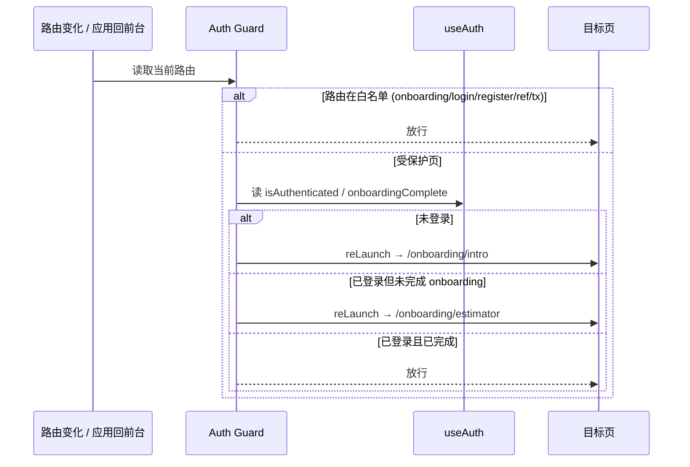
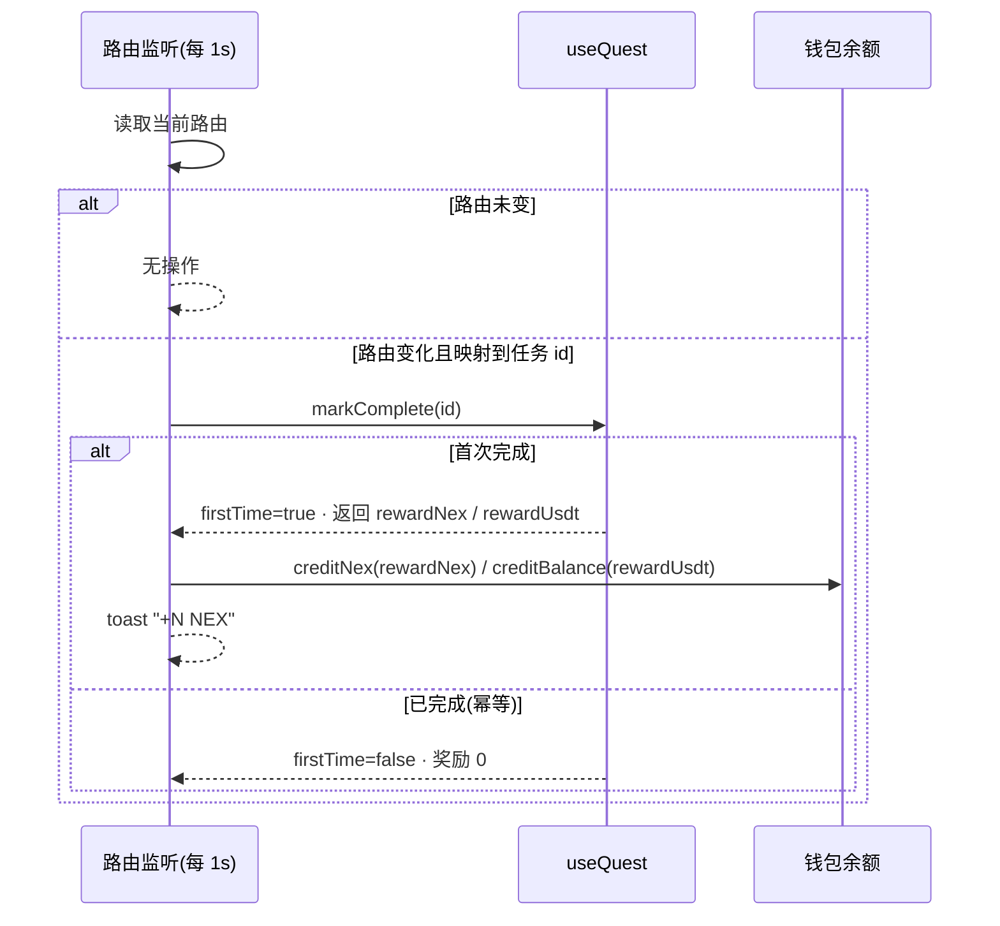
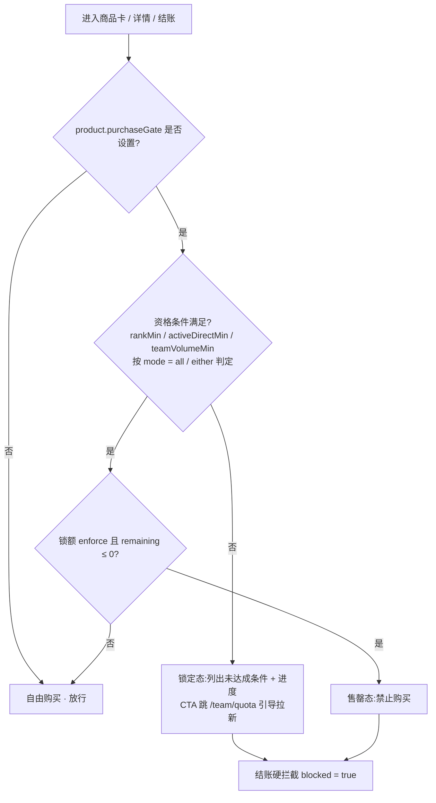
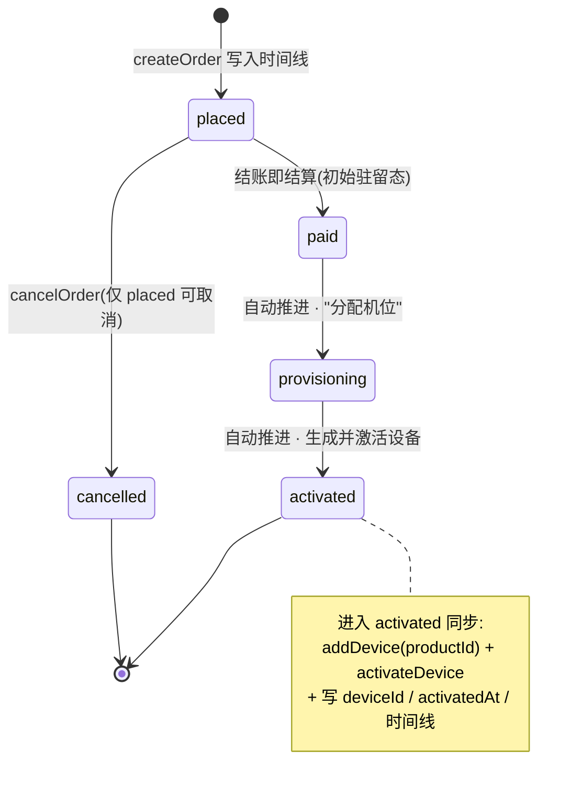
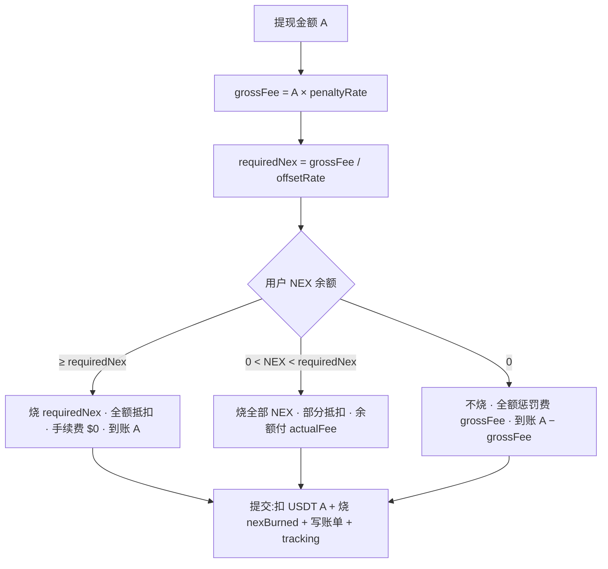
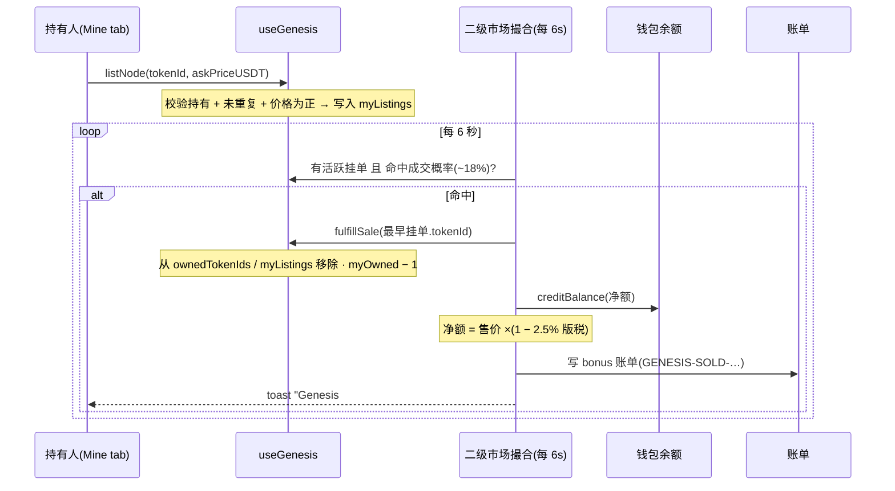
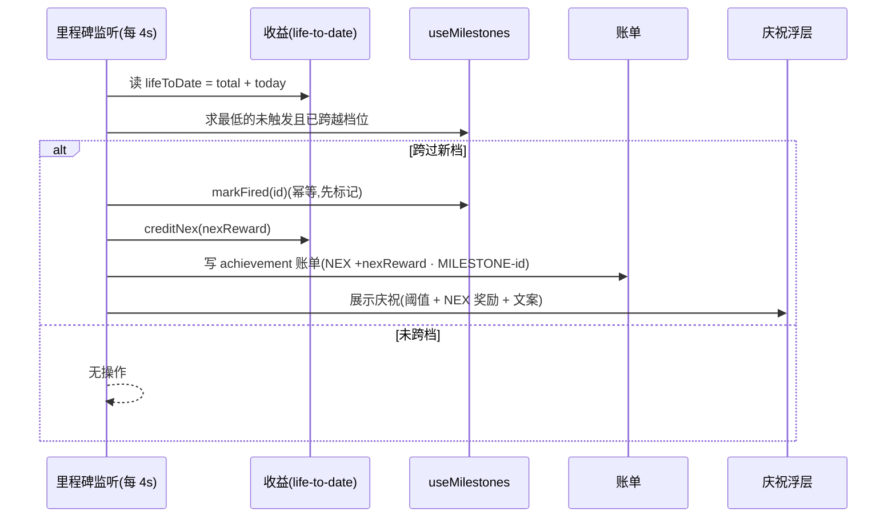

# Nexion · 产品需求文档(PRD)

| 项 | 值 |
|---|---|
| 文档编号 | SN-PRD-2026-002 |
| 版本 | v3.7 |
| 文档类型 | Product Requirements Document |
| 适用对象 | 产品 / 设计 / 前端 / 测试 / 业务 |
| 适用系统 | Nexion 移动端 H5 应用 |

> **声明**:本文档为研究性原型的产品需求规格,系统中所有业务数据(收益、佣金、价格、TVL)均为模拟生成,不涉及真实资金。

---

## 目录

1. 产品概述
2. 用户角色与场景
3. 信息架构与导航
4. 账户与身份(注册 / 登录 / 推荐 / KYC / 安全)
5. Home Dashboard
6. Earn(算力赚取)
7. Store(设备商城)
8. Team(团队中心)
9. Wallet(钱包系统)
10. Genesis 创世节点
11. 扩展功能(Nova / 通知 / 信任中心 / 成就 / 收据 / 全球地图 / API / 帮助)
12. 数据模型
13. 业务规则与计算公式
14. 国际化(i18n)
15. 非功能需求
16. 技术架构
17. 验收标准与 KPI
18. 附录:路由 / 文件清单

---

## 1. 产品概述

### 1.1 产品定位

Nexion 是面向全球非中国市场(北美、欧洲、东南亚、日韩、中东)的**分布式 AI 推理算力共享平台**。

核心叙事:**"Your phone is the AI cluster. Earn while you sleep."** — 用户的智能手机 NPU 在闲置时间为平台对接的 AI 客户(图像生成、LLM 推理、语音转写等)执行小型推理任务,获得 USDT 收益。

用户还可购买专用算力设备(NexionBox 系列)获得更高收益。

### 1.2 目标用户

| 区域 | 核心国家 | 用户特征 | 语言 |
|---|---|---|---|
| 北美 | 美国、加拿大 | iPhone/Pixel 主流,AI 早期用户,追求被动收入 | EN |
| 欧洲 | 英国、德国、法国 | 注重平台可信度,能源价格驱动"闲置变现" | EN / DE / FR |
| 东南亚 | 越南、菲律宾、泰国、印尼 | 手机渗透高,crypto 原生 | EN / 本地语 |
| 日韩 | 日本、韩国 | 技术型用户,Galaxy/iPhone 高端机 | JA / KO |
| 中东 | 土耳其、沙特、阿联酋 | 高净值,主权 AI 热潮 | EN / AR |

### 1.3 核心价值主张

- **零门槛**:装 App 就能开始赚钱,无需购买硬件
- **零摩擦**:注册 90 秒内首笔收益到账
- **多层路径**:从手机 → NexionBox S1 → Pro → Rack → 创世节点的清晰升级阶梯
- **多种收益**:静态(设备算力)+ 动态(团队推广 + 质押)双引擎
- **可证可查**:每笔收益附 Proof-of-Compute 推理收据 + 链上 attestation

### 1.4 商业模式

- 设备销售:NexionBox S1 $649 / Pro $1,199 / Rack P1 $4,499 / Genesis $9,999
- 团队分润佣金体系(影响力网络版税 + 双轨)
- NEX 平台代币经济(锁仓 / 兑换 / 二级市场)
- 算力市场撮合服务费(向 AI 客户收取)

### 1.5 竞品参考

| 产品 | 类型 | 借鉴点 |
|---|---|---|
| io.net | 去中心化 AI GPU 云 | 客户侧叙事 + 代币经济 |
| Render Network | 去中心化 GPU 渲染 | 任务类型清晰分类 UI |
| Akash Network | 去中心化云 | "对抗 Big Tech 算力垄断"叙事 |
| Bittensor (TAO) | 去中心化机器学习市场 | 子网架构选择 UI |
| NiceHash | GPU 挖矿市场 | 收益展示形式、设备管理 UI |
| Genesis Mining | 云矿机 | 算力合约 + 托管收益模式 |
| StormGain | 加密云挖矿 | 可视化算力工作动效 |

---

## 2. 用户角色与场景

### 2.1 用户分层(基于产品使用阶段,内部 ID L0-L5)

| 内部 ID | UI 显示(EN / ZH) | 进入条件 | 核心诉求 | 转化目标 |
|---|---|---|---|---|
| L0 | Visitor / 访客 | 未注册 | 了解平台 | 点击注册 |
| L1 | Newbie / 新手 | 已注册,手机算力自动接入 | 看每天能赚多少 | 24h 在线 + 首笔收益 |
| L2 | Active / 活跃 | 累计 $5+ 收益 | 稳定获益,尝试提现 | 首次提现成功 |
| L3 | Upgrade-ready / 升级候选 | 主动查看硬件商城 | 寻求更高收益 | 完成设备购买 |
| L4 | Owner / 持有者 | 已购 NexionBox 1+ 台 | 最大化收益 | 复购 / 追加台数 |
| L5 | Ambassador / 推广大使 | 推荐 3+ 成功注册 | 团队收益,被动分成 | 裂变传播 |

> 内部 `UserTier` enum 保留 `"L0"|"L1"|…|"L5"` 标识符;UI 一律走 i18n `profile.tierLabels` 显示功能化标签,**不暴露 L\d 编号**,避免与已废弃的 MLM 层级数字混淆。

### 2.2 V 级头衔(V0-V12,基于团队业绩)

跟 L 级独立,V 级是团队业绩驱动的军衔体系(详见 §8.2)。L0-L5 反映"产品使用阶段",V0-V12 反映"团队规模阶段",两套体系并存。

### 2.3 核心使用场景

| 场景 | 用户 | 触发 | 期望结果 |
|---|---|---|---|
| 注册 + 首单收益 | 新用户 | 完成手机号验证 | 90 秒内看到首笔 $0.0003 推理收益 + welcome gift |
| 升级硬件 | 活跃用户 | 看到手机收益瓶颈 | 在 store 选购 NexionBox 并完成支付 |
| 邀请好友 | 推广用户 | 分享 referral link | 朋友通过链接注册 → 双方获得礼包 + 邀请人后续拿团队分润 |
| 提现 | 活跃用户 | 收益达 $20+ | 选网络 + 输地址 → KYC 通过 → 48h 内到账 |
| 质押增益 | 设备持有者 | 想锁仓获更高 APY | 选 30/90/180/365 天档位 + 金额 → 锁仓 |
| 升等级冲奖 | 推广大使 | 想拿实物奖品 | 达成升 V 条件 → 获得头衔 + 实物奖品配送 |

### 2.4 30 天用户旅程

```
Day 0:   注册 → 设备识别 → 一键启用 → 90 秒首笔 $0.0003 + $5 welcome bonus
Day 1:   过夜累计 $0.05 → Nova push "earned overnight"
Day 3:   $0.13 → 推送"提现需满 $20" + 推荐裂变 hint
Day 7:   $0.42 → "🔒 Upgrade Unlocks" 显示锁定的高价任务
Day 14:  $0.78 → 商城 hero "117× more"
Day 21:  $1.20 → "推荐 1 人得 $10"
Day 30:  $1.80 → 月报 + "NexionBox 月入 $210"
Day 45:  触发升级决策 → S1 详情页
Day 60:  完成购买 → 日收益从 $0.06 跳到 $7.00
Day 90:  活跃推广者,V2-V3 头衔追求
```

---

## 3. 信息架构与导航

### 3.1 应用框架(IOSFrame chassis)

所有路由统一套进 iOS 414×874 设备外壳:

| 区 | 内容 |
|---|---|
| Status Bar | 实时时钟 + Dynamic Island + 信号/WiFi/电量 |
| Header App Row(仅 tab 路由) | Nexion logo + 铃铛(打开 Nova drawer) + Locale Switcher |
| ScrollContainer | 内容主区 |
| TabBar(仅 tab 路由) | 5 个 tab,floating pill 样式 |
| Home Indicator | iOS 风白条 |

**框架规则**:
- Header / TabBar 锁定在 chassis 边界,内容独立滚动
- overscroll-behavior contain
- **默认主题 dark**(产品默认 dark mode 体验)。SSR 阶段 `<html data-theme="dark">` 直出,zustand `useTheme.mode` 初值同步为 `"dark"`,避免首屏闪光;旧用户在 localStorage `nexion-theme-v1` 中 persist 过 `"light"` 仍保留其个性选择,新用户 / 清缓存进来即落到 dark
- **Chassis 顶部留白**:tab 路由首屏 hero 紧贴 brand row;sub-route(`SetPageHeader` 模式页)在此基础上再下移,避免第一张 IOSList 撞 header 底沿

### 3.2 底部 5-Tab 主导航

| Tab | 名称 | 入口路由 | 核心内容 |
|---|---|---|---|
| 1 | Home | `/` | Dashboard,综合所有维度的实时信息 |
| 2 | Earn | `/earn` | 我的设备 + 任务中心 + 收益统计 + Market |
| 3 | Store | `/store` | NexionBox 商城 + 订单 |
| 4 | Team | `/team` | 团队体系全套(等级 + 分润 + 配额 + 大使) |
| 5 | Me | `/me` | 个人中心(Profile + Wallet + 扩展 + Preferences) |

TabBar:active tab 显示背景 chip 高亮。

### 3.3 完整路由清单

```
/                                Home Dashboard
/market                          NEX 行情详情页(对标 AI/DePIN tokens)
/events                          活动中心(限时优惠 / 挑战 / 季节福利)
/learn                           教程中心(Learn-to-Earn)
/earn                            Earn(算力赚取)
/store                           Store list
/store/[productId]               商品详情
/store/checkout                  结账(含 trade-in / replace-lowest intercept,见 §7.5)
/store/bundle                    套餐结算(多商品组合 + 阶梯折扣)
/tradein                         301 永久重定向到 /me/devices(向后兼容旧短链)
/store/tradein                   301 永久重定向到 /me/devices(独立 trade-in 页已下线,功能内置入 /store/checkout 拦截 + /me/devices promo banner)
/store/orders                    我的订单
/store/orders/[id]               订单详情
/team                            Team 主页
/team/rank                       V 级头衔进度
/team/rank/how-it-works          等级体系新人说明页
/team/unilevel                   影响力网络版税(Influence Network Royalty)
/team/unilevel/how-it-works      影响力网络版税玩法说明页
/team/binary                     双轨对碰
/team/binary/how-it-works        双轨玩法新人说明页
/team/leadership-pool            全球领导奖池
/team/leadership-pool/how-it-works  领导池玩法新人说明页
/team/commissions                佣金明细(5 类)
/team/commissions/how-it-works   6 类佣金来源说明页
/team/leaderboard                邀请排行榜(4 周期 + 奖池)
/team/network                    影响力网络可视化
/team/tree                       族谱树
/team/quota                      硬件配额解锁
/team/agent                      区域大使
/me                              Me 主页
/me/profile                      个人资料
/me/devices                      我的设备(全 inventory 激活/取消激活管理)
/me/security                     安全设置
/me/security/kyc-express         KYC-Express 说明页
/me/wallet                       钱包主页
/me/wallet/topup                 充值 + KYC-Express
/me/wallet/withdraw              提现
/me/wallet/withdraw/tracking     提现追踪
/me/wallet/exchange              NEX↔USDT 兑换
/me/wallet/exchange/how-it-works 兑换玩法说明页
/me/wallet/repurchase            复投
/me/wallet/repurchase/how-it-works 复投玩法说明页
/me/wallet/bills                 账单流水
/me/wallet/cards                 我的银行卡(saved-cards 列表)
/me/wallet/cards/new             绑定银行卡(可带 returnTo)
/me/trial                        免费试用(绑卡式 3 天 + 7 grace + 3 extension)
/me/wallet/nex                   NEX 资产详情页(持仓 / P&L / 用途 / 活动)
/me/receipts                     推理收据
/me/risk-disclosure              平台风险提示书(scroll-to-bottom + 强制确认)
/me/achievements                 成就墙
/me/goals                        收益目标设置(target + deadline + 推荐路径)
/me/wrapped                      年度 Wrapped(Spotify 风全屏 6 卡片)
/me/preferences                  偏好设置(音效 / 触感 / 通知 6 类偏好)
/missions                        Mission Center(任务中心,聚合所有任务体系的统一入口)
/me/proof                        Proof of Compute
/me/replay-tour                  重播引导
/me/help                         帮助中心
/me/support                      实时客服(渠道枢纽)
/me/support/tickets              工单系统(列表 / 创建 / 详情 3 mode)
/support/messages                统一会话中心(多类别客服会话列表)
/support/chat                    会话聊天线程(?cid= 人工 / ?type=ai Nova)
/me/language                     语言切换
/me/notifications                通知中心
/staking                         Staking 4 档质押
/staking/how-it-works            质押玩法新人说明页
/genesis                         创世节点预售
/genesis/how-it-works            Genesis 创世节点说明页
/genesis/marketplace             二级市场
/genesis/holder                  持有人 dashboard(分红 / 权益 / 持仓)
/trust                           信任中心
/trust/nex                       NEX 平台代币说明页
/daily                           每日签到
/globe                           全球节点地图
/developer                       API 开发者平台
/ref/[code]                      公开邀请落地页
/tx/[hash]                       Etherscan 风交易详情页(从 bills / trade-in 跳转)
/search                          全局搜索(routes / 设备 / 商品 / 网络成员 / FAQ)
/login                           登录(支持 ?ref=CODE)
/register                        注册(支持 ?ref=CODE)
/onboarding/intro                启动语
/onboarding/estimator            收益估算
/onboarding/connect              算力校准 + 接单规则告知
/onboarding/terms                服务条款(从 intro 脚注 / register 注册脚注进入)
```

---

#### UniApp 交付主体路由覆盖

用户端交付主体为 `Nexion-uniapp`。截至 L5 终验,Next.js 参考源 80 个路由已全部映射到 UniApp 81 个 pages;唯一新增页为 `/onboarding/terms`,用于承接服务条款确认。Next.js 版本仅作为行为参考源保留,后续业务验收以 UniApp 路由覆盖、i18n 镜像、运行时动作 proof 与三端 canon gate 为准。

验收口径:
- Next reference routes:80/80 covered.
- UniApp pages:81 pages.
- 路由缺口:0.
- 阻断类动作缺口:0.

## 4. 账户与身份

### 4.1 注册流程

3 步极简验证码注册:

| 步骤 | 字段 | 校验规则 | 交互 |
|---|---|---|---|
| 1 | 国家码 + 手机号 | 6-15 位数字 | 选区号 + 输手机 + "Send code" |
| 2 | 6 位 OTP | 仅数字 | 满 6 位**自动确认**(无需手动点击) |
| 3 | 密码 + 确认密码 | 两次一致 + 符合 §4.6.1 强度要求 | 提交 → 注册成功 |

**注册成功后行为**:
1. 自动创建 user(persist 到 localStorage)
2. 自动 `addDevice("phone")` 接入手机算力(进入 Phase 0 多阶段揭示)
3. 跳转 `/onboarding/estimator`(L0 → L1)

支持 `?ref=CODE` URL 参数携带推荐码(详见 §4.3)。

注册页底部含合规脚注「创建账号即表示同意服务条款和隐私政策」,其中「服务条款」下划线可点,进入 §4.7.5 服务条款页;「隐私政策」当前为占位文本(无独立页)。

### 4.2 登录流程

双模式登录:默认密码登录(`password`),可切换至验证码登录(`otp`)。返回用户主要走 password 路径以加快再访;丢失密码或更换设备的用户走 OTP 路径。两种模式共用相同的手机号识别。

#### 4.2.1 密码登录(默认)

| 步骤 | 字段 | 校验规则 | 交互 |
|---|---|---|---|
| 1 | 国家码 + 手机号 + 密码 | 手机 6-15 位数字;密码非空(强度校验在 server) | 输完三项 → "Sign in" → 登录成功跳 `/` |

页面底部"改用验证码登录"链接切换至 OTP 模式;"忘记密码?"链接进入 reset 流程(§4.2.3)。

#### 4.2.2 验证码登录(OTP)

| 步骤 | 字段 | 校验规则 | 交互 |
|---|---|---|---|
| 1 | 国家码 + 手机号 | 6-15 位数字 | 选区号 + 输手机 + "Send code" |
| 2 | 6 位 OTP | 仅数字 | 满 6 位**自动确认**(无需手动点击)→ 登录成功跳 `/` |

底部"改用密码登录"链接切换回 password 模式。

#### 4.2.3 忘记密码 reset 流程

从密码登录页"忘记密码?"链接进入。3 步:

| 步骤 | 字段 | 校验规则 | 交互 |
|---|---|---|---|
| 1 | 国家码 + 手机号 | 6-15 位数字 | "Send verification code" |
| 2 | 6 位 OTP | 仅数字 | 满 6 位自动校验 → 进入步骤 3(本步不发起 signIn)|
| 3 | 新密码 + 确认密码 | 两次一致 + 符合 §4.6.1 强度要求 | "Update password and sign in" → 写入新密码 + 自动登录 + 跳 `/` |

完成后 toast 提示"密码已更新 · 已登录"。任一步骤 back 退出当前 step:step 3 → step 2,step 2 → step 1,step 1 → 退回密码登录页(并清空所有 reset 输入)。reset 模式下不显示底部 OAuth / 注册引导 / 模式切换链接,避免干扰。

#### 4.2.4 推荐码绑定

支持 `?ref=CODE` URL 参数:三种登录路径(password / OTP / reset)成功后,若已有 sponsor 则不重绑,无 sponsor 时自动 silent bind(不发 welcome gift,gift 只在注册步骤发放,详见 §4.3)。

#### 4.2.5 重入保护

三个 sign-in 路径(`signInWithPassword` / `verifyCode` OTP 模式 / `finishReset`)共享同一 `setTimeout` ref。客户端守卫:`if (loading || signInTimerRef.current) return;` 防止快速双击、OTP 数字 backspace+retype、React strict-mode useEffect 双调用导致双 `signIn()` + 双 `router.replace`。任一 sign-in 路径中途 back / toggle mode / 进 reset → cancel pending timer,防 stale fire 强制登录。

**真后台对接**(endpoint TBD,候选名):

| Endpoint | Method | Payload | 用途 |
|---|---|---|---|
| `/api/auth/login` | POST | `{country, phone, password}` | password 模式;返 session token + `sponsorBound:boolean` |
| `/api/auth/otp/send` | POST | `{country, phone}` | OTP / reset 流程 step 1;server TTL + 试次限制 |
| `/api/auth/otp/verify` | POST | `{country, phone, code}` | OTP 模式登录;返 session token;server 必须以 idempotency key 去重 |
| `/api/auth/password/reset` | POST | `{country, phone, code, newPassword}` | reset 完成;server 重校验 OTP 后写新密码 + 返 session token,单事务(详见 §4.6.5)|

所有 sign-in endpoint 必须支持 `Idempotency-Key` header(详见 §9.11e),client guard 仅为体验层防御。

### 4.3 推荐邀请系统

#### 4.3.1 推荐链接落地页 `/ref/[code]`

任何用户访问该 URL 时:

| 元素 | 内容 |
|---|---|
| Sponsor 卡 | 从 code hash 映射的固定 sponsor(姓名 + 头像 + V 级 + 城市 + 下线数) |
| Welcome Gift hero | `$5 USDT + 20 NEX` 大字 |
| Perks 列表 | 4 项($5+20 gift / 第一天赚钱 / 24/7 active / sponsor mentorship) |
| 社会证明 | 28,432 new joiners · 47 countries · $1.2M paid out |
| Partner wall | NVIDIA / Intel / AMD / OpenRouter / OPPO / TechCrunch |
| Trust badges | SOC 2 Type II / ISO 27001 / GDPR · MSB / CertiK audited |
| CTA(主) | "Claim my $5 + 20 NEX" → `/register?ref=CODE` |
| CTA(次) | "Sign in" → `/login?ref=CODE` |

#### 4.3.2 注册时绑定 sponsor

`/register?ref=CODE` 顶部显示 sponsor 确认卡(头像 + sponsor 名 + V chip + 礼包预告)。

**业务规则**:
- 注册完成时:`sponsorship.bind(code)` 写入 sponsorCode + sponsor 信息
- 立即 `claimGift()` → 钱包 +$5 USDT + 20 NEX
- 显示庆祝 toast:`+$5 + 20 NEX welcome gift · Sponsored by Sarah K.`
- **首次绑定生效,后续 URL ?ref 不可覆盖**
- 每个账号 welcome gift **仅一次**

#### 4.3.3 登录时绑定

`/login?ref=CODE` 静默绑定(无 toast),不触发 welcome gift。

#### 4.3.4 推荐人收益

被推荐人完成订单时,推荐人按固定 10% 费率获得直接版税(Direct Royalty),其上线网络按 Network Yield Bonus 算法分得扩展版税(详见 §8.3)。

### 4.4 KYC-Express 验证

#### 4.4.1 触发场景

- 首次提现请求时
- NEX 兑换累计达到 $100 USDT lifetime 时
- 用户主动在 `/me/security` 验证身份

#### 4.4.2 流程

1. 引导用户支付 $1 USDT 到指定钱包(`/me/wallet/topup?kyc=1`)
2. 系统记录支付钱包地址作为"已验证地址"
3. 验证完成后 `useWalletPairing.walletPaired = true`
4. `$1` 实际计入用户余额(无损失)

KYC-Express 与充值共用 `/me/wallet/topup?kyc=1` 入口。用户从提现触发 KYC 时,top-up 页面必须显示 KYC 状态、验证金额、当前链路和验证完成后的提现解锁说明;完成后返回提现流程继续填写网络、地址、金额与风险披露确认。

#### 4.4.3 验证后特权

- 提现地址必须与 KYC 地址一致(防代提)
- 兑换 cap 不变,但 KYC 触发不再阻断
- 显示"✓ KYC verified"chip

#### 4.4.4 KYC-Express 说明页 `/me/security/kyc-express`

零基础说明页,降低用户对身份验证的抗拒感,文案强调"合规 + 隐私 + 快速"。

**页面结构**(自上而下 6 段 + CTA):

1. **Hero** — 标签 `IDENTITY VERIFICATION` + 大标题 `KYC-Express · 90 seconds, one time, never again.` + 副字(FATF / MiCA 合规口径)
2. **§1 WHEN IT TRIGGERS**(AlertCircle)— 4 个 InfoCard 列出触发场景:Lifetime exchange > $100 / Single withdrawal > $100 / Region escalation / Risk-flag review
3. **§2 WHAT YOU PROVIDE**(ListChecks)— 3 步 StepRow:Full legal name / Government ID photo / Liveness selfie(30s 人脸扫描)
4. **§3 WHAT WE NEVER ASK**(Lock)— 3 个 IconRow:🚫 SSN / 🚫 银行登录 / 🚫 家庭成员信息 — 隐私安抚段
5. **§4 WHAT YOU UNLOCK**(Sparkles)— 4 个权益 IconRow:💸 提现 cap $100 → $50K · ⚡ 当日到账(免 24h hold) · 🛡 合规盾 · 🏆 +20 NEX
6. **§5 PARTNERS · COMPLIANCE**(ShieldCheck)— Sumsub(Tier-1 KYC,Binance / Bybit / Crypto.com 共用,SOC 2 Type II) / GDPR + MiCA(EU region 存储 + right-to-erasure) / Encrypted at rest(零知识加密,Nexion 员工无法解密)
7. **§6 FAQ** 4 问:多久验证完 / 证件不是英文怎么办 / 不验证能提现吗 / 被拒怎么办
8. **CTA** — `Start KYC-Express` → `/me/wallet/topup?kyc=1` + footer `Free · ~90 seconds · powered by Sumsub`

i18n keys 在 `kycExpress.*` namespace,~40 keys。复用 `app/components/how-it-works/parts.tsx` 共享组件(HowHero / HowSection / InfoCard / StepRow / IconRow / FaqRow)。

**入口** — `/me/security` 加 IOSListItem `KYC-Express · 90 seconds · lifts $100 cap · Sumsub-powered`,ShieldCheck icon。

### 4.5 安全管理 `/me/security`

页面包含 5 个功能项:

| 项 | 功能 | 详见 |
|---|---|---|
| 密码修改 | 当前密码 + 新密码 + 确认,inline 表单展开 | §4.6.4 |
| 2FA(双因子) | TOTP + 8 个 recovery codes | §4.5.1 |
| Active Sessions | 显示当前 + 历史登录设备,可逐个 revoke | §4.5.2 |
| Revoke All Other Sessions | 一键登出所有其他设备 | §4.5.2 |
| Delete Account | 红色 destructive,二次确认;确认后即登出 + 清除本地会话 + 跳转 `/login`(真后台:`DELETE /api/account` 服务端清除用户记录)| — |

#### 4.5.1 双因子认证(2FA)

**算法**

采用 **TOTP**(Time-based One-Time Password,RFC 6238),兼容 Google Authenticator / Authy / 1Password / Microsoft Authenticator。

- 6 位 code,30 秒时间窗
- HMAC-SHA1 + 16 byte (128-bit) random secret per user
- 容差:接受 ±1 个 30s 窗口,防 client 时钟漂移

**启用流程**

`/me/security` 点击 "Enable 2FA":

1. Confirm dialog 解释 2FA 用途 + 备份提示
2. server `POST /api/auth/2fa/enroll` → 返 `{secret, qrcodeUrl, recoveryCodes[]}`(base32 secret + otpauth URI + 8 个 recovery codes)
3. client 渲染 QR + 可显式查看 secret + 强制显示 recoveryCodes + 提供 download(纯文本 / PDF)
4. 用户在 authenticator 扫码后输 6 位 TOTP → `POST /api/auth/2fa/confirm` → server 验证 → 启用成功 + toast `2FA 已启用 — 请备份恢复码`

未在 confirm 步骤完成验证前,2FA enrollment 不计入 user state(server 端 pending,5 分钟超时清理)。

**登录时校验**

任一 sign-in 路径(password / OTP / reset)server 验证一次因子成功后,若 user has 2FA enabled:

- 不立即签发 session token,改返 `{step: "2fa_required", challengeId}`
- client 跳 `/login/2fa?challengeId=...` 显示 6 位 TOTP 输入框 + "使用恢复码" 切换链接
- 用户输 TOTP code 或 recovery code → `POST /api/auth/2fa/verify {challengeId, code, type: "totp" | "recovery"}` → server 验证 → 签发 session token + 跳 `/`

2FA challenge 5 分钟过期,过期后必须重头登录。

**关闭流程**

`/me/security` toggle off:

1. Confirm dialog(danger)警告关闭后账户更易被入侵
2. Step-up auth:必须输 current password 二次验证
3. `POST /api/auth/2fa/disable {currentPassword}` → server 验证 → 关闭 + revoke 所有 recoveryCodes
4. Toast `2FA 已关闭`

**Recovery codes**

| 维度 | 规则 |
|---|---|
| 数量 | 8 个一次性 codes,启用时一次性生成 |
| 长度 / 格式 | 10 位字母+数字,中间连字符(如 `xk9p3-mv2nr`)|
| 存储 | server-side hashed(同密码 argon2id),client 不存 |
| 显示 | 仅启用 / regenerate 时显示一次,用户必须 download / 抄录 |
| 使用 | 每个 code 一次性,使用即失效 |
| Regenerate | `/me/security` → "Regenerate codes" → 二次确认 + currentPassword → server 失效旧 codes + 生成 8 个新 |
| 失效场景 | (1) 单 code 使用 (2) 全部 regenerate (3) 2FA 关闭(全失效)|

**失去 device + recovery codes 路径**

用户既丢 authenticator 又没保存 recovery codes:

- 走客服工单(`/me/help → contact support`)+ KYC 二次验证
- server 人工 disable 2FA + audit log,审核通过后用户重新走 enroll

不提供"忘记 2FA" 自助路径(防社工攻击)。

**真后台对接**

| Endpoint | Method | Payload | 用途 |
|---|---|---|---|
| `/api/auth/2fa/enroll` | POST | — | 启动 enrollment,返 secret + QR + recoveryCodes |
| `/api/auth/2fa/confirm` | POST | `{code}` | 用户首次 TOTP 验证 → 启用 |
| `/api/auth/2fa/disable` | POST | `{currentPassword}` | 关闭 2FA + revoke recovery codes |
| `/api/auth/2fa/verify` | POST | `{challengeId, code, type}` | 登录二因子 challenge |
| `/api/auth/2fa/regenerate-codes` | POST | `{currentPassword}` | 重生 recovery codes |

TOTP / recovery 连续输错走 §4.6.2 锁定计数器(5 次 / 15 分钟 → 锁定登录)。

#### 4.5.2 Session 管理

**Token 结构**

server 签发两类 token,client 持久化到 cookie(`httpOnly` + `Secure` + `SameSite=Lax`):

| Token | 类型 | 有效期 |
|---|---|---|
| Access token | JWT,server 对称密钥签名,payload `{userId, sessionId, exp, iat}` | 4 小时 |
| Refresh token | opaque random string,server 持有 → sessionId 映射 | 30 天滑动(每次 refresh 重置)|

**Refresh 流程**

client 调 API 收到 401 → 静默 `POST /api/auth/refresh` 带 refresh token cookie → server 验证未 revoke + 未过期 → 签发新 access + **rotate** refresh(旧 refresh 立即失效)→ retry 原请求。

Rotation 防 refresh token 被截获后长期复用:被盗后用一次就失效,真实用户下次 refresh 失败立即触发 sign-out + 强提示"账户安全异常"。

**Active Sessions 数据模型**

`/me/security` Active Sessions 列表项字段(server canonical):

| 字段 | 类型 | 说明 |
|---|---|---|
| `id` | string | sessionId |
| `device` | string | UA parse 结果(如 `iPhone 15 · Safari`)|
| `ip` | string | IP 地址,client 显示 mask 后两段 |
| `location` | string | IP → 城市级 GeoIP(隐私上限,不到街道)|
| `signedInAt` | number(ms) | session 创建时间 |
| `lastActiveAt` | number(ms) | 该 session 最近一次 refresh / API call 时间 |
| `current` | boolean | 是否当前浏览器的 session |

30 天未活跃自动过期(`now - lastActiveAt > 30d` → session 失效 + refresh token revoke)。

**主动登出**

| 操作 | endpoint | 行为 |
|---|---|---|
| Sign out 当前 session | `POST /api/auth/logout` | revoke 当前 sessionId 的 refresh + 加入 access token revocation list(JTI) |
| Revoke 单个 session | `POST /api/auth/sessions/:id/revoke` | revoke 指定 sessionId,下次 refresh 失败 → 被强制登出 |
| Revoke all others | `POST /api/auth/sessions/revoke-others` | revoke 除当前外所有 session |
| 密码修改成功后联动 | (server side-effect) | 等效 revoke all others,参 §4.6.4 |

logout client 副作用:清 access + refresh cookie + clear 所有 user-scope Zustand store + `router.replace("/login")`。

**安全约束**

- 所有 token 仅通过 cookie 传输;`httpOnly` 防 XSS 读取,`Secure` 强制 HTTPS,`SameSite=Lax` 防 CSRF
- access token JWT 签名密钥 server 持有,client 不得解码 / 篡改;敏感字段不放 JWT payload
- refresh rotation 检测异常 reuse(同一 refresh token 被两次 redeem)→ 立即 revoke 整条 session chain + 强提示
- 长时间未活跃(`lastActiveAt > 7 天`)的 session 在敏感操作(提现 / 改密码 / 关 2FA / regenerate recovery codes)前要求 step-up auth(重新输密码或 2FA)

### 4.6 密码与凭证规则

统一应用于注册设密(§4.1 步骤 3)、忘记密码 reset(§4.2.3 步骤 3)、安全管理修改密码(§4.5)三个入口。Client 实时校验仅为体验层提示,实际通过 / 拒绝以 server 提交校验为准。

#### 4.6.1 强度要求

| 维度 | 要求 |
|---|---|
| 最小长度 | 8 位 |
| 最大长度 | 64 位 |
| 字符组合 | 至少含字母 + 数字两类(推荐含大写或符号,UI 强度条仅作提示)|
| 等价黑名单 | 不允许等于手机号 / 国家码+手机号 / 邮箱本地部分 / 用户昵称 |
| 弱密码字典 | 不允许命中 OWASP Top 10000 / 常见键盘序列(`123456` / `password` / `qwerty` 等)|
| 字符重复 | 单字符连续重复 ≥ 6 次拒绝(如 `aaaaaa`)|
| 历史复用 | 不能等于最近 3 次旧密码(server 留 hash 历史比对)|

UI 输入时显示三级强度条(`weak` / `fair` / `strong`),仅辅助提示,不作通过判定。

#### 4.6.2 错误尝试与锁定

server 持有锁定计数器(IP + userId 维度),client 仅显示倒计时(`error.lockedUntil` 字段):

| 场景 | 阈值 | 行为 |
|---|---|---|
| 密码登录连续输错 | 5 次 / 15 分钟 | 触发 15 分钟账户锁定,期间三种登录模式全部禁 |
| 密码登录连续输错 | 10 次 / 24 小时 | 触发 24 小时锁定 + 强制走 reset 流程 |
| reset 流程 OTP 输错 | 5 次 / 当次 session | 失效当前 OTP,需重新 `Send code` |
| 修改密码 currentPassword 错 | 与登录共用计数器 | 同登录锁定规则 |
| 2FA TOTP / recovery 连续输错 | 5 次 / 15 分钟 | 触发 15 分钟锁定,等同密码登录锁定 |

锁定期间 client 显示 `账户已临时锁定 · {mm:ss} 后可重试`,主 CTA disabled。

**解锁路径**:

- 15 分钟 / 24 小时锁定到期自动解锁,无需用户操作
- 用户主动:走 §4.2.3 reset 流程,reset 成功后清零所有锁定计数器
- 异常解锁(被盗号 / 设备丢失):提交 KYC 二次验证 + 客服工单(`/me/help → contact support`),server 人工 unblock + 写 audit log

锁定期间 server 拒绝该手机号一切登录请求(密码 / OTP / reset),即使新 `/api/auth/otp/send` 也不签发新 code,防绕过短信通道刷量。

**OTP code 有效期**:

- 6 位 OTP 在 server-side 有效 **5 分钟**
- 同一手机号同时仅 1 个 active code,新 `send` 自动失效旧 code
- 过期后 verify 返 `errors.otpExpired`,client 引导重新 send
- Resend 60 秒倒计时(client `RESEND_SECONDS = 60`)防短信轰炸,server-side 同步限频:同一手机号 24h 内 ≥ 3 次 send 触发 CAPTCHA(参 §16.2.1)

#### 4.6.3 服务端存储与传输

- 密码全程通过 HTTPS 传输,服务端**绝不**存明文或可逆加密
- 服务端使用 `argon2id`(或同等 KDF)+ 随机 salt 哈希存储,memCost ≥ 64 MB / timeCost ≥ 3 / 并行度 ≥ 1
- hash 字段不参与任何日志 / 错误响应 / 客户端 echo / telemetry
- client 表单字段 `type="password"`,用户主动点 eye toggle 可临时切 `type="text"`;明文不发到任何 analytics

#### 4.6.4 修改密码流程

`/me/security` 内联表单:

| 字段 | 校验 |
|---|---|
| 当前密码 | server 校验,失败回 `errors.currentPasswordWrong` + 锁定计数器累加 |
| 新密码 | 应用 §4.6.1 全部规则 + 不能等于当前密码 |
| 确认新密码 | 必须等于新密码 |

成功后 server 失效该用户**所有非当前会话**的 session token(等同 §4.5 Revoke All Other Sessions),client 保留当前 session;toast `密码已更新 · 其他设备已登出`。

#### 4.6.5 真后台对接

| Endpoint | Method | Payload | 用途 |
|---|---|---|---|
| `/api/auth/password/check-strength` | POST | `{password, phone, nickname?}` | (可选)预校验强度 + 黑名单命中,UI 防弱密码提交;不存储 |
| `/api/auth/password/change` | POST | `{currentPassword, newPassword}` | /me/security 修改密码,需有效 session;成功后失效其他 session |
| `/api/auth/password/reset` | POST | `{country, phone, code, newPassword}` | 忘记密码完成(同 §4.2.5);成功后返 session token |

所有 endpoint server-side 完整执行 §4.6.1 强度规则、§4.6.2 锁定逻辑、§4.6.3 存储规则。

### 4.7 Onboarding 流程

注册 / 登录完成后进入 Onboarding,3 步骤揭示价值主张并完成手机算力激活。

#### 4.7.1 Step 1 — `/onboarding/intro` 启动页

Hero 信息层:

| 元素 | 文案 / 内容 | 设计意图 |
|---|---|---|
| 系统状态 chrome | iOS 标准 status bar(时钟 + 信号 + 电量) | 真平台仿真 |
| 标题 line 1 | "AI 时代,算力就是钱。" | 资本视角钩 — AI 缺算力,你刚好有 |
| 标题 line 2 | "24 小时 替你打工。" | 第二人称 + 强动词 + 数字前置 |
| 副标题 | "插上充电,就开始接 AI 任务。越多 · 越久 · 赚得越多。" | 隐性 phone hint + 增长承诺 |
| 实时统计 chip | `28,xxx 台设备 · $1,2xx,xxx 今日已付` | 社会证明 + 紧迫感 |
| 中央 ComputeOrb | SVG 动画:旋转轨道 + 卫星节点 + 中央芯片标 "N" | 真平台仿真 — 算力网络可视化 |
| 主 CTA | "立即开始 →"(brand 大按钮) | 零门槛字眼,无扣款 / 绑卡暴露 |
| 副 CTA | "登录"(surface ghost) | 复访用户路径 |
| 条款脚注 | "继续即表示你同意 服务条款"(「服务条款」下划线可点 → §4.7.5 `/onboarding/terms`) | 合规可读护栏 |
| Skip 按钮 | **删除** — 不允许跳过 intro | 法务+教育护栏 |
| LocaleSwitcher | 顶部右侧,默认根据 `navigator.language` 自动匹配 | 见 §4.7.4 |

文案合规护栏:hero 字眼禁用 "保证 / 稳赚 / 暴富";"白领 / 白嫖 / 等你领 / 手快有手慢无" 等口语化 + 紧迫感字眼可用(SKILL `nexion-design` 漏斗心理学第 4 节)。

#### 4.7.2 Step 2 — `/onboarding/estimator` 收益估算

读取手机 NPU 规格 → 显示移动算力档位 + 日收益基线 + NexionBox 对比卡(117× 解锁钩)。详细规则参 §11(暂略,本次未改动)。

#### 4.7.3 Step 3 — `/onboarding/connect` 算力校准

12 秒"算力校准仪式",3 项并行测试 + 结果展示 + 接单规则告知。3 阶段状态机:

**Phase A · intro(explainer)**

解释为何要校准 + 列 3 项测量内容:

| icon | 测量项 | 目的 |
|---|---|---|
| 🧠 Cpu | NPU 性能基准 | 决定你的设备能跑哪些 AI 任务 |
| 🌐 Globe | 网络延迟 | 通过你当前的网络(Wi-Fi 或移动数据均可)ping 三个区域推理网关 |
| ⚡ BatteryCharging | 供电与散热 | 确认充电状态,保证长时间接单不降频 |

CTA "开始校准 · 12 秒"。

**Phase B · calibrating(12s 并行动画)**

3 张测试卡同时跑,各自独立 progress bar + 实时 metric ticker:

| 测试 | 时长占比 | 模拟指标 |
|---|---|---|
| NPU benchmark | 0% → 45% 完成 | `matmul-mobile.fp16` 跑分,0 → 28.3 TOPS(带 jitter) |
| 网络延迟 ping | 30% → 80% 完成 | 新加坡 38ms / 东京 42ms / 美西 156ms(带 jitter)|
| 供电与散热 | 55% → 85% 完成 | "充电中 · 78% · 散热正常" |

顶部倒计时 "校准中... 剩余 X 秒"。

**Phase C · result(分数 + 政策告知)**

固定结果展示(mock 阶段所有用户都通过):

```
┌─────────────────────────────┐
│  ✓ 校准完成                  │
│                              │
│         87/100               │
│    移动算力 Tier-2 合格      │
│   预估日收益 $0.06/天 基准   │
├─────────────────────────────┤
│  ✓ NPU 性能基准: 28.3 TOPS  │
│  ✓ 网络延迟: 38ms · 优秀    │
│  ✓ 供电与散热: 就绪 · 78%   │
├─────────────────────────────┤
│  ⚠️ 任务接取规则             │
│  🔋 充电是硬性门槛 —         │
│     没插电就不会接任何任务   │
│  🌐 网络通畅即可 —           │
│     Wi-Fi 或移动数据都行,    │
│     调度器分发每个任务前     │
│     都会 ping 检测           │
│  • 断电或断网会自动重连 ——   │
│     短暂中断不丢任务,        │
│     长时间未恢复才换新任务   │
└─────────────────────────────┘

       [激活手机算力 →]
```

CTA "激活手机算力 →" 路由到 `/`(Home Dashboard)。激活规则:

1. user 进入 L1 阶段(`{ tier: "L1" }`)
2. phone 设备已在注册时 `addDevice("phone")` + `activatedAt=purchasedAt` 接入,calibration 完成只是"告知"动作,无需额外 server 写入
3. UI 在 `/me/devices` 显示 phone "在线" 状态(若 `isCharging + isWifiConnected` 满足);否则按中断状态显示「重连中」或「未接单」(见 §12.2 手机算力门槛与任务中断模型)

**真后台对接**(endpoint TBD,候选名):

| Endpoint | Method | Payload | 用途 |
|---|---|---|---|
| `/api/onboarding/calibrate/start` | POST | `{deviceFingerprint}` | 启动 server 端真实跑分 + 网络延迟探测 |
| `/api/onboarding/calibrate/result` | GET | — | 长轮询 / SSE 拉取分数 + tier + yield baseline |

Mock 阶段两 endpoint 都由 client `setTimeout(12000)` 替代。Server 端真实实现时,Phase A 的"3 项测试"应映射为真后端的 benchmark 算法 + ping target gateway 集合(由后台 admin 维护)。

#### 4.7.4 Locale 自动匹配

LocaleSwitcher 在第一次 mount 时调用 `useLocale.ensureSystemDetected()`:

1. 读取 `navigator.language` + `navigator.languages` 候选列表
2. exact match LOCALES.code(如 `"zh"`)→ 命中
3. 否则 fallback base prefix(如 `"zh-CN" → "zh"`)→ 命中
4. 未命中 → 保留 `DEFAULT_LOCALE = "en"`

Persist 字段 `userSet: boolean`:false 时允许 auto-detect 覆盖;一旦用户在 LocaleSwitcher 主动 `setLocale(code)` → `userSet=true`,后续 session 永远尊重用户选择,不再 auto-detect。

#### 4.7.5 服务条款页 `/onboarding/terms`

平台完整服务条款的可读页,供 onboarding 与注册流程的合规脚注链接进入。

**入口**:
- intro 启动页脚注「继续即表示你同意 服务条款」的「服务条款」(§4.7.1)
- 注册页底部脚注「创建账号即表示同意服务条款和隐私政策」的「服务条款」(§4.1)

两处均以 `navigateTo` 进入,保留来源页于栈中;页面返回(顶部 back chevron / 底部「我已了解」)以 `navigateBack` 回到来源页,冷启动无历史时 fallback `reLaunch` 回 intro。「隐私政策」无独立页,保持占位文本(不做空链接)。

**结构**:顶部返回头(back chevron + 品牌行)+ 生效日 eyebrow + 标题 + 引言 + 10 编号条款段 + 风险披露交叉链接 + 合规主体 footer + 底部「我已了解」按钮。

**10 条款段**(每段标题 + 正文,i18n `terms.s1Title/s1Body … s10Title/s10Body`):

| # | 主题 |
|---|---|
| 01 | 接受与资格(年满 18 · 非 OFAC 制裁辖区) |
| 02 | Nexion 服务(智能合约算力市场 · 不保证任务量 / 定价 / 需求) |
| 03 | 账户与安全(登录凭据 / 2FA / 钱包私钥自管) |
| 04 | 硬件购买与运行(激活即终成交 · 随使用逐步折旧 · trade-in 折抵剩余效能) |
| 05 | 收益、奖励与 NEX 代币(收益为预测非承诺 · 代币市场风险 · 量力而行) |
| 06 | 钱包、提现与合规(30 天结算 · 贡献分清算 · 累计 $100 触发 KYC · 隔离储备 · KYT 监控) |
| 07 | 推荐与网络奖励(由平台利润支付非好友充值 · 禁垃圾 / 虚假 / 大规模拉人) |
| 08 | 禁止行为(洗钱 / 操纵代币市场 / 规避 KYC / 多账户刷量 / 篡改网络 / 干扰他人设备) |
| 09 | 费用、税费与变更(逐笔披露 · 自负税费 · 变更应用内通知后继续使用视为接受) |
| 10 | 免责、责任与适用法律(按现状无保证收益 · 责任上限为前三月费用 · 具约束力仲裁) |

风险披露交叉链接 →「平台风险披露」`/me/risk-disclosure?return=/onboarding/intro`(§11.4a)。footer 合规主体:Nexion Compliance Authority · FinCEN MSB# · MiCA-aligned · legal@nexion.io。

i18n namespace `terms`(en/zh 镜像);无后端,纯客户端展示页。真后台对接时条款正文应可由 `GET /admin/legal/terms?locale=&jurisdiction=` 下发,对标 §11.4a risk-disclosure 的「监管改条款当天可改」能力。

#### 4.7.6 登录态路由守卫(Auth / Onboarding Guard)

会话态由 `useAuth`(persist key `nexion-auth-v1`)的两个标志决定:`isAuthenticated`(是否已登录)与 `onboardingComplete`(是否完成 onboarding)。守卫负责拦截「未登录」或「已登录但未走完 onboarding」的用户访问受保护页,把他们送回正确的漏斗起点。

**守卫规则**:每次路由变化(以及应用回到前台时)校验当前页面:

| 条件 | 处置 |
|---|---|
| 当前页在白名单内 | 放行(漏斗自身页面不自我重定向,避免循环) |
| `isAuthenticated === false` | 重定向至 `/onboarding/intro`(回到注册漏斗起点) |
| `isAuthenticated === true` 且 `onboardingComplete === false` | 重定向至 `/onboarding/estimator`(回到 onboarding 收益估算步骤) |
| 已登录且已完成 onboarding | 放行 |

**白名单**(不受守卫拦截的无壳页):onboarding 全流程(`/onboarding/*`)、登录(`/login`)、注册(`/register`)、推荐落地(`/ref/*`)、交易/凭证详情(`/tx/*`)。这些页面是漏斗本身或公开入口,守卫对其放行,使漏斗永不自我重定向。

**默认登录态**:全新安装(无 persist 记录)默认视为「已登录 + 已完成 onboarding」的用户,应用直接打开到 Home,守卫在正常使用中处于休眠态。仅当用户主动 `signOut()` 后,守卫才被激活,任何受保护页都会把用户送回 onboarding 漏斗。历史 persist 用户(无 `onboardingComplete` 字段)视为已完成 onboarding(向后兼容)。



**真后台对接**:把本地 `useAuth` 替换为真实会话(`GET /api/auth/session` 提供 `isAuthenticated` / `onboardingComplete`),守卫判定逻辑完全不变。`signUp` / `signIn` → `POST /api/auth/{register,login}` 返回 token + canonical user;`completeOnboarding` → `POST /api/onboarding/complete`。

---

## 5. Home Dashboard

`/` 路由,从上到下 14 个 section,集中展示用户最关心的实时数据。

### 5.1 个性化问候(Greeting Header)

- 时间感知:`Good morning/afternoon/evening, <用户首名>`(高亮名字)
- 副标:`Your phone is earning $0.04 today`(显示手机设备 today earnings,实时跳动)

### 5.2 今日收益 Hero(双引擎)

- **标题行**:`EARNINGS · TODAY` 左 + `+5.2% 24h` chip 右
- **大字数字**:`$X.XX`,实时跳动。**作用域:跨所有收入流的今日总入账** = `earnings.today`(设备 mining 当日聚合)+ `useCommission.todayUSDT()`(今日 0:00 起入账的团队佣金)。Earn 页 `Compute earned · today` 只算前者(纯设备),因此 Home Hero 数字永远 ≥ Earn Today,差额即"团队 commission 今日入账"。真后台:`GET /api/me/earnings?range=today` 服务端合并返回(TBD;candidate,见 §9.11c.1)
- **增量 chip**:每次跳动触发 `+$0.000X` 小 chip 在标题行右侧出现(无位移,不挡数字)
- **副标**:`3 of 3 devices streaming · since 9:41`
- **NEX 持仓 chip**(链 `/me/wallet`):`NEX badge + 持仓数(toLocaleString) + "+X today" 增量 + $0.171 价格 + +20.4% 24h chip(涨 / 跌)`
- **分隔线 + 双引擎内嵌**:
  - **Static**:今日 +$X.XX · {N} mining · live dot(链接 `/earn`)
  - **Dynamic**:今日 +$Y.YY · {M} network · {K} commissions(链接 `/team/commissions`)

### 5.3 升级推荐 Chip(Boost Upsell)

Fleet-aware 4 slot 每 8 秒轮换,每条带 CTA:

| Slot | 文案 | CTA | 触发条件 |
|---|---|---|---|
| Pro vs Phone | `Pro owners earned +$1.74 more today` | Add Pro → `/store/stellarbox-pro` | 用户没 Pro |
| Rack day rate | `Rack owners just hit $8.00/day per node` | See math → `/store/stellarrack-p1` | 用户没 Rack |
| Genesis floor | `Genesis floor up +18% · 7d on OpenSea` | Browse → `/genesis/marketplace` | 始终 |
| Staking APY | `180-day vault APY just hit 95% for 24h` | Lock now → `/staking` | 始终 |

### 5.4 我的设备 Fleet

显示用户 fleet(phone + 已购 box):

每行:
- 设备 icon + 型号名(Your phone / NexionBox S1 / Pro / Rack)
- GPU 型号 + 实时温度 + 负载 / 状态(online / paused / offline)
- 今日产出 +$X.XX(实时)

**底部 Add CTA**:
- 显示下一档没拥有的设备 + 倍数(8× / 30× / 133×)+ 价格
- 点击直跳 `/store/[productId]`

### 5.5 实时网络任务(On Nexion Grid)

显示当前正在跑的 3 个 AI 任务(每 5s 刷新):
- 客户 logo + AI 模型(SDXL Turbo / Llama 3.2 / Whisper)+ 客户名 + 城市
- 右侧:GPU 数 + 持续时长

底部统计:`28,432 devices on 4,820 live jobs +$215/sec network`

### 5.6 V 级进度卡

链接 `/team/rank`:
- 当前 V 级 + 头衔
- 距下一阶 进度条
- 仍需条件文字描述
- 实物奖品 chip(如 Apple Watch SE)

### 5.7 $NEX 代币行情

链接 `/trust`:
- 当前价 + 24h 涨幅(`$0.171 +20.4%`)
- 24h sparkline(从 useMarket.klineHourly)
- "🚨 Binance tier-1 review · cleared" chip

### 5.8 全球领导池快照

链接 `/team/leadership-pool`:
- 本周池子总额(`$487.3K · ends in 3d`)
- 用户预估分红 + 占比
- V<3 用户显示"V3+ to unlock"提示

### 5.9 Quick Action 3 件套

横排 3 个 chip:
- Stake → `/staking`(显示 `180% APY`)
- Genesis → `/genesis`(显示 `150 left`,红框 urgent)
- Daily Check-in → `/daily`(显示当前 streak)

### 5.10 实时活动流卡 (LiveFeedCard)

单卡 tab-切换合并两类社会证明 feed,共享 chrome 不重复占用 home 流量。挂在 MissionControl 转化区(ZONE 1 hook),紧跟 DayOneQuestCard 之后,作为 conversion stack 之后的 social proof 锚点。

**Tab 1 — Activity**(全网视角平台动态,默认激活):
- 实时滚动 6 行全平台事件,每 ~3.2s 替换一条
- 事件类型(随机生成,dot 区分):

| kind | who 标签 | 文案模板 | tone |
|---|---|---|---|
| ok | `You` | `{model} @ {client}` | success |
| live | `Peer` | `{name} · {region} — {model} @ {client}` | tech-cyan |
| warn | `Lock` | `{model} @ {client} — needs {vram}GB` | warning |

- 行内字段:`ts(相对) · who tag · msg · val`(`val` = 收益 $X.XXXX 或 `locked`)
- Live 指示:脉冲 dot + "live" chip

**Tab 2 — Earnings**(用户视角佣金 / 同行购买):
- 3 行,每 ~6.5s 推一条新事件
- 文案 `{name} bought {product}` + 右侧 `+${amount}`
- mock 名字池 7 个 / 3 档产品(S1 $29.9 / Pro $89.9 / Rack $349.9)
- Live 指示:脉冲 dot + "live" chip
- 底部 `See all →` footer cue,整卡 `<Link href="/team/commissions">` 包装

**结构规则**:
- Tab 切换 iOS-style segmented control;**live chip 随 tab 走**(Activity=tech-cyan / Earnings=success)
- sr-only span 保留 `Live platform activity · Live network earnings` 双 needle 字符串,确保 verify.sh 在任一 tab 激活时都能命中

**节奏**(两条 ticker 并行运行):
- Activity:每 3.2s 替换 1 行,counter ref 永递增防 React key 冲突
- Earnings:每 6.5s 推 1 行,id ref 同上
- 两条独立 useEffect interval,切 tab 后台依然在 tick,切回直接显示最新状态

**SSR 处理**:服务端直出 placeholder 行(deterministic seed),客户端 mount 后才进入 random tick 模式,避免 hydration mismatch。

**i18n**:`home.liveActivityLabel / liveNetworkEarnings` + `Activity / Earnings` tab labels(en + zh 镜像)。

### 5.11 收益事件流(Earnings Ledger)

5 条最新收益,每 5.8s 推一条新行:
- 客户 logo + 模型 + 客户名 + 城市
- 金额 +$0.000XX + 时间
- 新行入场:mc-ledger-in

### 5.12 网络脉搏(Network Pulse)

2×2 grid metrics + 每格 sparkline:
- Phones · Paid today · Hubs · Your rank
- 右上角 `+$215/sec` ticker

### 5.13 设备对比卡(Math Card)

`Your phone needs 27 days to earn $1.62. NexionBox S1 earns it in 90 seconds.`
- 双 bar 对比(phone 长 vs box 短)
- CTA:`See the math` → `/store`

### 5.14 信任标识(Trust Chip Wall)

底部 chip 列表:NVIDIA / Intel / AMD / CertiK ✓ / SOC 2 / GDPR / ISO 27001
- 链接 `/trust`
- 副标:`Reserve proof on-chain · 102.4% backed · Trust Center →`

### 5.15 首日任务(Day-One Quest)— 3 phase 状态机

新用户引导任务卡,渲染位置在 GreetingHeader 之后、EarningsHero 之前。

#### 5.15.1 3 phase 状态机(Sprint Quest-A+B 改造)

| Phase | 时间窗 | 完成奖励 | Badge | 文案 | Home 占位 |
|---|---|---|---|---|---|
| **active** | 0-24h | 500 NEX | Day-One Hero | 倒计时 chip | 渲染 |
| **grace** | 24-72h | 200 NEX(降 60%) | Latecomer Hero | banner `First 24h closed. Grace window: claim 200 NEX...` | 渲染 |
| **expired** | 72h+ | 0 | — | — | **不渲染**(`QuestHero` return null,让出 Home 黄金位置) |

**铁律**:expired phase 不渲染 — 任务窗口已过,在 Home 顶部展示 6 行灰显失败任务违反 §1 转化优先原则。用户已 claim 的 Day-One Hero / Latecomer Hero badge 保留在 `/me/achievements`,作为成就 closure 真正应在的位置。

**实现**:
- `lib/mock/quest.ts` 提供 `getQuestState(elapsed, claimedFinal): "active" | "grace" | "expired"` 纯函数
- `lib/mock/quest.ts` 提供 `rewardNexForState(state): number`(500 / 200 / 0)
- `useQuest.claimFinal(phase)` 参数化 — phase = "active" 解锁 Day-One Hero badge,phase = "grace" 解锁 Latecomer Hero badge,phase = "expired" 拒绝(reward = 0,不应到达)
- `useQuest` zustand persist v2 + `migrate` — 老 localStorage 自动 backfill `claimedPhase = null`
- `<QuestHero>` `if (phase === "expired") return null` 守卫整张卡隐藏

#### 5.15.2 UI 规格(active / grace 通用)

- 顶部行:Trophy icon + phase 标签(`Day-One Quest` / `Day-One Quest · Grace window` / `Day-One Quest Complete`)+ 右侧 chip:
  - active / grace 未完成 + timer 未到 0:倒计时 `⏰ HH:MM:SS`
  - 全部完成:右侧 `6/6 done`
- 进度 bar(by completed/total)
- 6 任务 row:`<QuestRow>` **默认展开**(`expanded` state true)— 直接渲染 6 行任务列表给出具体完成路径。`allDone` 强制 expand。底部 collapse bar 仍保留供用户主动收起。设计目的:转化优先 — 用户首次看到 Quest 时立即获知 6 个完成动作,比单看进度条更能驱动行动
- 卡片底部三层交互区(参 §5.15.4)

**Timer 起算**:基于 `useQuest.startedAt`,QuestHero mount 时 `ensureStarted()` set `Date.now()`,persist 锁定。新老 mock 用户首次访问 Home 都会触发一次完整 3 phase 体验。

#### 5.15.3 6 任务清单
- 进度行:`{done} of {total} tasks` / 右侧累计 `+N NEX`(已完成任务的 rewardNex 之和)
- progress bar(by completed/total)
- 6 任务 row(纵向,固定顺序按 funnel 难度):
  - 未完成态:序号圆点(1-6 数字)+ 任务名 + 右侧奖励 `+NN NEX` + ArrowRight
  - 已完成态:勾选圆点 + 任务名(line-through)+ 右侧奖励 `+NN NEX`(invite 行额外 `+$1`)
  - 每行整体是 `<Link href={task.href}>`,点击直接跳触发路由

| # | id | 标题 i18n | 跳转 | 完成触发 | 奖励 |
|---|---|---|---|---|---|
| 1 | connect_wallet | Connect a wallet | `/me/wallet/topup?kyc=1` | KYC-Express phase=complete 时 markComplete | +50 NEX |
| 2 | visit_earn | Open Earn tab | `/earn` | QuestRouteWatcher 监听 pathname | +30 NEX |
| 3 | visit_store | Browse the store | `/store` | QuestRouteWatcher 监听 pathname | +50 NEX |
| 4 | view_product_roi | View a NexionBox ROI | `/store/stellarbox-s1` | QuestRouteWatcher 监听 `/store/{id}`(排除 `/store/orders` 和 `/store/checkout`)| +100 NEX |
| 5 | setup_profile | Set up your profile | `/me/profile` | Profile 页 Save 时 markComplete | +80 NEX |
| 6 | invite_friend | Invite 1 friend | `/team` | Team 页 copyCode 时 markComplete | +200 NEX + $1 USDT |

#### 5.15.4 底部交互区(三层分层 hint + 主 CTA + 次 CTA)

未完成态下,卡片底部按视觉权重分三层:

**L1 — 完成提示行**(plain text,inline icon)
- active:文案 `Complete all 6 to unlock +500 NEX bonus` + 右侧 Trophy icon
- grace:文案 `Complete all 6 to unlock +200 NEX bonus` + Trophy icon
- 设计目的:告诉用户最终目标存在,但不喧宾夺主

**L2 — 主 CTA bar**(整宽)
- 文案 i18n `quest.buyCta`:
  - zh `购首台 NexionBox · 启动 $38/日永续收益`
  - en `Get your first NexionBox · earn $38/day forever`
- 左侧 Sparkles icon + 右侧 ArrowRight icon
- href = `/store/stellarbox-s1`(主推 SKU 详情页)
- 设计目的:服务 [转化优先级第一原则](#§1 NexionBox 购买导向),把 Day-One Quest 直接接到入金动作。点击同时也会触发 task #4 `view_product_roi` 自动完成(+100 NEX),双重激励

**L3 — 次 CTA bar**(整宽)
- 文案 i18n `quest.expand`(`查看 6 项任务` / `View 6 tasks`)+ ChevronDown icon
- 展开后切换 `quest.collapse`(`收起任务` / `Hide tasks`)+ ChevronUp icon
- 设计目的:Apple Music / Spotify "Show More" 模式,让用户主动选择展开任务列表;不与主 CTA 抢注意力

**全部完成态**(allDone=true)
- L1/L2/L3 替换为整宽 claim button(原 footer claim 逻辑保留):
  - active 未领:button `Claim +500 NEX bonus` → `claimFinal("active")` + `creditNex(500)` + `useAchievements.unlock("day_one_hero")`
  - grace 未领:button `Claim Latecomer +200 NEX` → `claimFinal("grace")` + `creditNex(200)` + `useAchievements.unlock("day_one_latecomer")`
  - 已领奖:phase-color 卡显示 `🎉 Day-One Hero badge + 500 NEX claimed` 或 `🎉 Latecomer Hero badge + 200 NEX claimed`(由 `claimedPhase` 派发)

#### 5.15.5 Nova 召回 push

| Push | 触发条件 | 文案钩子 | CTA href |
|---|---|---|---|
| `questGraceReminderPush` | 进入 grace + 未 claim + 未完成所有任务 | `Your Day-One Quest just rolled into the grace window. You can still claim +200 NEX (down from 500)...` | `/`(回 Home 继续 quest) |
| `questFinalExpiredPush` | 进入 expired + 未 claim | `Day-One Quest has fully closed. Your activity log remains in the achievements page — check whether you unlocked the Day-One Hero or Latecomer Hero badge.` | `/me/achievements` |

**接入位置**:`<StellaTriggers>` `useQuest.startedAt + claimedFinal + completed.length` 订阅,5 min tick + 7 day cooldown(实际一次性 push per phase transition)。

#### 5.15.6 实现细节

- **SSR 处理**:`useState<number | null>(null)` mounted 守卫,server 输出 null,client mount 后才渲染倒计时,避免 Date.now hydration mismatch
- **路由监听器** `QuestRouteWatcher`:挂在 `(main)/layout.tsx` 的 silent client 组件,`usePathname` listener,自动 markComplete 路由型任务(visit_earn / visit_store / view_product_roi)。非路由型任务在对应动作的 click handler 内手动 `useQuest.getState().markComplete(...)`
- **partial reward 一致性**:`nexEarned = useMemo(() => progressNexEarned(completed), [completed])` 紧跟 useState 声明,**必须放在所有 early-return 之前**(rules-of-hooks)。React 保证 `completed.length`(用于 progress text `已完成 X/Y`)与 `nexEarned`(用于 `+N NEX` 累计奖励)在同一 commit 内呈现一致状态,杜绝"3/6 + 0 NEX"或"0/6 + 180 NEX"类不一致瞬态
- **expand toggle**:`useState(true)` 默认展开(详见 §5.15.2 设计意图 — 转化优先,用户首屏即看到 6 个具体任务路径);`effectiveExpanded = expanded || allDone` 衍生,6/6 完成时强制保持展开让 claim 按钮可见;底部 collapse bar 仍允许用户主动收起
- **i18n**:`quest.*` namespace
  - phase / 状态 keys:`title / titleGrace / completeTitle / progress / completed / finalBonusHint / claimBonus / claimLatecomer / bonusClaimed / latecomerClaimed`
  - 交互 keys:`buyCta`(主 CTA 文案)/ `expand`(展开任务列表,带 `{n}` 任务数 placeholder)/ `collapse`(收起任务列表)
  - 6 task titles:`t_connect_wallet / t_visit_earn / t_visit_store / t_view_product_roi / t_setup_profile / t_invite_friend`
  - grace phase 不再渲染独立警示 banner — 窗口紧迫感由 §5.15.2 的 phase styling + 顶部倒计时 chip + L1 hint + L2 主 CTA 四点共同暗示
  - expired phase 整张卡 return null,无相关文案 keys

#### 5.15.7 路由型任务自动完成派奖

路由型任务(visit_earn / visit_store / view_product_roi)无需用户点击"完成",平台监听用户落地页自动判定完成并派奖:

- 平台以固定节奏(每 1 秒一拍)读取当前页面,页面变化时映射到对应任务:`/earn` → `visit_earn`、`/store` → `visit_store`、商品详情页 `/store/{id}` → `view_product_roi`(排除 `/store/orders`、`/store/checkout`)。
- 首次落在匹配页 → `markComplete(id)` 返回该任务的奖励(NEX,部分含 USDT);仅在**首次完成**时入账 NEX / USDT 并弹 `+N NEX` toast。
- 幂等:已完成任务重复访问返回 `firstTime:false`,不重复派奖(完成态持久化于 `nexion-quest-v1`,刷新后不再触发)。
- 非路由型任务(connect_wallet / setup_profile / invite_friend)在对应动作处(KYC 完成 / Profile 保存 / 复制邀请码)手动调 `markComplete` 派奖,不由本监听覆盖。



> 真后台对接:任务定义 `GET /api/quest`;完成派奖 `POST /api/quest/complete` 返回 `{ firstTime, rewardNex, rewardUsdt }` + canonical 余额 / 账本行,替换本地判定对调用方零改动。

---

## 6. Earn(算力赚取)

### 6.1 我的设备

显示用户已激活 fleet 详细卡片(`activatedAt !== null` 过滤,见 §12.2)。**已购但未激活的设备进入库存,通过 `/me/devices` 管理,不在此处显示。**

| 设备类型 | 卡片字段 |
|---|---|
| Phone | NPU 型号 + Mobile NPU ~28 TOPS + 实时算力曲线 + 今日已产(USDT 主字 + NEX 副字)+ est/hour(USDT + NEX 双行)+ 充电状态 + WiFi 状态 + **Tasks you're locked out of** mini section。Hero `−$N 每天流失` 损失锚 + 3 行锁定任务,每行右侧 `+$N/d` daily potential(`(86400/avgSec) × QUEUE_SATURATION × avgReward`)+ VRAM 要求 + 底部 `Unlock N more tasks →` 链 /store |
| NexionBox S1/Pro/Rack | GPU 型号 + 温度 + VRAM 占用 + 功耗 + 今日已产 + est/hour + 当前任务 + 累计运行天数 |
| Cloud Share | 纯虚拟设备,无硬件状态,仅显示累计产出(双币) |

**操作**:Pause / Resume / 进入 detail 页 / 取消激活(跳 `/me/devices`)

### 6.2 设备槽位卡 (EmptySlotsHint)

详见 §6.7 — 统一的"添加设备 / 槽位占用 / 潜在收益"复合卡(原 AddDeviceTile 已合并入 §6.7,不再单列组件)。

### 6.3 任务中心(Task Center)

单一视图(无分页 tab),自上而下:

- **🔒 Upgrade Unlocks**:列出手机够不着的高价任务(Llama 70B / Sora-class video / Fine-tune)。每行右侧主视觉 `+$N/d` = daily potential,从 `LockedTeaser.dailyPotentialUSD` 字段读取,公式 `(86400 / avgSec) × QUEUE_SATURATION × avgReward`。VRAM 要求降为附注小字,要求 Pro/Rack 才能接;点击跳 `/store`
- **任务历史(History)**:跨设备已完成任务列表(最近 20 笔,按完成时间倒序),每行 model · type · 奖励 · 相对时间;有对应收据的行可点开 Proof-of-Compute 收据详情(§11.5)。段头提供 **查看全部 →** 入口跳推理收据归档页 `/me/receipts` 查看完整记录
- 顶部保留全网实时任务计数(社会证明)

### 6.4 收益统计(Earnings Overview)

- Hero `TotalEarnedCard` 顶部 4-pill range toggle:**Today / Week / Month / All**
- **默认 range = Today**;Today 数字 = 纯设备算力当日聚合,与 Home Hero 的"今日总入账"(设备 + commission today)**自然不同**,差额由 Home 端 commission 部分承担,无视觉撞脸
- **作用域:仅算力收益(compute / device mining)**——卡内 4 个 range 数字与 breakdown bar 只统计设备 GPU/NPU 跑任务产生的 USDT+NEX。团队佣金 / staking / quest 等其他收益流不入此卡。卡片标签为 `Compute earned · {range}` 以明示范围
- 4 个 range 全部 streaming:`today` 由设备 tick 增量驱动;`thisWeek / thisMonth / total` 由 server 端按 range 独立聚合推送(§9.11c.1 行 `GET /api/me/earnings?range=…`)
- 每个 range 同时显示:数字(int.cents 分层)+ Δ% 相比上一区间 + jobsCount + 7d streak + 来源 breakdown bar(2-cell:Production / Flagship · NEX bonus)
- 跨收入流汇总:**Compute lifetime + Team lifetime 全合并视图见 `/me/wallet` 的 "All-time earnings" 行**(Compute $X · Team $Y · 总额 $Z)。Earn 与 /me 的范围分工保证每个 tab/页面只承载一个清晰的收益维度
- Recent Transactions 单行滚动列表 + live 脉冲

### 6.5 Market Overview(行情)

- AI Workload Price Index:6 个模型单价(SDXL Turbo / Llama 70B / Whisper / Embedding / Flux Schnell / Phi-3-mini)
- 顶部 sparkline + 横向 chip 滚动
- 数据每 1.6s tick

### 6.6 错过收益 Banner(MissedIncomeBanner)

位置:**TotalEarnedCard 紧后**,与今日已赚数字形成"赚到 $X / 少赚 $X"对比对(损失厌恶最大化)。Trial 入口在其后,提供正向救济出口。

**目的**:显式化"用户当前用手机赚到的"与"NexionBox S1 上限可以赚到的"之间的差额,把潜在损失搬到桌面。

**UI 规格**:

- 顶部 `↓ MISSED TODAY` 标签(TrendingDown icon)
- 大字 `−$X.XX` + 副字 `vs NexionBox S1 ceiling`
- 双 progress bar:
  - `Your phone $0.06/d` — 细条,宽度按 phone/S1 比例(~0.16%)
  - `NexionBox S1 ceiling $7.00/d` — 实条,100% 满
- 底部 row:
  - 左:`Cumulative missed since signup` + 大字 `−$X,XXX` + 小字 `NNd`
  - 右:pill CTA `Stop the bleeding →` → /store
- 整张卡 `<Link href="/store">` 包裹,任意位置点击都跳商城

**计算公式**:

| 量 | 公式 |
|---|---|
| PHONE_DAILY | 0.06 (USDT/d 常量) |
| S1_DAILY | 7.00 (USDT/d 常量) |
| dayProgress | `min(1, elapsedHoursToday / 24)` |
| missedToday | `(S1_DAILY − PHONE_DAILY) × dayProgress` |
| daysSinceJoin | `max(1, floor((now − user.joinedAt) / ONE_DAY_MS))` |
| cumulativeMissed | `(S1_DAILY − PHONE_DAILY) × daysSinceJoin` |

**SSR 处理**:用 mounted 守卫(参 §16.5 pattern),server 输出静态 `−$—` 骨架,client mount 后才填入 Date.now 派生数字,避免 hydration mismatch。

**刷新节奏**:client mount 后 setInterval(60s)重新计算,让数字在用户停留期间持续上涨。

### 6.7 任务锁定累计 Banner(TaskLockCumulativeBanner)

位置:MissedIncomeBanner 与 DeviceLifecycleBanner 之间。**无条件渲染**(任何用户都被锁定在某个 task tier 之外,banner 永远有数字)。

**目的**:在"设备 baseline 差额"(§6.6)与"硬件效率衰减"(§6.8)之外补第三层语义 — **任务 tier 锁定** — 把"高价 AI 任务无法承接,本月被锁掉的潜在收益"以累计数字呈现。三 banner narrative:

| Banner | 损失类型 | 触发条件 |
|---|---|---|
| §6.6 MissedIncomeBanner | 与 S1 baseline 的日产差额 | 所有用户(对比锚 = S1)|
| §6.7 TaskLockCumulativeBanner | 高价任务 tier 锁定的月度累计 | 所有用户(每用户都被锁某 tier)|
| §6.8 DeviceLifecycleBanner | 已购设备的衰减损失 | 仅持有 degradable 硬件用户 |

**UI 规格**:

- 顶部 `LAYERS TASKS LEFT ON THE TABLE` 标签(Layers icon)
- 大字 `−$N`(`<TickerNumber>` 0.8s)+ 副字 `this month · {modelA} · {modelB}`(从 `getLockedTeasers(maxVram, 2)` 拿 2 个具体被锁 model 名,使数字具象化)
- 月进度 progress bar:宽度 = `monthProgress`(当月已过 fraction)
- 底部 row:
  - 左:`since signup` + 大字 `−$X,XXX`(累计)
  - 右:pill CTA(44pt tap target)
    - **P1-P2** 文案:`See higher tiers →` → `/store`(新用户引导到主商城)
    - **P3+** 文案:`Trade in for new gen →` → `/me/devices`(老用户引导到设备仓库 + promo banner,Batch E 已迁)
- 整张卡 `<Link>` 包裹

**计算公式**(`lib/store/task-lock.ts`):

```
MONTHLY_LOCKED_TASK_USD = { P1: 40, P2: 40, P3: 140, P4: 140, P5: 450, P6: 450 }

monthProgress     = (now − monthStart) / (nextMonthStart − monthStart)  // 日历月进度
phaseMonthlyUSD   = MONTHLY_LOCKED_TASK_USD[currentPhase.id]
thisMonthUSD      = phaseMonthlyUSD × monthProgress

cumulativeUSD     = Σ MONTHLY_LOCKED_TASK_USD[getPhaseForMonth(m).id]  // m ∈ [1, floor(monthsSinceJoin)]
                   + thisMonthUSD
```

**Examples row 数据源**:`getLockedTeasers(maxVram, 2)`(`lib/mock/tasks.ts`)— maxVram 来自用户 fleet 的最大 VRAM(phone 12 / S1 96 / Pro 192 / Rack 640 / cloud-share 12),保证 example 与用户实际能力对齐(锁的就是 fleet 装不下的 model)。

**SSR 处理**:沿用 §16.5 mounted-skeleton,server 输出 `<Skeleton.Hero accent="purple">` + 2 条 `<Skeleton.Line>`,client mount 后填入派生数字。

**刷新节奏**:setInterval(60s)更新 `now`,让 `thisMonthUSD` 在用户停留期间持续上涨。

**铁律**:文案不暴露 `phase id / phase name / "P3-P4" / "subscription push"` 等 PM 内部术语,只显示具体 model 名 + 美元数字(参 [[feedback-no-meta-in-product]])。

### 6.8 设备生命周期 Banner(DeviceLifecycleBanner)

位置:**My Devices 列表 + EmptySlotsHint 之后**(仅在用户至少持有 1 台 degradable 硬件时渲染,phone-only 用户零显示)。语义上"刚扫完自己具体设备 → 立刻看到舰队衰减提示"比单看一个抽象数字更有共鸣,转化力更强。

**目的**:把"硬件随月份衰减 + 累计月度损失"实时呈现,持续推动用户走 trade-in / 升级路径。

**衰减曲线**(per-device,基于 `purchasedAt` 计算):

| 月段 | 月度衰减率 | 累计效率(段末) |
|---|---|---|
| 月 1-3 | −4% / 月 | 100% → 88.5% |
| 月 4-8 | −6% / 月 | 88.5% → 65.1% |
| 月 9-12+ | −23.7% / 月 | 65.1% → ~22%(floor) |

**豁免设备**:phone(产能本就 trivial)、cloud-share(平台租赁算力,云端自维护)。

**核心 utility**(`lib/store/device-lifecycle.ts`):

```
DEGRADATION_PER_MONTH = { early: -0.04, middle: -0.06, late: -0.237 }
MIN_EFFICIENCY = 0.22   // late 率使月 9-12 实际累计落到 22% floor(−10% 时只到 ~43%,与 floor 矛盾)
ONE_MONTH_MS = 30 * ONE_DAY_MS

isDegradable(kind)                  → kind ∉ {phone, cloud-share}
getMonthsOwned(purchasedAt, now)    → 浮点月数(平滑曲线)
getEfficiency(monthsOwned)          → 累计效率 ∏(1+rate)(跨 stage 边界积分)
getLifecycleSummary(device)         → { isDegradable, monthsOwned, efficiency,
                                        dailyRateAtFull, dailyRateNow,
                                        dailyLossUSD, monthlyLossUSD }
getNetworkMonthlyLoss(devices)      → { totalMonthlyLossUSD, degradableCount }
```

**UI 规格**:

- 边框按平均效率分档:≥85% / 65-85% / <65%
- 顶部 `FLEET EFFICIENCY` 标签(Activity icon)
- 大字 `XX.X%`(`<TickerNumber>` 0.8s 动画)+ 副字 `average across N hardware devices`
- 单条 progress bar:宽度 = avgEfficiency
- 底部 row:
  - 左:`Monthly loss vs day-1 yield` + 大字 `−$X.XX` + 小字 `oldest · Nd` 或 `oldest · N.N mo`
  - 右:pill CTA `Trade-in options →` → /me/devices(Batch E:trade-in surface 已迁;见 §7.5)
- 整张卡 `<Link>` 包裹

**SSR 处理**:沿用 §16.5 mounted 守卫,server 输出 `<Skeleton.Hero accent="purple">` + 2 条 `<Skeleton.Line>`,client mount 后填入派生数字。

**刷新节奏**:client mount 后 setInterval(60s)重计算,monthsOwned / efficiency 在用户停留期间持续平滑变化。

### 6.9 设备槽位卡(EmptySlotsHint)

位置:设备列表之后、Market Overview 之前。

**目的**:作为 /earn → /store 的核心转化入口,以 hero-tier 视觉强度呈现"添加设备 → 潜在日收益"的转化叙事(原 AddDeviceTile + EmptySlotsHint 两组件已合并并升级至 hero-card 标准)。

**两种状态**:

| 状态 | 触发 | 表现 |
|---|---|---|
| **Active**(还有空槽位)| `selectActiveCount(s) < MAX_DEVICES (6)` | hero-tier 完整 CTA |
| **Capped**(满槽位)| `selectActiveCount(s) === MAX_DEVICES` | Lock icon + `Slot limit reached` 文案,不再可点 |

**槽位口径**(Sprint #146-1):槽位占用 = `activatedAt !== null` 的设备数,**不**等于 `devices.length`(库存)。已购未激活设备不消耗槽位。

**Active UI 规格**(自上而下):

1. **Eyebrow**(`↗ POTENTIAL DAILY YIELD · IF FILLED`):明确数字语义为"如果填满后的潜在日产",不是当前实际产。配 TrendingUp icon。

2. **Hero number** — `$` Hero split 模式:
   - `+$`(小)
   - `{potentialDaily}`(大)
   - `/day`
   - 旁边 `UNTAPPED` chip(SKILL 卡片嵌套规则:无 border)

3. **Subtitle**:`{empty} × NexionBox S1 @ $7.00/d · {multiplier}× your phone`(具体硬件 + phone 倍数,转化语言)。

4. **6-col slot grid**:
   - **已用 slot**:device-kind icon(从 `KIND_ICON` 映射)+ 右上 pulse 圆点(`v5-hb-pulse-success` 2.4s)
   - **空 slot**:Plus 占位

5. **3-stat row**(居中):
   - `{filled}/{MAX}`(本格状态)
   - `${networkAvg}`(网络平均日产)
   - `top {N}%`(填满后排名估算 = potentialDaily / NETWORK_AVG_DAILY × 70%)

6. **CTA**:brand pill + Zap icon + Fill slots + ArrowRight。无 halo(per user feedback)。

7. **Footer note**:`current fleet ${current}/d · upgrade to multiply`(对比当前 baseline,放大转化诱因)。

**动态效果** — 粒子从底部升起(`v5-dot-drift-tall` keyframe),在 hero number 行附近消失,不干扰上半部信息。

**计算**(Sprint #146-1):

- `activeCount = devices.filter(d => d.activatedAt !== null).length`
- `empty = MAX_DEVICES − activeCount`
- `potentialDaily = empty × promo.targetDaily`(随推广目标设备日收益,ladder 化)
- `promo = derivePromoUpgrade(devices)` — 派生推广基准对象:激活真实设备中**最高**日收益的一台为 base,推广目标为算力阶梯下一档(参 §13.2a)
- `multiplier = round(potentialDaily / promo.baseDaily)`(若 `baseDaily > 0`;无激活设备时不显示倍数行)
- `baseName` 从 `promo.baseName` 取(随 active 设备切换:`Your phone` / `NexionBox S1` / 等)
- `fleetCurrentDaily = activeDevices.reduce((s, d) => s + d.baseRate, 0)`(实际激活设备日产之和,不再硬编 `count × 0.06`)
- `fleetRankPctIfFilled = max(8, min(94, round(potentialDaily / NETWORK_AVG_DAILY × 70)))`
- `empty ≤ 0` → 渲染 Capped 状态
- 6-col slot grid 显示 **active devices**(非 inventory)

---

## 7. Store(设备商城)

### 7.1 商品列表 `/store`

6 种产品卡片(含双代际),代际淘汰由 §6.8 设备生命周期衰减曲线驱动:

| 产品 | 代际 | 状态 | 价格 | 日产 USDT | 日产 NEX | 倍数 vs Phone |
|---|---|---|---|---|---|---|
| Phone(基准) | — | — | $0 | $0.06 | 10 | 1× |
| NexionBox S1 | Gen 1 | **legacy** | $649 | $7.00 | 40 | 117× |
| NexionBox Pro | Gen 1 | **legacy** | $1,199 | $13.00 | 80 | 217× |
| NexionBox Pro v2 | Gen 2 | active | $1,319 | $14.00 | 90 | 233× |
| NexionRack P1 | Gen 1 | **legacy** | $4,499 | $45.00 | 300 | 750× |
| NexionRack P2 | Gen 2 | active | $7,499 | $75.00 | 500 | 1,250× |
| Cloud Share | Gen 1 | active | $19.9 | $0.19 | 3 | 3× |

**Legacy 代际**:S1 / Pro / Rack P1 标 status="legacy",ProductCard 左下角显示 `LEGACY` chip(i18n `store.legacyBadge`)。Legacy 仍可购买,但伴随 §6.8 衰减曲线在 12 个月内退化到 ~22%,引导用户走 §7.5 Trade-in 升级。

**代际映射**(`TRADEIN_UPGRADE_MAP`):
- S1 → Pro v2(Trade-in 抵扣 $300)
- Pro → Pro v2(Trade-in 抵扣 $300)
- Rack P1 → Rack P2(Trade-in 抵扣 $800)

**Gen-2 代际发布门**(`Product.unlocksAtPhase`):

| 产品 | unlocksAtPhase | 时点(参 §13.4 phase 月段)|
|---|---|---|
| NexionBox Pro v2 | `P3` | 月 ≥ 4(首波代际升级窗口)|
| NexionRack P2 | `P5` | 月 ≥ 8(最后升级窗口)|

**列表渲染**(`/store`):

- 已发布产品(`unlocksAtPhase` 未设 / 已 reached)→ 渲染常规 `<ProductCard>`
- 未发布产品 → 过滤出主列表,聚合到底部 **"Next generation" coming-soon section**,每张以 `<LockedProductCard inline>` 渲染(横向卡 + lock icon + 名称 + tagline + ETA + "Notify me when live" pill)
- SSR 阶段(mounted=false)默认把 `unlocksAtPhase` 产品视为锁定,与 first paint hydration 对齐(参 §16.5);client mount 后按真实 phase 重算

**购买门(等级门 + 锁额门)**(`Product.purchaseGate`):

代际发布门(`unlocksAtPhase`,阶段门)之外,高客单设备可挂第二类 per-product 购买门 —— **等级/条件门**(谁有资格买)+ **锁额门**(本期限量多少)。两者正交,任一可单独设。目的:高价机型挂资格条件 + 限量,制造稀缺感并把"达成团队条件"作为购买前提,驱动用户冲直推数 / 团队业绩。门为**后台可配**(运营在后台 SKU「购买限制」配置组设定,server-canonical,见后台 PRD E 域),前端只读、服务端二次校验为权威。

数据结构 `PurchaseGate`(全字段可选,任一条件省略=不校验该项;`purchaseGate` 整体未设=自由购买无门):

| 字段 | 含义 |
|---|---|
| `rankMin?` | 最低 V 级(0-12),需 `myRank ≥ rankMin` |
| `activeDirectMin?` | 最少活跃直推数 |
| `teamVolumeMin?` | 最低团队业绩(USD) |
| `mode` | 多条件判定:`all`(全满足 AND)/ `either`(任一满足 OR)|
| `quotaCap?` | 锁额:本期可售上限(未设=不限量)|
| `quotaSold?` | 已售(服务端维护;余量 `remaining = max(0, quotaCap − quotaSold)`)|
| `quotaPeriod?` | 锁额周期:`month` / `lifetime` |
| `enforce` | `true`=硬拦截(售罄即禁购)/ `false`=仅展示 FOMO 不拦 |

**单源判定** `evaluatePurchaseGate(product, { rank, activeDirect, teamVolumeUSD })` → `{ eligible, soldOut, blocked, remaining, conditions, unmet, progressPct }`,商品列表 / 详情 / 结账 / 配额页(§8.9)**共用此纯函数**,杜绝口径分叉:

- `eligible` = 无条件→true;`mode=all`→所有条件满足;`mode=either`→任一满足
- `soldOut` = `enforce && remaining ≤ 0`
- `blocked` = `!eligible || soldOut`(结账据此拦截)



**Pro / Rack P1 上线默认**(后台可改):

| 产品 | 门类型 | 条件 | mode | 锁额 cap / sold | enforce |
|---|---|---|---|---|---|
| NexionBox Pro | 单活跃直推 | ≥ 5 活跃直推 | all | 1,000 / 977(余 23)| 硬拦 |
| NexionRack P1 | 组合 | V≥3 **或** ≥15 活跃直推 **或** 团队业绩 ≥ $20,000 | either | 100 / 92(余 8)| 硬拦 |

> 锁额 `remaining` 是该 SKU"还剩 N 件"的**单一来源**(收编原 `stock` 展示,消除双口径)。其余 SKU 默认无购买门;Pro v2 / Rack P2 维持阶段门(`unlocksAtPhase`)。

**列表顶端 VsPhoneHero**:`Your phone $0.06/d ↔ NexionBox S1 $7.00/d`,中间 `117× MORE` boost chip,两侧带 `+NEX/d` 副字(双币展示)。倍数 = round(S1 日产 / phone 日产) = round(7 / 0.06) = 117;营销文案与实时计算徽章统一用此单一派生值,不另行圆整。

**Promo strip 互斥**:VsPhoneHero 之下若 `<TradeinWindowBanner>`(§7.6)正在显示,则 S1 promo `$200 off NexionBox S1` strip **隐藏**(S1 是 legacy,window 开放时推销 S1 与"换到新一代"叙事冲突)。其它情况(无 legacy fleet / 未到 P3)S1 promo 正常显示。

**卡片 ROI-first hero metric**(自上而下):

1. **大字日产**:USDT 主数字(如 `$7.00/d`)+ 同行 `+N NEX` 副字(双币)。Cloud Share 同为入门级日产出设备,显示 `$0.19/d` + `+3 NEX/d`,与硬件同形(无年化 / 份额 / 锁仓语义)。
2. **倍数徽章**(卡片右上角):`NNN×` + 副字 `vs phone`(= round(dailyEarn / 0.06),如 S1 117× / Pro 217× / Rack P1 750×)。
3. **价格行**:`Price $649 · $60/mo × 11` 小字。Cloud Share 改 `$19.9`。
4. **AI Performance 行**(已有):chip,展示 SDXL img/min · LLM tok/s · 解锁池信息。

> **商品卡不展示回本天数 / 年化 / 首年净利**——避免在卡片层引导用户自行算年化(数字可信不自曝,§13.1)。回本 / 年化 / 首年净利等 ROI 派生值仅在商品详情页(§7.2)与结账页展示。

**卡片元素**:
- 产品渲染图(datacenter 风,4U 服务器内部 4 张 NVIDIA-style 显卡可见)+ Best Seller / Trending badge + 库存告警(<50 时显示 `NN LEFT`)
- 标题 + 副标 + GPU · VRAM 规格小行
- 上述 4 行 ROI hero metric
- 评分行(⭐ X.X · N reviews · N sold)
- 底部 footer 双按钮:Details (i 圆) + Buy Now CTA(内嵌价格)

### 7.2 商品详情 `/store/[productId]`

**Phase gate**:商品详情外层包 `<ProductDetailGate product={product}>` 客户端 wrapper。读 `useProductPhase()`,若 `product.unlocksAtPhase` 未 reached,**post-mount 替换整页**为 `<LockedProductCard>` 完整变体(lock icon + `New silicon — coming next quarter` 大字 + tagline + GPU/VRAM mini-spec + Estimated arrival + 全宽 `Notify me when live` 按钮)。直链 URL(`/store/stellarbox-pro-v2` 等)仍返回 HTTP 200,不走 `notFound()` — 用户从分享链接落地也能看到 anticipation 卡。SSR + first paint 渲染完整产品页(避免 hydration mismatch),mount 后再 swap,接受短暂闪烁(deep-link 场景为边缘 case)。

页面自上而下(unlocked 状态):

1. **Hero card**:产品大渲染图 + tagline + 规格 2×2 grid(GPU / VRAM / Hash Rate / TDP)
2. **Price box**:
   - 大字 `$649`
   - Est. daily 行:`$7.00` + `+40 NEX/d` 副字(双币展示)
   - **ROI hero strip**:
     - 上行 `⏱ PAYS FOR ITSELF IN` 小字标签
     - 大字 `93 days`(payback ≥60 天显示 `X.X months`)
     - chip 行:`Year 1 profit +$1,906` + `14,600 NEX/yr`
   - Buy Now CTA
   - 库存告警(<50):`Only N units left at this price` 脉冲点
3. **LiveSocialProof strip**(Price box 之后,vs-phone 之前):3 stat 横排紧迫感卡,详见 §7.2.2
4. **vs-phone strip**(独立 section,LiveSocialProof 与 AI Performance 之间):
   `📱 Your phone $0.06/d ↔ 📦 $X.XX/d` + chip `NNN×`
   速度倍数 = round(dailyEarn / 0.06)。S1=117× / Pro=217× / Rack P1=750×
5. **AI Performance section**:2 列 spec grid(🖼 Image Gen / 💬 LLM / 🎬 Video Gen / 🔧 Fine-tune)+ 🔓 解锁池 chip
6. **What's Included**:features 列表带 ShieldCheck 图标
7. **Managed service strip**:3 列 promise(99.9% uptime / 24/7 service / Live monitor)
8. **ROI Calculator**(详见 §7.2.1)
9. **Social proof**:用户头像 + reviews 节选(详见 §7.2.3,作为深度信任)
10. **Final CTA**:全宽 `Order {product.name} →` 按钮

Cloud Share variant:Cloud Share 现为**入门级日产出设备**(非份额 / 非年化理财)。详情页隐藏硬件专属的 ROI hero strip 与 ROI Calculator,Price box 显示设备日产出(`$0.19/d` + `+3 NEX/d` 双币),Hero 下方显示日产出区(与硬件同形,无年化 % / 质押 / 锁仓 / 赎回语义)。走立即购买流程,`$19.9` 一次性购买。

#### 7.2.1 ROI Calculator

放在详情页底部,允许用户调整数量(1-10)实时重算。

**结构**:

- 标题 `CALCULATE YOUR RETURNS`(verify.sh 关键文案断言)
- 数量 stepper(`− 1 +`)— 仅硬件 SKU;Cloud Share(入门设备 · 日产微量)不含此计算器(见 §7.2 Cloud Share variant)
- `Total investment: $X,XXX` 即时小行
- **5 ROI block**(2 列 grid + 第 5 块 col-span-2):
  - Est. Daily
  - Est. Monthly
  - Est. Annual + 副字 `+N NEX/yr`(双币年度展示)
  - Payback(显示 `N d` 或 `X.X mo`)
  - **Year 1 Net**(col-span-2 突出,`+$XX,XXX`)
- **12-Month Cumulative Return Chart**(仅非 Share):
  - 标题 `12-MONTH CUMULATIVE RETURN` + 右上角终值 `$XX,XXX`
  - 12 根柱(月累计收益,profitable 月 / 未回本月)
  - `Purchase price` 水平虚线(对应 totalPrice)
  - `▲ Break-even M{n}` 竖虚线 marker(标第几月回本)
  - 底部 legend(Purchase price 点 / Profitable 点)
- Footer 免责声明:"Projections use current network parameters (live). Actual earnings fluctuate ±15%. ROI excludes electricity (covered by managed hosting)."

**计算公式**:

| 量 | 公式 |
|---|---|
| daily | `product.dailyEarn × qty` |
| monthly | `daily × 30` |
| annual | `daily × 365` |
| paybackDays | `round(totalPrice / daily)` |
| year1Net | `annual − totalPrice` |
| annualNEX | `product.dailyEarnNEX × qty × 365` |
| 月柱值 cumulative[i] | `daily × 30 × (i + 1)`, i ∈ [0, 11] |
| breakEvenMonth | `ceil(paybackDays / 30)` |

#### 7.2.2 LiveSocialProof

Price box 之后的紧迫感 strip(Sprint A-1 / B.1)。**目的**:让产品页正中位置(用户已被 Price + ROI 钩住准备决策)出现"别人正在买"的实时社会证明,把"是否买"的犹豫期压到最短。

**布局**:顶部 dot 脉冲 + `ACTIVITY RIGHT NOW` 标签,下方 3 列,每列 Stat 组件:

| 列 | 图标 | 数值公式 | jitter |
|---|---|---|---|
| Viewing | Eye | `24 + FNV-1a(productId) % 92`(24-115 区间) | 客户端 12s ±5 |
| Sold · 24h | ShoppingBag | `max(8, product.sold × 0.024)` | 30% 概率每 12s +1 |
| Sold · 30m | Clock(+ ⚡ HOT 标) | `max(1, sold24h × 0.022)` | 6% 概率每 12s +1 |

**库存告警条**(stock < 50)— 卡底加一行 strip:`Only N units left at this price · restock unconfirmed` + dot 脉冲。

**SSR 安全**:基线由 FNV-1a hash(productId)+ mulberry32 PRNG 派生,SSR baseline = client baseline 完全一致,避免 hydration mismatch。客户端 mount 后才 setInterval jitter。

**i18n**:`store.liveProof.{label/viewingLabel/sold24hLabel/sold30mLabel/stockWarning}`(en + zh 镜像)。

### 7.3 结账流程 `/store/checkout`

7 步状态机:`select-payment → confirm → pay-instructions → awaiting → confirmed → activating → live`

#### 7.3.1 步骤定义

| Step | 内容 | 推进触发 |
|---|---|---|
| select-payment | 4 支付方式选择(USDT TRC20 / USDT ERC20 / BTC / Card)| `Continue` |
| confirm | Review order:产品 / 数量 / 支付方式 / 物流 / 费用拆解 / 总额 | `Pay now`(链上)或 `Continue to payment`(Card)|
| pay-instructions | 链上 → QR + 地址 + 倒计时;Card → saved-cards selector + CVV(§7.3.3)| 链上 12s auto-detect 模拟确认 / Card 提交 |
| awaiting | 等待网络/支付方确认(2.4s mock)| 自动 |
| confirmed | 支付成功庆祝(首单特殊分支,§7.3.4)| 1.2s 自动进 activating |
| activating | 设备激活时序图 | 全部步完成 |
| live | 跳 `/store/orders/[id]` |  |

#### 7.3.2 Confirm step 费用拆解

按支付方式动态展示:

| 支付方式 | 显示行 | Total 计算 |
|---|---|---|
| Card | Subtotal + Card processing fee (3.5%) + Total | `price × 1.035` |
| 链上(USDT/BTC)| Network fee: Free + Total | `price` |

CTA 文案:Card 显示 `Continue to payment`(继续进入支付),链上显示 `Pay now`(立即支付)。**点击 CTA 直接进 pay-instructions,不弹任何 confirm modal**(去除冗余双重确认)。

#### 7.3.3 pay-instructions 分支

**链上分支(USDT TRC20/ERC20 / BTC)**:
- 140×140 QR 二维码 + 真实网络格式钱包地址
- 30 分钟支付倒计时
- 12s auto-detect 模拟链上确认

**Card 分支**(走 saved-cards 复用流程,见 §9.10):
- 顶部:已绑卡列表(从 `useCards.cards` 读),tap 选中 → brand-2 高亮 + Check 标
- "添加新卡"入口:跳 `/me/wallet/cards/new?returnTo={当前 checkout url}`,绑定完自动跳回
- 选中后:输入 CVV(只 3-4 位数字)
- 空态(无任何绑卡):卡片提示"还没有绑定的银行卡 / 绑定一次,以后结算只输 CVV 即可" + 主 CTA "绑定银行卡" 跳 `/me/wallet/cards/new?returnTo=...`
- 费用拆解:商品总价 / 卡处理费 (3.5%) / 实付总额
- 提交按钮:`支付 ${总额}`(选中卡 + CVV 4 位时启用);否则 disabled 显示 `输入 CVV` / `选择银行卡` / `填写完整信息`

**关键安全约束**:**完整 PAN / CVV 永不持久化**。saved-cards store 只存 brand / last4 / expiry / holder + 一个 mock tokenId(对标 PSP token 化模式)。

**支付成功后**:
- 自动创建订单(`useApp.orders`)
- 跳 `/store/orders/[id]` 显示进度

#### 7.3.4 confirmed step 首单庆祝分支(Sprint A-1 / E.1)


`confirmed` step UI 根据 `wasEmptyBeforeRef.current`(组件挂载时 snapshot `useOrders.orders.length === 0`)分两个分支渲染:

- **非首单**:Check icon + `Payment Confirmed` + 副字 `Funds received · Initializing your device…`
- **首单**:
  - `<Confetti originRef={medalRef}>` 全屏彩带(detail § 14.3.1.1)
  - 🏅 medal spring 入场
  - 大字 `🎉 Your first NexionBox is on its way`
  - 副字 `We'll provision your slot in the data center within minutes.`
  - Sparkles icon + `Achievement unlocked · First Hardware Owner · +200 NEX`

**为什么用 ref snapshot 而不是订阅 store**:`createOrder` 立即把 `orders.length` 从 0 推到 1,如果直接订阅,触发庆祝判定时已经为 1,逻辑断。`useRef(orders.length === 0)` 在挂载瞬间 snapshot,保留"组件挂载前用户是否已有订单"的真值,贯穿整个 checkout 生命周期。

### 7.4 订单管理 `/store/orders`

订单 4 阶段直通车:`placed → paid → provisioning → activated`(平台为机房托管模式,无实物物流环节)。

**结算与驻留态**:结账即时结算 —— `createOrder` 创建订单时同时记入 `placed`(已下单)与 `paid`(已付款)两条时间线事件,订单初始驻留态为 `paid`。`placed` 仅是时间线上的瞬时事件,正常流程不停留于该状态(无独立"待付款"驻留态)。

**自动履约推进(全局)**:订单付款后无需用户干预即可自动履约。平台对所有在途订单(`paid` / `provisioning`)以固定节奏(每 6 秒一拍)逐段推进:`paid → provisioning`(分配机位)→ `provisioning → activated`(设备上线)。订单进入 `activated` 的同一更新内,平台**自动生成并激活一台对应商品的设备**(`addDevice(productId)` + `activateDevice`,受 §12.x `MAX_DEVICES=6` 活跃槽位上限约束),并写入 `deviceId` / `activatedAt` / 时间线 `Device live · joined Nexion network`,从而把购买动作与 Earn 模块的设备机队接起来。用户停留在某订单详情页(`/store/[id]`)时,该订单以更快的节奏(每 3 秒一拍)单独推进,使进度条实时可见。



> 当前各阶段推进由客户端模拟节奏驱动(`SimulationProvider` ORDER_TICK 6s + 详情页 3s);真后台对接时改由服务端履约事件推送(SSE `GET /api/orders/:id`),客户端只反映 canonical 状态、不自行推断推进。设备记录由服务端在订单上线时创建并回传 `deviceId`。真平台所需的 `payment_failed / expired / refunded / chargeback / provisioning_failed` 终态在 mock 阶段暂统一塌缩为 `cancelled`,对接时补全(见 §9.11f)。

**取消规则**:订单**仅在付款前(`placed` 态)可由用户自助取消**。一旦进入 `paid`(结账后的初始驻留态)及之后的 `provisioning` / `activated`,订单即为**最终态,不可自助取消** —— 机房已产生机位调度与资金结算承诺,付款后的撤销改走退款 / 支持流程。`cancelOrder(id)` 对任何非 `placed` 状态为 no-op,该不变量由服务端权威强制、client 仅反映(`GET /api/orders/:id` 返回规范状态)。因当前结账即结算、订单不停留在 `placed`,订单详情页实际不出现自助"取消订单"入口。

**订单详情页 `/store/[id]`**:
- **Order summary** 板块顶部展示 **Order ID**(完整订单号)+ Quantity / Unit price / Discount / Subtotal / Total
- **Deployment timeline**(原"物流进度"已统一更名)— 4 阶段时间线 + 状态描述 + 进度条
- **Deployment #**(原"运单号")+ **Datacenter**(原"承运商",显示 SG / FRA / VA 机房 ID)+ 数据中心 API 模拟说明
- 到 `activated` 阶段自动 `addDevice(productId)` 添加设备到 fleet

**文案规则**:平台不涉及实体物流(机房托管 = 数据中心一键开通),所有 "shipping / tracking / courier" 文案统一改为 "deployment / activation / datacenter"。例外:V 级 / 奖品系统的实物 prize(iPhone 16 Pro 等)保留 shipping 语义。

### 7.5 Trade-in & Upgrade — Checkout Intercept + Inventory Surface

旧代际硬件残值置换 + 代际升级路径。**独立 `/store/tradein` 页已下线**,功能拆解为两个表面:

1. **Checkout intercept**(`/store/checkout` mount-time)— 用户从 `/store/[productId]` 点 Buy now 进入 checkout 时,自动评估资格 + 槽位,优先弹三件 sheet 之一;
2. **Inventory surface**(`/me/devices` 设备仓库)— 持久 `<TradeInPromoBanner>` 推送升级机会,点 CTA 跳到目标商品详情触发上述 intercept。

#### 7.5.1 Eligibility 评估 + 残值公式

每个商品的购买资格由 `lib/v3/_config/tradein-config.ts` 的 `eligibility[kind]` 定义,模式 `open / any-of / all-of`,9 种规则类型:`open / own-kind / own-prev-tier / v-rank-min / cumulative-deposit-usdt / kyc-tier / days-active / referral-count / trade-in`。

**默认 eligibility**:
- **S1**:`open`(任何用户可购)
- **Pro**:`any-of`〔own ≥1 S1 / V-Rank ≥2 / 累计入金 ≥$1000 / trade-in from S1〕
- **P1**:`any-of`〔own ≥1 Pro / V-Rank ≥4 / 累计入金 ≥$5000 / trade-in from Pro〕

**残值公式**(`computeSalvageRate` + `computeSalvageCredit`):

```
rate(t_months) = max(floor, baseline − monthlyDecay × t_months)  // baseline=0.30, monthlyDecay=0.025, floor=0
credit          = price × rate(ageMonths)                          // floor 触底后为 $0
```

**守卫**:`if (ageMonths < minHoldingMonths) return 0`(默认 minHoldingMonths=1 月,防"买入立即 trade-in 套利")。所有参数 server-canonical via `GET /api/config/tradein`,运营可热改无需 client redeploy。

**铁律**:salvage credit **永不写余额** — 仅在置换 checkout 中作为扣减项使用(`debitBalance(price − credit)`),不可提现、不可累加。

#### 7.5.2 Checkout intercept 触发条件

结账页 mount 时按序评估:

0. **购买门硬拦截**(置于 trade-in / MAX_DEVICES intercept 之前):对挂 `purchaseGate` 的商品跑 `evaluatePurchaseGate`(§7.1),若 `blocked`(资格未达成或锁额售罄)→ 阻断支付 + 中性提示 + CTA 跳 `/team/quota`。服务端在下单时二次校验为权威(`POST /api/orders` 对未达成资格 reject),前端拦截仅为体验前置。
1. 若 `useDeviceEligibility(productKind).canTradeIn === true` → 显示 `<TradeInOrFullChoiceSheet>`(分叉:trade-in 哪台旧设备 / 全价购买)
2. 否则若 `activeCount >= MAX_DEVICES` → 显示 `<ReplaceLowestSheet>`(让出最低产出设备)
3. 否则正常 checkout 流程(支付方式选择 → 确认 → 扣款)

`KNOWN_KINDS` 白名单仅包括基础 DeviceKind(s1/pro/p1/cloud-share/phone)。v2/P2 catalog 不触发 intercept(走正常 checkout)。

#### 7.5.3 三件 sheet 组件 + 状态机

`useTradeinSheet` 单一 discriminated union 防双开:`{ kind: "none" | "choice" | "tradein" | "replace" | "block" }`。

| Sheet | 触发 | 主流程 | Composer 关键 |
|---|---|---|---|
| `<TradeInOrFullChoiceSheet>` | Intercept Path A 入口 | 列出 tradeInSources[],用户选某 fromKind 或 "Pay full" | choose tradein → showTradein;choose full → 槽满 fallback showReplace 或 hide |
| `<TradeInSheet>` | Path A confirm | 旧设备摘要 + salvage 抵扣 + 净付 + 法务披露 | `replaceDevice → debitBalance → 失败 rollback (re-insert removedDevice snapshot, remove new) → addBill → router.replace` |
| `<ReplaceLowestSheet>` | Path B 槽满 | 列最低产出 active device,提供 Replace / Keep & buy / Cancel | Pending-task gate → `moveToInventory → addDevice → activateDevice → debitBalance → bill` |
| `<PendingTaskBlockSheet>` | Replace 时 lowest 有 in-flight task | Wait / Force-replace(放弃任务) | 任务快照 → `addDevice → moveToInventory → activateDevice → debitBalance → 清 currentTask (LAST,success-only)`,失败分支均 restore taskSnapshot |

**关键不变量**:
- M1(原子):每个 composer 任一步失败,所有先前步骤 rollback,设备数组 + 余额 + bill 回到调用前状态
- M2(salvage 不入余额):`debitBalance(price − salvage)` 是唯一接触余额的调用,salvage 不通过 `creditBalance` 路径
- M3(双击防御):每个 composer 入口 `confirmingRef` 守卫;成功路径不 reset(避 unmount 前再触发)
- M4(generation lineage):新设备 `generation = (oldDevice.generation ?? 1) + 1`(不写死 2)

#### 7.5.4 `/me/devices` 设备仓库 + 推送 Banner

`<TradeInPromoBanner>` 配置门控,挂在 `/me/devices` 顶部。配置参数全部 server-canonical:

| 参数 | 默认 | 用途 |
|---|---|---|
| `enabled` | true | kill switch |
| `cooldownHours` | 24 | 用户 dismiss 后多久不再弹(localStorage cache,server reconciles)|
| `maxPerSession` | 1 | 单会话最多弹几次(sessionStorage)|
| `delayMs` | 1500 | 进页后延迟弹出(让首屏 content 先渲染)|
| `routes` | `["/me/devices"]` | 路由白名单(`cfg.routes.includes(pathname)` 检查)|
| `triggerWhen.hasEligibleDeviceInInventoryOrSlot` | true | 粗 kill switch |
| `triggerWhen.minDeviceAgeDays` | 30 | 不为太新设备弹 promo |

**评估**:`nextUpgradeTier(ctx)` 返回当前用户可升级的下一档(S1→Pro / Pro→P1);`pickPromoSource(devices, targetKind, minAgeDays)` 选最老 active device(EOL 优先)。`credit ≤ 0` 时不弹(防"save $0" 尴尬)。

CTA 行为:`router.push(/store/{nextTierKind})` → 用户在目标商品页 Buy now → checkout intercept 自动开 ChoiceSheet。

#### 7.5.5 i18n

`tradein.*` namespace 共 35 keys(旧 11 keys + Batch B/C/D 24 新 keys):
- 旧入口(保留兼容老 caller):heroLabel / rowSalvageLabel / rowUpgradePrice 等 11
- Eligibility hint 9 keys(`eligibilityHint{Open|OwnKind|...|TradeIn}`)
- Sheet 文案 25 keys(sheet*/replace*/block*/choice*)
- 错误文案 6 keys(errReplaceUnavailable / errPleaseRetry 等)
- Memo template 5 keys(sheetBillMemo / replaceBillMemo / keepBuyBillMemo / forceReplaceBillMemo / etc.)

`myDevices.inventory*` namespace 24 keys(/me/devices 仓库页全文 + promo banner)。

#### 7.5.6 Demo 演示工具(PM-facing)

`/me/replay-tour` 顶部新手引导回放后,挂"Lifecycle demo"section,4 个 PM-facing 演示 action,让 prototype 演示者绕过"购买 → 等月份"的真时间延迟,立即呈现衰减曲线 + Trade-in 流程效果。

| Action | Store call | 效果 | i18n key |
|---|---|---|---|
| Seed S1 | `_devSeedLegacyDevice("stellarbox-s1", 5)` | 加一台 5 个月前购买的 NexionBox-S1(落地效率 ~70%) | `replay.demoSeedTitle/Hint/Cta` |
| Seed Rack | `_devSeedLegacyDevice("stellarrack-p1", 8)` | 加一台 8 个月前购买的 NexionRack-P1(落地效率 ~50%) | `replay.demoSeedRack/RackHint/RackCta` |
| Fast-forward | `_devFastForwardAll(3)` | 全部 degradable 设备 purchasedAt 拨回 3 个月 | `replay.demoFastForwardTitle/Hint/Cta` |
| Reset | `_devResetDevices()` | 重置回 phone-only(purchasedAt = user.joinedAt) | `replay.demoResetTitle/Hint/Cta` |
| Trigger milestone | `useMilestones.reset() + _devBumpEarningsTotal(150)` | 重置已触发的里程碑 + 拨高 earnings 跨过 $100 阈值,§11.3a watcher 下次 poll 时 fire celebration overlay | `replay.demoMilestoneTitle/Hint/Cta` |
| Trigger Nova push | `useStella.push(monthlyTaskLockPush + tradeinNudge)` 走唯一 cooldownKey 绕过节流 | Sprint 2 收尾(Gap D)— 立即 force-fire 月度任务锁定推送 + Trade-in nudge(若条件满足),文案随当前 phase 切换,PM 演示无需等真 cadence | `replay.demoStellaTitle/Hint/Cta` |

每个 action 触发 toast 反馈(模板 `replay.demoToastSeeded/FastForwarded/Reset/Full`),容量校验 MAX_DEVICES。

**设计意图**:快速展示"用户买了 NexionBox 4-5 个月后看到效率衰减 + Trade-in 引导"完整路径,不能等真时间。这些 demo helpers 不影响真实用户流程(用户从 /store 正常购买的设备 purchasedAt = Date.now())。

### 7.6 Trade-in Window Banner(TradeinWindowBanner)

位置:`/store` 顶部,VsPhoneHero 之下、商品列表之上。**条件渲染** — 平台 phase × 用户 legacy fleet 双门控,其中任一不满足即整 banner 隐藏。开放时同步抑制 §7.1 末段提到的 S1 promo strip(防止"换到新一代"叙事与"$200 off S1"促销并存)。

**目的**:把 §13.4 phase 推进引发的"新一代上市 · trade-in 窗口开放"事件以高紧迫感入口固化在 `/store` 顶部。与 §6.8 DeviceLifecycleBanner(/earn 入口)互补 — 用户从 Earn 或 Store 任一侧进入 §7.5 trade-in 流程都有 1-tap 路径。CTA target 为 `/me/devices`(Batch E:trade-in surface 已从独立页迁到设备仓库 + checkout intercept)。

**显示矩阵**(phase × ownership):

| phase | 用户持 legacy box | 用户持 legacy rack | banner variant | 文案 |
|---|---|---|---|---|
| P1-P2 | 任意 | 任意 | hidden | gen-2 未发布 |
| P3-P4 | ✓ | — | `box` | `Pro v2 trade-in open — $300 off` |
| P3-P4 | — | ✓ | hidden | rack window 待 P5 开 |
| P3-P4 | — | — | hidden | 无 legacy 可换 |
| P5-P6 | ✓ | — | `box`(final 升级)| `Pro v2 trade-in open — $300 off` |
| P5-P6 | — | ✓ | `rack` | `Final rack upgrade — $800 off` |
| P5-P6 | ✓ | ✓ | `combined` | `Final fleet upgrade — $1,100 off` |
| P5-P6 | — | — | hidden | 无 legacy 可换 |

**Legacy 设备识别**:
- legacy box = 用户拥有 `kind ∈ {stellarbox-s1, stellarbox-pro}` 任一
- legacy rack = 用户拥有 `kind = stellarrack-p1`

**Hook**:`useTradeinWindowState()` 暴露 `{ visible, variant, isFinal }`,供 `/store/page.tsx` 同时控制 banner 渲染 + S1 promo strip 互斥。SSR mounted=false 时返回 `visible=false`,与 first paint hydration 对齐(参 §16.5)。

**i18n**(`store.tradeinWindow.*` 8 keys):
- `label`(`LIMITED WINDOW`)
- `titleBox` / `bodyBox` / `titleRack` / `bodyRack` / `titleCombined` / `bodyCombined`
- `cta`(`Open trade-in`)

**铁律**:文案永不暴露 `phase id / "P3" / "final phase" / "deposit lock-in"` 等 PM 术语;只用"trade-in open / final upgrade window / new silicon now available"等真实平台话术。

---

## 8. Team(团队中心)

### 8.1 团队主页 `/team`

汇总枢纽,显示:
- 邀请 hero(ReferralHero,见 §8.1.1)
- 3-stat 行:Direct(自直推人数)/ Network(直推+扩展总数)/ Today(今日团队收益)
- V 级 hero + 升阶进度条 + 实物奖品 chip
- 5-track Team programs 卡(V-Rank ladder / Influence Royalty / Dual-Track Binary / Leadership Pool / Regional Ambassador)— 每行 icon + label + sub + 右侧 value;value 按 §8.1.0 规则分类显示
- 团队收益卡(TeamLedgerCard,见 §8.1.2)— 本月 + 累计 + Direct/Extended 拆分 + 可提现/冷却 + 提现入口(单一聚合卡,替代原"团队 lifetime 卡 + 月份佣金卡"的拆分布局,消除 lifetime $195.09 与本月数据重复显示)
- Influence Network 入口(链 §8.7 orbit live map)/ Genealogy 入口(链 §8.8)
- Genesis FOMO 卡:销售进度 + 剩余配额 + 链 Genesis 详情
- Leaderboard preview:Top Inviters + 自己排名 + ↑N 周变化 + 链 §8.11

#### 8.1.0 ProgramRow value 字段分类

ProgramRow 右侧 value 按内容自动分类,影响视觉强度:

| Value 类型 | 示例 | 语义 |
|---|---|---|
| Active earnings(含 `$`) | `+$11.00/d` / `$240/wk` | 真实 active earnings,强调显示 |
| 状态 / hint | `Active` / `+14% next` / `Locked` / `V5+` | 状态指示 / 升级 hint,次级显示 |
| Disabled 锁定 | 任意 + `disabled: true` | 未解锁,弱化显示 |

判断方式:`val.includes("$")`。语义:earnings 强化"钱在流入",status hint 引导 unlock 动作。

#### 8.1.1 邀请 Hero(ReferralHero)

**目的**:展示"我的邀请码 + 双向奖励经济 + 实时社会证明 + 分享路径",降低分享决策门槛,提升直推转化。

**内容**(自上而下):

1. **邀请码展示 + 复制**:展示 `user.referralCode`(如 `NEXION-8K9X`),配复制按钮 · 点击调 `navigator.clipboard.writeText(code)` + toast `Copied {code}` + 1.6s 内反馈 Check

2. **双向奖励**:
   - You get(邀请人):`$200 + 200 NEX` / `per friend signup · 5% lifetime commission`
   - They get(被邀人):`20 NEX welcome` / `instant credit on first device pairing`

3. **Social proof**:`247 inviters earned today · 30-day cooldown per friend`(mock 实时社会证明,无需对接后端)

4. **分享动作**:
   - Share link 主入口:跳 `/team/leaderboard`(查邀请排行)
   - Poster:打开海报功能(P-mini phase 占位 toast `Poster ready`,Sprint 3 接入真实 canvas 渲染)

**关键参数**(`INVITE_REWARDS` 常量,Sprint 3 第三阶段接 phase multiplier):
- `REWARD_USDT_LIFETIME_ESTIMATE` = 200(`You get` 数额,代表被邀人 lifetime 平均贡献 ≈ unilevel + binary + 平级奖之和)
- `REWARD_NEX_INVITER` = 200(邀请人 NEX 一次性 bonus)
- `REWARD_NEX_INVITEE` = 200(被邀人 welcome NEX,首次设备配对触发)

#### 8.1.2 团队收益卡(TeamLedgerCard)

**目的**:把"本月可领、累计业绩、网络结构拆分、可提现/冷却余额、提现入口"聚合在单卡,替代原"团队累计 lifetime 卡 + 月份佣金卡"双卡布局,消除同一 $195.09 数据重复出现。

**内容**(自上而下):

1. **Header**:`This month` eyebrow + `View details →` link(跳 `/team/commissions`,§8.6)

2. **本月 hero**(主指标):
   - 本月 USDT 收益(`monthUSDT`,来自 `useCommission.monthlyUSDT()` aggregate)
   - 副字:`+ {monthNEX} NEX`(本月 NEX 佣金,`useCommission.monthlyNEX()`)

3. **累计摘要行**(单行 mono):`Lifetime ${totalUSDTLifetime} · {contributors} contributors · ↑ +12.4%`
   - `totalUSDTLifetime`:`useCommission.totalUSDTLifetime()`
   - `contributors`:`useNetwork` 总成员数(直推+扩展)
   - `+12.4%`:MoM growth(mock 静态,Sprint 4 接 history aggregate)

4. **Direct / Extended 拆分**:
   - Split bar:Direct(brand)+ Extended(brand-2)按 lifetime USDT 比例
   - 2-cell 数额:`Direct · N% · $X.XX` / `Extended · N% · $X.XX`
   - 数据源:`directUSDT` = L1 累计;`extendedUSDT` = L2-L7 累计

5. **流动性 2-cell**:
   - Withdrawable:`unlockedUSDT`(已解锁可提现额)
   - Cooling (30d):`coolingUSDT`(30 天冷却中)
   - 注:原 lifetime cell 已上移到累计摘要行,此处删除以消重

6. **提现入口**:跳 `/me/wallet/withdraw`(§9.3)— P-mini phase 仅展示可提现额对应入口;接 NEX 抵扣式提现手续费(§9.3.2)

**数据流**:`useCommission`(月度/累计 aggregate)+ `useNetwork`(成员数 + 直推/扩展划分)+ `useApp.wallet`(可提现/冷却余额)

**i18n key**(`teamV3` namespace):`thisMonth` / `viewDetails` / `lifetime` / `withdrawable` / `coolingDown` / `withdrawUSDT`

**关键参数**(`INVITE_REWARDS` 常量,Sprint 3 第三阶段改为 base + phase multiplier):
- `REWARD_USDT` = 1(单次签约真实结算,不随 phase 变化)
- `BASE_REWARD_NEX` = 200(NEX 奖励 base)
- `BASE_REWARD_DOLLAR_LABEL` = 200(hero base,代表"被邀人 lifetime 平均贡献 ≈ unilevel + binary + 平级奖之和")

#### 8.1.1.1 phase-driven 邀请奖励 promo(Sprint 3 第三阶段)

接 `useProductPhase().inviteBonusMultiplier`(§13.4),根据用户当前 phase 自动派发奖励倍数:

| Phase 派发 multiplier | 派发表现 |
|---|---|
| `> 1.0`(P1=2.0,P2=1.5) | 顶部加 Flame chip `Limited time · {N}× bonus this week`(真实庞氏话术);左侧 hero 大字显示派发后金额(`$400` / `$300`)+ 原价 `$200`;Share CTA 跟随派发数额;NEX 显示 `400` / `300` |
| `= 1.0`(P3+) | 无 promo chip,显示基础 `$200 + 200 NEX`(无变化) |

**⚠️ 铁律(参 §13.4 + [[feedback-no-meta-in-product]])**:**永远不在 UI 暴露 phase id / phase name**。promo chip 用"Limited time · N× bonus this week"真实电商促销话术,等同 Coinbase / Binance 的限时活动文案。

`Math.round(BASE × multiplier)` 计算 → 整数显示;multiplier toFixed 仅在小数时显示一位(避免 `1.5×` → `2×` 取整后变成 `2x` 误导)。

### 8.1.3 Team finance controls

- Commissions:展示 5 类佣金事件明细,入口必须可从 Team 主页到达。
- V Rank:展示 V0-V12 进度、晋升条件、维持期与奖品/培育奖。
- Balance Match:展示双轨 balance、弱区/强区、日封顶与 spillover 逻辑。
- Leadership Pool:展示全球领导奖池、参与资格、分配周期与说明页。

以上四入口不得为占位按钮;点击后必须进入对应业务页面或任务式说明页,并保留 i18n copy。

### 8.2 V 级头衔体系 `/team/rank`

#### 8.2.1 13 阶完整表

| V | 头衔 | 升级条件 | 扩展版税覆盖(数学层 `unilevelDepth`) | 平级奖 | 领导池票数 | 实物奖品 |
|---|---|---|---|---|---|---|
| V0 | Cadet 学员 | 注册即得 | 仅直推 | — | — | — |
| V1 | Pilot 飞行员 | 自买 ≥ $299 + 直推 3 | 直推 + 1 度扩展 | — | — | Pilot 徽章 |
| V2 | Operator 操作员 | 团队 $5K | 直推 + 2 度扩展 | — | — | 操作员勋章 |
| V3 | Captain 舰长 | $20K + 2×V1 | 直推 + 3 度扩展 | 5% | 1 | Apple Watch SE |
| V4 | Commander 指挥官 | $50K + 3×V2 | 直推 + 4 度扩展 | 5% | 2 | iPhone 16 Pro |
| V5 | Wing Leader 翼领 | $150K + 4×V3 | 直推 + 5 度扩展 | 5% | 4 | Apple Vision Pro |
| V6 | Squadron 中队长 | $500K + 5×V4 | 直推 + 6 度扩展 | 5% | 8 | Rolex Submariner |
| V7 | Fleet Cmdr 舰队司令 | $1M + 6×V5 | 直推 + 7 度扩展 | 5% | 16 | Tesla Model Y |
| V8 | Star Admiral 星上将 | $3M + 7×V6 | 直推 + 8 度扩展 | 5% | 32 | Porsche 911 |
| V9 | Galaxy Lord 星河领主 | $10M | 直推 + 9 度扩展 | 5% | 64 | Lamborghini Urus |
| V10 | Nexion Founder 联合创始 | $30M | 无限扩展 0.5% | 5% | 128 | 私人飞机包月 |
| V11 | Cosmic Sovereign 宇宙至尊 | $100M | 无限扩展 1% | 5% | 256 | 加勒比游艇 |
| V12 | Singularity 奇点 | $500M | 无限扩展 1.5% | 5% | 512 | 全网交易 1% 永久分红 |

> "扩展度"= 数学层 unilevelDepth 字段值,内部按 `UNILEVEL_USDT` 数组结算;UI 层只展示"直推 / 扩展版税"二态,不暴露具体度数。

#### 8.2.2 升级判定规则

**条件类型**(每阶可组合 4 种,具体见 §8.2.1 表):

| 条件 | 字段 | 计入规则 |
|---|---|---|
| 自买累计 | `selfBuyUSD` | **仅本人下单**支付的 NexionBox / NexionRack / Cloud Share USDT 金额。复投锁仓 / NEX 内购 / 礼包赠送 **不计**。退款金额从累计中扣除。 |
| 直推数 | `directRefs` | 直接邀请并完成注册 + KYC-Express 的下家数(数学层 L1)。**仅去重计数**(同手机号 / 同钱包重复绑定不重复计)。降级 / 注销的下家从计数中扣除。 |
| 团队业绩 | `teamVolumeUSD` | 直推 + 扩展网络全部下线**所有订单 USDT 金额累加**(数学层 L1-L7;超过 V7 后按对应 unilevelDepth)。包括首购 / 复投 / 商城升级 / Cloud Share 充值。退款扣减。 |
| 下属 V 级数 | `vDownlines` | "≥Vn 等级"直推下家数,**含直推中达到目标 V 级或更高的人**。例:V3 要求 `vDownlines: { 1: 2 }` 表示需要 ≥2 个 V≥1 的直推(若直推中有 V3,也按 V≥1 计 1 个)。 |

**判定方式**:

- **同时满足全部条件**(`AND` 逻辑)才晋升。`progressPct = avg(每个 check 完成度)`,但实际晋升要求 **每个 check 必须独立 ≥ 1**(并非平均 ≥ 1)。
- 进度条 UI 显示 `progressPct`(平均完成度),Missing 文案逐条列出未达成项。
- **不可越级**:必须按 V0→V1→V2→...→V12 顺序升,每跳一阶。即使一次性满足 V5 的条件,系统也只先晋升到 V3(下一阶),下一次结算再升 V4,以此类推。这保证奖项 / 解锁深度 / 培育奖按阶逐次发放。

#### 8.2.3 晋升触发时机

- **被动评估**:每次以下事件触发后台 re-check:
  - 用户自买订单 paid → 重算 `selfBuyUSD`
  - 任意直推 / 扩展网络下家订单 paid → 重算 `teamVolumeUSD` 和上线 `vDownlineCounts`
  - 直推下家完成注册 + KYC → 重算 `directRefs`
  - 直推下家自身晋升 V 级 → 上线 `vDownlineCounts` 更新
- **晋升瞬时性**:check 通过后系统**当前帧自动 setMyRank**(无审批等待 / 无月结结算),立即生效:
  - 扩展版税覆盖范围加宽(下一笔订单按新覆盖度结算)
  - 解锁平级奖(若 V≥3)
  - 解锁领导池票数(下次周结自动并入)
  - 实物奖品入库(见 §8.2.5)
  - 上线触发 cultivationBonus NEX(见 §8.2.5)
- **晋升通知**:推送至 useNotifications(`kind: team`)+ Nova 推一条 `🎉 Congratulations! You're now V{n} {Title}.` + Home BoostUpsell 轮换插入 5s 庆祝条幅

#### 8.2.4 维持期 / 降级规则

- **不降级**:V 级一旦达成,**永久保留**。即使后续团队业绩缩水 / 下家流失 / V 级下家降级,自身 V 级不回退。
- **不需要月度维护**:无"月度业绩门槛""活跃考核""90 天激活窗口"等典型 MLM 维持机制。
- **唯一例外**:账户注销 → V 级清零(账户重新注册视为 V0)。
- **保留机制目的**:晋升后用户视角是"已锁定身份和未来收益"(包括 unilevel 深度 / 平级奖 / 领导池票数),减少持续投入压力。

#### 8.2.5 奖品发放 & 培育奖

**实物奖品(prizeName)**:

- 晋升到 V≥1 时,后台进入"实物奖品待发"队列(`useAchievements` 或独立实物 queue)。
- 用户在 `/team/rank` 详情页点击对应 V 级卡的"Claim prize"按钮 → 跳出 KYC-Express 地址确认(若未完成则强制完成)→ 提交后状态变 "Shipping in 14d"。
- **仅首次到达**该阶发放 1 次;不会因为多次满足重新触发。

**培育奖(cultivationBonus,NEX)**:

| 培育对象升至 | 上线一次性获得 NEX |
|---|---|
| V1 | 500 |
| V2 | 2,000 |
| V3 | 10,000 |
| V4 | 50,000 |
| V5 | 200,000 |
| V6 | 800,000 |
| V7 | 3,200,000 |
| V8 | 10,000,000 |
| V9+ | 0(高阶停发,改靠平级 / 领导池) |

- **触发对象**:被培育者的**直接上线**(L1 sponsor)。L2 及以上不分培育奖。
- **重复触发限制**:同一被培育对象升 V 级时仅触发**该次跨阶**对应奖励;若被培育者从 V2 直接达成 V5 条件(实际仍需逐阶升,见 §8.2.2),则上线分别在 V3 / V4 / V5 三次晋升时累计拿到 10K + 50K + 200K NEX。
- **结算**:NEX 即时入 `user.nexBalance`,无冷却期,无门槛。
- **通知**:`kind: team` 推一条 `🌱 Your direct {name} just hit V{n} — you earned +{nex} NEX cultivation bonus.`

#### 8.2.6 V 级矩阵设计意图

| 阶段 | V 范围 | 用户体验目标 |
|---|---|---|
| 入门 | V0 → V3 | 低门槛快速上手 — 3 个直推 + $20K 团队业绩可达,平均 2-4 周内 90% 活跃用户能升 V3,解锁第一个高单价奖品(Apple Watch SE)+ 平级奖 + 领导池 1 票 |
| 攀升 | V4 → V6 | 业绩门槛指数级跳跃($50K → $500K),需稳定下线团队 + V 级下属;典型 MLM "中坚干部"区间 |
| 高阶 | V7 → V9 | $1M-$10M 团队业绩,需 6+ V5 / 7+ V6 下属;少数顶尖大区领袖区间 |
| 远期 | V10 → V12 | $30M-$500M 远期天花板;实物奖品升级到飞机 / 游艇 / 股权,作为长期 aspirational 锚 |

#### 8.2.7 UI 规格

- 当前 V 级 hero(V Badge + 头衔英中文双行)
- 升至下一阶进度条(`Math.round(progressPct × 100)%`)
- Missing 条件清单(`nextRankProgress().missing` 数组逐条列出)
- 13 阶完整列表(已达成 / CURRENT / 锁定 3 状态)
- 每阶展示:升级条件 + 直推奖 + unilevel 深度 + 平级 + 领导池票数 + 实物奖品 + 培育奖
- 已达成阶可点击"Claim prize"领取实物奖品

### 8.3 影响力网络版税 `/team/unilevel`

**用户端命名**:Influence Network Royalty(中文"影响力网络版税")。对标主流 Partner Program 范式:Amazon Associates / Stripe Partners / Crypto.com Affiliate。

#### 8.3.1 版税规则

用户月度版税由**两个组件**叠加而成:

**A. 直接版税(Direct Royalty)**
- 你直接邀请的朋友(L1)产生的每一笔订单(首购 / 复投 / 商城升级 / Cloud Share 充值)按**固定 10% 费率**结算。
- 公式:`Direct Royalty = Σ(L1 直推朋友月订单额) × 10%`
- 直推费率为固定 10%(数学层单一来源 `UNILEVEL_USDT[1]`),不随网络活跃度变动;月度活跃度只决定 Partner Status 等级及其权益(见 §8.3.2),不改变费率。

**B. 网络收益奖金(Network Yield Bonus)**
- 扩展网络(L2-L7,实现层保留)的月度算力活跃度产生的算法奖金,不向用户暴露层级数字。
- 公式:`Network Bonus = Σ(扩展网络各层订单额 × UNILEVEL_USDT[layer]) × InfluenceScore`
- `UNILEVEL_USDT[L1..L7] = [10%, 5%, 3%, 2%, 1%, 0.5%, 0.5%]`(数学层常量,与原 7 层 Unilevel 计算逻辑一致,仅 L1 折算入 Direct Royalty,L2-L7 合并入 Network Yield Bonus)。
- `InfluenceScore = clamp(1 + log10(monthlyNetworkVolume / 100), 1.0, 5.0)`。

**Partner Status 等级表**(基于过去 30 天本人网络总活跃度自动评定,逐月重评):

| Partner Status | 月度网络活跃度门槛 | 解锁权益 |
|---|---|---|
| Standard | $0+ | 基础权益 |
| Verified | $5,000+ | 优先客服支持 |
| Elite | $50,000+ | 新品优先购 |
| Diamond | $500,000+ | 创始人 AMA + VIP |

Partner Status 仅决定权益(perks),**不改变直推版税费率**——任何等级下直推费率恒为 10%。

**示例**:用户处于 Verified 等级(月活跃 $5K+),直推朋友买 $1,199 Pro → Direct Royalty = $1,199 × 10% = +$119.90;同月扩展网络活跃 → 算法计 Network Yield Bonus +$92.50 → 本月总版税 +$212.40。

NEX 双币奖励规则不变:每笔订单的版税同时按 `UNILEVEL_NEX[layer]` 派发 NEX(50 / 20 / 10 / 5 / 2.5 / 1 / 1 NEX per $)。

#### 8.3.2 UI 规格

页面结构(自上而下):

1. **顶部 entry chip**:`📖 How the Royalty Program works →` 链 `/team/unilevel/how-it-works`。
2. **Hero 卡**:月度总版税金额(大字号)+ 当前 Partner Status chip(等级名 + 固定 10% 费率)。
3. **Direct Royalty 组件**:
   - 大字号金额(当前月 Direct Royalty)
   - 当前费率(`{rate}% royalty rate`)
   - 直推朋友数(`{n} direct friends contributing`)
4. **Network Yield Bonus 组件**:
   - 大字号金额(当前月 Network Bonus)
   - Influence Score(1.00 – 5.00)
   - Network activity($)
   - 算法奖金说明(`Calculated by the platform's influence algorithm…`)
5. **Partner Status 进度**:
   - 4 档 Partner Status 卡片横排(Standard / Verified / Elite / Diamond,各档解锁权益 + 门槛 + 当前档位高亮,不显示费率)
   - 进度条:`${current} / ${nextThreshold}` + 文案 `再积累 $X 月度活跃度即可升到 {next}`
   - 已达 Diamond 时显示 Crown + `已达最高合伙人等级 · Diamond`
6. **Member list filter**:三按钮 `全部 / 直推 / 扩展`(无层级数字)。
7. **Member 列表**:每个 member 卡 = 头像 + 名字 + 状态 dot + V 级 chip + 月业绩 + 本月版税贡献 + 二分类 badge(`直推 DIRECT` / `扩展 EXTENDED`)。

#### 8.3.3 玩法说明页 `/team/unilevel/how-it-works`

零基础说明页,对应入口 entry chip。

**页面结构**(自上而下):
1. iOS nav back + 标题 `How Influence Network Royalty works`
2. Hero + 标签 `ROYALTY PROGRAM` + 大标题 `Earn royalty on every order in your influence network.`
3. **§1 What is Influence Network Royalty?**:2 段说明
   - §1.1 双组件结构(Direct Royalty + Network Yield Bonus)
   - §1.2 行业对标(Amazon Associates / Stripe Partners / Crypto.com Affiliate / YouTube AdSense)
4. **§2 Partner Status Tiers**:4 行表(Status / Monthly network activity / Perk unlocked)+ 脚注"直推费率在每个等级恒为 10%,版税来自平台利润,朋友支付金额不变"
5. **§3 Network Yield Bonus 计算原理**:2 个信号卡(Network activity / Influence Score)+ 提示卡描述算法公式
6. **§4 数字示例**:
   - 场景:Verified 等级 × $1,199 直推订单(固定 10% 费率)+ 扩展网络
   - 拆解:Direct Royalty +$119.90 / Network Yield Bonus +$92.50
   - 合计本月版税:$212.40
7. **§5 How to grow your royalty 3 杠杆**:
   - 直推更多朋友
   - 帮直推激活扩展网络
   - 推月度活跃度冲刺更高 Partner Status(解锁权益)
8. **§6 FAQ 4 问**:
   - 朋友是否多付钱
   - 终身上限
   - Partner Status 月度重评(费率恒定 10%)
   - 是否需要主动 claim
9. 底部 CTA 回 `/team/unilevel`

### 8.4 双轨平衡匹配 `/team/binary`

**用户端命名**:Balance Match · Dual-Track Growth(中文"平衡匹配 · 双轨成长")。UI 一律称"轨道 Track A / Track B",**不暴露**"翼 wing / 左 / 右 / 空降 spillover / 上线 / 下线"等 MLM 词汇;内部 enum 仍用 `binary: "left" | "right"` 字段,网络数学层不变。

#### 8.4.0 设计动机

##### 8.4.0.1 在团队体系中的角色

双轨平衡匹配与影响力网络版税(§8.3)并行:网络版税提供横向 Direct + Extended 双组件分润,双轨提供纵向持续增长入口。两者叠加形成完整团队激励矩阵,使用户在 V 级扩展覆盖封顶后仍有继续邀请的回报路径。

##### 8.4.0.2 4 个核心机制要点

| # | 机制 | 业务效果 |
|---|---|---|
| 1 | 较小轨匹配公式 | Balance Match = `min(A, B) × 10%`,日上限 $5,000。仅按较小一轨体量发放,鼓励两轨均衡发展;较大一轨未匹配的体量累积到下个结算周期或作为平台运营备付金。 |
| 2 | 最低业绩门槛 | 强制两轨各 ≥ $1,000 才进入结算队列。未达门槛的业绩计为 pending,达标后批量结算 → 自然形成业绩沉淀缓冲池,稳定平台日结资金流。 |
| 3 | 自动分配机制(内部 spillover) | 网络伙伴在某轨业绩饱和时,新邀请自动分配到下游轨道,形成"网络伙伴主动帮你扩展轨道"的体验。增强网络绑定关系,降低用户主动退出意愿。 |
| 4 | LTV 延长 | 两轨无封顶 + 强制平衡,提供"持续投入还能再增长"的长期激励路径,把用户活跃生命周期从单一网络版税的 ~6 个月延长到 ~18-24 个月(基于行业基准数据)。 |

##### 8.4.0.3 与 Nexion 产品目标的契合

| 产品目标 | 双轨对碰的贡献 |
|---|---|
| 用户增长速率 | 自动分配机制把网络伙伴的拉新激励传递给下游用户,加速底层用户基数扩展 |
| 用户留存率 | 强制平衡门槛 + 业绩沉淀机制提升用户继续投入意愿 |
| 体系包装一致性 | Dual-Track Growth Program 命名与 V 级 / 影响力网络版税 / 领导池等模块共用"成长激励"语义,保持产品语言统一 |

#### 8.4.1 规则

每个用户开两条独立轨道 Track A + Track B(内部存储 `binary: "left" | "right"`)。

**Balance Match** = `min(A, B) × 10%`,日上限 $5,000

**强制平衡**:必须 Track A ≥ $1,000 且 Track B ≥ $1,000 才能领奖,否则当月归零

##### 8.4.1.1 轨道月活跃业绩(Group Volume, GV)计算

每条轨道的月活跃业绩 = **该轨道全部下游成员**(从直推到轨道末端,不限网络深度)**当月合格交易 USDT 金额累加**。

**计入项**:
- 设备首购(NexionBox S1 / Pro / NexionRack P1 / Cloud Share)
- 设备复购(同账户购买第二台及以上)
- Cloud Share 加仓充值
- §9.5 复投激励中用 USDT 余额触发的复投订单

**不计入项**:
- NEX 兑换购买(`/me/wallet/exchange` NEX→设备)
- 礼包赠送
- 注册新人首充礼(`WELCOME_GIFT_USDT`)
- 同账户跨轨道内部转账

**扣减项**:
- 30 天内退款 / 取消订单的 USDT 金额按比例扣减当月 GV
- 下游成员降级 / 注销后,其历史业绩从对应轨道累加值中移除

**周期**:按自然月统计,每月 1 日 00:00 UTC 滚动归零;月底 23:59 UTC 锁定结算。

**实现引用**:
- `useNetwork.leftVolumeMonth()` / `rightVolumeMonth()` — 遍历 `members[]` 按 `binary === "left" | "right"` 筛选,累加 `monthVolumeUSD` 字段
- `monthVolumeUSD` 字段在每笔合格交易完成时增量更新

#### 8.4.2 自动分配机制

当网络伙伴某节点已满后,新发展的成员自动分配到下游用户的轨道下面(内部 `isSpillover: true` 标记)。系统推送:`↳ Network partner V5 Sarah K. auto-placed 3 new members into your Track B`。

#### 8.4.3 UI 规格

- 今日 Balance Match 估算 hero(大字)+ 公式(min(A,B) × 10%)
- 阻塞警告(若任一轨 < $1,000)
- Track A / Track B 双轨卡(月业绩 + 成员数 + Top member)
- 较大 vs 较小差距比较条
- 自动分配记录(`↳` 图标)
- 最近匹配历史
- hero 上方 entry chip `📖 New here? Learn how the program works →` 链 `/team/binary/how-it-works`

#### 8.4.4 玩法说明页 `/team/binary/how-it-works`

**目的**:面向首次接触双轨机制的新用户的零基础说明页,从"你做什么"到"系统怎么算"再到"具体例子"递进,降低参与门槛。

**用户端命名映射**(对照内部代码 / 后台术语):

| 内部 / 后台 | 用户端展示 |
|---|---|
| binary 双轨 | Dual-Track Growth Program / 双轨成长奖励计划 |
| match Balance Match | Balance Match Bonus / 平衡匹配奖励 |
| left wing → "left" enum | Track A / A 轨道 |
| right wing → "right" enum | Track B / B 轨道 |
| 强制平衡 / 阻塞 | Both tracks must be active / 双轨均需达到激活门槛 |
| spillover(内部字段 isSpillover) | Auto-placement / 自动分配 |
| upline | Network partner / 网络伙伴 |
| downline | Track member / 轨道成员 |
| 日上限 / 阻塞归零 | Daily payout cap ensures fair distribution / below qualifying threshold |

文风对标 Apple Affiliate / Airbnb Superhost / Uber Driver onboarding 等正规商业奖励计划。

**页面结构**(自上而下):

1. **iOS nav**:back chevron → `/team/binary`,标题 `How it works`

2. **Hero**:
   - 顶部 `DUAL-TRACK GROWTH PROGRAM` 标签
   - 大标题:`You grow two teams side by side. When both grow, you earn.`
   - 副文:简短说明这是奖励均衡持续推荐的计划,不是单边猛冲

3. **§1 What is the Dual-Track Program?**(2 段)
   - 第 1 段:推荐网络分 Track A / Track B 两条独立轨道,每个邀请的人加入一条
   - 第 2 段:系统按两轨较小者的月度活动发奖,鼓励两轨平衡

4. **§2 Picture it like this**(SVG 树状图)
   - SVG:中心 `YOU` 节点 + Track A 圆 + Track B 圆 + 各 3 子节点小圆点 + 连接线
   - 下方 2 列示例数字卡:`Track A $3,000/mo` / `Track B $2,000/mo`

5. **§3 How your team grows (3 steps)**(圆点序号 1-3 stack)
   - Step 1 You invite someone — 选择放 Track A / Track B,placement 永久锁定
   - Step 2 They invite others — 新邀请自动加入同一轨道
   - Step 3 Auto-placement assistance — 网络伙伴推荐位填满后新成员下沉到你的轨道下游("your network partner helps your team grow")

6. **§4 How your reward is calculated**
   - 介绍段:系统月底取两轨总活动 × 较小数 × 10% = Balance Match Bonus
   - 内嵌计算 box(双数字 + 分隔线 + `Smaller track $2,000 × 10% = $200` 大字)
   - 资格 chip:`Both tracks need at least $1,000/month to qualify`
   - 白话段:不需要相等,但都得"活着",keep inviting smaller track

7. **§5 A real example: meet Sarah**(3 月 timeline 卡 stack)
   - Month 1:Tom (Track A) + Alex (Track B) 各小额订单 → 两轨未过门槛 → bonus $0(`· below qualifying threshold` tag)
   - Month 2:Tom + Alex 各邀请 2 人买 NexionBox S1 → A $2,600 / B $2,200 → bonus $220
   - Month 3(高亮卡):A $4,500 / B $2,400 → bonus $240(按较小一轨)
   - 💡 takeaway 卡:`The slower track sets your reward. Invest in both.`

8. **§6 Common questions**(4 FAQ 行,纯展开列表)
   - Q1 能否选 track?A1 可以,首次签约时选,placement 之后锁定
   - Q2 一轨没人怎么办?A2 继续邀请该轨或等网络伙伴自动分配;两轨 < $1,000 无 bonus
   - Q3 多久结算?A3 每月,自然月末统计、月初支付
   - Q4 不邀请也赚吗?A4 可以,Balance Match Bonus 只是 channel 之一,设备产出 / 直推奖照常

9. **底部 footer**:全宽 CTA `Got it · see my Dual-Track →` 链 `/team/binary`

**实现约束**:
- "use client" + useT(),完全静态展示,无 store 订阅(零状态)
- SVG 树状图:程序生成,viewBox 自适应,不依赖外部图片
- i18n keys:`binaryHowItWorks.*` namespace(en + zh 双语镜像),~30 keys

### 8.5 全球领导奖池 `/team/leadership-pool`

#### 8.5.1 规则

- 池子来源:平台每周总交易额 5%
- 分配:按 V 级权重票数(V3=1, V4=2, V5=4 ... V12=512,每升一级翻倍)
- 结算:每周一次

**示例**:V6 一人占全网总票约 1%。平台周交易 $10M → 池子 $500K → V6 单人周入 $5,000。

#### 8.5.2 UI 规格

- hero 上方 entry chip `📖 New here? Learn how the Leadership Pool works →` 链 `/team/leadership-pool/how-it-works`
- 本周池子总额 hero
- 距结算倒计时
- 你的预估分红 + 票数 + 全网票数 + 占比
- V<3 时显示"V3+ to unlock" + 升级路径 CTA
- V 级 → 票数权重完整表(显示全网 V3-V12 分布)
- 历史周池列表

#### 8.5.3 玩法说明页 `/team/leadership-pool/how-it-works`

零基础说明页,文风对标合规商业利润分享计划(Stripe Partner Fund / Apple Affiliate 等)。

**页面结构**:
1. iOS nav back + 标题 `How the Leadership Pool works`
2. Hero + 标签 `GLOBAL LEADERSHIP POOL` + 大标题 `5% of all platform volume, split among V3+ leaders every week.`
3. §1 What is the Leadership Pool?(2 段:周度 5% 注入 + 利润分享类比)
4. §2 V 级票数对照表(V3=1 / V4=2 / V5=4 / V6=8 / V7=16 / V8=32 / V9=64 / V10=128)+ 周分红占比估算
5. §3 结算时间表 3 步:周一 00:00 UTC 开新池 / 整周 5% 业绩流入 / 周日 23:59 UTC 快照 + CalloutBox `💡 When you reach V3 mid-week`(部分周按比例计入)
6. §4 提升池子分成 3 种途径 IconRow(🚀 升 V 级 / 💎 持有不衰减 / 🤝 帮团队成长)
7. §5 FAQ 4 问(V0-V2 能看吗 / 何时收到 / 票数会丢吗 / 总票数翻倍怎么办)
8. 底部 CTA 回 `/team/leadership-pool`

i18n keys 在 `poolHowItWorks.*` namespace(en + zh 双语镜像)~40 keys。

### 8.6 5 类佣金事件 `/team/commissions`

| 类别 | 触发 | 结算 | 备注 |
|---|---|---|---|
| 网络版税(Network royalty) | 被推荐人订单 — 数学层 7 层(L1 Direct,L2-L7 Extended) | 实时 | USDT + NEX,30 天冷却 |
| 平衡匹配(Balance Match) | 双轨对碰条件满足 | 每日 | USDT,30 天冷却 |
| Peer | 同 V 级团员业绩 5% | 每月 | USDT |
| Cultivation | 下属升 V 一次性 NEX | 实时 | V1 500 / V2 2K / V3 10K / V4 50K / V5 200K NEX |
| Leadership | 领导池周分红 | 每周 | USDT(V3+ 解锁) |
| Genesis | 创世节点持有人分红 | 每日 | USDT(创世持有人) |

UI:返回按钮同行 `📖 新手?了解 6 类佣金 →` chip 链 `/team/commissions/how-it-works` + 6 类汇总 grid + filter pills(全部 / 网络版税 / 平衡匹配 / 平级 / 培育 / 领导池 / 创世)+ 时间线 + 每条状态(冷却 N 天 / Ready / Withdrawn)+ tap 详情。

**Commission row layer chip 二分类显示**:Row 内紧跟 `sourceUserName` 显示来源 chip,基于数学层 `e.layer` 字段二分类:
- `layer === 1` → **直推**(`commissions.directBadge`)
- `layer >= 2` → **扩展**(`commissions.extendedBadge`)

不再暴露 `L{N}` 层级编号(已废弃 MLM 语汇)。数学层 `UNILEVEL_USDT[layer]` × 月业绩计算逻辑不动,只 UI 表达层去层级化。

#### 8.6.1 玩法说明页 `/team/commissions/how-it-works`

帮助用户区分"每笔到账钱来自哪个渠道",对应入口 entry chip。

**页面结构**:
1. iOS nav back + 标题 `How commissions work`
2. Hero + 标签 `ALL 6 COMMISSION TYPES` + 大标题 `Six different ways money lands in your wallet.`
3. §1 Why six?(简介一段)
4. §2 6 个 channel IconRow(emoji + label + 一句目的 + 解锁条件):
   - 👥 Network royalty · Direct + Extended
   - ⚖️ Binary · Balance Match Bonus
   - 🤝 Peer · same-rank bonus(V3 解锁)
   - 🌱 Cultivation · sponsor bonus (NEX)
   - 👑 Leadership · weekly pool share(V3 解锁)
   - 💎 Genesis · founder dividend(创世持有人)
5. §3 结算生命周期 3 个 status pill:`COOLING`(30d)→ `UNLOCKED` → `WITHDRAWN` + CalloutBox 解释为什么有冷却期
6. §4 典型一天案例:4 笔不同 channel 收益累加 → $79.00 + 2,000 NEX 日合计
7. §5 FAQ 4 问(为什么没看到佣金 / 能立即提现吗 / 降级失去什么 / Cultivation 和 Unilevel 区别)
8. 底部 CTA 回 `/team/commissions`

### 8.7 影响力网络 `/team/network`

2 圈轨道(orbit)可视化,与 §8.3 影响力网络版税的双组件结构对齐:

- **中心 YOU**(显示当前 V 级)
- **Direct 内圈**(实线轨道):直推朋友均匀散布 360°
- **Extended 外圈**(虚线轨道):扩展网络节点带轻微径向偏移分散,呈环带分布
- **Top metrics**:Members 总数 / Active 活跃数 / **Direct** 直推数
- 每 1.2 秒随机 pulse 一个 active 节点(模拟新订单经过)
- Tap 节点 → bottom sheet 显示详情(头像 + V 级 + DIRECT/EXTENDED badge + city + 月业绩 / 累计 / 加入天数 / 头衔 / 状态)
- Legend:Direct friends / Extended network
- 不暴露 L1-L7 / 左右翼 / 4 色 layer 编码 / Spillover ring;内部数据仍保留 layer 字段供数学层使用,可视化层只呈现 Direct(L1) vs Extended(L2-L7 合并)
- SVG cx/cy 计算后 `Math.round(n*100)/100` 规整精度,避免 SSR/CSR 浮点字符串化漂移

### 8.8 族谱树 `/team/tree`

Direct / Extended 二分类可折叠列表:

- **Top metrics**:Total network 成员数 / Monthly volume 全网月业绩
- **Direct section**(DIRECT badge,默认展开):
  - Header subtitle:`{n} contributing · ~$X/mo Direct Royalty`
  - member row 按 monthVolume 降序
- **Extended section**(EXT badge,默认展开):
  - Header subtitle:`{n} members · ~$X/mo Network Yield Bonus`
  - member row 按 monthVolume 降序
- member row:头像 + V 级 + 状态点 + city + 入网天数 + 本月版税贡献(数学层 `UNILEVEL_USDT[layer]` × 月业绩,直推用 10% 直接版税)
- 不展示 7 层 sections / 左右翼 filter / Spillover badge

### 8.9 硬件配额解锁 `/team/quota`

| 设备 | 解锁条件 | 月度库存 |
|---|---|---|
| NexionBox Pro | 5+ 已激活直推 | 1,000 台(余 23)|
| NexionRack P1 | 15+ 直推 **或** 团队月业绩 ≥ $20,000 | 100 台(余 8)|

> 解锁条件 / 阈值 / 库存 / 进度**单源自商品目录的 `purchaseGate` 配置**(§7.1)与 `evaluatePurchaseGate`,本页不自带硬编码数值;运营在后台调门槛 / 锁额,本页与商城卡 / 详情 / 结账同步变化。tier 的名称 / 价格 / perks 同源自 catalog,杜绝口径分叉。

UI:
- 用户当前邀请数 hero
- 每个 tier 卡片显示:解锁条件进度条(`progressPct`)+ 月度库存进度(`remaining / quotaCap`)+ perks + Buy/Invite CTA
- 满足条件 → 直跳 store 完成销售
- 不满足 → "Invite to unlock" 跳 team

### 8.10 区域大使 `/team/agent`

V5 Wing Leader 起开放,提供 4 项可申请预算:

| 预算项 | 额度 | 申请规则 |
|---|---|---|
| 线下活动场地 | $1,000 - $10,000 | 签到 QR ≥ 100 人 |
| KOL 推广配比 | 50% 补贴 | 结束后提交发票 + 流量数据 |
| 物料印刷 | 区域配额 | 海报 / 手册 / 名片 |
| SDK / 开发支持 | 按小时 | 为顶级客户定制集成 |

UI:
- Hero:Lead the network in your region
- Eligibility 状态(V<5 显 locked + 升 V5 路径 CTA)
- 4 预算桶卡片
- 申请表单(Date + City + Budget,V<5 时禁用)
- "Recently approved" 案例展示 3 个(Tokyo Web3 Summit / Berlin DePIN Meetup / São Paulo AI Devcon)
- 提交 → 等待 3-5 工作日合规审核

### 8.11 邀请排行榜 `/team/leaderboard`

#### 8.11.1 目的

公开展示全平台 Top 100 邀请人,提供持续的社会证明 + 排名对标,驱动用户增加邀请频次以争夺奖池席位。
任何持卡用户可访问,展示自身排名 + 距下一档差距,鼓励用户冲榜。

#### 8.11.2 页面结构(自上而下 6 段)

1. **Prize Pool Hero**:
   - 标签 `PRIZE POOL · {periodLabel}`
   - 大字 USD 金额(`$5K / $50K / $250K / $1M`)
   - 副字 `Pays to top {topN}`
   - 右上 Trophy icon
   - 分割线下:`Resets in` + 右对齐倒计时(`08:42:11 / 3d 12h / 12d / —`)

2. **Period Tabs**(单层胶囊):
   - `Today / Week / Month / All-time`
   - 切换时整页数据重新计算(同一份 mock dataset,不同 multiplier)

3. **My Rank 卡**:
   - 标签 `YOUR RANK`
   - `#412 / 100+` 大字(+ `/total` 副字)
   - Flame icon + `earn ${gap} more to climb` 进度提示文案
   - 右侧 Share to climb CTA(Share2 icon + 按钮,跳 `/team`)

4. **Podium(Top 3)**:
   - 顺序:#2(左)/ #1(中,凸起)/ #3(右)
   - 每格:奖牌 emoji 🥇🥈🥉 + 圆头像(单字符)+ handle + 国旗 + USD 金额 + `{n} directs`
   - 卡下方 3 行实物奖列表:`#1 Genesis Node + Rack ×1 / #2 NexionBox Pro ×3 / #3 NexionBox Pro ×1`

5. **#4 - #100 List**(单卡 + 4 列):
   - 列头:`# / Inviter / Directs / Earned`
   - inviter 列:头像 + handle + 国旗 emoji + Cpu icon(verified hardware)
   - 副行:`V{n}` chip + `{n} team` + `↑{delta}` / `↓{delta}`
   - 数值列:右对齐,Earned 列 compact(`$3.5K`)

6. **Share CTA**:
   - Share2 icon + `Share my invite link`
   - 链 `/team`,触发原页 InviteEarnCard 的 share path

7. **Footer note**:
   - `Rankings update every 5 minutes. Pool pays out automatically at period reset.`

#### 8.11.3 业务规则

- **排序键**:本期累计 USDT 佣金(unilevel + binary + leadership + 邀请奖 + 平级奖之和)
- **更新频率**:服务端每 5 分钟 snapshot,前端按 period 切换读取
- **奖池派发**:周期结束时按比例自动派发到对应 USDT 余额,触发 `commission` 事件
- **入榜门槛**:本期累计 ≥ $1
- **匿名化**:handle 显示完整(真实平台均不做 mask,反而强化攀比)
- **My Rank 取数**:服务端按当前用户 referrer 计算,>100 则只显示 `#NNN / 100+`

#### 8.11.4 奖池参数(`PERIOD_PRIZE`)

| Period | Pool USD | TopN | Resets In | Label |
|---|---|---|---|---|
| today | $5,000 | 20 | 08:42:11 | Daily |
| week | $50,000 | 50 | 3d 12h | Weekly |
| month | $250,000 | 100 | 12d | Monthly |
| all | $1,000,000 | 100 | — | All-time |

#### 8.11.5 Podium 奖品(`PODIUM_PRIZE`)

| Rank | 奖牌 | 实物 |
|---|---|---|
| #1 | 🥇 | Genesis Node + Rack ×1 |
| #2 | 🥈 | NexionBox Pro ×3 |
| #3 | 🥉 | NexionBox Pro ×1 |

---

## 9. Wallet(钱包系统)

### 9.1 钱包总览 `/me/wallet`

iOS Settings 风分组列表:

| 区 | 内容 |
|---|---|
| 顶 hero | USDT $248.56 + NEX 1,240(≈$212)+ Pending $2.31 |
| 3 圆形 action | Top-up / Withdraw / Exchange |
| Earnings section | Today / Pending / All-time |
| Activity section | Daily Check-in 入口(显示当前 streak)+ Transaction History |
| NEX highlight footer | +10% boost active 提示 |

### 9.2 充值 `/me/wallet/topup`

#### 9.2.1 5 个充值渠道

| Channel | Fee | Time | Min | Path |
|---|---|---|---|---|
| USDT (TRC20) | 1 USDT | 5 min | $10 | 链上 |
| USDT (ERC20) | 5 USDT | 15 min | $10 | 链上 |
| Bitcoin | 0.5% | 30 min | $20 | 链上 |
| Ethereum | 0.5% | 15 min | $20 | 链上 |
| **Visa / Mastercard** | **3.5%** | **Instant** | **$10** | **法币** |

⚠️ **关键分流原则**:CARD 与 4 个链上 channel 走**完全不同的支付流程**,不能复用 DepositCard。CARD → 调起信用卡表单(`CardPayForm`),链上 channel → 调起钱包地址 + QR(`DepositCard`)。

#### 9.2.2 链上 channel 流程(crypto)

选网络 → 生成 QR + 钱包地址(TRC20: `TR7NHqjeKQxGTCi8q8ZY4pL8otSzgjLj6t`)→ 倒计时 30 分钟 → 12 秒自动检测入账 → 余额到账。

#### 9.2.3 Visa / Mastercard 流程(`CardPayForm`)

对标 Stripe / Checkout.com Hosted Payment Page。

**A. Amount Preview Card**:
- `YOU RECEIVE: $X USDT` 大字 inline 可编辑(USDT 数量,即用户最终到账)
- 实时计算 `Card fee 3.5% · $Y` + `Card charged $Z`(用户信用卡实际被刷金额 = USDT + 3.5%)

**B. Card Form**(灰底 + border + focus-within:lemon/55 视觉):
- **Card number** input + **brand 自动识别**(右上角彩色徽章,首位 `4 → VISA` / `5 / 2 → MC` / `34 / 37 → AMEX`,默认 `•••`),4-4-4-4 格式化,最长 19 字符
- **Expiry MM/YY** + **CVV** 分两列(MM/YY 自动插斜杠;CVV 3-4 位数字)
- **Cardholder name** 自动大写
- **Country dropdown**(9 国 emoji flag:🇺🇸 🇬🇧 🇨🇦 🇦🇺 🇩🇪 🇯🇵 🇸🇬 🇭🇰 🇦🇪)+ **ZIP/Postal**(自动大写,10 字符上限)
- 所有 input 加 `autoComplete="cc-number / cc-exp / cc-csc / cc-name / postal-code"`,触发浏览器 / 系统密码管家自动填充

**C. Submit & Phase State**:

| Phase | 表现 | 时长 |
|---|---|---|
| `form` | Pay $Z 按钮 — 表单不合法时禁用,合法时可点 | — |
| `processing` | spinner + `Authorizing card…` + `Submitting to issuing bank · do not close this window` | 1.4s |
| `3ds` | spinner + `3D Secure verification` + `Your bank may text you a code · standing by` | 2.4s |
| `success`(90%)| ✓ + `Payment successful · $X USDT credited` + `Receipt #CK-NNNNNN · Charged $Z to ••••XXXX` + Back to wallet CTA | — |
| `fail`(10%)| ⚠️ + `Card declined · Reason: do_not_honor (issuer)` + Try again 按钮 | — |

成功路径触发 `useApp.creditBalance(usdtAmount)`,余额到账。

**D. 表单合法性校验**:`usdtAmount ≥ 10 && 卡号 ≥ 13 位 && MM/YY 匹配 && CVV 3-4 位 && holder ≥ 2 字符 && zip ≥ 3 字符`。

**E. Trust Footer**:`ShieldCheck` icon + `Card processed by Checkout.com (PCI DSS Level 1) · Nexion never sees your full card number · 3D Secure 2.2 enforced for transactions over $50`。

#### 9.2.4 业务规则

- **手续费 3.5%** 进入平台风控备付金(`fee_buffer` 余额),非利润口径
- **3D Secure 阈值** $50(MasterCard / Visa 默认 SCA 触发线)
- **失败重试** 同卡 24h 内允许 5 次,超过自动锁卡 24h(防 BIN attack)
- **PCI 范围** 卡号 / CVV 仅在前端 input 出现,提交时通过 Checkout.com Frames 直接送至 acquirer(Nexion 后端永远拿不到 PAN)
- **支付商** Checkout.com(主)+ Stripe(备),按地区路由 BIN 自动选择

#### 9.2.5 充值记录写入规则

- regular top-up 写入钱包账单,保留 channel / network / amount / txHash / status。
- KYC top-up 同步写入 KYC verification 状态,并把已验证钱包地址作为提现地址一致性校验依据。
- 充值页必须区分 regular top-up 与 KYC-Express top-up,不得只展示静态说明。

### 9.3 提现 `/me/wallet/withdraw`

#### 9.3.1 流程

| 步 | 字段 | 校验 |
|---|---|---|
| 1 | 金额 | ≥ $20 |
| 2 | 网络 | USDT-TRC20(推荐) / USDT-ERC20 / BTC / ETH |
| 3 | 收款地址 | > 10 字符 |
| 4 | NEX 抵扣手续费(可选) | 见 9.3.2;NEX 不足不阻拦,仅手续费升高 |
| 5 | 提交 | 进入提现追踪 |

#### 9.3.1a 提现提交闭环

- 未 KYC 用户先进入 KYC-Express,完成后回到提现页继续提交。
- 提现提交必须生成 tracking record 与 USDT 提现单;烧了 NEX 抵扣手续费时另写一条 NEX 抵扣单。
- 提交为原子操作:若 nexBurned > 0 先扣减用户 NEX 余额(`debitNex(nexBurned)`),再提交提现单;提现单失败则回滚已扣的 NEX,保证不出现"扣了 NEX 却没提现"或"提现了却没扣 NEX"。nexBurned = 0(用户无 NEX)时不扣 NEX,直接按全额惩罚费提交。
- USDT 提现单记录 `fee = actualFee`(见 9.3.2 计算),账单金额 = 提现金额(全额出金,手续费为其中差额);NEX 抵扣单记录烧掉的 NEX 数与抵扣的手续费。提现追踪页与账单显示的手续费均为 `actualFee`(三处口径一致)。
- `/me/wallet/withdraw/tracking` 必须展示 pending / review / paid / rejected 等状态轨迹,并允许从 bill hash 反查。

#### 9.3.2 NEX 优惠抵扣提现手续费(关键业务规则)

**模型**:提现按惩罚费率收取手续费;用户可烧 NEX 按优惠率抵扣该费(NEX 取代旧贡献积分门槛)。**不再硬拦截**——没有 NEX 也能提现,只是手续费高;NEX 越多手续费越低,烧够则全免。这是 NEX 的两大功能之一(另一为兑换 USDT,见 §9.4)。

**参数**(后台可调,随 phase 派发,见 §13.3):
- `withdrawPenaltyFeeRate`:无 NEX 抵扣时按提现金额收取的费率(默认 20%;P5 → 25%,P6 → 30%,锁定期摩擦上升)。
- `nexFeeOffsetRate`:每烧 1 枚 NEX 可抵扣的手续费(默认 $0.40 / NEX)。该值**远高于 NEX 兑换市价**(~$0.027),即用 NEX 抵手续费比兑现更划算,引导持有与抵扣。

**计算**(提现金额 A):

```
grossFee   = A × withdrawPenaltyFeeRate          // 无 NEX 抵扣时的费
requiredNex = grossFee / nexFeeOffsetRate         // 全额免费所需 NEX(A=$100/20%/$0.40 → 50)
nexBurned  = min(用户 NEX 余额, requiredNex)       // 部分抵扣
feeWaived  = min(grossFee, nexBurned × nexFeeOffsetRate)
actualFee  = grossFee − feeWaived                 // 烧够 → $0
到账        = A − actualFee
```

**三档结果**(以 A=$100、20% / $0.40 为例):

| 用户 NEX | 烧 NEX | 抵扣 | 实付手续费 | 到账 |
|---|---|---|---|---|
| 0 | 0 | $0 | $20 | $80 |
| 25 | 25 | $10 | $10 | $90 |
| ≥ 50 | 50 | $20 | $0 | $100 |

**业务流程**:



**NEX 来源**:
- 主产出:设备挖矿(NEX 即时滴灌入钱包持仓)
- 每日签到水龙头(基础 +2 NEX / 天,连续 7 天额外 +5 NEX)
- 团队佣金部分以 NEX 计

**NEX 抵扣面板 UI**(金额 > 0 时显示):
- 进度条:当前 NEX 余额 / requiredNex(全额抵扣所需)。
- 全额抵扣:`✓ 已烧 N NEX · 提现手续费全免($0)`。
- 不足时:`按惩罚费率收 $X · 攒 NEX 可降低甚至免除`,并双 CTA 引导补 NEX:
  - `Daily check-in`(签到攒 NEX,跳 `/daily`)
  - `Mine more NEX`(去挖矿赚 NEX,跳设备 / 商城)
- 规则说明:`每 1 NEX 抵 ${offsetRate} 手续费(远高于兑换价值)· 烧够 {requiredNex} NEX 即全免;不足按比例抵扣,余额以 USDT 支付。`

#### 9.3.3 KYC-Express 门槛

首次提现需完成 KYC-Express($1 USDT 验证钱包所有权)。已 KYC 显示 ✓ chip。

#### 9.3.4 反向劝阻卡 `<StakeAlternativeCard>`

Sprint A-1 / B.2。当用户输入金额 ≥ $20 时,在 amount input 之后、NEX 抵扣面板之前显示 hero 卡,把"现在拿走 $X"转换为"$Y 在 N 天后"的对比,导出 USDT 质押转化(质押为 USDT 锁仓,见 §9.5)。

**核心心智**:不阻止提现 / 不动 Submit 按钮 / 不强制留下,只展示机会成本。维持 §1 转化优先原则,把提现冲动导向更深锁定而非阻拦。

**计算**(沿用 §13.3 staking pool APYs,simple-interest 与 staking 页 UI 一致):

```
future = amount × (1 + APY × days / 365)
```

| Tier | APY | 30d → | 90d → | 180d → |
|---|---|---|---|---|
| 30d | 5% | $X × 1.00411 |  |  |
| 90d | 12% |  | $X × 1.02959 |  |
| 180d | 20% |  |  | $X × 1.09863 |

示例:$500 → 30d $502 / 90d $515 / 180d $549

**UI 结构**:
1. Sparkles label `WHAT THIS BECOMES IF YOU STAKE INSTEAD`
2. 大字 headline:`{amount} staked for {peak.days} days at peak APY becomes {peak.value}.`
3. 3 档 tier grid(横排):每档 N-day 标签 + future value 大字 + `+$delta`(30d / 90d / 180d)
4. 全宽 pill CTA `Stake for +${delta} in {peak.days} days →` → `/staking`
5. 免责声明:`Projections use current APY snapshot · Early unlock forfeits 100% of accrued premium · Not financial advice`

**i18n**:`walletV3.stakeAlt.{label/headline/tierLabel/cta/disclaimer}`(en + zh 镜像)。

#### 9.3.4a Risk disclosure gate(Sprint A-1 / A.3)

`handleSubmit` 前置守卫:`useRiskDisclosure().accepted === false` 时,跳 `/me/risk-disclosure?return=/me/wallet/withdraw`,接受后通过 query 自动回原页。Staking lock 同理(同一 store)。详见 §11.X。

#### 9.3.5 Compliance hold banner(Sprint 3,phase 派发)

当 `useProductPhase().complianceHoldEnabled === true`(P5 + P6)时,在 KYC-Express verified 卡之后、Amount input 之前显示 AlertTriangle banner:

- 标题:`Extended compliance review`
- 副文(模板):`Platform reached its lock-in phase. Withdrawals over $1,000 enter a {days}-day enhanced review window before settlement. Smaller amounts still settle on the standard timeline.`
- `{days}` 从 `phase.withdrawalCooldownDays` 派发(P5+ = 45)

P1-P4 阶段不渲染 banner(无 phase gate)。提现惩罚费率 / NEX 抵扣率 / 冷却均随 phase 派发(见 §13.3 / §13.4.2),不硬编码常量。

#### 9.3.6 提现追踪 `/me/wallet/withdraw/tracking`

5 状态:`submitted → review-passed → processing → sent → confirmed`

每状态显示时间戳 + 进度条 + 预计完成时间。

### 9.4 NEX↔USDT 兑换 `/me/wallet/exchange`

#### 9.4.1 Swap UI

- From token + amount input
- 大箭头(可点击切换方向)
- To token + 自动计算
- 实时汇率(`1 NEX = $0.171`)+ refresh 按钮
- "Quote refreshing" indicator
- 历史 5 笔 swap

#### 9.4.1a 兑换确认与写入

NEX↔USDT 兑换确认必须展示 from/to amount、rate、fee、KYC/cap 状态与兑换后余额预估。确认后写入 swap record、wallet bill 与 cap 变化;失败时不得只 toast,必须保留原余额并展示失败原因。

#### 9.4.2 风控参数

| 参数 | 值 |
|---|---|
| 每用户日 cap | $50 USDT 等值 |
| 全平台日 cap | $20,000 USDT 等值 |
| KYC 触发线 | 累计 ≥ $100 lifetime |
| 排队 | 超 cap 进入下日队列 |

#### 9.4.3 Gate 决策

提交前自动检查,3 种拦截:

| Reason | 触发 | 用户操作 |
|---|---|---|
| `kyc-required` | 累计 > $100 且未 KYC | 引导到 `/me/wallet/topup?kyc=1` |
| `user-cap` | 本日个人额度已满 | 弹窗 "Queue for tomorrow",可选排队 |
| `platform-cap` | 全平台日额度已满 | toast 拒绝,提示明日重试 |

#### 9.4.4 风控仪表盘 UI

- header 之下 entry chip `📖 New here? Learn how exchange works →` 链 `/me/wallet/exchange/how-it-works`
- 用户日 cap 进度条($X/$50,超 85% 变红)
- 平台日 cap 进度条($XK/$20K)
- KYC 状态行(verified 绿 / 未验黄 + lifetime $Y)
- Queue 列表(下一日待处理)

#### 9.4.5 玩法说明页 `/me/wallet/exchange/how-it-works`

**页面结构**:
1. iOS nav back + 标题 `How exchange works`
2. Hero + 标签 `NEX ↔ USDT EXCHANGE` + 大标题 `Convert NEX to USDT (or back) at live market rate.`
3. §1 Why a built-in exchange?(USDT 提现 vs NEX 持有的两种钱形态)
4. §2 三步操作 StepRow(选方向金额 / 确认报价 / 资金即时结算)
5. §3 三层风控限制 IconRow:
   - 📅 用户日上限 $50/day(00:00 UTC 重置)
   - 🌐 全平台日池 $20,000/day(满即排队)
   - 🪪 KYC 门槛 $100 lifetime
   + CalloutBox `💡 Why daily limits?`(FATF Travel Rule + MiCA 合规)
6. §4 触及上限 3 步透明流程 + CalloutBox `✓ Your funds are never locked unilaterally`(排队随时可取消)
7. §5 FAQ 4 问(汇率来源 / 是否收费 / 能否直接兑法币 / 超过 $50/日)
8. 底部 CTA 回 `/me/wallet/exchange`

i18n keys 在 `exchangeHowItWorks.*` namespace ~35 keys。

### 9.5 复投激励 `/me/wallet/repurchase`

#### 9.5.1 目的

引导用户把已到账的 USDT 重新投入资金,以更深的锁仓换取更高的复合收益。

#### 9.5.2 UI

- Hero:`Lock USDT for 90 days · earn 3 things at once`
- 3 项 benefits:
  - `35% APY · 90 days`
  - `Cultivation ×1.5`
  - `Genesis lottery ticket`
- 金额输入 + presets($100 / 200 / 500 / 1000)
- 90 天后预测:本金 + 利息 + 解锁可提现总额
- CTA:`Re-invest $X`

#### 9.5.3 业务逻辑

提交 → `debitBalance(amount)` + `stake(amount, 90)` → 90 天锁仓到 staking vault,并发放培育奖 ×1.5 倍率与 Genesis 抽奖券。

§9.5.2 header 之下 entry chip `📖 New here? Learn how Re-invest works →` 链 `/me/wallet/repurchase/how-it-works`。

#### 9.5.3a 复投确认与写入

复投确认必须展示复投金额、进入 stake/cap 的影响与账单摘要。确认后写入 repurchase event、wallet bill 与 active stake/cap 变化。

#### 9.5.4 玩法说明页 `/me/wallet/repurchase/how-it-works`

零基础说明页,文风强调"3 重奖励一次叠加"以解释复投增益的独特价值。

**页面结构**:
1. iOS nav back + 标题 `How Re-invest works`
2. Hero + 标签 `RE-INVEST BOOST` + 大标题 `Lock USDT for 90 days — earn 3 things at once.`
3. §1 What is Re-invest Boost?(2 段:强化版 90 天质押 + 复利效应类比)
4. §2 一笔存款 3 重奖励 IconRow:
   - ⚡ 35% APY · 90 天质押利息
   - 🎟 Genesis 抽奖券(每月开奖,中奖 ~$5,000 NFT)
   - 📈 培育奖倍率 ×1.5
5. §3 操作 3 步(选金额 / 查看明细 / 锁仓 90 天)+ CalloutBox `💡 Early withdrawal cost`(罚本金 15% + 利息/券全 forfeit)
6. §4 Worked example: 复投 $1,000 — 卡显示本金 $1,000 / ×1.5 倍率 / 1 张抽奖券 → 第 90 天总回报 $1,300+
7. §5 FAQ 4 问(为什么用复投而不是普通质押 / NEX 能否复投 / 抽奖券何时发 / Genesis 抽奖怎么开)
8. 底部 CTA 回 `/me/wallet/repurchase`

i18n keys 在 `repurchaseHowItWorks.*` namespace ~40 keys。

### 9.6 Staking 4 档质押(USDT 锁仓)`/staking`

质押与复投(§9.5)均为 **USDT 锁仓**产品;NEX 不可质押(NEX 仅两大功能:兑换 USDT 与抵扣提现手续费,见 §9.3 / §9.4)。用 NEX 余额需先在兑换页换成 USDT 再质押。

| 期限 | APY | 提前赎回罚款 |
|---|---|---|
| 30 天 | 12% | 5% 本金 |
| 90 天 | 35% | 15% 本金 |
| 180 天 | 80% | 30% 本金 |
| 365 天 | 180% | 50% 本金 |

#### 9.6.1 UI

- Hero:Total locked + Accrued + Active count + Matured count
- 4 个 plan 卡片(每个:期限 + APY 大字 + 描述 + 罚款警告 + Stake CTA)
- Positions 列表:
  - 期限 + APY chip + 本金
  - 实时累积利息(每 4s tick)+ 剩余天数 + 进度条
  - 已到期 → `Claim` CTA
  - 进行中 → `Early withdraw` + `Track` 双 CTA
  - 已领取 / 已早赎 → 状态显示

#### 9.6.2 Stake Bottom Sheet

- 金额输入 + presets($100 / 500 / 1,000 / 5,000)+ Max
- 90 天后预测(本金 + 利息 + 解锁日期 + 合计)
- Lock CTA + Early withdraw 警告

§9.6.1 hero 上方加 entry chip `📖 New here? Learn how staking works →` 链 `/staking/how-it-works`。

#### 9.6.2a 开仓确认与写入

Staking 开仓必须展示档位 APY、锁期、提前退出 penalty、预计收益和最小质押额。确认后写入 active position 与 wallet bill;用户端展示值必须与后台 G1 参数源一致。

#### 9.6.3 玩法说明页 `/staking/how-it-works`

零基础说明页,文风对标 "类银行定期存款" 类比,**三段坦诚风险说明**确保用户在锁仓前完全理解。

**页面结构**:
1. iOS nav back + 标题 `How staking works`
2. Hero + 标签 `STAKING VAULT` + 大标题 `Lock USDT, earn interest. Like a fixed-term deposit, but on-chain.`
3. §1 What is staking?(定期存款类比,2 段)
4. §2 4 档计划数字对照表(以 $100 为例:30d/5%/$4.11 · 90d/12%/$29.59 · 180d/20%/$98.63 · 365d/35%/$350)
5. §3 操作 3 步 StepRow(选计划 + 金额 / 锁仓 / 到期 Claim)
6. §4 **风险说明**(3 个 IconRow):
   - 🔒 资金锁定整个期限
   - ⚠️ 提前赎回 forfeit 全部累计利息(只拿本金扣罚款)
   - 📉 APY 浮动,但已质押位按原利率到期
   + CalloutBox `Why it's safe`(102.4% 超额抵押兑付 + 信任中心公开储备)
7. §5 FAQ 5 问(最低金额 / NEX 能否质押 / 到期不 claim 怎样 / 多笔并行 / 是否算团队业绩)
8. 底部 CTA 回 `/staking`

### 9.7 账单 `/me/wallet/bills`

按日期 grouping 流水:
- type / amount / symbol / status / memo / ref
- 6 type:swap / topup / withdraw / earning / commission / refund

### 9.8 每日签到 `/daily`

#### 9.8.1 规则

签到是一个小额 NEX 水龙头(NEX 主产出仍是设备挖矿,见 §13.1)。

- 每日签到 baseline +2 NEX
- 连续 7 天满额外 +5 NEX bonus
- **Lucky multiplier**:每次签到 15% 概率触发 1.5×,5% 概率触发 2× 随机奖励倍率(作用于当次 NEX 发放量)
- 同一天不可重复签到;同一天 0:00 之前不算新一天
- 中断 streak(>48h 未签)→ 重置为 0,但可消耗 1 张 Streak Saver 恢复至历史最长 streak(上限 30 天)
- `longestStreak` 字段在签到时同步更新

#### 9.8.2 30 天里程碑路线图

7 阶梯奖励,签到累计满 N 天后,Claim 按钮变亮可手动领取:

| Day | 奖励 | 类型 |
|---|---|---|
| 3   | +5 NEX | nex |
| 7   | +15 NEX | nex |
| 14  | +1 USDT | usdt |
| 21  | +100 NEX | nex |
| 30  | 🎰 Lucky Spin × 1 | spin |
| 60  | +10 USDT | usdt |
| 100 | ⭐ Streak Master Badge(NFT) | badge |

每个里程碑 claim 一次后状态变为 `claimed`(Claimed 按钮);未达成显示 Lock icon + "Xd to unlock"。
里程碑奖励本质上是 sunk-cost 强化:user 累计越久,放弃损失越大。

Day-30 的 `🎰 Lucky Spin × 1` 奖励发放 1 张转盘抽奖券,进入 §11.10.9 Lucky Spin 转盘(与每日免费转盘同一奖池);claim 后提示"已领到一次幸运转盘机会",可选立即前往转盘。

#### 9.8.3 断签复活卡(Streak Saver)

- 用户默认 1 张
- 仅当 streak 真正断掉(`Date.now() - lastSignedInAt > 48h`)时按钮亮起
- 消耗 1 张 → `signInStreak` 恢复到 `min(longestStreak, 30)`,`lastSignedInAt` 设置为 "yesterday" 使次日签到可续上
- Day-30 里程碑可获得 +1 张复活卡(未来扩展)
- 0 张时按钮 disabled + 副字 `No savers left · earn one at Day-30 milestone`

#### 9.8.4 Top Streakers 迷你榜

5 行社会证明 leaderboard,显示当前全平台最长连签人(Daniel_K 🇺🇸 412 / Mei_C 🇸🇬 387 / Lukas_F 🇩🇪 341 / Carlos_M 🇧🇷 298 / Priya_S 🇮🇳 256),
右上角显示 `Your best: {longestStreak} days`,驱动用户与榜单对标。

#### 9.8.5 UI(完整页面结构,自上而下)

1. **Streak hero** — 大字 streak 数字 + `days` + "Active streak" 标签 + 距下次里程碑 daysToMilestone 文案 + 已签到时显示 `Next claim in HH:MM:SS` 倒计时 chip
2. **本周 7 天日历**(Mon-Sun grid)— 已完成 / Sun 第 7 天 / 今日高亮 / future
3. **签到主 CTA** + 副字 `Streak day + 15% chance of 1.5×, 5% chance of 2×` Lucky 提示
4. **30 天里程碑路线图**(7 行卡片,见 §9.8.2)
5. **Streak Power-Ups 卡**(Sparkles header)— 4 行 conversion-tied unlock(参 §9.8.6)
6. **Streak Saver 卡** — Shield icon + 余量 + `Use 1 saver` 按钮(仅断签时可用)
7. **Top Streakers 榜**(见 §9.8.4)
8. 3 stats grid:NEX Balance / Lifetime earned / Burned
9. "Your NEX unlocks up to $X USDT withdrawal" 卡 → 跳提现(NEX 用于抵扣提现手续费,见 §9.3.2)
10. Recent 10 条 NEX 发放历史(`mounted` guard,避免 SSR/CSR 时间戳 hydration mismatch)

#### 9.8.6 Streak Power-Ups(Long-tail Task System 强化)

4 个 conversion-tied unlock,基于 `signInStreak` 与阈值比较自动解锁。激活后写入 `useDailyPowerUp` persist,激活同时 unlock 一枚成就 badge,引导用户跳目标路由继续转化动作。

| Streak 阈值 | 增益名称 | i18n key | 转化路径 | Badge | Icon |
|---|---|---|---|---|---|
| **7 天** | Royalty Boost +5% this week | `royalty_boost` | `/team/unilevel/how-it-works` | `streak_royalty` | Zap |
| **14 天** | NEX yield boost unlocked | `nex_boost` | `/daily` | `streak_nex` | Zap |
| **30 天** | +2% APY on next stake | `staking_boost` | `/staking` | `streak_staker` | ShieldCheck |
| **60 天** | Genesis whitelist priority | `genesis_whitelist` | `/genesis` | `streak_founder` | Gem |

每行 ≥ 56px Apple HIG tap target,三态:

| 态 | Icon | Right CTA |
|---|---|---|
| Locked(`streak < threshold`) | Lock icon | `Locked` label |
| Unlocked + 未激活 | icon | 实心 button `Activate →` → `claim(id)` + `unlockAchievement(badgeId)` + 跳 `href` + toast |
| 已激活 | Check icon | `Activated` label |

**Dynamic footer banner**(inline 卡片,三态切换):

1. 存在 unlocked + 未激活 perk:banner `«{name}» is ready — tap Activate on the right`
2. 无 unlocked perk + 有 locked perk:banner `{days} more days to unlock «{name}»` — 直接驱动签到动机
3. 全部已激活:banner `All {n} perks activated · keep streaking to retain them`

设计目的:即使所有 perk 都锁定,用户也能看到"还差 X 天到第一个 reward"的紧迫感,而不是 4 个并列 Lock icon 的视觉死局。

**实现细节**:
- `lib/mock/streak-powerups.ts` 4 个 `StreakPowerUp` 定义(id / threshold / icon / tint / href / badgeId)
- `lib/store/daily-powerup.ts` `useDailyPowerUp` zustand persist `nexion-daily-powerup-v1`(`claimed: StreakPowerUpId[]` + `claimedAt: Record<id, ms>`)
- `app/components/daily/streak-power-ups.tsx` mounted-guarded(`claimed` 来自 persist,需 hydrate 后才读)
- 严守 [feedback_no_meta_in_product]:UI 文案绝不出现 "phase boost" / "exit theater" / 任何元层面术语,只用真实平台话术(Royalty Boost / NEX yield boost / APY boost / Whitelist priority)

#### 9.8.7 SSR/CSR 安全

- 历史时间戳列表 + 已签到倒计时 chip 都依赖 `Date.now()` / persisted store,需 `mounted` flag 守卫,避免 hydration mismatch
- Lucky multiplier 仅在 signIn 事件 handler 内 roll,不在 render 时调 Math.random()
- Streak Power-Ups 已激活态来自 `useDailyPowerUp` persist,同样 mounted-guarded(SSR 默认未激活,client hydrate 后才显示真实状态)

### 9.9 NEX 资产详情页 `/me/wallet/nex`

#### 9.9.1 目的

为 NEX 持币用户提供 user-level 资产视图(对比 §11.9 `/market` 是 platform-level 价格视图)。
集中展示:持仓 + 估值 + 24h 涨跌 + 持仓结构 + 盈亏 + 用途入口 + 历史活动,降低用户管理 NEX 的认知门槛,
强化"NEX 不是空气币 — 有真实结构 / 真实收益 / 真实用途"的产品感。

#### 9.9.2 页面结构(自上而下 6 段)

1. **Hero**:
   - 标签 `YOUR HOLDINGS`
   - 大字 NEX 余额 + 副字 `NEX`
   - 右侧 USD 估值 + `▲/▼ XX.XX% (24h)`
   - sparkline area chart
   - `View market →` 链 `/market`

2. **Quick Actions 4-cell**:
   - Buy(TrendingUp)→ `/me/wallet/exchange`
   - Sell(TrendingDown)→ `/me/wallet/exchange`
   - Stake(Lock)→ `/staking`
   - Re-invest(RefreshCw)→ `/me/wallet/repurchase`

3. **POSITION BREAKDOWN**(3 行):
   - Liquid balance · `{nexBalance} NEX` · USD 估值
   - Today's mining accrual · `+{todayNEX} NEX` · From your active fleet
   - Pending cooldown · `0 NEX` · 默认无 NEX cooldown(NEX 不走 30d cooldown,USDT 才走)

4. **PROFIT & LOSS**:
   - 顶部右侧 `+$XXX.XX (+XX.X%)`
   - 3 cell:Avg cost `$0.085` / Total invested `$X` / Current value `$X`
   - 公式:`pnl = nexBalance × nexPrice - nexBalance × costBasis`,`costBasis = 0.085`(initial day-0 price,后续可改成事件追踪)

5. **USE YOUR NEX 2×2 grid**:
   - 👑 Genesis Node · "Stake NEX → permanent share" → `/genesis`
   - 🔄 Re-invest boost · "90d lock + 4× rewards" → `/me/wallet/repurchase`
   - 🔒 Stake NEX · "30d / 90d / 180d / 365d" → `/staking`
   - ❤️ Donate · "Community grant pool" → `#`(暂占位)

6. **RECENT NEX ACTIVITY**(10 行混合):
   - 来源 1:devices.todayEarningsNEX 累加(过去 5 天 mock 衰减比例,Cpu 紫 icon,标签 `Mining payout · fleet`)
   - 来源 2:`useCommission.events` 中 `amountNEX > 0` 的事件(Users icon,标签 `{sourceUserName} · {kind}`)
   - 每行右侧:`+{nex} NEX` + ≈ `${usd}`
   - 顶部 `View all` 链 `/me/wallet/bills`

#### 9.9.3 入口

- `/me/wallet` Balance Hero 内的 NEX 副字加 ChevronRight 链 `/me/wallet/nex`
- 未来可加 Home Mission Control NEX ticker 卡的副 CTA(本期暂用 `/market` 单一目的地)

#### 9.9.4 SSR/CSR 安全

- nexBalance / activity 列表均依赖 persisted store + Date.now(),需 `mounted` flag 守卫
- sparkline tick 由 `useMarket.tickPrice` 每 3s 推进,在 `useEffect` 内开 interval,unmount 清理

### 9.10 我的银行卡 `/me/wallet/cards`

**目的**:Card 支付方式的"绑卡一次复用"管理入口。用户绑定一次,后续 checkout 只需复选 + CVV 二次验证,无需重填卡号 / expiry / 持卡人。对标 PSP(Stripe / Adyen)的 token 化模式。

**两个路由**:

| 路由 | 用途 |
|---|---|
| `/me/wallet/cards` | 列表 + 设默认 + 解绑 |
| `/me/wallet/cards/new?returnTo=...` | 绑定新卡表单;`returnTo` 参数支持从 checkout 跳来,绑完自动跳回 |

**列表页内容**:
- 空态:dashed 框 + "还没有绑定的银行卡 / 绑定一次,结算时一键复用" + 底部 `添加新卡` brand pill
- 列表:每张卡 → CreditCard icon + `{Brand} •••• {last4}` + `有效期 MM/YY · {持卡人}` + 默认 chip(若是默认)+ 底部双 action(设为默认 / 解绑)
- 解绑用 `confirm()` 二次确认("解绑这张卡? · 解绑 / 取消")
- 列表底部 sticky `添加新卡`(brand pill)
- 页面底部声明:"完整卡号、CVV 不会保存。仅留存品牌、末四位、有效期、持卡人姓名,符合 PCI DSS 标准。"

**绑卡页字段**:
- 卡号(4-4-4-4 格式化,最多 19 位,inputMode numeric,autoComplete cc-number)
- 有效期 MM/YY(autoComplete cc-exp)
- CVV(3-4 位,autoComplete cc-csc)
- 持卡人姓名(自动 uppercase,autoComplete cc-name)
- 头部右侧自动 detect 并显示 brand chip(`Visa` / `Mastercard` / `Amex` / `UnionPay`)
- 选项:设为默认支付卡(checkbox,默认勾选)
- 完成后 toast `已绑定 {Brand} •••• {last4}`,push 跳 returnTo
- 安全声明:"只留存品牌、末四位、有效期、持卡人姓名;完整卡号、CVV 不会保存。"

**Brand 检测规则**(`detectBrand`,Luhn 前缀启发式):
- `^4` → visa
- `^(5[1-5]|2[2-7])` → mastercard
- `^3[47]` → amex
- `^62` → unionpay
- 否则 → unknown

**与 checkout 衔接**:
- checkout 页 `CardPaymentForm` 调 `useCards()` 读列表 + defaultTokenId
- 已绑卡:渲染 selector + CVV input
- 无绑卡:渲染空态 + 跳绑卡页 CTA
- 选中 + CVV 填完才启用 `支付 ${total}` 按钮
- CVV 仅本次提交使用,**永不持久化**

**解绑试用绑定卡拦截**(Sprint #146-2 MVP-C):
- 用户在 `/me/wallet/cards` 点击解绑按钮时,若该卡 `tokenId === useFreeTrial.cardTokenId` 且 trial status ∈ {`active`, `grace`, `extended`}:
  - **不走** 默认 confirm 弹窗,改为弹 `<TrialUnbindRetentionSheet>` 挽留 sheet
  - 挽留 sheet 内容:警告 ribbon · 累计 shadow 收益 · 剩余天数 · 30 天 cooldown 锁定 · "继续试用更划算" 钩子
  - 主 CTA "保留这张卡 · 继续试用"(挽留方向)
  - 次 CTA "确认解绑 · 终止试用"(弱化破坏性动作)
  - 用户点确认解绑 → 调 `useFreeTrial.cancel("unbind")` + `useCards.remove(tokenId)` + toast,顺序服务端事务化
- 非 trial 绑定卡,走原默认 confirm 流程

**Cards 后台接口契约**(server endpoint TBD,候选命名,真后台对接时正式确认):

| Endpoint | Method | Payload | 用途 |
|---|---|---|---|
| `/api/cards` | `GET` | — | 列出当前用户已绑定的卡(返回 tokenId / brand / last4 / expiry / holder / boundAt)|
| `/api/cards/tokens` | `POST` | `{ pan, expiry, cvv, holder }`(TLS + 不留存原始 PAN)| PSP tokenization,返回 `{ tokenId, brand, last4, expMonth, expYear }`;**客户端永不见 PAN/CVV** |
| `/api/cards/:tokenId` | `DELETE` | — | 解绑(撤销 token)。Trial 绑定卡解绑前必须先 POST `/api/trial/cancel { reason:"unbind" }` |
| `/api/cards/:tokenId/default` | `PUT` | — | 设为默认支付卡 |

⚠️ 当前 prototype 用 `useCards` zustand persist 模拟 PSP token store;真后台对接时,所有 mutation 走 server endpoint,client 只 cache 显示字段(`brand / last4 / expiry / holder`)。

### 9.11 免费试用 `/me/trial` (Sprint #146-2)

**目的**:绑卡式免费试用 NexionBox S1,试用期满自动转购,作为 SaaS 转化漏斗的核心拉新机制。对标 Audible / Apple Arcade / Spotify 等成熟试用模型。

#### 9.11.1 状态机

7 态(`useFreeTrial.status`):

```
idle
 ↓ startWithCard(tokenId) — 用户绑卡后
active (trialDays 天免费,shadow 持续累加)
 ↓ tick 检测 activeEndsAt
grace (graceDays 天保留窗,shadow 冻结,推送购买引导)
 ↓ 高质量用户(shadow ≥ highQualityThresholdUSD)→ 弹延长 sheet → acceptExtension
extended (extensionDays 天,继续 push)
 ↓ tick 检测 scheduledChargeAt 触发 attemptCharge
 ├→ redeemed (扣款成功 / 主动 redeemEarly):addDevice + activateDevice + receipt
 ├→ failed (扣款失败,余额不足 / 卡 invalid):shadow 归零,push reminder
 └→ cancelled (用户解绑卡 / 主动取消):shadow 归零
```

终态进入冷却期(`cooldownDays`),冷却后可再次申请。

#### 9.11.2 用户路径

| 入口 | 触发 |
|---|---|
| Home mount 自动 push claim sheet | session-once,1.5s 延迟,canStart && status=idle 时 |
| Home `TrialHeroBanner` (idle+canStart) | $116 hero + social proof + 立即领取 pill |
| Earn 顶部 `TrialHeroBanner` (idle+canStart) | 同上,inline 多入口 |
| Earn 顶部 `TrialGhostSlot` (active/grace/extended) | NexionBox S1 设备卡:试用中标识 + live shadow + ETA + 早购折扣 + 买断 CTA;**占用 1 个设备槽位,试用期 MissedIncomeBanner 让位以避免转化卡重复** |
| Home 顶部 `TrialGhostSlot` (active/grace/extended) | 同上 |
| Me 页 `TrialEntry` | idle+canStart:pill;active:card |
| `/me/trial` 详情页 | 倒计时 + shadow 累计 + 绑卡卡 + 提前购买折扣表 + 去赚取页 CTA(forward-only;**取消试用入口移至 `/me/devices` 设备管理**)|

#### 9.11.3 关键交互

- **claim → 绑卡**:`/me/wallet/cards/new?returnTo=<urlencode("/me/trial?trial=1")>&trial=1` — `returnTo` 内联 `trial=1` 标记,确保绑卡完成回跳后 `/me/trial` 仍带标记并自动触发 `startWithCard(defaultTokenId)`;顶层 `trial=1` 供绑卡页判定展示披露。绑卡页 `?trial=1` 顶部 warning notice 显式披露 `${trialPriceUSD}` 扣款金额 + 抵扣机制(试用收益封顶抵扣 `trialOffsetCapUSD`、购买后剩余收益入余额)+ 中途取消条款(法务披露后置,只在用户已 commit 后出现)
- **早购 redeemEarly**:`/me/trial` 主 CTA。实付 = `trialPriceUSD` − 早购促销(`discountRate` 封顶 `discountCapUSD`,默认 15% / $20)− 试用收益抵扣(`min(shadow, trialOffsetCapUSD)`,默认上限 $50)。早购促销与收益抵扣**叠加**;早购促销为主动转化专享,**auto-charge 不享促销**。**主动购买必经二次确认弹窗**:点击购买后弹全局 `confirm()` 明示实付金额 + 收益结算说明,用户确认后才扣款(合规要求 — 单击不得直接扣款)
- **自动扣款**:SimulationProvider 每 4s poll `useFreeTrial.poll(now)`,boundary 满足 → mock attemptCharge(`chargeFailRate` 概率失败演示)。实付 = `trialPriceUSD` 全价(**无早购促销**)− 试用收益抵扣(`min(shadow, trialOffsetCapUSD)`)。auto-charge 为无人值守扣款,合规依据是绑卡页披露 + grace 剩 1h 紧迫推送(不另设二次确认弹窗)
- **高质量延长**(MVP-D):grace 进入时检查 `shadowFrozenAtUSD >= highQualityThresholdUSD`,满足 → SimulationProvider 弹 `<TrialExtensionSheet>`,用户接受调 `acceptExtension()`(返 boolean,非 grace 时返 false)进入 `extended`。Sheet 关闭 / backdrop 点击 = 隐式 decline(等同 `declineExtension()` 标 `extensionGranted=true`),防 4s poll 循环骚扰
- **紧迫推送**(MVP-D):
  - `active` 剩 ≤24h:toast.warn `"免费试用剩 24 小时 · 提前购买立省 $X"`
  - `grace` 剩 ≤1h:toast.warn `"1 小时后系统将自动完成购买 · 不想买? 现在取消"`
  - session-scoped `urgencyFired` 标志防 spam;trial restart(新 active)时 reset
- **解绑挽留**(MVP-C):用户在 `/me/wallet/cards` 删试用绑定卡 → handleRemove 拦截 → 弹 `<TrialUnbindRetentionSheet>` → 用户确认 → `cancel("unbind")` + `removeCard(tokenId)`,30 天 cooldown 启动
- **claim sheet auto-push**(MVP-C):受 4 个后台可控参数节流(见 §9.11b TrialConfig):enabled / delayMs / cooldownHours / maxPerSession。manual show(用户主动点入口卡)不计入 sessionShownCount

#### 9.11.4 资金 / 数据风控

- **shadow 兑现规则(Model A — 购前抵扣封顶 / 购后剩余入余额)**:
  - `liveShadowUSD/NEX` 在 `active/grace/extended` 状态:仅 UI display,**不写**入 `useApp.earnings` / `useApp.wallet` / `useCommission.events` / lifetime stats / `useNetwork` / V 级条件;**购买设备前,试用收益只能用于抵扣购机款,不可提现、不可当现金花**
  - **槽位占用**:试用激活期(`active/grace/extended`)预留 1 个设备槽位 — shadow 设备**不进** `useApp.devices[]`,但 `/earn`、`/me/devices`、`EmptySlotsHint` 的槽位计数与 `activateDevice` 上限均计入该预留(`trialReservesSlotNow()` 非响应式查询,store↔trial 耦合);激活真实设备不会超出 `MAX_DEVICES`,转购(`redeemed`)时试用预留释放、真实设备入槽,净占用不变
  - 进入 `redeemed` 终态(redeemEarly 主动购买 + auto-charge 自动转购两路径):累计 shadow 经纯函数 `computeTrialOffset(config, shadowUSD)` 拆为 `{ offsetUSD, remainderUSD }`,`offsetUSD = min(shadowUSD, trialOffsetCapUSD)` 抵扣购机款(已反映在实付金额),**仅 `remainderUSD`(超出抵扣上限的部分)在购买完成后 creditBalance 入账户余额**;NEX 收益不能抵 USDT 标价,购买后全额 creditNex 入 NEX 余额。两条路径共用同一 helper,各写 `type:"bonus"` bill。snapshot 时机在 `useFreeTrial.poll()` / `redeemEarly()` 改 status 之前
  - 进入 `failed / cancelled` 终态:shadow 归零、不入账(符合 §9.11.5 "中途取消则收益归零" 承诺)
- **绑卡强制**:`canStart()` 守卫 + 必经绑卡跳转;无卡不可启动
- **冷却期边界守卫**:claim sheet 可被多入口唤起(不预检资格),`onClaim` 前置 `canStart()` 判断 — 冷却期内 / phase 关闭则提示并不跳转绑卡,避免白绑卡;若用户已带 `trial=1` 标记回到 `/me/trial` 但 `canStart()` 为假,清除 URL 标记 + toast 提示原因,不静默无开通
- **一次性 + 冷却**:终态进入 `cooldownDays`(默认 30 天)cooldown,期间不可再次试用
- **referral 农场屏蔽**:试用账户的 referral signup 不触发 `useCommission` inviter bonus
- **client time 防篡改**:`startedAt` snapshot 即写 persist,后续只读不写
- **试用收益用语**:产品内 0 mock 字眼,只用"试用收益 / 试用累计 / 试用奖励"(参 [[feedback-trial-copy-no-mock]])

#### 9.11.5 入口推广策略

- **Home auto-push**(MVP-C 后台可控):受 `autoPushEnabled` / `autoPushDelayMs`(默认 1500ms)/ `autoPushCooldownHours`(默认 24h)/ `autoPushMaxPerSession`(默认 1)节流;`useTrialClaimSheet.lastClosedAt` localStorage persist 跨 session 延续 cooldown
- **入口/banner 文案规则**:**入口侧严禁"自动扣款 / 扣款 / $X 后扣"字眼** — 只突出"免费 / 0 元 / 试用收益 / 立即领取";扣款金额 + 完整条款仅在用户**主动 commit 流程**内(`/me/wallet/cards/new?trial=1` 顶部 warning + `/me/trial` 详情页倒计时区域)透明告知,符合"先吸引进入、再展示条款"的真平台 SaaS 营销范式
- **入口侧不暴露 grace 期天数**:用户在 active 期完全不知道有 7 天 grace,只有 active 结束后 toast/ribbon 才显示"试用即将完成购买"
- **多入口**:Home Hero(TrialHeroBanner)/ Earn 顶部 / Me 入口 / `/me/devices` 空槽位(待补)/ Home 自动 push(`<MissionControl>` mount useEffect),降低用户单点拒绝率
- **抵扣引导**:claim sheet 主体强调"试用收益直接抵扣设备款"(转化甜头) + "提前购买额外立省 $20"(早购钩子),不暴露扣款字眼

### 9.11a 后台接口(留接口待真实后台对接)

按 [[feedback-mock-real-compatible]] 规则,当前**前端 mock 实现**保持 backend-replaceable shape,user 任意阶段可接真后台不需要重写前端。

#### 9.11a.1 Admin endpoints(运营后台用)

| Endpoint | Method | Payload | 用途 |
|---|---|---|---|
| `/api/admin/trial/config` | `GET` | — | 拉取 `TrialConfig` 全量参数 |
| `/api/admin/trial/config` | `PUT` | `Partial<TrialConfig>` | 更新部分参数,前端 store 同步刷新 |
| `/api/admin/trial/sessions` | `GET` | `?status=&from=&to=&limit=` | 列出活动 / 终态试用会话 |
| `/api/admin/trial/sessions/:userId` | `GET` | — | 单用户试用详情 + shadow 累计 + 状态转换 timeline |
| `/api/admin/trial/sessions/:userId/cancel` | `POST` | `{ reason }` | 强制取消试用(资金风控介入)|
| `/api/admin/trial/sessions/:userId/charge` | `POST` | — | 立即触发 attemptCharge(测试扣款链路)|
| `/api/admin/trial/kpi` | `GET` | `?from=&to=` | KPI 聚合:绑卡转化率 / 试用→购买率 / 失败率 / 提前购买率 / 复活率 |

#### 9.11a.2 User-facing endpoints(用户端操作)

| Endpoint | Method | Payload | 用途 | 当前 mock 实现替换点 |
|---|---|---|---|---|
| `/api/trial/eligibility` | `GET` | — | 检查当前用户能否开新试用 | `useFreeTrial.canStart()` 返回值 |
| `/api/trial/state` | `GET` | — | 拉取当前试用完整 state(polling / SSE / WS) | 替换 `useFreeTrial.poll()` 整体逻辑 |
| `/api/trial/start` | `POST` | `{ cardTokenId }` | 开通试用(server 生成所有时间戳) | `useFreeTrial.startWithCard()` |
| `/api/trial/redeem-early` | `POST` | — | 主动早购,server 调 PSP 扣 `trialPriceUSD` − 早购促销(`discountRate` 封顶 `discountCapUSD`)− 收益抵扣(`min(shadow, trialOffsetCapUSD)`);`remainderUSD` 购后入余额。返回价格拆解供二次确认弹窗预览 | `useFreeTrial.redeemEarly()` |
| `/api/trial/charge` | `POST` | — | **Server-internal**(cron 触发,client 不直接调)— grace/extended 到期 auto-charge 扣 `trialPriceUSD` 全价(无早购促销)− 收益抵扣(`min(shadow, trialOffsetCapUSD)`),`remainderUSD` 购后入余额。Client 通过 SSE `/api/trial/state` 观察终态转换 | `useFreeTrial.poll()` 内 `mockChargeAttempt` |
| `/api/trial/cancel` | `POST` | `{ reason: "unbind" \| "explicit" }` | 取消试用,30 天 cooldown 启动。Unbind 路径配套触发 card token revocation(见 §9.10)| `useFreeTrial.cancel()` |
| `/api/trial/extension` | `POST` | `{ accept: boolean }` | 接受/拒绝高质量延长。Accept 返 canonical state(`extended`);decline 返 `grace` 但 `extensionGranted=true`,防 4s poll 循环 | `useFreeTrial.acceptExtension() / declineExtension()` |

#### 9.11a.3 前端实现规则

- `useTrialConfig` 当前 persist 在 localStorage,**真实接入后**:mount 时 fetch `/api/admin/trial/config` → seed store;`update()` 改 PUT 后更新 store
- `useFreeTrial` 当前全前端 state,**真实接入后**:user action(startWithCard / redeemEarly / cancel / acceptExtension)改为先 POST 对应 endpoint,响应成功才 update local state(乐观更新 + 失败回滚)
- `useFreeTrial.poll()` 当前 client-side 时间判定,**真实接入后**:替换为 SSE/WS 订阅 `/api/trial/state` 或定时 GET poll;状态转换逻辑全 server-side
- 所有 `mockServerNow()` 调用点 → 替换为已同步的 server time 缓存(单点替换)
- `mockChargeAttempt()` → 删除,redeem 链路直接走 server endpoint

#### 9.11a.4 生产环境 server-side responsibilities(MOCK ↔ REAL 切换清单)

下表所列逻辑当前为前端 mock 实现,**真实接入时必须迁移到 server-side**,前端只负责 fetch + 显示:

| Server-side 职责 | 当前 mock 实现位置 | Why server-side |
|---|---|---|
| **当前时间权威值** | `mockServerNow()` in `free-trial.ts` | 防止 client clock skew / 篡改试用时长 |
| **试用资格判定**(cooldown / phaseOpen) | `useFreeTrial.canStart()` | 不暴露规则给 client,防止伪造 |
| **状态机推进**(active→grace→extended→redeemed/failed/cancelled) | `useFreeTrial.poll()` | server-cron / job runner 在精确时刻触发,client 只 reflect |
| **shadow 累积冻结**(grace 进入时 snapshot) | poll 内 `shadowFrozenAtUSD/NEX` 计算 | 防止 client 伪造高 shadow 数额套高质量延长 |
| **PSP 扣款** | `mockChargeAttempt(chargeFailRate)` | 真 PSP(Stripe / Adyen)调用 + balance 检查 + idempotency key,**前端永不可知失败概率/RNG** |
| **抵扣价格计算 + 收益结算拆分** | `computeDiscountedPrice(config)` + `computeTrialOffset(config, shadow)` | 前端展示 OK,但订单 total 与收益的"抵扣 / 入余额"拆分必须 server 重算(防止 client 伪造 discountRate / shadow / offset)|
| **referral signup bonus 屏蔽** | (待 MVP-C 实现)`useCommission` filter trial 期间 inviter | server-side 检查 `user.trialActive` 字段决定不发,前端不应介入 |
| **30 天 cooldown 校验** | canStart 内 `now < cooldownEndsAt` | server-side 校验,前端只 reflect |
| **高质量用户判定** | `isHighQualityEligible()` 用 shadowFrozenAtUSD ≥ threshold | server-side 综合判定(可扩展 KYC / 邀请 / 活跃度等组合规则)|
| **自动扣款定时触发** | SimulationProvider TRIAL_TICK_MS 轮询 | server cron(Cloudflare Workers / Vercel Cron / 等)精确到秒,client 只 SSE/WS 订阅状态 |

**实施 checklist(真后台接入时)**:
1. 替换 `mockServerNow()` → server time fetch + skew cache(单点)
2. 删除 `mockChargeAttempt()`,redeem 链路改 server POST
3. 删除 `useFreeTrial.poll()` 主体,改为 SSE/WS 订阅或定时 GET state
4. `useTrialConfig.update()` 改 PUT request
5. 加 `useCommission` trial-aware inviter bonus 屏蔽(后端 enforced)
6. 加 axios/fetch 错误处理 + 失败回滚 + 乐观更新 retry

### 9.11b TrialConfig 数据模型(后台可控参数表)

```ts
interface TrialConfig {
  trialDays: number;              // 默认 3 — 免费试用 shadow 累积天数
  graceDays: number;              // 默认 7 — 保留期(shadow 冻结,持续推送)
  extensionDays: number;          // 默认 3 — 高质量用户额外延长
  discountRate: number;           // 默认 0.15 — 主动购买抵扣比例
  discountCapUSD: number;         // 默认 20 — 早购促销折扣上限 USD
  trialOffsetCapUSD: number;      // 默认 50 — 试用收益抵扣购机款上限 USD(购前只抵扣;超出部分购后入余额)
  autoChargeAtEnd: boolean;       // 默认 true — 周期满是否自动扣款
  highQualityThresholdUSD: number; // 默认 100 — 高质量延长触发阈值(shadow USD)
  chargeFailRate: number;         // 默认 0.01 — mock 扣款失败概率(演示风控)
  trialProductId: "stellarbox-s1"; // 当前固定;后续可扩 Pro/Rack
  trialPriceUSD: number;          // 默认 649 — 扣款目标金额(= S1 售价)
  shadowDailyUSD: number;         // 默认 7 — S1 baseline 日产
  shadowDailyNEX: number;         // 默认 40 — S1 baseline NEX 日产
  cooldownDays: number;           // 默认 30 — 终态后冷却期
  phaseOpen: boolean;             // 默认 true — 当前 phase 是否开放试用
  // ── claim sheet auto-push 节流(MVP-C 后台可控)──
  autoPushEnabled: boolean;       // 默认 true — kill switch,关闭后只能用户主动从入口触发
  autoPushDelayMs: number;        // 默认 1500 — 进入 home 后多少毫秒触发 auto-push
  autoPushCooldownHours: number;  // 默认 24 — 关闭后多少小时内不再 auto-push 同一设备(localStorage 跨 session 持久化)
  autoPushMaxPerSession: number;  // 默认 1 — 单会话最多 auto-push 几次(防骚扰)
}
```

后台 PUT 任一字段 → 前端 `useTrialConfig.update(patch)` → 所有挂载 `useTrialConfig` 的组件(claim sheet / hero banner / /me/trial / ghost slot / `<MissionControl>` auto-push effect)立即响应新参数。

**字段实时性**:
- `discountRate / discountCapUSD / trialOffsetCapUSD / highQualityThresholdUSD / chargeFailRate / cooldownDays / phaseOpen / autoPush*`:实时生效,每次 poll / redeem / claim sheet 渲染读取
- `trialDays / graceDays / extensionDays / trialPriceUSD / shadowDailyUSD / shadowDailyNEX`:**仅影响新启动的 trial**;正在进行中的 trial 在 `startWithCard()` 时已 snapshot `activeEndsAt / graceEndsAt`,中途修改不会推后/拉前 already-started boundary。`/me/replay-tour` TrialConfigPanel 顶部有 ⚠️ 提示说明。

### 9.11c 全平台后台可控参数清单(非 trial 模块)

`9.11a` 仅覆盖免费试用模块。全平台另有 23 张业务参数表 / 内容池目前以 hardcoded const 形式分散在前端文件,必须在真后台对接时迁移到 server。

#### 9.11c.1 业务参数表(运营常调)

| 参数 / 表 | 当前前端位置 | 提议接口 | 调整频次 / 触发场景 |
|---|---|---|---|
| Unilevel rates L1-L7(USDT + NEX) | `lib/v3/commission.ts:56-62` | `GET /api/config/commission/rates` | Promotion 周 multiplier / phase 紧缩 |
| Commission 30-day cooling-off | `lib/v3/commission.ts:141` | `GET /api/config/commission/cooling-days` | 监管紧缩 → 拉长 30d→45d→60d |
| V-Rank ladder(13 级 selfBuyUSD / directRefs / teamVolumeUSD / votes / prize) | `lib/v3/v-rank.ts:49-140` | `GET /api/config/v-ranks` | 阶段调整门槛 |
| V_VOTES + GLOBAL_V_DISTRIBUTION | `lib/v3/leadership-pool.ts:27-43` | `GET /api/config/leadership-pool` | 周池金额 + vote weight |
| Staking pools 统一(USDT 锁仓 + NEX 池)| `lib/v3/staking.ts:28-40` + `lib/mock/staking-pools.ts:13-46` | `GET /api/config/staking/pools` | APY / penalty / enabled / minStake |
| Genesis 节点经济(TOTAL_SLOTS / unitPriceUSDT / dailyDividendShare) | `lib/v3/genesis.ts:25,76,82` | `GET /api/genesis/state` | 供应 / 单价 / 分红比例 |
| Genesis 二级市场 stats(floor / vol_24h / sales_24h / listed / owners) | `app/(main)/genesis/marketplace/page.tsx:48-52` | SSE `/api/genesis/marketplace/stats` | 实时市场数据 |
| NEX 市场参数 + 拉盘曲线(price / pump 概率 / 幅度) | `lib/v3/market.ts:50-76` | WebSocket `/api/market/nex` | server canonical |
| Exchange 三阈值(USER_DAILY_CAP / PLATFORM_DAILY_CAP / KYC_LIFETIME) | `lib/v3/exchange.ts:20-22` | `GET /api/config/exchange/caps` | 合规调阈值 |
| Phase engine 全表(每 phase 多个时变 dial × 6 phases,含 `withdrawPenaltyFeeRate` / `nexFeeOffsetRate`)| `lib/store/product-phase.ts` | `GET /api/admin/platform/phase-config` | 12 月节奏 dial 调优 |
| Task pricing 表(6 类 min/maxReward + QUEUE_SATURATION)| `lib/mock/tasks.ts:31-193` | `GET /api/config/task-pricing` | 每周市场行情 |
| Device specs(baseRate / baseRateNEX / price 全表) | `lib/store/index.ts:33-86` | `GET /api/products/specs` | 产品上下架 / 定价 |
| Device degradation 曲线(-4% / -6% / -23.7% + MIN_EFFICIENCY) | `lib/store/device-lifecycle.ts:31-39` | `GET /api/config/lifecycle` | 衰减曲线决定终身收益 |
| Sponsorship welcome gift(USDT + NEX)| `lib/v3/sponsorship.ts:34-35` | `GET /api/config/sponsorship` | 周季节性礼包变化 |
| Earnings milestones(5 档阈值 + NEX 奖励) | `lib/store/milestones.ts:28-34` | `GET /api/config/milestones` | 阶段调整 |
| Sign-in lucky multiplier(5% 2x / 15% 1.5x / 7d streak,作用于签到 NEX 发放)| `lib/v3/nex-faucet.ts` | `POST /api/faucet/sign-in` 返 multiplier | A/B 实验值 |
| Trade-in 全配置(`salvage.rate=0.30` / `monthlyDecay=0.025` / `minHoldingMonths=1` + `eligibility[kind].rules[]` + `promo.{enabled,cooldownHours,maxPerSession,delayMs,routes,triggerWhen}` + `inventory.softMax`)| `lib/v3/_config/tradein-config.ts` | `GET /api/config/tradein` (TBD; candidate) | 折旧定价 + 资格门槛 + promo 节奏 |
| Tradein composer endpoints | `lib/store/index.ts:recycleDevice / replaceDevice / moveToInventory` | `POST /api/devices/recycle` / `POST /api/devices/replace` / `POST /api/devices/deactivate` (TBD; candidates) | 服务端原子 tx 替代 client composer |
| Trade-in promo dismissal log | `app/components/tradein-promo-banner.tsx` localStorage | `GET/POST /api/users/me/promo-dismissals` (TBD; candidate) | 跨设备 cooldown 一致性 |
| User cumulativeDepositUsdt | `recordDeposit` action | `GET /api/users/me.cumulativeDepositUsdt` (TBD; candidate) | trade-in 资格门槛源 |
| Deposit write path | topup PSP webhook | `POST /api/wallet/topup` (TBD; candidate) | PSP webhook → server tx 写 bill + 更 cumulativeDepositUsdt |
| Wallet 提现限额 + fee 公式 + 日额度 | `app/(main)/me/wallet/withdraw/page.tsx:55,69,209,311` | `GET /api/config/wallet/withdraw-limits` | 监管 / 风控调阈值 |
| Bundle 折扣 ladder(4 件 12% / 3 件 8% / 2 件 5%)| `lib/store/cart.ts:22-26` | `GET /api/config/cart/bundle-discount` | 促销活动 |
| Day-One quest 时窗 + 奖励(24h / 72h grace / 500 NEX / 200 NEX)| `lib/mock/quest.ts:33-38` | `GET /api/config/quest/day-one` | 新人转化最核心钩子 |
| 平台 marketing stats(activeDevices / paidToday / countries / uptime)| `lib/store/index.ts:182-187` | SSE `/api/platform/stats` | 首页信任 hero,server broadcast |
| Nova push cadence(10 channel × `{enabled, tickMs, cooldownMs, …}`,见 §11.0A.1)| `lib/v3/_config/stella-cadence.ts` | `GET/PUT /api/admin/stella/cadence-config` (TBD; candidate) + SSE `/api/stella/config-invalidate` 推变更 | 运营 throttle AI 推送频率(per cohort / phase / risk regime),每条 channel 独立 kill-switch |
| 用户多 range 收益聚合(today / week / month / all)| `useApp.earnings.{today,thisWeek,thisMonth,total}` | `GET /api/me/earnings?range={today\|week\|month\|all}` (TBD; candidate) + SSE `/api/me/earnings/stream` 推 today 滚动 | 4 个 range 独立 server 计算,客户端只渲染;Earn hero 4-tab toggle 全部 streaming |

#### 9.11c.2 内容池(运营 + 法务必须可调)

| 内容池 | 当前位置 | 提议接口 | 触发场景 |
|---|---|---|---|
| Stella v3 频道推送(team / staking / market 3 频道 ~30 模板) | `app/components/stella/stella-triggers-v3.tsx:34-155` | `GET /admin/stella/channels?type=X` | 虚假宣传文案监管点名立即下架 |
| Stella 推送模板池(quick reply / cadence / quest / social / market event) | `lib/mock/stella-templates.ts:36-480` | `GET /admin/stella/templates/{key}` | A/B 文案实验 |
| Stella social-event pool(SOCIAL_NAMES / CITIES / AI_CLIENTS + 5 variants)| `lib/mock/stella-templates.ts:299-369` | `GET /admin/stella/social-event-pool` | 每市场轮换姓名/城市/金额 |
| Home ConversionBanner(this week's bonus + payback 天数 + ROI anchor)| `app/components/home/mission-control.tsx:558-2202` | `GET /admin/home/conversion-banner.copy` | 主 CTA 跨平台,A/B 优先 |
| Trial claim sheet + lifecycle 全套 ZH 文案 + legal disclaimer | `app/components/trial-claim-sheet.tsx:99-133` + `me/trial/page.tsx:199-346` | `GET /admin/trial/copy?locale=` | 转化 #1 wedge,合规改文案当天必须能改 |
| Risk-disclosure s1-s7 bodies(MiCA / FATF / FinCEN MSB# / PwC / Chainalysis 等)| `lib/i18n/messages/en.ts:556-569` | `GET /admin/legal/risk-disclosure?locale=&jurisdiction=` | 监管要求改条款当天必须能改 |
| Withdrawal limit copy("Daily limit: 1 withdrawal · 80% balance max") | `app/(main)/me/wallet/withdraw/page.tsx:310-311` | `GET /admin/wallet/withdraw-limits.copy` | 调阈值时文案必须同步 |
| Events(8 类活动:flash sale / refer / wheel / regional PK)| `lib/mock/events.ts` | `GET /api/events?status=ongoing&region=` | 季度活动滚动 |
| Weekly quests(Tier1 / Tier2 ID 表) | `lib/mock/weekly-quests.ts` | `GET /api/quests/weekly?weekKey=` | 周更新 |
| Monthly challenge(5 个 ChallengeId + monthsFrom/To) | `lib/mock/monthly-challenge.ts:11-18` | `GET /api/quests/monthly` | 月主题轮换 |
| Day-One quest tasks(Stella 推送 + 任务文案) | `lib/mock/stella-templates.ts:253-273` + `lib/mock/quest.ts` | `GET /admin/onboarding/quest-tasks` | A/B 引导文案 |
| Marketing namespace(home / tradein / milestones)| `lib/i18n/messages/{en,zh}.ts` 内对应 namespace | `GET /i18n/{namespace}?locale=` | 运营 A/B 多版 |

#### 9.11c.3 核心数字口径三端同源

- staking:APY / penalty / minStake / lockDays。
- Genesis:slot price $24.08、年化 87.9%、royalty/dividend、一级/二级市场开关。
- 设备生命周期:decay -4% / -6% / -23.7%, floor 22%, salvage formula。
- 商品与收益:SKU price、daily earning、route threshold、trial price。
- Team:unilevel 7 层、V Rank 条件、binary cap、leadership pool rule。
- Wallet:withdraw min / fee / cap / KYC gate。

任何端修改上述数字必须同步更新机读 canon source,否则验收失败。

### 9.11d Admin Kill Switch + Client-tamper Defense

#### 9.11d.1 Kill Switch(监管点名 / 紧急下架)

| Switch | 触发场景 | 接口 |
|---|---|---|
| **Staking pool 单档 disable**(尤其 180% APY / 365d) | 监管定性"高息违法集资" | `POST /api/admin/staking/pool/:id/disable` |
| **Genesis 一级 + 二级市场全局 pause** | 证券类风险 | `POST /api/admin/genesis/pause` + `geo_block: string[]` |
| **NEX↔USDT swap 全局 pause** | OFAC / FATF 链路 | `POST /api/admin/exchange/pause` |
| **Free-trial entry kill switch**(`phaseOpen=false`)| 诱导销售定性 | `POST /api/admin/trial/{open\|close}` |
| **Risk-disclosure 版本号 + 司法辖区双维度强制 re-acknowledge** | 监管更新条款 / 跨国合规 | 加 `acceptedVersion: number` + `acceptedJurisdiction: "MAS" \| "BaFin" \| "FinCEN" \| "SFC" \| ...` 双字段;server `GET /api/legal/risk-disclosure/current?jurisdiction=` 返当前 user IP / KYC 所属辖区的 `{ version, body }`;client 检测 `acceptedVersion < current` 或 `acceptedJurisdiction ≠ current` 任一时强制 re-prompt。**单 version 不够 — 跨国真平台必须 per-jurisdiction 分别记录接受**(同一用户在 SG 接受 MAS 条款 ≠ 在 DE 接受 BaFin 条款)|
| **Region geo-block**(Genesis marketplace 等) | 国家级要求屏蔽 | 各 endpoint 加 `geo_block: string[]` 字段,server 边缘判 IP |

#### 9.11d.2 Client-tamper Defense(localStorage 篡改路径)

下列状态目前 100% client 持久化,DevTools 一行 setState 即可篡改。真后台必须 **server canonical + client 仅做 UI cache**:

| 篡改路径 | 攻击效果 | server 修复 |
|---|---|---|
| `useFreeTrial.{status,finishedAt}` 重置 | 无限领试用 + 折扣 | `GET /api/trial/eligibility` server 单源,localStorage cache 失效自动重 fetch |
| `useWalletPairing.setState({walletPaired:true})` | 跳过 $1 KYC-Express | `GET /api/kyc/status` server 单源,提现 endpoint 二次 enforce |
| `useRiskDisclosure.setState({accepted:true})` | 跳过强制阅读解锁出金/staking | server 持有 user 接受版本号,所有 gated action server 重校验 |
| `useSecurity.setState({twoFactorEnabled:true})` | 伪造已开 2FA(若涉及风控降级) | session token claim 持有真实 2FA 状态 |
| `useProductPhaseOverride.pinned`(localStorage)+ URL `?dev=1` | 跳 phase 解锁高 invite multiplier / 短 cooldown | `?dev=1` 移除生产支持 + phase 完全 server 决策 |
| `MAX_DEVICES=6` 改常量 | 多设备 yield | server `POST /api/devices/activate` enforce slot cap,client 限制纯 UI |
| `_devSeedLegacyDevice` / `_devFastForwardAll` / `_devBumpEarningsTotal` 生产 bundle 仍在 | 伪造老化设备 / 改 lifetime USD 领里程奖 | build-time strip(`process.env.NODE_ENV === "production"` 块剥离)+ tree-shake |
| OTP `verifyCode()` client 仅做正则 | 任意 6 位数字过 → 批量开号 | `POST /api/auth/otp/verify` 必调 |
| Bills 客户端 push 无 server 二次入账 | 伪造账单 | server 是唯一账本,client 拉 `GET /api/bills?cursor=` 不写 |
| Order ID + Withdrawal ID + Bill ID + Card tokenId 客户端 mint | 可枚举 / 撞 ID / 伪造 PSP token | server 单源 ID,响应携带 |

#### 9.11d.3 Feature Flag / A/B 实验值(必须 server-driven)

| 实验值 | 当前位置 | 替换 |
|---|---|---|
| `chargeFailRate=0.01` 客户端 Math.random | `lib/store/trial-config.ts:59` + `free-trial.ts:55-60` | server-only,`POST /api/trial/charge` 返 `{ok, reason}` |
| Unilevel rates promotion 周 multiplier | `lib/v3/commission.ts:56-62` | server feature flag(server-side 计算佣金时按 user bucket 应用 multiplier)|
| Sign-in lucky multiplier(5% 2x / 15% 1.5x,作用于签到 NEX 发放)| `lib/store/nex-faucet.ts` | `POST /api/faucet/sign-in` 返 multiplier |
| PHASES 全表(每 phase 多个时变 dials,含 `withdrawPenaltyFeeRate` / `nexFeeOffsetRate`)| `lib/store/product-phase.ts` | `GET /api/admin/platform/phase-config` + user bucket-aware override |
| NEX 拉盘曲线(isPump=0.08 / ±3%)| `lib/v3/market.ts:73-76` | server-driven price feed |

### 9.11e 跨 store mutation 原子性(transaction boundary)

下列用户操作目前由前端拼装多个 store 写入(非原子),crash 中途 → 部分持久化。真后台必须收敛到 single endpoint + server transaction:

| 用户操作 | 当前 client 序列 | 真后台 endpoint |
|---|---|---|
| Sign in(三模式) | `useAuth.signIn` + `useSponsorship.bind`(若带 `?ref=CODE` 且未绑定) | `POST /api/auth/login` / `POST /api/auth/otp/verify` / `POST /api/auth/password/reset` 原子(create session / bind sponsor / 返 canonical `{session, sponsorBound}`)— 非原子时 crash 中途会留下 auth=true / sponsor=null 永久状态,sponsor first-wins 不可补绑 |
| Open staking position | `useApp.debitBalance` + `useStaking.stake` + (missing `addBill`) | `POST /api/staking/open` 原子(debit / create stake / write bill / 返 receipt id) |
| Claim staking position | `useStaking.claim` + `useApp.creditBalance` + (missing `addBill` / `addReceipt`) | `POST /api/staking/:id/claim` |
| Early withdraw staking | `useStaking.earlyWithdraw` + `useApp.creditBalance` + (missing `addBill` / penalty bill / `addReceipt`) | `POST /api/staking/:id/early-withdraw` |
| Re-invest from wallet | `useApp.debitBalance` + `useStaking.stake` + (missing `addBill`) | `POST /api/wallet/reinvest` |
| Submit withdrawal | `useApp.debitNex`(烧 nexBurned 抵手续费,可为 0) + `useApp.submitWithdrawal(amount,network,address,fee)` | `POST /api/withdrawals` 原子(烧 nexBurned / 扣 USDT / queue tx / 写 USDT 提现单(fee=actualFee)+ 烧 NEX 时写 NEX 抵扣单 / 返 withdrawalId;失败回滚 NEX) |
| Open free trial | `useCards.bind` + `useFreeTrial.startWithCard` + (missing PSP authorization) | `POST /api/trial/start` |
| 试用早购 | `useFreeTrial.redeemEarly` + `useOrders.createOrder` + `useApp.creditDevice` | `POST /api/trial/redeem-early` |

每个 endpoint 必须支持 `Idempotency-Key` header(由客户端 mint UUIDv4,server 用作 dedup key 24h)— 当前所有 client mutation 都没有 idempotency,网络抖动 retry 会造成重复扣款 / 重复开仓。

### 9.11e.1 组合攻击路径(单 audit 维度看不到)

单条 client-tamper 路径(`useFreeTrial` 重置 / OTP 任意 6 位过 / sponsor 无反多账户检测)分开看每条都 manageable,**叠加起来**形成机器人养号闭环,获客成本 ≈ 0:

```
主账号生邀请 → 子账号注册(OTP 任意 6 位过)
                ↓
           sponsor bind + 拿 $5+20NEX welcome gift(无反多账户检测)
                ↓
           子账号开试用 → 拿 shadow earning(client Math.random 99% 成功)
                ↓
           子账号取消试用 → 进 30 天冷却
                ↓
           localStorage.removeItem('nexion-trial-v1') → 重置全部 state
                ↓
           canStart() 重新返 true → 回到"开试用"步骤,无限循环
```

**真后台修复(组合 + 跨维度)**:
- OTP 必走 `POST /api/auth/otp/verify`,server-side TTL + 试次限制
- Sponsor bind 走 `POST /api/sponsorship/bind` + **反多账户检测三层**(IP / device fingerprint / payment instrument 任一重复 → reject)
- Trial state 100% server canonical,client localStorage 仅 UI cache
- Welcome gift server-side 用 `userId.created` 单次幂等发放,localStorage reset 不影响 server 记录

### 9.11f 状态机失败/退款路径(server canonical)

当前 Order / Withdrawal / Staking position 状态机均**缺少失败 / 退款 / 异常状态**。真后台必须扩展:

| State machine | 当前状态 | 缺失状态 | 备注 |
|---|---|---|---|
| Order | placed / paid / provisioning / activated / cancelled | `payment_failed` / `expired` / `refunded` / `chargeback` / `provisioning_failed` | `cancelled` 当前 collapses 所有失败为一类 |
| Withdrawal | submitted / review-passed / processing / sent / confirmed | `review-rejected` / `address-invalid` / `tx-failed` / `tx-orphaned` / `refunded` / `frozen` | 全部 server canonical,client 仅订阅 |
| Staking position | claimed: bool + earlyExit: bool | 改为 status union: `pending_lock` / `active` / `mature_unclaimed` / `early_withdrawn` / `claimed` / `slashed` / `refunded` |  |
| Free trial | idle / active / grace / extended / redeemed / failed / cancelled | ✓ 已完整 | 7-state, MVP-A 已实现 |

服务端是所有状态机的唯一权威;client 通过 `GET /api/{module}/:id` 或 SSE 订阅获取当前状态,**绝不本地推进**。

---

## 10. Genesis 创世节点

### 10.1 一级预售 `/genesis`

#### 10.1.1 规则

- 限量 1,000 张
- 单价 $9,999
- 持有特权:
  - 全网每日交易 0.1% 池子均分(单张日产约 $24)
  - V5 Wing Leader 资格直通(跳过 $150K 业绩门槛)
  - 闭门 AMA + 年度峰会(Lisbon 2026)
  - 持有人专属 Discord 通道

#### 10.1.2 UI

- header 之下 entry chip `📖 New here? Learn how Genesis Nodes work →` 链 `/genesis/how-it-works`
- Hero:销售进度条(`847/1,000 sold` + 倒计时)+ `~150 left`
- 单价 + 日预估收益 hero
- 4 项 perks 卡片
- Live social proof(每 8-14s 滚动 `Tom from SF just bought 2 Genesis Nodes`)
- 销售 ticker(每 30s 销售数自动 +1-3)
- Sticky 底部 CTA `Reserve a Genesis Node · $9,999`
- Confirm sheet:数量调节 ± + 小计 / 网络费 / 日分红预估 / 合计

#### 10.1.3 玩法说明页 `/genesis/how-it-works`

零基础说明页,文风对标传统 founder 股权 + 永续分红类比,降低 NFT 概念门槛。

**页面结构**:
1. iOS nav back to `/genesis` + 标题 `About Genesis Nodes`
2. Hero + 标签 `GENESIS NODES` + 大标题 `1,000 founder NFTs. Each a permanent share of the network.`
3. §1 What is a Genesis Node?(2 段:类比 founder 股权 + 限量 1,000 张永不增发)
4. §2 持有 1 张的 4 项权益 IconRow:
   - 🪙 全网每日成交 0.1%(永久,当前约 $24/day)
   - 🎟 每月 Genesis 抽奖券(中奖额外 ~$5,000 NFT)
   - 📜 创始成员证书(链上验证)
   - 🗳 DAO 投票权(每张 1 票)
5. §3 获取途径 3 步 StepRow:预售 $9,999 固定价 / 二级 OpenSea 竞价 / 持有自动收分红 + CalloutBox `💡 Why pre-sale beats secondary`(地板价通常 1.5-3× 创始价)
6. §4 二级市场交易 4 步流程(打开 marketplace → 挂单 → 设价上 OpenSea → 卖出后分红跟随 NFT)+ CalloutBox `⚠️ Once sold, dividends move with the NFT`
7. §5 FAQ 5 问(为什么只有 1,000 张 / 分红比例会变吗 / $9,999 是不是太贵 / 平台关停怎么办 / 能持多张吗)
8. 双 CTA:`Got it · go to pre-sale` 链 `/genesis` + `Browse secondary market` 链 `/genesis/marketplace`

i18n keys 在 `genesisHowItWorks.*` namespace ~55 keys。

### 10.2 二级市场 `/genesis/marketplace`

#### 10.2.1 Collection Hero

- Collection 名 + Verified ✓ chip + `ERC-721 · Ethereum · 1,000 supply`
- 4 stats:Floor $25K / 24h vol $1.2M / Listed 89 / Owners 953
- Floor 7d 涨幅 chip + "View on OpenSea" 外链

#### 10.2.2 3 Tab 结构

| Tab | 内容 |
|---|---|
| Listings | 顶部 List-for-sale 引导 banner(文案随是否持有动态切换)+ 2 列 NFT grid + sort pills(Price asc / Recent / Last sale)+ 8 张 listing 卡 |
| Activity | 8 条 feed(Sale / Listed / Transfer / Mint 4 类 icon + 地址 shortener + 时间) |
| Mine | 用户已持有 grid + 每卡内 inline 价格 input(可编辑)+ List CTA(主操作)|

**挂单入口设计原则**:Mine tab 卡片内的 List 按钮是挂单流程的**唯一入口**;不在顶部 nav 加冗余 Sell 按钮,Listings tab 顶部用引导 banner 把用户推到 Mine。

#### 10.2.3 NFT 卡

**ListingCard**(他人挂单):
- 视觉:Crown icon + `#NNN` 大字 + `FOUNDER · 2.5×` chip(i18n key `marketplace.founderLabel`)
- 价格 + 上次成交对比(涨跌幅 chip,绿 / 橙)
- Buy CTA 接 `useApp.debitBalance + useGenesis.purchase`
- 成功 toast `Genesis #N acquired · Paid $X · holdings N`(i18n,en + zh)
- 失败 toast `Insufficient USDT · Need $X · balance $Y`(i18n,en + zh)

**MyTokenCard 三态设计**(自己持有):

| 状态 | 触发条件 | 表现 | 操作 |
|---|---|---|---|
| **未挂单** | tokenId ∉ `myListings` | Crown,`你的 · 2.5×`,价格 input(一眼可编辑)+ "地板 $X K" + "挂单"按钮 | 输入价格 → 点"挂单" → confirm dialog |
| **挂单中** | tokenId ∈ `myListings` | Crown,右上角 `挂单中` chip + pulse 圆点,显示 `标价 $X` + `<1m 挂单` 时间,`✕ 取消挂单` 按钮 | 点"取消挂单" → confirm dialog(danger) |
| **已售出** | tokenId 从 `ownedTokenIds` 移除(`fulfillSale` 触发) | 卡片消失 | 自动触发 toast `Genesis #N 已售出 · 买家支付 $X · 到账 $Y(扣 2.5% 版税)` |

**二次确认 confirm dialog**:
- **挂单**:`确认以标价挂单 Genesis #N? · 标价 $X · 地板 $Y K · 成交时扣 2.5% 版税 · 买家成交前你可随时取消` → "确认挂单" / "取消"
- **取消挂单**:`取消 #N 的挂单? · 节点将回到你的钱包(下架),你之后可以重新设价上架` → danger "确认取消" / "取消"

**tokenId 一致性规则**:
- Mine tab 从 `useGenesis.ownedTokenIds[]` 渲染,**显示真实购买的 token 序号**(对应 listing 的 #N)
- 一级预售购入 → ID 序列 `soldSlots + 1`, `+2`, ...
- 二级购入 → 直接记录 listing 的真实 tokenId(`purchase(n, [listingTokenId])`)
- 卡片 key 用 `tokenId`(不要用 array index)避免 React 复用错误

**OpenSea 外部市场 modal**(全屏 z-120 fixed):
- 触发:点 Collection Hero 右下 `在 OpenSea 查看 ↗` 按钮
- Phase 1(2.4s):spinner + "正在连接 OpenSea…" + "加载 collection · 0xNX...A98F"
- Phase 2(超时):随机 5 种可信错误之一:
  - `OpenSea API 请求频率受限,请 15 分钟后再试`
  - `Collection 同步中 — OpenSea 通常需要挂单后 24-48h 显示`
  - `跨链桥维护中。预计恢复:24h`
  - `Collection 正在 OpenSea 等待 ✓ 认证审核,通过后可见`
  - `Cloudflare 1015 错误:OpenSea 边缘节点限流`
- 安抚文案:`别担心 — 你的挂单仍在 Nexion 站内市场正常显示`
- 站内导流 chip:`💡 大多数持有人选择在 Nexion 站内 P2P 交易 · 更快 + 零 gas`
- 双按钮:`重试连接` + `返回 Nexion 市场`(主 CTA)
- 重试逻辑:再次 2.4s loading,从 5 个错误中随机选,直到用户点 `返回 Nexion 市场` 关闭

所有 marketplace 文案 i18n key 在 `marketplace.*` namespace(~70 keys,en + zh)。

#### 10.2.4 挂单自动成交(二级市场流动性)

持有人在 Mine tab 把某节点挂单(`listNode(tokenId, askPriceUSDT)`,校验:持有该 token、未重复挂单、价 > 0)后,该挂单会在二级市场自动撮合成交,模拟真实买家接盘:

- 用户有 ≥1 个活跃挂单时,平台以固定节奏(每 6 秒一拍)、约 18% 概率成交其**最早的一个**挂单(`fulfillSale`)。
- 成交时:节点从 `ownedTokenIds` / `myListings` 移除、`myOwned` − 1;卖家净入账 `售价 ×(1 − 2.5% 网络版税)` 进可用余额,并写一条 `bonus` 账单;弹出成交 toast(`Genesis #N 已售出 · 到账 $Y`)。
- 2.5% 网络版税(§13.3 `Genesis 二级版税`)在成交时扣除并进入网络金库,卖家实得为净额。



> 当前成交由客户端模拟撮合(`SimulationProvider` 与订单共用的 6s 循环);真后台对接时由服务端在真实买家成交挂单时触发(`POST /api/genesis/{list,unlist}` + 服务端撮合),客户端不持有任何成交赌注,只反映 canonical 成交结果。

### 10.3 持有人 Dashboard `/genesis/holder`

#### 10.3.1 目的

为 Genesis Node 持有人提供完整的 holder portal,集中展示分红 / 权益 / 持仓 / 二级流动性,
对标 BNB Holder Dashboard / Bybit VIP / BlockFi Tier benefits。
当 `useGenesis.myOwned === 0` 时**显示真实空状态**(0 nodes / $0.00 lifetime / 0 pending)+ 引导购买,
不伪造数据。Perks / Live feed / Footer 保留作为"购买能得到什么"的预览。

DAO 治理功能本期**仅作为持有人权益的文字承诺**(在 Perks 列表显示"1 节点 = 1 票")**不提供 active 投票 UI**,未来如开放可重新加 Active Governance section。

#### 10.3.2 页面结构(自上而下 8-10 段,按持有状态分支)

**当 `myOwned > 0`(完整状态)**:

1. **Hero** — 👑 大字 N Nodes + `Lifetime dividends $X` + 3 cell:Today / Pending payout / Next payout HH:MM:SS 倒计时(每日 00:00 UTC 刷新)
2. **30-DAY EARNINGS bar chart**(30 根条带)+ 顶部 `Total this month $X` chip
3. **YOUR NODES 列表** — N 个 NFT 卡(`NEX-GEN-XXXX` serial / 铸造日期 / Lifetime / 30d 统计 / ExternalLink → 二级市场)
4-7. Live feed / Perks / Quick Actions / Footer(同下方)

**当 `myOwned === 0`(空状态)**:

1. **Hero** — 显示 `0 Nodes` + 所有金额 `$0.00`(真实空状态,不骗用户)
2. **Not-holder CTA 大卡** — "You don't hold any Genesis Nodes yet" + 剩余张数 + ChevronRight → `/genesis` 购买
3. **预览提示 banner** — "Preview · perks, dividend feed below show what holders actually receive. Buy a node to activate your dashboard."
4. **30-day chart 隐藏 / Holdings 列表隐藏**(避免渲染假数据)
5-7. Live feed / Perks 保留(全网公开信息,可作为"购买能得到什么"预览)

**共享后续段**(自上而下):
5. **LIVE DIVIDEND FEED**(5 行实时滚动)— `Anon #XXXX · 来源 · +$X.XX · Ns ago`,ping 脉冲 + 派发规则 footer `Every transaction drips · paid daily 00:00 UTC`
6. **YOUR NODES 列表**(N 个 NFT 卡,最多 6)— Crown icon + `NEX-GEN-XXXX` serial + 铸造日期 + Lifetime / 30d 统计 + 二级市场 ExternalLink
7. **HOLDER PERKS 6 项**(描述性权益,无交互入口):
   - 💎 0.1% 平台分润(永久,每日 USDT 到账)
   - 🚀 V5 直通(跳过 $150K 团队业绩门槛)
   - 🎟 Founders Circle(闭门 TG 群 + AMA + alpha)
   - 🗳 DAO 治理(1 节点 = 1 票,文字承诺,投票 UI 未开放)
   - 🎁 年度忠诚空投(限量 NFT + 周边)
   - 💰 二级流动性(OpenSea / 站内市场,floor $25K+)
8. **QUICK ACTIONS 3 cell**:Buy another node $10K / Sell on market floor $25K / Claim pending $X.XX
9. **Footer note** — `Genesis Nodes are ERC-721 on Ethereum mainnet · Smart contract 0xNX...A98F · Audited by CertiK and Halborn`

#### 10.3.3 业务规则

- **持仓数据**:用真实 `myOwned`,0 时显示 0 nodes / $0.00,不伪造预览数据
- **每日分红**:`dailyDividendPerNode = platformDailyVolumeUSD × 0.1% / 1000`(全平台单一来源 `useGenesis.currentDailyDividendPerNodeUSDT()`:0.1% × 当前平台日交易量 ÷ 1,000 张;`/genesis`、购买 sheet、holder 三处统一调用此函数。平台日交易量基数 ~$24M → 当前约 $24/node/日,$9,999 一张约 14 个月回本——可信卖点,不暴露话术)
- **Lifetime 累计**(mock):`todayShare × 142` 假设持有 142 天(仅当 hasNodes 时计算)
- **Pending payout**:`todayShare × 0.8`(尚未到 00:00 UTC 派发的部分)
- **Next payout 倒计时**:每秒 tick(`setInterval(setTick, 1000)`)

#### 10.3.4 入口

- `/genesis` 顶部 chip row 加 `Holder dashboard`(Diamond icon)与 `How it works` 并列

#### 10.3.5 SSR/CSR 安全

- 持仓数 / 倒计时 / Live feed 时间戳 / Holdings 卡铸造日期 都 mounted guard
- chart bars deterministic mock(纯函数 useMemo),无 Math.random in render

---

## 11. 扩展功能

### 11.0 Me 主页 `/me`

`/me` 是 5 个 tab 之一,定位为**导航 / 摘要中心**,而非完整资金操作中心。所有完整流程(钱包、设备、网络、成就、设置)都通过摘要卡的链入口跳到对应子页。**首屏 4 张大卡** + 下方 Settings 列表 + 底部 Sign out。

**1. Profile compact row**(无独立 card,扁平 Link row → `/me/profile`)
- 头像
- 显示名 + V badge + KYC pending chip(若未验证)
- 单行 mono:`{phoneMask} · {region} · Joined {n}d`
- 整行点击跳 `/me/profile`,右侧 chevron 提示

低视觉权重,减少跟核心信息(钱包余额、网络收益)抢夺注意力。

**2. 我的钱包卡** `Card` 非 Link,内部多入口
- Header eyebrow `我的钱包` + 右侧 `钱包 →` Link 跳 `/me/wallet`(完整资金中心)
- USDT 余额 hero + 待结算提示(`≈ ${n} 待结算 · 每 24h 自动入账`)
- **3 个 quick action**(min-h-[64px] Apple HIG):**充值 / 提现 / 兑换**,各自跳对应 `/me/wallet/{topup, withdraw, exchange}`。充值用 accent 突出,提现/兑换次级。
- **设备槽位转化条**(仅在 `devices.length < MAX_DEVICES` 时渲染):
  - 左:`{n} 个设备槽位空闲 · +$X/d`(潜在日收益 = emptySlots × 7 取整)
  - 右:`添加设备 →` Link → `/store`
  - 计算:`emptySlots = MAX_DEVICES(6) − devices.length`;`slotPotential = emptySlots × 7`(取整)
- Footer compact 行:左侧 NEX chip + 数量 + USD 估值;右侧 `{n} 条本月` 链 `/me/wallet/bills`

设计动机:用户高频操作是充值/提现/兑换,放一级减少 1 步点击。设备槽位转化条在余额下方直接展示"有多少空位 + 填满能多赚多少",把资金管理动线与硬件购买动线合并于同一卡片,减少跳转层级。其他资金管理(质押 / 复投 / Bills / NEX 详情等)在 `/me/wallet` 子页。

**3. 我的网络卡** `Card href="/team"` 整卡可点击

定位:升级引导卡 — 展示距下一阶 V 级的具体动作 + 升级解锁的核心权益,引导用户进 `/team` 操作。**不展示状态信息**(可提现 / cooling 已在钱包卡覆盖),保持单一主题。

**进行中状态**(`gap.next` 不为空):
- Prize 锚点:下一阶解锁的实物奖品(如 V3 = Apple Watch SE)
- 主标:`距 V{N+1} {title}` + 主缺口文案(取 `nextRankGap(state).primaryGap`,按 `progress = have/required` 比例选离完成最远的条件)
- 升级权益:`topUnlocks` 取前 2 项(emotional weight 排序见 §13.2)
- 进度条 + 百分比;`progressPct ≥ 0.8` 时进度条切 warning(冲刺暗示)
- "+N more" 副字:`unmetCount > 1` 时提示尚有几条未达

**Server-eligible 过渡态**(所有 conditions met 但 server 未确认):
- 主缺口位置显示 `条件全部达成 · 等待确认`(success 色)
- 进度条满格
- Server 仍可能 reject(anti-abuse / race-condition fraud check)— UI 仅提示

**Max-rank 终态**(`gap.next === null`):
- 卡片塌缩到单行 dignity row:`已达最高阶 · {title}` + V 级 prize icon
- 不显示进度条 / 权益对比

**数据来源**:`nextRankGap(state)` helper(`lib/v3/v-rank.ts`)— client preview only,server canonical 见 §13.2。`/team/rank` 详情页参 §8.2。

**4. 成就 strip**
- 6 个 BadgeTile 横排(`首次收益 / 7 天连签 / 后台设备 / 推荐达人 / 100 俱乐部 / Founder`)
- 已解锁数 / 总数 chip
- Footer SettingsRow `查看全部勋章 → /me/achievements`

**5+. 设置区**(`§11.X` 子页入口列表)
- 账户 / Earn extras / 资产 / 安全 / 帮助 / 语言 / 等等(参 `app/(main)/me/page.tsx` SettingRow 渲染列表)


浮动 bubble + Drawer 聊天面板。

### 11.0A Nova AI 顾问系统

**目的**:chassis-level 漂浮 AI 顾问。浮动 bubble 跨页存在,负责自动 push 与未读聚合;点击进入统一会话中心(§11.8.4),Nova 作为其中「AI 顾问」会话类型,承载自动 push 通道与 AI 对话。请求人工时切换到会话中心的「普通客服」会话类型(§11.0A.3)。

**作用域**:本节(§11.0A.1 - §11.0A.3)定义 Nova 的所有 channel + 切换规则。`§11.0A` 编号作为 §11.0 Me 主页 下的子区段,与 §11.1 我的设备 在层级上同辈但范围正交(Nova 跨页 / 设备只在 /me)。

**代码标识符保留**:文件路径 `app/components/stella/*` / `lib/v3/_config/stella-cadence.ts` / `lib/mock/stella-templates.ts`、zustand store `useStella`、内部状态值 `mode === "stella"`、admin endpoint `/admin/stella/*` 全部保留 `stella` 字符——重命名仅作用于 UI / 产品文案层。

#### 11.0A.1 5 个基础 push channels

| Channel | 默认频率 | 内容 |
|---|---|---|
| welcome | 注册 8s 后 / 24h cd | 欢迎语 + 解释玩法 |
| market-event | 12 min tick / 30 min cd | 全网算力波动 / AI workload 价格变动 |
| upgrade-nudge | 15 min tick / 60 min cd | 基于用户当前 fleet 推荐升级 |
| risk-alert | 异常事件 | 设备掉线 / 任务失败 |
| daily-summary | 每 25 完成任务 / 25 min cd | 当日收益总结 |

> **频率全部 server-controllable**:每条 channel 的 `{enabled, tickMs, cooldownMs}` 由 `GET /api/admin/stella/cadence-config`(§9.11c.1)拉取(endpoint 路径保留 `/stella/*` 命名作为代码契约),运营按 cohort / phase / 风险态势在线调整;`enabled=false` = 单 channel kill-switch。客户端常量(`lib/v3/_config/stella-cadence.ts`)只是真后台未接入前的默认 fallback,数值与本表保持一致。

#### 11.0A.2 3 个 v3 业务 channels

| Channel | 频率 | 内容示例 |
|---|---|---|
| team_event | 90s tick / 70s cd | "Sarah K. just bought Pro · +$89.90 USDT credited" |
| staking_event | 4 min tick / 5 min cd | "180-day vault APY just rose from 80% → 95%" |
| market_event | 6 min tick / 7 min cd | "$NEX broke $0.178 +20.4% in 24h" |

每条 push 带 CTA chip 直跳目标路由。

#### 11.0A.2a Sprint 2 / 3 / A-2 增量 channels

| Channel | 默认频率 | 触发条件 / 内容 |
|---|---|---|
| tradein-nudge | 15 min tick / 60 min cd(P3-P4)/ 24 h cd(P5-P6 final window)| Sprint 2 第三阶段 + 收尾 — `isPhaseReached(P3)` 才 fire(P1-P2 无 gen-2 可换 → skip);degradable fleet 平均效率 < 65% 时触发;文案两 variant:正常档钩子 `efficiency / month loss` + CTA `See trade-in options →`;P5+ final 档切换为 `**Final upgrade window** — your X is at Y% and bleeding −$Z/month. New-gen trade-in credit closes when this window does.` + CTA `Open trade-in →`,cooldown 收紧推紧迫感 |
| monthly-task-lock | 30 min tick / 30 d cd(P1-P2)/ 7 d cd(P3-P4)/ 3.5 d cd(P5-P6) | Sprint 2 收尾(Gap D)— 月度任务锁定累计推送,phase-keyed 节奏。读 `getTaskLockSummary(joinedAt)` 取 thisMonthUSD,`getLockedTeasers(maxVram, 1)[0]` 取最佳 model 名。文案三 variant(early/mid/late phase bucket):early `Heads up — $N premium tasks (model) unaccepted this month. NexionBox would clear most.` → /store;mid `Premium queue's running hot — missed $N this month (model pool). Pro v2 catches 2.5× throughput.` → /me/devices;late `**Final upgrade window.** Lost ~$N this month on model alone, plus fleet degrading. Rack P2 trade-in closes when this window does.` → /me/devices(Batch E 迁移)|
| social-event | 20 min tick / 30 min cd | Sprint A-2 / A.5 — 5 类全网"真实事件"等概率派发:大额提现走推荐网络 30% / V 级升级 25% / Genesis 二级成交 20% / AI 客户月 NEX 消费 +18-50% 15% / 网络小时新增 10%。文案严守真实平台叙事风,无 PM 内部术语 |
| quest-grace-reminder | 5 min tick / 7 day cd(一次性) | Sprint Quest-A+B — 用户首日任务进 grace 窗口(24-72h)且未 claim 时 push,CTA → `/` 回 Home 继续。详 §5.15.5 |
| quest-final-expired | 5 min tick / 7 day cd(一次性) | Sprint Quest-A+B — 用户首日任务彻底过期(72h+)且未 claim 时 push,CTA → `/me/achievements` 查看 badge 状态。详 §5.15.5 |
| weekly-quest-refresh | 进入新 ISO 周时一次 / cooldown key 基于 `weekKey` 永不重复 | Sprint Q-1 — 每周一新 Weekly Quests 上线时 push,CTA → `/missions` Mission Center。文案 `🎯 New week, new quests. 5 tasks unlocked — top reward +X NEX`。详 §11.13.9 |
| event-claimable | 15 min tick / 60 min cd | Sprint Q-3 — 当存在 trackable + done + 未 claimed 的 event 时 push 催领。文案 `🎁 You've earned a reward. {topEventName} is done (and N more) — claim +X NEX before it expires.` CTA → `/events`。topEventName 取奖励最大的那个,total NEX 为所有 claimable 奖励之和。详 §11.10.7 |

> **整体节奏 v3 收敛**:相较 v2,ambient 噪声类 channel(market / upgrade / dailySummary / tradein / social / eventClaim)cooldown 拉长 5-6× → 30 分钟主动浏览只触发 1-3 次 AI 推送。事件触发类(quest grace / expired / weekly refresh / wrapped)节奏不变 — 它们由日历滚动 / 状态机推动,不是 ambient noise。所有节奏由 §9.11c.1 `GET /api/admin/stella/cadence-config` 控制。

#### 11.0A.3 人工客服切换(Handoff)

用户在 Nova(AI 顾问)会话请求人工客服时,不在 Nova 会话内就地切换坐席,而是路由到统一会话中心(§11.8.4)的「普通客服」会话类型,由真人客服线程接管;Nova 会话保持 AI 语义不变。

- **切换入口**:Nova 会话头部「人工客服」按钮 → 打开会话中心的普通客服会话(无可用会话时回会话中心列表)。
- **人工客服语义**:发送 / 回复、坐席身份、回复模板见 §11.8.4。
- **AI auto-push 与人工对话互不干扰**:team / staking / market 等自动 push 始终注入 Nova(AI)会话;人工客服是独立会话类型,无需静默 AI 通道,Nova 自身不再有「live-agent 就地模式」与无响应自动切回逻辑。

### 11.1 我的设备 `/me/devices`

**目的**:全 inventory 管理入口 — 购买 ≠ 激活,用户在这里决定哪些设备占用 6 个算力槽位中的一个。

**两段分组**:
- **已激活**:`devices.filter(d => d.activatedAt !== null)` — 每行显示设备名 + 日收益 + GPU 型号 + 取消激活按钮
- **待激活**:`devices.filter(d => d.activatedAt === null)` — 每行同上 + 激活按钮(若槽位已满则 disabled 显示"槽位已满")

**顶部 slot meter**:`activeCount / MAX_DEVICES` 双色进度条(6 格)+ 文字 mono 标识。

**Actions**:
- `激活`:调 `useApp.activateDevice(id)`,失败条件:槽位满 / 设备不存在 / 已激活;成功 toast `已激活 {name}`
- `取消激活`:**根据当前任务状态分支**
  - 若设备 `currentTask === null`(空闲态)→ `confirm()` 二次确认("取消后该设备停止贡献收益与任务进度,可随时重新激活"),确认后立即调 `useApp.deactivateDevice(id)`
  - 若设备 `currentTask !== null`(进行中任务)→ 弹专用 3 选 sheet(`useDeactivateSheet`):
    - **等任务完成后自动取消**(主 CTA):调 `useApp.scheduleDeactivation(id)`,设备保持激活直到 tick 检测任务完成并自动出槽
    - **强制取消(放弃当前任务奖励)**(次 CTA):立即调 `useApp.deactivateDevice(id)`,当前任务奖励不发放
    - **返回**:cancel,不动状态
  - Sheet 内显示当前任务实时进度(model / client / 奖励 / progress% / ETA)
- 列表项 chip:`pendingDeactivate=true` 时显示"任务完成后自动取消" warning chip(Clock icon)
- 空 inventory 状态:dashed 框 + "还没有任何设备 / 前往商城购买 NexionBox" + 底部 brand pill `前往商城购买`

**取消激活的连锁效应**(完整一致性):
- 设备退出 active fleet:Earn 页"我的设备"section / Home FleetSection / MyEarnings 卡均同步消失
- DeviceCardPC 内嵌的"Tasks you're locked out of" mini section(phone 专属)随 DeviceCardPC 一起消失
- 推广文本变量(`derivePromoUpgrade`)自动重算 base = 剩余激活真实设备中最高日收益的一台(全无激活时 fallback S1 anchor)
- earnings tick 不再贡献 USDT/NEX
- weekly quest 设备进度只算 active

**安全声明**:取消激活不影响硬件归属(设备仍在用户库存),不影响购买记录与 lifetime 收益历史。重新激活时 tick 在下一帧 pickRandomTask,任务恢复接取。

### 11.2 通知中心 `/me/notifications`

汇总所有事件历史(Nova 推送 + 佣金 + 质押到期 + Genesis 销售 + 系统通知)。

#### 11.2.1 类型

| Kind | 来源 |
|---|---|
| commission | Unilevel / Binary / Peer / Cultivation / Leadership 任一类佣金 |
| team | Sponsorship / Spillover / Rank progress |
| staking | APY 变化 / Maturity / Lock reminder |
| market | NEX 价 / TVL milestone / Listing 新闻 |
| genesis | 销售 ticker / 二级市场动态 |
| system | KYC / 维护通知 / 监管 |

#### 11.2.2 UI

- iOS nav 顶部 + unread 数 badge + Mark all read + Clear read 操作
- 6 个 filter pills(All + 5 类,只显示有内容的)
- 时间线列表:
  - 未读 dot + 加粗标题
  - 已读态
  - tap 自动 markRead + 跳 CTA href
- 200 条 cap,LRU 滚动

#### 11.2.2a Swipe-to-action(conversion-tied)

每行 row 由 `<SwipeRow>` 通用组件包。用户左滑暴露 conversion 路径 + 管理 actions,**第一个 action 与 NotifKind 联动**,把通知 → 直达入金页:

| NotifKind | Swipe action 1(conversion)| 跳转 | Action 2 | Action 3 |
|---|---|---|---|---|
| commission | 复投 | `/me/wallet/repurchase` | 已读 | 删除 |
| team | 团队 | `/team` | 已读 | 删除 |
| staking | Stake | `/staking` | 已读 | 删除 |
| market | 行情 | `/market` | 已读 | 删除 |
| genesis | Genesis | `/genesis/marketplace` | 已读 | 删除 |
| system | — | — | 已读 | 删除 |

设计目的:绕过 list-tap → detail-tap → 入金-tap 三步漏斗,让用户拿到 commission 通知后**左滑直跳复投页**,把通知从被动事件流升级为主动 conversion 漏斗入口。

**store action**:`useNotifications.removeOne(id)` 单条删除(swipe-to-delete),复用现有 `markRead(id)` 单条已读。

#### 11.2.3 入口

- Me 页 Earn extras section 第一行 row(显示 unread badge)
- Header bell 当前打开 Nova drawer(保留独立角色)

#### 11.2.4 通知优先级队列

| Priority | 适用类型 | 保留策略 |
|---|---|---|
| `critical` | 提现冻结 / KYC 拒绝 / 风控异常 / 合规要求 re-acknowledge / 资金账户异动 | **永不淘汰**(`CAP_CRITICAL = Infinity`)|
| `high` | 试用即将到期 / 高质量延长资格 / staking maturity / 大额收益结算 | tier 内 LIFO,`CAP_HIGH = 50` |
| `normal` | Nova v3 频道社交事件 / 邀请奖励到账 / 设备状态变化 | tier 内 LIFO,`CAP_NORMAL = 200` |
| `low` | 节庆活动 / 周月任务 / 推荐已知 / 营销 promo | tier 内 LIFO,`CAP_LOW = 30`(真后台对接后改 24-48h 自动淘汰)|

**前端实现(已完成,Round 7)**:`lib/v3/notifications.ts` 加 `priority: NotifPriority` 字段;`push()` 默认 `"normal"` 保持向后兼容;`applyPriorityRetention()` 按 tier 单独 cap,critical 永不丢失。所有 callsite 旧调用无需改动,显式优先级仅在新调用点声明(如风控类系统通知应明确传 `priority: "critical"`)。

**Priority 升级路径**(MVP-D 抓到的边界):同一 notification id 后续以更高 priority 重新出现(例如 `normal` 试用提醒被升级为 `critical` 风控告警)时:
- 客户端 mock 已实现 in-place 升级(`lib/v3/notifications.ts:push` existing-id 分支检 `priorityRank` 后 update),并清 `readAt` + bump `unread`,保证升级事件重新进入未读队列浮顶
- 升级时 `ts` 重置为 now,触发 surface-newest-critical 排序语义
- 真后台等价行为:server 检测 priority 变化后,在新事件上 emit 一条 canonical 记录(同 id,新 priority + 新 ts + readAt=null),client 通过 SSE / cursor refresh 重读;**client 不直接 PATCH**,改由 server 主动推送

**真后台接口契约**:
- `GET /api/notifications?cursor=&limit=&priority=` — 分页拉取,支持按优先级过滤
- `POST /api/notifications/:id/read` — server-side 标读
- SSE `/api/notifications/stream`(候选)— server 主动推 priority 升级 / 新通知
- `client.useNotifications` 改为 cursor-based fetch,LIFO cap 仅作为 UI 显示窗口,**不再是权威数据源**

### 11.3 信任中心 `/trust`

14 个 section 集中展示合规与信任标识。

| Section | 内容 |
|---|---|
| Hero | "Hardware-backed compute · Verifiable execution" + TVL $847M + Active nodes 287K |
| Compliance badges | SOC 2 Type II / ISO 27001 / GDPR / HIPAA / FinCEN MSB / Chainalysis KYT |
| Audits & reserves | CertiK 智能合约审计 PDF + Etherscan reserve proof + Trail of Bits quarterly attestation |
| Trusted by | NVIDIA / Intel / AMD + 5 客户 logo |
| Backed by | a16z crypto / Sequoia / Pantera / Polychain / Multicoin / Coinbase Ventures |
| **Leadership team** | 5 行 C-suite,LinkedIn 风格(首字母头像 + 名 + 角色 + ex-公司 + `in` 外链 chip)。Section header suffix `verified on LinkedIn`。整行 `<a href="#">` 占位 |
| In the press | TechCrunch / CoinDesk / Forbes / The Block 4 篇报道 |
| **Q3 2026 financials** | 顶部 strip(文件图标 + 标题 + `Download PDF →` 占位链接)+ 2×2 KPI grid(MRR $4.87M +22% / Active 184,206 +38% / Devices 28,432 +12% / Payouts $31.2M +27%)+ footnote `Selected metrics · Full audited report ships to investors quarterly`。Section header suffix `audited by PwC` |
| **NEX backed by AI demand** | hero(`Every NEX is minted only when AI inference completes` + `30% 平台手续费回购销毁`)+ 3 列 stats(`$X.XXM 24h volume` / `$XXXM FDV` / `X.XXB Circulating`)+ 3 行 top AI 客户 NEX 月度消费 ranking(Helix Labs / Mosaic Studios / Echo Earbuds)+ footer `View all 1,247 active AI clients →` |
| $NEX listings | PancakeSwap / Uniswap / CoinGecko / CoinMarketCap "Live",Binance / Coinbase "审核中" |
| Bug bounty | $50,000 per critical · HackerOne · 24h triage SLA |
| KYC & AML | Jumio / Sumsub / Chainalysis / Elliptic / ComplyAdvantage |
| Footer | compliance@nexion.ai |

**Sprint A-1 / A.2 新增**:Leadership team + Q3 2026 financials 两 section 在 Investors → Press → NEX anchor 链条中插入(Leadership 在 Investors 后 Press 前;Q3 在 Press 后 NEX anchor 前),进一步强化"真实 fintech / Web3 公司"信号。所有 PDF / LinkedIn 链接均为占位 `href="#"`,纯视觉剧场。

**NEX 价值锚叙事目的**:为平台代币提供"工作量证明"语义 — NEX 不是凭空铸造,而是 AI 推理完成才 mint;暗示 buyback 机制(30% 平台手续费回购);列出 top 客户月度 NEX 消费量,放大"1,247 家客户真实需求"的可信度。数据源:`useMarket.volume24hUSDT / circulating` 计算 FDV;客户消费量来自 §9.5 AI 客户清单关联。

`NEX backed by AI demand` section 内嵌 entry chip `📖 What is NEX? Learn more →` 链 `/trust/nex`。

#### 11.3.1 NEX 代币说明页 `/trust/nex`

零基础说明页,向新用户解释 NEX 平台代币本质 + 用法 + 价格机制。

**页面结构**:
1. iOS nav back to `/trust` + 标题 `About NEX token`
2. Hero + 标签 `PLATFORM TOKEN` + 大标题 `NEX — the token that powers Nexion's compute economy.`
3. §1 NEX vs USDT 对照表(Property / USDT / NEX 三列;Token type / Current price / Volatility / Primary use 四行)
4. §2 NEX 4 个来源 IconRow:
   - ⚙️ 设备挖矿(主产出:每笔推理任务完成 mint NEX,即时滴灌入持仓)
   - 🤝 团队佣金(unilevel / peer / cultivation 部分 NEX 计价)
   - 📈 质押利息(NEX 计价收益)
   - 🎁 签到 + 注册礼包(每日签到水龙头 + 20 NEX 注册礼)
5. §3 NEX 5 种用法 IconRow:
   - 💱 Convert to USDT 提现(经 `/me/wallet/exchange`)
   - 🔥 提现网络结算费(每 $100 提现燃烧 N NEX,见 §9.3.2)
   - 🛒 支付升级 / 复投
   - 🔒 质押锁定 NEX 收益
   - 🚀 持有看涨
6. §4 价格涨跌机制双卡:
   - DEMAND SIDE:AI 客户付费 → 月度 buyback
   - 🔥 BURN MECHANISM:30% 平台费永久销毁
   - 💡 Track NEX in real time CalloutBox(指向 Trust Center 实时数据)
7. §5 FAQ 5 问(NEX 是否稳定币 / 是否可直接提现 / 价格下跌怎么办 / Binance 上市 / 与 memecoin 区别)
8. 双 CTA:`Open Exchange` 链 `/me/wallet/exchange` + `Back to Trust Center` 链 `/trust`

### 11.3a 收益里程碑庆祝(MilestoneWatcher)

Sprint A-1 / E.2。平台以固定节奏(每 4 秒一拍)监听用户累计收益(life-to-date = `earnings.total + earnings.today`),当其跨越下一个未触发阈值时,被动触发一次全屏庆祝 overlay 并自动派奖,无需用户操作。

**与 §11.4 成就系统的差异**:Achievements 是用户主动 Claim 的成就(条件评估 → 可见 lock 状态 → Claim 入账);**MilestoneWatcher 是被动触发的庆祝**(条件越过 → 自动 fire + 自动入账 NEX 奖励,无需用户操作)。两者并行,不冲突。

**跨档派奖动作**(单次跨档):

1. 标记该档已触发(幂等守卫,先标记防同档重入);
2. 入账 NEX 奖励(`creditNex(nexReward)`);
3. 写一条 `achievement` 类账单(NEX,金额 = `+nexReward`,ref `MILESTONE-{id}`,memo 注明 `Earnings milestone · ${thresholdUSD}`);
4. 打开庆祝 overlay(自带 confetti + 5.2s 自动 dismiss)。



**5 档阈值**(`lib/store/milestones.ts` 常量):

| ID | 阈值 (USD lifetime earnings) | NEX 奖励 | 业务文案钩子 |
|---|---|---|---|
| earn-100 | $100+ | +100 NEX | "First $100 earned — your phone has officially paid back its activation overhead." |
| earn-500 | $500+ | +250 NEX | "Half-grand reached. Hardware tier upgrades start unlocking measurable ROI." |
| earn-1000 | $1,000+ | +500 NEX | "Four-figure earner. You're outpacing 88% of solo-phone accounts." |
| earn-5000 | $5,000+ | +1,500 NEX | "Mid five-figure operator. Most users at this stage already own a NexionBox Pro." |
| earn-10000 | $10,000+ | +3,000 NEX | "Top 2% of Nexion earners. Founders Tier consideration unlocks at $25K." |

**Overlay UI**(portal 到 body):
- Trophy icon spring 入场
- 大字 `$X+`
- 标题 + 阈值专属业务文案
- chip `+N NEX` 奖励
- `<Confetti originRef={medalRef}>` 同步触发
- 5.2s 自动 dismiss

**fire 节奏**:一次只触发一个 milestone,即使越过多档也走 cascade(每 4s 检查一个),避免视觉打架 + 增强戏剧化。

**Persist**:`useMilestones` zustand persist(key `nexion-milestones-v1`)记录 firedIds,刷新不重触发。

**Demo 触发入口**(`/me/replay-tour` Lifecycle demo section,Sprint 2 第三阶段 §7.5.7 同位置):"Trigger earnings milestone" 按钮 → `resetMilestones() + _devBumpEarningsTotal(150)` → 下一次 poll 时 fire $100 阈值。

**i18n**:`milestones.*` 7 keys(title 模板 + 5 阈值业务文案 + genericBody fallback)。

### 11.4 成就系统 `/me/achievements`

24 个成就分类(First / Earnings / Social / Loyalty / Hardware),每解锁触发弹窗 + 可领取 USDT/NEX 奖励。

### 11.4a 风险提示书 `/me/risk-disclosure`(Sprint A-1 / A.3)

合规剧场关键件 — 真实加密交易所 ToS 风格强制阅读 + 双 gate 确认(scroll-to-bottom + checkbox)。首次提现 / 首次 staking 锁仓前拦截。

**Store**:`lib/store/risk-disclosure.ts` — `useRiskDisclosure` zustand persist(`nexion-risk-disclosure-v1`),`{ accepted, acceptedAt, accept, reset }`。

**页面结构**:
1. iOS nav back + 标题 `Platform risk disclosure`
2. **Hero**(AlertTriangle):`REQUIRED READING` 标签 + `Read this before staking, locking, or withdrawing.` + 副文
3. **7 章节**(每章 mono 编号 01-07 + 标题 + body):
   - 01 收益预估只是预测,不是承诺(±15% 周波动)
   - 02 硬件衰减曲线(月 1-3 −4% / 4-8 −6% / 9-12 −23.7% / floor 22%)
   - 03 NEX 代币市场风险(±20% 日 / 非 FDIC 保险)
   - 04 提现窗口 + 合规审查(30d / 45d enhanced / 无 NEX 抵扣时按惩罚费率收手续费)
   - 05 Staking 锁仓不可撤销(提前赎回扣全息 + 5-15% 本金)
   - 06 网络经济 + 推荐人激励(平台利润支付 / 反垃圾推广)
   - 07 托管 / KYC / 监管管辖(FinCEN MSB / MiCA / Chainalysis / PwC 季度审计)
4. **Bottom sentinel + IntersectionObserver**(`rootMargin -24px`)— 工作在 iOS chassis 内部 scroll 容器
5. **未滚到底 banner**:`ArrowDown` + `Please scroll through all sections before acknowledging`
6. **Acknowledge section**:
   - Checkbox(scrolledToBottom 才能勾)+ `I have read the 7 sections above and understand...` 完整 acknowledgement label
   - Accept CTA(全宽):双 gate 满足才 enable;已接受时变 `Acknowledged` + ShieldCheck 不可点
7. **Footer disclaimer**:`Acknowledgment is logged with timestamp. Re-reading available anytime via Me → Risk disclosure.`

**双 gate**:`canAccept = scrolledToBottom && checked && !accepted`。

**i18n**:`riskDisclosure.*` namespace ~25 keys(en + zh 镜像)。

**集成点**(`useRiskDisclosure().accepted === false` 时拦截):
- `/me/wallet/withdraw` handleSubmit 前置守卫(§9.3.4a)
- 后续 Sprint:`/staking` lock CTA 同理

### 11.5 推理收据 `/me/receipts` + `/me/proof`

#### 11.5.1 推理收据 `/me/receipts`

每完成一笔 AI 推理任务生成"推理收据":
- 任务 ID + 客户名 + AI 模型 + 设备/GPU + 时长 + 能耗 + 单价 + 收益明细(gross / network fee / net paid)
- 客户地址 + 签名(rsa-sha256)+ attestation tx_hash + 区块号
- 列表行点击打开 Proof-of-Compute 详情 sheet;**详情为纯信息展示**,所有字段只读,不提供复制 / 分享 / 在 explorer 查看等操作

#### 11.5.2 Proof of Contribution 分享卡 `/me/proof`

社交分享中心 — 真实平台都做(对标 Coinbase shareable card / Robinhood Wrapped),目的是**把用户的 lifetime 收益 / streak / 网络规模做成可一键社交分享的视觉证明**,驱动 referral 转化。

**3 个卡片主题 Tab**:
- **Earnings** — hero `TOTAL EARNED $XXX.XX` 大字 + 14 点 sparkline
- **Streak** — hero `LONGEST STREAK 🔥 N d` 大字
- **Network** — hero `TEAM REACH 👥 N` 大字

**共享区域(所有 variant)**:
- 顶部 brand 行(Nexion logo + `PROOF OF CONTRIBUTION` label)
- 用户名 + Member since + **VBadge** 组件露出当前 V 级
- 3 mini stats:Active days / Devices / Top X% of network(基于 lifetime 收益分位)
- **Achievements chips 横滑**:V{N} {title} / {n}d streak / {n} devices / {n}d active(动态生成)
- **Referral 区**:大字 `NEXION-XXXX` 推荐码 + 完整 URL(点击复制)+ QR 占位图案(从 referralCode 哈希)

**分享触点**:
- 顶部 `Quick share` CTA → 调起 `navigator.share()` 原生 sheet(无原生支持时回退到 clipboard.writeText + toast)
- 下方 **6 个目的地 grid**:X/Twitter / Telegram / WhatsApp / Instagram / Copy link / Save PNG
- 每目的地 icon + label,点击复制对应 shareText 到剪贴板

**Share Text 模板**(根据 variant 切换):
- Earnings:`💸 Earned $X on Nexion in N days. Join my network: {refUrl}`
- Streak:`🔥 N-day streak on Nexion. Daily check-ins drip passive NEX. Join me: {refUrl}`
- Network:`🌐 My Nexion network is N strong across 7 layers. Compound earnings from each. Join: {refUrl}`

**数据源**:
- earnings / activeDays / devices / referralCode / displayName / joinedAt → `useApp` + `useProfile`
- 当前 V 级 → `useVRank.myRank` + `V_RANKS[myRank].title`
- streak / longestStreak → `useNexFaucet`
- totalMembers → `useNetwork`

**SSR/CSR 安全**:
- VBadge / streak chip / longestStreak 数字依赖 persisted store,需 `mounted` flag 守卫
- QR 占位图案在 useMemo 内基于 referralCode 哈希生成(纯函数,SSR 安全)

i18n keys 在 `proof.*` namespace,~50 keys。

### 11.6 全球节点地图 `/globe`

SVG 抽象世界地图 + 28K 节点 dot + 顶部国家活跃排行 + 实时 pulse 任务派发动画。

### 11.7 Developer API `/developer`

展示性 API 文档 + 代码 sample + SDK 下载链接。

### 11.8 帮助 + 客服

#### 11.8.1 帮助中心 `/me/help`

FAQ accordion,分类:Account / Earnings / Hardware / Payment / Security。

#### 11.8.2 客服渠道枢纽 `/me/support`

- Live status chip(`Online now · avg response 4m`)
- 5 个渠道行:**在线会话**(链 §11.8.4 统一会话中心)/ Telegram / Discord / Submit a ticket(链 §11.8.3 `/me/support/tickets`)/ Email
- Pinned 公告 4 条

#### 11.8.3 工单系统 `/me/support/tickets`

私密 1:1 客服对话系统,对标 Binance Customer Service / Coinbase Help Tickets / Crypto.com Support。
**单页 3 view mode**(本地 React state 切换,无路由跳转):

**A. List mode(默认)**:
- Subtitle + 3 stats 卡:`OPEN` / `AWAITING YOU` / `RESOLVED lifetime`
- `+ New ticket` CTA
- `Median first response · 12 min` chip
- 4 tabs:All / Open / Resolved / Closed
- 工单行:status icon + `STATUS · CATEGORY · TK-ID` chip + 未读 chip(`N new`)+ 标题 + 相对时间 + msg count

**B. Detail mode**(点列表行):
- Meta 卡:status / category / 标题 / Created {when} / Last update {when}
- 消息线程:用户消息靠右,客服消息靠左,顶行带名字 + 时间
- 回复 textarea + `Send reply` + `Mark closed` 双按钮(已 closed / resolved 状态隐藏)

**C. Create mode**(点 New ticket):
- 8 个分类 chip:Withdrawal / Deposit / KYC / Hardware / Account / Earnings / Technical / Other
- Subject 输入 + Description textarea
- Cancel / Submit ticket 双按钮 + 空字段校验

**TicketStatus 枚举与颜色**:
| status | label | color |
|---|---|---|
| open          | Open          | #FFC83D |
| in_progress   | In progress   | #3DA9FF |
| pending_user  | Awaiting you  | #FF6B35 |
| resolved      | Resolved      | #C6FF3A |
| closed        | Closed        | #5F6A7E |

**TicketCategory 枚举**:account / withdrawal / deposit / kyc / hardware / earnings / genesis / technical / other。
**TicketPriority 枚举**:low / normal / high / urgent。

**Mock 数据**(`lib/mock/tickets.ts`):7 个工单(2 进行中 / 1 等用户 / 1 处理中 / 2 已解决 / 1 已关闭),每个含完整消息线程(2-5 条对话)。

i18n keys 在 `tickets.*` namespace,~40 keys。

### 11.8.4 统一会话中心 `/support/messages` + `/support/chat`

**目的**:把人工客服与 AI 顾问统一到一个会话中心。人工客服支持**多类别**,用户可在不同类别的客服会话间主动切换。区别于工单系统(异步 / 私密 1:1 / 有状态机)——会话中心是即时聊天形态。

**会话类别(`ConversationType`,可扩展)**:

| 类别 | 角色 | 会话语义 |
|---|---|---|
| `advisor` 专属顾问 | 增长顾问 | **顾问主动触达**:预置带转化 CTA 的引导消息(如「设备闲置 ~30%,升级 Pro 多赚」→ `/store`;「180 天锁仓 95% APY」→ `/staking`),以未读呈现,引导购买 NexionBox / 锁仓 / 复投 |
| `support` 普通客服 | 客服支持 | **用户发起**:处理售前 / 售后问题(账户 / 提现 / 订单等);用户发消息 → 真人客服回复 |
| `ai` Nova | AI 算力顾问 | §11.0A Nova 作为 AI 类型并入;保留 quick-prompt + 自动 push 通道;会话头部「人工客服」入口路由到 `support` 会话(§11.0A.3) |

**入口与路由**:
- `/support/messages` — 会话中心:按类别分组列出会话,用户主动切换类别查看该类别会话。
- `/support/chat?cid={id}` — 人工类别会话聊天线程;`/support/chat?type=ai` — Nova 聊天线程。
- 入口:Nova 浮动 bubble(点击进会话中心)、客服渠道枢纽 `/me/support`「在线会话」行(§11.8.2)、Home 的 Nova 卡(进 AI 会话)。

**业务规则**:
- `advisor` 会话默认带未读(主动触达),作为常驻转化触点;进入会话清零该会话未读。
- `support` 为用户发起线程,用户发送后由真人客服按类别模板回复。
- `ai`(Nova)承载所有自动 push;Nova bubble 未读徽标聚合**全部类别**未读(AI + 人工)。
- 人工 / 顾问回复为按类别循环模板(真后台接入后替换为真实坐席消息流)。

**数据模型**:§12.9a Conversation。**i18n**:`conversations.*` 命名空间 + `support.chLiveChat` 渠道键。

### 11.9 NEX 行情详情页 `/market`

#### 11.9.1 目的

提供 NEX 与同类 AI / DePIN tokens 的横向对标视图,锚定 NEX 处于"主流赛道",
强化交易所上线预期(`Binance / Coinbase 审核中`),驱动用户从 Home `$NEX ticker` 卡进入 → 买入 NEX。

#### 11.9.2 页面结构(自上而下 7 段)

1. **NEX Hero**:
   - 标签 `YOUR PLATFORM TOKEN`
   - 左:N 圆 icon + `NEX / USDT` + 副字 `Nexion · #{rank}`
   - 右:大字价格 + `▲/▼ XX.XX% (24h)`
   - 时段 tabs:`1H / 24H / 7D / 1M / ALL`
   - K-line area chart(上涨 / 下跌)
   - 双 CTA:Buy NEX + Sell NEX,链 `/me/wallet/exchange`

2. **6-cell Stats grid**:
   - Market Cap / 24h Volume / FDV
   - Circulating / Total Supply / Rank
   - 底部 ATH 行:`$0.184 (-X.X% from ATH)` 损失感

3. **LISTED ON 卡**:
   - 标签
   - 已上交易所:`PancakeSwap · MEXC · Gate.io · LBank`
   - chip ⏳:`Binance · Coinbase (under review)` — 锚定未来合法性

4. **Category Tabs**(胶囊):All / Watchlist / AI / DePIN / Infra

5. **Token 列表**:
   - 列头:`# / Asset / Price / 24h`
   - NEX 置顶 + `OURS` chip
   - 同类 tokens 15 个(RNDR / TAO / FET / AKT / IO / OCEAN / AR / FIL / GRT / AGIX / GLM / NMR / POND / RLC / ROSE)
   - 每行:Star(可切换 watchlist)+ icon + symbol + name · market cap + price + sparkline + 24h %

6. **Footer note**:
   - `Data refreshes every 30 seconds. Prices are reference-only · NEX/USDT is settled at platform rate.`

#### 11.9.3 业务规则

- Watchlist 切换在前端 `Set<symbol>` state 持有(无服务端写入,刷新即重置;真实平台会持久化)
- NEX 永远置顶 + 永远不可被 unstar
- NEX/USDT 价格来源:复用 `useMarket` store(同 Home ticker / NEX↔USDT 兑换页)
- 其他 token 数据来源:`lib/mock/tokens.ts` 静态 mock,无实时 tick(避免 perf 损耗 + 强化"NEX 是唯一活跃 token"暗示)
- Device ranking 等"工作负载行情" 不进 /market,仍在 `/earn` 的 Market Overview(§6.5)

#### 11.9.4 入口

- Home Mission Control 的 `$NEX` ticker 卡(NexTickerCard)→ 链 `/market`
- 可从 `/trust/nex` 等 NEX 说明页加 "查看行情" 入口

### 11.10 活动中心 `/events`

#### 11.10.1 目的

集中展示限时折扣 / 邀请挑战 / 抽奖转盘 / 区域 PK / 奖励翻倍周 / 节日活动 / 持币空投 / 新人加速 等促销活动,
形成持续的"周期性流量回访点",每个活动卡都是一个独立的 conversion hook(折扣 → 商城 / 邀请挑战 → InviteEarnCard / 抽奖 → 转盘 page 等)。

**Long-tail Task System Layer 4**:trackable 类活动接入真任务化引擎 — progress 来自真实平台状态(`evaluateEventProgress`),Join / Claim 通过 `useEventQuest` 持久化,完成时直接 `creditNex` + `useAchievements.unlock` 写入余额 / 解锁勋章(参 §11.13)。

#### 11.10.2 页面结构(自上而下 4 段)

1. **Featured Hero**:
   - 主推 1 个 ongoing 活动(默认 NexionBox Pro Flash Upgrade)
   - 显示 `FEATURED` 标签 + Trophy icon + emoji 大字 + 标题 + 副标 + 奖励 chip + 倒计时 + 进度条 + 大按钮 CTA

2. **5-Tab nav**(胶囊):All / Ongoing / Upcoming / Joined / Ended

3. **活动卡列表**(Hero 之外的活动):
   - 每卡 grid:emoji icon + 主体(类型 chip + ribbon + `You're in` 标记 + 标题 + 副标 + 奖励 chip + 倒计时 / 开始时间 / Ended 状态 + 可选进度条)
   - Ended 状态卡片不可点

4. **Footer note**:`Events run on UTC time. Rewards are credited automatically to your USDT / NEX balance unless otherwise noted.`

#### 11.10.3 活动类型(EventKind)

| EventKind | 标签 | 典型示例 |
|---|---|---|
| `discount`  | Flash Sale     | NexionBox Pro $500 OFF 7d |
| `referral`  | Refer & Earn   | Refer 5 · Win a Pro |
| `wheel`     | Lucky Wheel    | Spring Daily Spin |
| `regional`  | Regional PK    | LatAm vs SEA vs EU $20K |
| `boost`     | Bonus Boost    | Weekend Double NEX / Re-invest 2× |
| `seasonal`  | Seasonal       | Black Friday 20% OFF |
| `holding`   | Holders Reward | Hold ≥ 1,000 NEX → share $5K |
| `onboarding`| New Pilot      | First-Week +200 NEX + 1 Saver |

#### 11.10.4 状态机

| status | 表现 | 行为 |
|---|---|---|
| ongoing  | 倒计时 + 进度 + Join CTA | 可点 |
| upcoming | `Starts in X` | Notify-me CTA |
| ended    | `Ended` 副字 | 可点查看历史 |

#### 11.10.5 默认初始数据

10 个 mock(8 ongoing + 1 upcoming + 1 ended),硬编码在 `lib/mock/events.ts`。
每个 event 字段:`id / kind / status / title / subtitle / ribbon / emoji / tint / reward / progress / countdown / startsIn / joined / ctaLabel / href / featured`。

#### 11.10.6 真任务化引擎(Trackable vs Decorative)

Events 分两大类:

| 类别 | 行为 | 例子 |
|---|---|---|
| **Trackable** | 接 `evaluateEventProgress(ev.id, ctx)`,progress 由真实平台状态派发;支持 Join(持久化到 `useEventQuest.joined`)+ Claim(`creditNex` + `unlockAchievement`) | `evt-pro-upgrade-7d` / `evt-refer-5-get-pro` / `evt-onboarding-7d` / `evt-nex-holders-share` |
| **Decorative** | 系统级 boost / 抽奖 / 区域 PK / 节日营销 — 不需要 opt-in,progress 装饰性(用 events.ts hardcode 或不显示);Action row 渲染 `ev.ctaLabel` 链接跳 `ev.href` | `evt-weekend-double-nex` / `evt-reinvest-2x` / `evt-spring-spin` / `evt-regional-pk` / `evt-black-friday` / `evt-anniversary-spin` |

**Trackable evaluator 映射**(`lib/mock/event-progress.ts`):

| Event ID | 评估字段 | Target | 奖励 NEX | Badge ID |
|---|---|---|---|---|
| `evt-pro-upgrade-7d`   | `ctx.ownsProOrHigher`(buy Pro / Rack 一台) | 1 | 2,000 | `flash_upgrader` |
| `evt-refer-5-get-pro`  | `ctx.directInviteCount`(直推数,clamp ≤ 5) | 5 | 5,000 | `team_champion` |
| `evt-onboarding-7d`    | `ctx.vRank`(within 7d of joinedAt)— 4 步达到 V2 | 4 | 200 | `fast_pilot` |
| `evt-nex-holders-share`| `ctx.nexBalance`(clamp ≤ 1,000) | 1,000 | 500 | `diamond_hands` |

**EventProgressContext**(`lib/mock/event-progress.ts`):extends `ChallengeProgressContext`(参 §12.10 月度挑战 context)+ 3 extra fields(`vRank` / `joinedAt` / `nexBalance`)。统一构建于 `lib/hooks/use-event-progress-context.ts`,Events 页 + Missions 页 + Nova push triggers(代码 `StellaTriggers`)共享。

#### 11.10.7 行为(Trackable Event)

- **未 join + 未 done**(ongoing):卡底渲染 `Join now` / 原 `ev.ctaLabel` 实心 button → `useEventQuest.join(id)` + toast `Joined «{title}»`
- **已 join + 未 done**:卡底 outline link `View progress →` 跳 `ev.href`(默认 `#`,或 trackable event 关联的路由如 `/team` for refer-5)
- **done + 未 claimed**:卡底实心 button `Claim +N NEX`(主题色)→ `creditNex(EVENT_REWARD_NEX[id])` + `useAchievements.unlock(EVENT_BADGE_ID[id])` + `useEventQuest.claim(id)` + toast `+N NEX credited`
- **已 claimed**:卡底灰 Lock label `Claimed`,无操作

#### 11.10.8 入口

- `/me` 设置列表 SettingRow `Events Center · 9 live`(Trophy icon)
- `/missions` Mission Center 的 Events row 显示动态 stat + claimable 红色 badge(参 §11.13.2)

#### 11.10.9 Lucky Spin 转盘

`wheel` 类 Decorative event(`evt-spring-spin` 日重置 / `evt-anniversary-spin` 周年型)的玩法面。点击事件卡 `Spin now` CTA,或从签到 30 天里程碑领券后,弹出全屏转盘 sheet —— 不占用独立路由,挂载于 IOSFrame chassis(`app/components/lucky-spin-sheet.tsx`),状态由 `useLuckySpin` 持有(`lib/store/lucky-spin.ts`,见 §12)。

**抽奖次数来源**(两类来源进同一转盘、共用同一奖池):

- **每日免费 1 次**:`evt-spring-spin`,UTC 00:00 重置;按 `eventId × userId × spinDate`(UTC 日桶)计次。当日用完显示"今日免费次数已用完 + 重置倒计时 + 去签到攒券"引导(跳 `/daily`)。
- **连胜里程碑券**:签到连续满 30 天里程碑发放 1 张 bonus 抽奖券(§9.8.2),进入同一转盘;消费 bonus 券前二次确认(免费次数零门槛不确认)。

**奖池(8 档,server-canonical RNG 裁决,概率之和 = 100%)**:

| 档 | 奖项 | 概率 |
|---|---|---|
| 1 | +5 NEX | 38% |
| 2 | $1 USDT | 5% |
| 3 | +10 NEX | 24% |
| 4 | $20 USDT | 0.9% |
| 5 | +30 NEX | 18% |
| 6 | $50 购机抵扣券 | 3% |
| 7 | +50 NEX | 11% |
| 8 | $500 USDT | 0.1% |

中奖结算:NEX 即时入 NEX 余额(另写 `type:"bonus"` 账单);USDT 入 USDT 余额并写账单;$50 购机抵扣券仅用于抵扣购机款、不可提现。每次中奖记入本地中奖历史(上限 20 条)。

**风控与护栏**(服务端裁决,前端镜像态):

- **server-canonical RNG**:中奖裁决由服务端执行(`POST /api/events/:id/spin`),概率表服务端持有,客户端不可知概率、不本地 roll(生产环境 RNG 不落客户端随机函数)。
- **三护栏**:真实奖(USDT / 券)受 **日派彩预算上限 · 单奖每日全局库存 · 真实奖总开关** 三项约束;达上限或运营关闭时真实奖档当日停发、仅发 NEX。
- **兑付覆盖率红线自动降级**:每次抽奖前服务端核验平台兑付覆盖率,低于红线时自动降级为"仅 NEX / 券档"(真实 USDT 档不参与当次裁决),覆盖率回升自动恢复;前端转盘对应真实奖扇区置灰、顶部提示"今日大奖暂歇,小奖照常发"。

**边界场景与提示**:

- 无抽奖次数:转盘不可转,顶部倒计时 + 引导去签到攒券。
- 真实奖售罄:顶部 banner 提示,真实奖扇区置灰。
- 网络繁忙:抽奖请求失败时弹网络繁忙覆盖层,抽奖次数不扣除、可重试。
- 中奖庆祝:普通奖与大奖(≥50 NEX 或高额 USDT)差异化呈现;中奖后"收下",或在仍有剩余次数时"再转一次"。

**i18n**:`luckySpin.*` namespace(en + zh 双语镜像)。数据模型见 §12.19。

### 11.11 教程中心 `/learn`

#### 11.11.1 目的

Learn-to-Earn 教育中心 — 集中沉淀产品 / 玩法 / 安全 知识入口,降低新用户学习成本,
同时通过"完成课程领 NEX 奖励"的机制(对标 Binance Academy / Coinbase Earn / OKX Learn)提升用户对产品的认知 + 参与深度。

#### 11.11.2 页面结构(自上而下 5 段)

1. **Featured Lesson Hero** — 显示主推课程("What is Nexion · 5-minute crash course")emoji + 标题 + 副标 + `🎁 Earn +20 NEX` chip + 时长 chip + progress bar(部分进度)+ Start / Resume / Review 主 CTA
2. **YOUR LEARNING 进度卡** — GraduationCap icon + `N of Total completed` + `+XXX NEX earned` + progress bar
3. **6 个分类 Tabs**(横滑)— All / Basics 🚀 / Earn ⚡ / Team 🧬 / Wealth 💎 / Security 🛡
4. **课程卡列表** — 每卡:emoji icon + 分类 chip + Article/Video/Hands-on format + Beginner/Intermediate/Advanced level + ✓ Completed chip(已完成的)+ 标题 + 副标 + 🎁 reward chip(+10 ~ +50 NEX)+ 时长 + Start/Resume/Review 按钮 + progress bar(进度中的)
5. **Footer note** — `Lessons are independent · finish any to earn the reward. Quizzes appear at the end; pass once to unlock the reward.`

#### 11.11.3 分类与课程

| 分类 | 课程数 | 关键课程 |
|---|---|---|
| Basics 🚀 | 3 | What is Nexion · 5-min crash course / Your first device · Phone vs Box vs Rack / ROI Calculator walkthrough |
| Earn ⚡ | 3 | Maximize daily yield · Peak hours + AI Drop / Workload pricing 101 · SDXL→LLM 70B / Why your fleet sometimes earns NEX instead of USDT |
| Team 🧬 | 3 | Inviting friends · Direct + extended network / Dual-Track Binary in 7 minutes / V-Rank ladder · V0 → V12 |
| Wealth 💎 | 3 | Staking 4-tier · when to lock / Genesis Node deep-dive · 1,000-seat permanent share / Re-invest Boost · 4 layered rewards |
| Security 🛡 | 3 | KYC-Express triggers and how to clear / 2FA + hardware wallet + anti-phishing / How Nexion proves compute · TEE + receipts |

总 15 课,每课 4-10 分钟,奖励 10-50 NEX。

#### 11.11.4 业务规则

- 课程数据静态 mock(`lib/mock/learn.ts`),无持久化进度同步(本期);progress / 已完成状态硬编码示意
- Featured 由 `featured: true` 字段标记(目前固定第 1 课)
- Learn-to-Earn 奖励本期仅显示 chip,未来扩展为完成 quiz → `useApp.creditNex()` NEX 余额增加
- 课程页(`/learn/[slug]`)未实装(本期 href = `#`)

#### 11.11.5 入口

- `/me` 设置列表加 SettingRow `Learn · Earn NEX`(BookOpen icon)

### 11.12 Sprint A-2 / A-3 / P-full 新页与组件汇总

按主题分组,本节为 2026-05-21 一日推进新增功能的索引页。每项简述目的 + 关键设计 + 引用其他章节做详细规格。

#### 11.12.1 套餐结算 `/store/bundle`(Sprint A-2 / B.3)

- **目的**:多商品组合下单 + 阶梯折扣,补充单商品 checkout 的转化路径
- **折扣 tier**:2 件 5% / 3 件 8% / 4+ 件 12%(`BUNDLE_DISCOUNT_TIERS`)
- **UI**:Hero 折扣 tier grid + In-bundle 列表 + Suggestions(剩余产品)+ 底部 Subtotal/Discount/Total 卡 + 合并日产能
- **Store**:`useCart` zustand persist(`nexion-cart-v1`)— `items: string[]` + add/remove/clear/has
- **i18n**:`bundle.*` namespace ~14 keys

#### 11.12.2 交易详情 `/tx/[hash]`(Sprint A-2 / A.4)

- **目的**:伪 Etherscan/TRONScan,从 bills / trade-in / staking 链路引用
- **实现**:`[hash]` dynamic route + `seeded(hashSeed(hash))` PRNG 派发 mock 字段(block / value / gas / from / to / contract / confirmations / minutesAgo)— 同一 hash 复现一致数据
- **UI**:Hero CONFIRMED + 3 stat tile(block/conf/age)+ 6 行 details + 外部 Etherscan/TRONScan 链接
- **i18n**:`tx.*` namespace ~16 keys

#### 11.12.3 收益目标 `/me/goals`(Sprint A-3 / F.3)

- **目的**:用户主动设目标,系统派发推荐设备 tier
- **算法**:`perDay = target / days` → 推荐 Cloud Share / S1 / Pro / Rack(按 dailyEarn 阶梯)
- **UI**:Hero + Target input + 4 preset targets + 4 preset deadlines + Recommendation card + Active goals list with progress bars
- **Store**:`useGoals` zustand persist(`nexion-goals-v1`)— `Goal[]` + setGoal/markAchieved/remove
- **i18n**:`goals.*` namespace ~17 keys

#### 11.12.4 年度 Wrapped `/me/wrapped`(Sprint A-3 / E.5 + F.4)

- **目的**:Spotify Wrapped 风全屏故事卡片,年度数据回顾 + 社交分享驱动 referral
- **6 卡片**:hero / total earned / devices owned / network grew / V-rank reached / share & done
- **导航**:tap 左侧 1/4 区 prev / 右侧 1/4 区 next,底部 prev/next 按钮
- **z-index**:`z-[80]`(IOSFrame 内全屏 overlay,非 portal)
- **数据源**:`useApp.earnings.total` + `useCommission.totalUSDTLifetime` + `useNetwork.totalMembers` + `useVRank.myRank`
- **i18n**:`wrapped.*` namespace ~13 keys

#### 11.12.5 偏好设置 `/me/preferences`(Sprint P-full / P8 + P9)

- **目的**:音效 / 触感 / 通知 6 类偏好的统一切换中心
- **2 组 toggle**:Feedback(sound + haptics)+ Notifications(6 种 NotifKind 各自 mute)
- **Store**:`usePreferences` zustand persist(`nexion-preferences-v1`)
- **i18n**:`preferences.*` namespace ~14 keys

#### 11.12.6 全局搜索 `/search`(Sprint P-full / P6)

- **入口**:IOSFrame Header 右上角 Search icon,所有 tab 路由可见
- **索引**:20+ 静态路由 + Store products + 用户设备 + 网络成员 + FAQ 条目
- **结果**:实时过滤(input change)+ 5 组分类(route / product / device / member / faq)+ 跳转 ChevronUpRight 图标
- **i18n**:`search.*` namespace ~10 keys

#### 11.12.7 长按设备菜单(Sprint P-full / P4)

- **位置**:`<DeviceCardPC>` 内嵌(`app/components/device-card-pc.tsx`)
- **触发**:`onPointerDown` 480ms 长按 → `DeviceQuickMenu` bottom sheet
- **2 actions**:Detailed stats(跳 /earn)+ Trade-in(degradable only,跳 /me/devices)。**无手动暂停/恢复** — 真实平台节点要么运行、要么被动中断,用户不持有暂停任务或设备的能力
- **i18n**:`earn.quickMenu.*`(stats / tradein / cancel)

#### 11.12.8 Compliance Re-verification banner(Sprint A-3 / A.7)

- **位置**:`(main)/layout.tsx` 内挂载,phase P5+(`complianceHoldEnabled`)触发
- **24h dismiss cooldown**:localStorage `nexion-compliance-banner-dismissed-at`
- **文案**:`Compliance re-verification window` + `Random KYC + KYT spot checks are active`(用户视角真实庞氏话术)
- **i18n**:`complianceBanner.*` 3 keys

#### 11.12.9 404 mascot(Sprint A-3 / E.4)

- `app/not-found.tsx` 重做,加 Nova vocabulary 风 SVG mascot(helmet + visor + 双 ? LED + antenna LED + Sparkle)
- spring 入场 + LED 脉冲 + 文案 `Nova checked every corner of the network`

#### 11.12.10 重投奖励 3 重动画(Sprint A-2 / B.5)

- `<motion.div>` stagger 入场 + `key={amount}` 让金额变化时 re-trigger
- 3 个 Benefit pills(Zap / Check / Diamond)依次 spring scale 入场(stagger 0.12s,delay 0.05s)

#### 11.12.11 Staking 复利计算器(Sprint A-2 / B.4)

- `<CompoundCalculator>` 嵌在 `/staking` 4 plan cards 后 + Positions 前
- 输入金额 + 4 档 term 切换(30/90/180/365d)+ 双卡 projection(单次 vs N× 复投 1 年终值)
- 公式:`compound = principal × ∏(1 + apy × term/365) for cycles = floor(365/term)`
- i18n `stakingV3.calc.*` 5 keys

#### 11.12.12 半年 Wrapped Mini(Sprint A-2 / F.1)

- Nova push trigger,`elapsed >= 14 days`(原型压缩自 6 月)时 fire 一次,30 天 cooldown 几乎一次性
- 文案钩子总收益 + 推荐人数 + V 级,CTA → /me/proof
- 模板 `wrappedMiniPush()` in `stella-templates.ts`

#### 11.12.13 Team royalty hero 置顶(Sprint A-2 / D.1)

- `/team` 主页 V3+ 用户 InviteEarnCard 之前置顶 Royalty card
- 显示本月总版税(`monthUSDT`)+ Network Yield Bonus NEX 计数,跳 `/team/unilevel`
- i18n `teamV3.royaltyHeroLabel/Subtitle`

#### 11.12.14 Genesis 卡 3D 倾斜(Sprint A-2 / E.3)

- 新通用组件 `<TiltCard>`(`app/components/ui/tilt-card.tsx`)
- mouse pointer 跟踪 perspective + rotateX/Y(±9°)+ scale 1.02 hover
- Reset on leave(240ms cubic-bezier 弹回)
- 接入:`<ListingCard>` 在 `/genesis/marketplace`

#### 11.12.15 Home 行情入口(Sprint A-2 / D.2)

- `<MarketBoard>` 主体在 `/earn`(操作时的决策辅助)+ `/market` 专用路由
- 不在 Home `<MissionControl>` 渲染:Home 16 sections 已聚焦"状态总览 + 转化触发",再嵌 MarketBoard 会重复 4 子卡内容并稀释主转化注意力(Earnings hero → Quest → Buy)

#### 11.12.16 邀请 promo chip(Sprint 3 第三阶段 / inviteBonusMultiplier)

- 见 §8.1.1.1

### 11.13 Long-tail Task System — 4 层架构(Sprint Q-1 上线 L2 + Mission Center)

#### 11.13.1 4 层架构总览

| Layer | 周期 | 任务数 | 单次最大奖 | 状态 |
|---|---|---|---|---|
| **L1 Daily Streak** | 每日 | 1 签到 + 1 micro | 100 NEX(streak 加成 +500) | `/daily`(streak + milestone + saver + leaderboard) |
| **L2 Weekly Quests** | 每周一 reset | 1 Tier 1 + 4 Tier 2 | 3,000 NEX(buy Genesis + P6 ×1.5) | `<WeeklyQuestHero>` + `<WeeklyQuestList>` |
| **L3 Monthly Challenge** | 每月 1 reset | 1 big | 10,000 NEX + 月度勋章 | `<MonthlyChallengeCard>`(5 主题派发) |
| **L4 Event/Seasonal** | 不定期 | 临时集 | 5,000 NEX(refer-5) | `/events`(4 trackable + 6 decorative)— 参 §11.10.6 |

**统一入口**:`/missions` Mission Center,聚合 5 处分散的任务体系。Home 顶部仍展示当前最高优先级(`<QuestHero>` + `<WeeklyQuestHero>`),用户主动看完整任务则跳 `/missions`。Me 页 Earn extras 顶置 `<SettingRow href="/missions">`。

#### 11.13.2 Mission Center `/missions`

6 个 section(自上而下):

| Section | 内容 |
|---|---|
| Hero | Trophy + `ALL MISSIONS` 标签 + 标题 + 副文 |
| **Today** | 链 `/daily` — 每日签到 + streak |
| **This Week** | 内嵌 `<WeeklyQuestHero>` + `<WeeklyQuestList>` |
| **This Month** | 内嵌 `<MonthlyChallengeCard>`(参 §11.14) |
| Day-One Quest | 链 `/`(回 Home 顶部继续 quest)— **仅当 phase ∈ {active, grace} 时显示**(参 §5.15) |
| Events | 链 `/events` — 显示 `{N} ongoing · {M} joined · {K} claimable` 动态 stat,K > 0 时显示圆 badge(参 §11.10.6)|
| Achievements | 链 `/me/achievements` — 勋章 closure |

每 section 用 `<Section heading icon>` 包装 + `<RouteRow>` 行(圆 icon + label + value + ArrowRight)。

#### 11.13.3 Weekly Quests Tier 1 派发器(`dispatchTier1`)

按用户状态优先级 → 派发单个最匹配的入金任务:

| Priority | 条件 | Tier 1 Quest | Base Reward | 入金类型 | Badge |
|---|---|---|---|---|---|
| 1 | `myRank ≥ 6 + 无 Genesis` | `buy_genesis` | +2,500 NEX | A 直接 | Genesis-Believer |
| 2 | 有 Rack + `balanceUSDT ≥ 2,000` | `buy_additional_hw` | +2,000 NEX | A 直接 | — |
| 3 | 有 Pro/Rack 老代际(generation 1) | `tradein_upgrade` | +1,800 NEX | A 直接 | — |
| 4 | 仅有 S1 | `upgrade_s1_to_pro_v2` | +1,500 NEX | A 直接 | — |
| 5 | 无 hardware + `balanceUSDT ≥ 200` | `buy_first_box` | +1,000 NEX + $10 | A 直接 | — |
| 6 | 无 hardware + `balanceUSDT < 200` | `topup_balance` | +100 NEX | A 充值 | — |
| 7 | Fallback(其他所有情况) | `stake_fallback` | +250 NEX | B 锁定 | — |

**Phase reward multiplier**(`getPhaseRewardMultiplier(phase)`):P1 1.0 / P2 1.0 / P3 1.1 / P4 1.2 / P5 1.3 / P6 1.5。**UI 仅显示 `×1.5 boost` chip,无 phase id leak**。

#### 11.13.4 Weekly Quests Tier 2 池(`dispatchTier2`)

每周从 8 池中确定性抽 4(`mulberry32(hashSeed(weekKey))` shuffle):

| Quest ID | Base Reward | 派发条件 | 入金类型 |
|---|---|---|---|
| `invite_friend` | +200 NEX + $2 | 始终在池 | E 传销 |
| `reinvest` | +120 NEX | `balanceUSDT ≥ 100` | B 锁定 |
| `stake_small` | +150 NEX | `balanceUSDT ≥ 200` | B 锁定 |
| `nex_swap` | +80 NEX | `nexBalance ≥ 100` | D 兑换抽水 |
| `top_up_small` | +100 NEX | `balanceUSDT < 200`(小余额激励) | A 直接 |
| `browse_store` | +50 NEX | 始终在池 | 暖身 |
| `ai_jobs_50` | +80 NEX | 有 hardware | 设备激活 |
| `genesis_browse` | +60 NEX | 始终在池 | 高端暖身 |

#### 11.13.5 完成激励

- **Tier 1 + 全部 Tier 2 都 claim** → 触发 Weekly Champion bonus 行:`+500 NEX × phase mult`(P1=500 / P6=750)+ 解锁 `weekly_champion` achievement
- 每张 Tier 2 row 完成后变 `Sparkles + Claim +N NEX` 按钮态;claim 后变 `Check + line-through` 灰显态

#### 11.13.6 周次锚定(`weekKey`)

- `currentWeekKey(now = Date.now()): string` 返回 ISO 周编号 `YYYY-W##`(eg. `2026-W21`)
- `useWeeklyQuest.rollWeekIfStale()` 在 Home / Mission Center mount 时调用,跨周自动清空 `tier1Completed / tier2Completed / *Claimed / bonusClaimed`
- 同周内刷新页面 Tier 2 列表保持一致(deterministic shuffle by `weekKey`)

#### 11.13.7 视觉规格

**`<WeeklyQuestHero>`**:Flame icon + 单卡 hero。
- 顶部 `THIS WEEK'S BONUS` / `本周限时大奖` 标签(不暴露"conversion"内部术语)
- 任务标题 + body(派发的 quest i18n key)
- 大字 `+XXX NEX` + 可选 `+$N` 副字 + 可选 `×1.5 boost` promo chip
- 右侧 CTA:未完成 → 跳 quest.href / 完成未领 → 领奖按钮
- `tier1Claimed` 后整张卡 hidden,让位 Tier 2

**`<WeeklyQuestList>`**:行列表 + Bonus 行。
- Header:`ENGAGEMENT QUESTS` + `3/4` 计数
- 4 行:未完成(数字圆 + 任务标题 + 奖励)/ 完成未领(Sparkles + Claim 按钮)/ 已领(Check + line-through)
- 底部 Bonus 行:Tier 1 claimed + 全 4 Tier 2 claimed 时显示 `+500 NEX × mult` 全宽按钮

#### 11.13.8 i18n

- `missions.*` namespace ~16 keys(en + zh 镜像):nav / hero / 6 section heading + label + value
- `weeklyQuest.*` namespace ~40 keys:hero label / tier2 label / claim / promoChip / bonus + 9 Tier 1 quest(title + body + cta)+ 8 Tier 2 quest(title)
- `me.missionsRow / missionsValue` 2 keys

#### 11.13.9 Nova push

新 channel:**weekly-quest-refresh**(Sprint Q-1)— 每周一次,cooldown key 基于 `weekKey`(`weekly-quest-refresh-{currentWeekKey}`)永不重复 push 同一周。文案 `🎯 New week, new quests. 5 tasks unlocked — top reward +X NEX. Complete all five for the Weekly Champion bonus.`,CTA `Open Mission Center →` → `/missions`。详 §11.0A.2a。

#### 11.13.10 Sprint 切片

| Sprint | 范围 | 状态 |
|---|---|---|
| **Q-1**(已完成) | L2 Weekly Quests 全量 + Mission Center 主页 + Home / Me 接入 + Nova push | ✅ |
| Q-2(待做) | L3 Monthly Challenge 5 主题派发 + Mission Center "This month" section 实装 | pending |
| Q-3(待做) | L1 Daily Streak 深化 + L4 Event Quests 真任务化 | pending |

---

## 12. 数据模型

### 12.1 User(useApp.user)

```
{
  email: string;
  tier: "L0" | "L1" | "L2" | "L3" | "L4" | "L5";
  joinedAt: number;             // epoch ms
  referralCode: string;
  usdtBalance: number;
  nexBalance: number;
  pendingEarnings: number;
  cumulativeDepositUsdt: number; // 终身已确认 USDT 入金累计,仅由 recordDeposit 写入;
                                 // 非 earnings / exchange / salvage refund / KYC bonus 增长。
                                 // 驱动 §7.5 trade-in `cumulative-deposit-usdt` 资格规则
                                 // (Pro $1000 / Rack P1 $5000)。server-canonical via
                                 // GET /api/users/me。
}
```

### 12.2 Device(useApp.devices[])

```
{
  id: string;
  kind: "phone" | "stellarbox-s1" | "stellarbox-pro" | "stellarrack-p1" | "cloud-share";
  name: string;
  gpu: string;                  // 型号
  vramTotal: number;            // GB
  basePower: number;            // W
  baseRate: number;             // daily USDT 基准(满效率,参 §6.8 设备生命周期)
  baseRateNEX: number;          // daily NEX 基准(平台代币,spec §8.1 静态收益 80%)
  purchasedAt: number;          // epoch ms,购买/入网时间。驱动 §6.8 衰减曲线
  activatedAt: number | null;   // epoch ms 激活进槽位的时刻;null = 已购未激活(库存中)
  pendingDeactivate?: boolean;  // true = 等当前任务完成后自动取消激活(graceful deactivation)
  generation: number;           // 1 = 原型规格;2 = trade-in 升级(Pro v2 / Rack P2)
  status: "online" | "offline";   // 无 "paused":用户无手动暂停;被动中断由 pausedReason + interruptedAt 表达
  gpuUsage: number;             // 0-100
  gpuTemp: number;              // °C
  gpuPower: number;             // W
  vramUsed: number;             // GB
  currentTask: CurrentTask | null;
  recentTasks: CompletedTask[]; // 最近 10
  todayEarnings: number;        // 今日累计 USDT
  todayEarningsNEX: number;     // 今日累计 NEX
  // phone 专属(heartbeat-sourced 运行态,客户端只读)
  batteryLevel?: number;
  isCharging?: boolean;
  isWifiConnected?: boolean;       // 字段名沿用 v3.2,语义为"网络可达"(Wi-Fi 或 cellular 均可)
  thermalState?: "nominal" | "fair" | "serious" | "critical";
  pausedReason?: "no-charger" | "no-network" | null;  // tick 计算,UI 渲染中断态
  interruptedAt?: number | null;  // 掉电/掉网时任务进入重连宽限的起始 epoch;null=未中断。驱动 30s/5 次重连窗口(见下)
}
```

**手机算力门槛与任务中断模型**:phone 设备每个 tick 计算 `pausedReason`,均为 universal hard requirement(无用户 opt-out,无 PhoneSettings opt-in;用户无手动暂停能力):

| reason | 触发条件 | UI |
|---|---|---|
| `no-charger` | `isCharging === false` | 「未接单 · 等待充电」卡片 + Plug icon |
| `no-network` | `!isWifiConnected`(fail-closed:undefined 也算离线)| 「未接单 · 网络不可达」卡片 + WifiOff icon |
| `null` | 满足两条件,正常接单 | 显示当前任务 + 进度 |

**任务中断 / 重连宽限**:掉电或掉网发生时**不立即丢任务**。若当前有 `currentTask`,任务进入重连宽限窗口(`INTERRUPT_GRACE_MS` = 30s,内含 `INTERRUPT_MAX_RETRIES` = 5 次重试,每 6s 一次),记录 `interruptedAt`:

- **窗口内恢复**(两条件重新满足)→ **续跑原任务**(`startedAt` 顺延中断时长,挂起时间不计入进度),清 `interruptedAt`;
- **窗口超时**(>30s / 5 次重试均失败)→ **取消当前任务**(`currentTask = null`,放弃进度与奖励,无收据),清 `interruptedAt`;条件恢复后由调度器**派发新任务**,不续跑被取消的任务。

宽限期内任务**挂起**:不计 earnings、不轮换新任务、设备卡显示「重连中 · 第 n/5 次重连 · Xs 后超时取消」。阈值常量集中于 `lib/store/interrupt.ts`(见 §13.3),tick 取消判定与 UI 倒计时共用同一纯函数 `interruptInfo()`。

**真后台对接**(endpoint TBD,候选名):

| Endpoint | Method | Payload | 用途 |
|---|---|---|---|
| `/api/device/:id/heartbeat` | POST | `{isCharging, isWifiConnected, batteryLevel, thermalState}` | 设备 agent 定期上报状态;server 跑 ping 校验 + 决定 eligibility;返 `pausedReason` |

客户端 store 只 mirror server 推送的 `pausedReason`,不参与 gating 决策。Demo 阶段在 `device-card-pc.tsx` 提供 tap-to-toggle 状态 pill 让 reviewer 模拟拔电 / 断网。

**激活生命周期 (`activatedAt`)** — 购买与激活解耦的核心数据。`useApp.devices[]` 同时承载库存(已购未激活 / `activatedAt=null`)与已激活设备(在槽位中 / `activatedAt=number`)。两类 derived selectors:

- `selectActiveDevices(s)` / `selectInactiveDevices(s)` — 派生过滤
- `selectActiveCount(s)` — 槽位占用数
- `selectActivePhone(s)` — 手机激活状态(可能因用户在 `/me/devices` 取消激活而为 undefined)
- `derivePromoUpgrade(devices)` — pure helper,返回 `{ baseKind, baseName, baseDaily, targetKind, targetName, targetDaily, multiplier, targetPayback }`,推广文本(weekly quest / Home upsell / EmptySlotsHint / DoTheMathCard / MissedIncomeBanner)动态接此 helper。**base(`base*` 字段 = 最高日收益活跃真实设备)+ targetPayback(目标设备按其日收益的回本天数)详见 §13.2a**

**Store actions**:
- `addDevice(kind)` — 新购入库存,**无上限**(`activatedAt=null`)
- `activateDevice(id) → boolean` — 进槽位,**返回 false 当且仅当**:设备不存在 / 已激活 / **(当前激活数 + 试用预留槽 `trialReservesSlotNow() ? 1 : 0`)≥ `MAX_DEVICES`(6)**;成功时清零 `pendingDeactivate`(恢复激活时清除遗留挂起标记)
- `deactivateDevice(id)` — **立即**出槽位:清零运行态遥测 + `currentTask=null`(放弃任务奖励)+ `pendingDeactivate=false`,保留 `purchasedAt` / `generation` / 其他元数据
- `scheduleDeactivation(id)` — **优雅出槽位**:若 `currentTask !== null` 则只设 `pendingDeactivate=true`(等任务完成);若 `currentTask === null` 则立即执行 `deactivateDevice` 等效行为
- `tick()` 守卫:`activatedAt === null` 的设备不参与 earnings / task 累计;任务完成处理时检查 `pendingDeactivate=true` → 自动执行 deactivate(清零 telemetry + `activatedAt=null`,不再 pickRandomTask)

**初始 seed**:onboarding 完成后,phone 自动 `activatedAt = purchasedAt`(强制激活,无 skip)。用户进 APP 后可在 `/me/devices` 取消激活,使手机进入库存状态。

### 12.3 Order(useOrders,persist key `nexion-orders-v4`)

```
{
  id: string;                   // ORD-YYYYMMDD-NNNN
  productId: DeviceKind;        // 排除 "phone"(phone 不经下单流程)
  productName: string;
  quantity: number;
  unitPrice: number;            // USDT
  discount: number;             // USDT
  total: number;                // USDT = unitPrice − discount
  paymentMethod: string;        // 如 "usdt-trc20"
  status: "placed" | "paid" | "provisioning" | "activated" | "cancelled";
  placedAt: number;
  paidAt?: number;
  activatedAt?: number;
  timeline: OrderTimelineEvent[];   // 每段推进追加一条 { status, ts, note? }
  deviceId?: string;            // activated 后自动生成的设备 id
  dataCenter: "Singapore DC" | "Frankfurt DC";   // NexionRack P1/P2 → Frankfurt,其余 → Singapore
}

OrderTimelineEvent = { status: OrderStatus; ts: number; note?: string }
```

`createOrder` 落库即写入 `placed` + `paid` 两条时间线、驻留态为 `paid`;`advanceOrder` 每推进一段追加一条时间线事件,进入 `activated` 时自动生成并激活设备并写入 `deviceId`(见 §7.4 自动履约推进)。

### 12.4 Network Member(useNetwork.members[])

```
{
  id: string;
  name: string;
  avatar: string;
  vRank: 0-12;
  layer: 1 | 2 | 3 | 4 | 5 | 6 | 7;
  binary: "left" | "right";
  isSpillover: boolean;
  joinedAt: number;
  monthVolumeUSD: number;
  totalVolumeUSD: number;
  status: "active" | "idle" | "offline";
  sponsorId?: string;
  city: string;
}
```

### 12.5 Commission Event(useCommission.events[])

```
{
  id: string;
  kind: "unilevel" | "binary" | "peer" | "cultivation" | "leadership" | "genesis";
  sourceUserId: string;
  sourceUserName: string;
  layer?: number;               // 仅 unilevel
  orderId?: string;
  orderAmountUSD?: number;
  amountUSDT: number;
  amountNEX: number;
  ts: number;
  unlockAt: number;             // 30 天后
  status: "cooling" | "unlocked" | "withdrawn";
}
```

### 12.6 Staking Position(useStaking.positions[])

```
{
  id: string;
  amountUSDT: number;
  termDays: 30 | 90 | 180 | 365;
  apy: number;
  startTs: number;
  unlockTs: number;
  status: "active" | "matured" | "early-withdrawn" | "claimed";
}
```

### 12.7 Genesis Holding(useGenesis,persist `nexion-genesis` v2)

```
{
  totalSlots: 1000;
  soldSlots: number;            // 全网,ticker 自动增长
  myOwned: number;              // 当前用户持有数
  ownedTokenIds: number[];      // 用户真实持有的 token 序号(对应 listing #N)
  myListings: MyListing[];      // 当前用户在二级市场的活跃挂单
  unitPriceUSDT: 9999;

  purchase(n, tokenIds?): { ok, cost }   // 一级用递增 ID,二级传 listing 真实 ID
  listNode(tokenId, ask): boolean
  cancelListing(tokenId): boolean
  fulfillSale(tokenId): MyListing | null  // 成交模拟:从 ownedTokenIds + myListings 移除,decrement myOwned
}

MyListing = { tokenId: number, askPriceUSDT: number, listedAt: number }
```

**Persist migration**:`version: 2` + `migrate()` 自动 backfill 老用户。检测 `myOwned > ownedTokenIds.length` 时按 `soldSlots` 倒推回填序号 ID,同时初始化 `myListings: []`,避免 schema 升级后老 localStorage 显示空 Mine。

### 12.8 Sponsorship(useSponsorship)

```
{
  sponsorCode: string | null;
  sponsor: { name, vRank, title, city, downlines } | null;
  giftClaimed: boolean;
  boundAt: number | null;
}
```

### 12.9 Notification(useNotifications.items[])

```
{
  id: string;
  kind: "commission" | "team" | "staking" | "market" | "genesis" | "system";
  title: string;
  body?: string;
  ctaLabel?: string;
  ctaHref?: string;
  ts: number;
  readAt: number | null;
}
```

### 12.9a Conversation(useConversations)

统一会话中心(§11.8.4)的人工客服会话。`ai`(Nova)类型由 `useStella` 承载,不在此 store。Session 态(非持久,每会话从 mock seed 重建,使顾问主动未读常驻);真后台接入后由会话 API 提供并持久化。

**ConversationType**:`"ai" | "advisor" | "support"`(可扩展)。

ConvMessage:

```
{
  id: string;
  sender: "user" | "agent";
  text?: string;        // 运行时 / 真后台消息正文
  textKey?: string;     // mock 预置消息的 i18n seed key(渲染时解析,保双语)
  ctaKey?: string;      // 预置消息 CTA 文案 i18n key
  ctaHref?: string;     // CTA 目标(逻辑路由,经路由映射层跳转)
  ts: number;
}
```

Conversation:

```
{
  id: string;
  type: ConversationType;
  agentName: string;
  roleKey: string;      // 角色副标题 i18n key
  messages: ConvMessage[];
  unread: number;
  lastTs: number;
}
```

派生:`byType(type)` 按类别取会话、`totalUnread` 人工侧未读合计(Nova 未读由 `useStella.unread` 提供,bubble 在页面层合并)。

### 12.10 Exchange Cap(useExchangeV3)

```
{
  todayUserUsedUSD: number;
  todayPlatformUsedUSD: number;
  dayKey: string;               // YYYY-MM-DD
  lifetimeExchangedUSD: number;
  kycVerified: boolean;
  queue: QueuedExchange[];
}
```

### 12.11 Quest(useQuest,persist key `nexion-quest-v1`)

```
{
  completed: QuestTaskId[];     // 已完成任务 id 数组(持久化,幂等)
  claimedFinal: boolean;        // 是否已领取全部完成奖励
  startedAt: number | null;     // quest 24h 窗口起算 epoch ms;首次 ensureStarted 时锁定
  markComplete(id): QuestCompleteResult;   // 首次完成返回该任务奖励;已完成返回 firstTime:false / 奖励 0(幂等,不重复派奖)
  claimFinal(): boolean;        // 领取最终 +500 NEX + Day-One Hero badge
  ensureStarted(): number;      // 若 startedAt === null 则 set Date.now(),否则返回现有值(幂等)
  isComplete(id): boolean;
  reset(): void;                // 清空 completed / claimedFinal / startedAt
}

QuestCompleteResult = { firstTime: boolean; rewardNex: number; rewardUsdt: number }

QuestTaskId =
  "connect_wallet" | "visit_earn" | "visit_store" |
  "view_product_roi" | "setup_profile" | "invite_friend"
```

各任务奖励见 §5.15.3 任务清单;路由型任务的自动完成 + 派奖编排见 §5.15.7。`markComplete` 只返回是否首次完成 + 应派金额,余额 / 账单写入由调用方编排(store 不互相 import)。

### 12.12 NEX 水龙头(useNexFaucet,persist key `nexion-nex-faucet`)

签到状态机 + 连签 + 里程碑。NEX 余额不在此 store —— NEX 单源在钱包 `nexBalance`(§12.x),签到 / 里程碑发放的 NEX 通过 `useApp.creditNex` 入钱包持仓。本 store 只持有签到节奏状态。

```
{
  history: FaucetEvent[];               // 50 条 ring buffer(NEX 发放记录)
  lastSignedInAt: number;               // epoch ms,上次签到
  signInStreak: number;                 // 当前连签
  longestStreak: number;                // 历史最长连签
  streakSavers: number;                 // 断签复活卡余量(default 1)
  claimedMilestones: number[];          // 已领里程碑天数 [3,7,14,21,30,60,100]

  signIn(): { ok, gained, streak, multiplier }      // 计算当日基础 +2 NEX(连签满 7 天额外 +5)× lucky multiplier;返回 gained,由 daily 页 compose `app.creditNex(gained)` 入钱包
  useSaver(): boolean                   // 消耗 1 张复活卡恢复 streak
  claimMilestone(day, gainedNex, reason): boolean   // 领里程碑(NEX / USDT / spin / badge),发放写入对应余额
}

FaucetEvent = { ts: number, delta: number, reason: string }   // delta = 本次发放 NEX
```

**纯函数**(独立于 store,提现页与 phase 系统共用):

```
computeWithdrawFee(amount, userNex, penaltyFeeRate, nexFeeOffsetRate): WithdrawFee  // 提现费 + NEX 优惠抵扣(grossFee/requiredNex/nexBurned/feeWaived/actualFee/netReceive),见 §9.3.2
```

### 12.13 Weekly Quest(useWeeklyQuest,persist key `nexion-weekly-quest-v1`)

```
{
  weekKey: string;                     // 当前 ISO 周 YYYY-W## (本期 anchor)
  tier1Completed: boolean;             // 派发的 Tier 1 任务已完成
  tier1Claimed: boolean;               // Tier 1 奖励已领
  tier2Completed: string[];            // 已完成 Tier 2 任务 id 数组(本周内)
  tier2Claimed: string[];              // 已领 Tier 2 奖励 id 数组
  bonusClaimed: boolean;               // Weekly Champion bonus 已领

  rollWeekIfStale(): void              // 跨周自动清空全部状态
  completeTier1(): boolean
  claimTier1(): boolean
  completeTier2(id): boolean
  claimTier2(id): boolean
  claimBonus(): boolean
}
```

### 12.14 Monthly Challenge(useMonthlyChallenge,persist key `nexion-monthly-challenge-v1`)

```
{
  monthKey: string;                    // 当前 YYYY-MM ISO month
  claimedIds: ChallengeId[];           // 已领的 monthly challenge id

  rollMonthIfStale(): void             // 跨月清空
  claim(id): boolean                   // 领取月度挑战奖励
  hasClaimed(id): boolean
}

ChallengeId =
  "foundation_builder" | "network_architect" | "upgrade_pathway" |
  "diamond_tier" | "founders_quest"
```

参 §11.14 Monthly Challenge 派发器(5 主题基于 `user.joinedAt` 月数分段)。

### 12.15 Event Quest(useEventQuest,persist key `nexion-event-quest-v1`)

```
{
  joined: string[];                    // 用户已 Join 的 trackable event id
  claimed: string[];                   // 已 Claim 的 event id
  joinedAt: Record<string, number>;    // 每个 event id → join 时刻 epoch ms

  join(id): boolean                    // 已 join 返 false(防重)
  claim(id): boolean                   // 已 claim 返 false
  hasJoined(id): boolean
  hasClaimed(id): boolean
  reset(): void
}
```

仅 trackable event(参 §11.10.6 4 个 trackable event id)会通过 `useEventQuest.join` 持久化用户参与;decorative event 用 `events.ts` hardcode `joined` 字段。

### 12.16 Daily Power-Up(useDailyPowerUp,persist key `nexion-daily-powerup-v1`)

```
{
  claimed: StreakPowerUpId[];          // 已激活的 power-up id 数组
  claimedAt: Record<string, number>;   // 每个 power-up id → 激活时刻 epoch ms

  claim(id): boolean                   // 已 claimed 返 false
  hasClaimed(id): boolean
  reset(): void
}

StreakPowerUpId =
  "royalty_boost" | "nex_boost" | "staking_boost" | "genesis_whitelist"
```

Unlock 状态(streak ≥ threshold)纯派生于 `useNexFaucet.signInStreak`,**不持久化** — 只持久化"已激活该 perk"的决定。激活同时 `useAchievements.unlock(badgeId)` 写入勋章成就。参 §9.8.6 完整规格。

### 12.17 Saved Card(useCards,persist key `nexion-cards-v1`)

```
{
  cards: SavedCard[];
  defaultTokenId: string | null;

  add(input): string                  // returns tokenId; first card auto-defaults
  remove(tokenId): void                // also reassigns defaultTokenId to next card or null
  setDefault(tokenId): void
  get(tokenId): SavedCard | null
}

SavedCard = {
  tokenId: string;                     // mock PSP token uuid — NEVER the PAN
  brand: "visa" | "mastercard" | "amex" | "unionpay" | "unknown";
  last4: string;                        // for masked display `•••• 1234`
  expiry: string;                       // "MM/YY"
  holder: string;                       // uppercase
  boundAt: number;                      // ISO epoch
}
```

**关键安全约束**:完整 PAN / CVV **永不入 store / 永不入 localStorage**。绑卡 form 内的 PAN 仅用来 `detectBrand` + `slice(-4)` 派生 last4,提交后 form state 丢弃。PSP token 化模式占位:此版本生成 mock uuid 作为 `tokenId`,真实接入时替换为 PSP 返回的 token id。

`detectBrand(digits)` 启发式:
- `^4` → visa
- `^(5[1-5]|2[2-7])` → mastercard
- `^3[47]` → amex
- `^62` → unionpay
- 否则 → unknown

### 12.18 FreeTrial(useFreeTrial,persist key `nexion-trial-v1`)

```
{
  status: "idle" | "active" | "grace" | "extended" | "redeemed" | "failed" | "cancelled";
  cardTokenId: string | null;       // 绑定卡 token,自动扣款 + 解绑挽留拦截依据
  startedAt: number | null;          // ms epoch — 试用激活时刻
  activeEndsAt: number | null;       // = startedAt + trialDays
  graceEndsAt: number | null;        // = activeEndsAt + graceDays
  extendedEndsAt: number | null;     // = graceEndsAt + extensionDays(仅 extended 时)
  scheduledChargeAt: number | null;  // 当前下次扣款时间,跟随 grace/extended 切换
  finishedAt: number | null;          // 终态时刻,驱动 cooldown 计算
  failReason: "insufficient_funds" | "card_invalid" | "unknown" | null;
  extensionGranted: boolean;          // 已接受高质量延长(防重弹)
  shadowFrozenAtUSD: number;          // grace 进入瞬间冻结的 shadow 累计(USD)
  shadowFrozenAtNEX: number;
}

// Actions
startWithCard(tokenId): void
redeemEarly(): { ok: boolean; reason?: ChargeFailReason }
cancel("unbind" | "explicit"): void
acceptExtension(): void
declineExtension(): void
poll(now): void                       // SimulationProvider 每 4s 调
reset(): void
canStart(): boolean                   // idle + cooldown 过期 + phaseOpen

// Derived helpers (lib/store/free-trial.ts exports)
liveShadowUSD(now): number             // active 时实时累加;grace/extended 返冻结值
liveShadowNEX(now): number
remainingMs(now): number               // 当前阶段倒计时
isHighQualityEligible(): boolean       // grace + !extensionGranted + shadow >= threshold
computeDiscountedPrice(config): { subtotal; discount; total }
```

**关键安全约束**:
- shadow 字段**永不**入资金账户 / commission events / lifetime stats / network 统计
- `cardTokenId` 只在持卡人本人的 `useCards` 内匹配存在的卡才有效;cards.remove 时检查 trial 占用并拦截
- `poll()` 触发的扣款成功 → 同步调 `useApp.addDevice + activateDevice`(走 Sprint #146-1 激活流程,槽满则进库存)

---

### 12.19 Lucky Spin(useLuckySpin,persist key `nexion-lucky-spin-v1`)

```
{
  bonusTickets: number;          // Day-30 里程碑发放的 bonus 抽奖券余量
  lastFreeSpinDate: string;      // 最近一次免费抽奖的 UTC 日期 "YYYY-MM-DD";!== 今日 → 当日有免费次数
  history: { prizeId: string; ts: number }[];  // 中奖历史(cap 20,新→旧)
  realPrizeSoldOut: boolean;     // 真实奖今日售罄(护栏镜像态)
  coverageDegraded: boolean;     // 兑付覆盖率低于红线 → 仅发 NEX/券(镜像态)
  // 会话态(不持久化):open / phase("idle"|"confirming"|"spinning"|"won")/ lastWonPrizeId / wheelAngle
}

// 奖池常量 SPIN_PRIZES[8](id / kind: "nex"|"usdt"|"coupon" / amount / weight / isReal),见 §11.10.9

// Actions
openSheet() / closeSheet(): void
grantBonusTicket(n): void              // Day-30 里程碑调用
spin(): string | null                  // 消费 1 次(免费优先)+ server roll + 置 spinning,返中奖 prizeId
reveal(): void                         // 动画结束置 won(派奖由组件 compose,见下)
refundAndReset(wasFree): void          // 网络失败退还次数
backToIdle() / pushHistory(prizeId): void

// Derived helpers
hasFreeSpinToday(): boolean
availableSpins(): number               // (今日免费 ? 1 : 0) + bonusTickets
realPrizeActive(): boolean             // 售罄 / 降级 → false(真实奖档不参与裁决)
```

**关键约束**:
- 真实奖(USDT / 券)中奖须经 server-canonical RNG + 三护栏 + 兑付覆盖率红线裁决(§11.10.9);客户端 `realPrizeSoldOut` / `coverageDegraded` 仅为前端镜像态。
- 派奖经 UI handler compose 多 store:NEX → `useApp.creditNex` + `useBills.add(bonus)`、USDT → `useApp.creditBalance` + `useBills.add(bonus)`、$50 券仅记录(不入余额);store 不跨 import 其他 store。
- 每日免费次数按 `lastFreeSpinDate`(UTC 日桶)计;接真后台后由服务端按 `eventId × userId × spinDate` 计票,超额返 409。

---

## 13. 业务规则与计算公式

### 13.1 设备收益生成(双币种,spec §8.1)

每个设备同时累积 USDT(流动性结算)和 NEX(平台代币),按秒 tick:

```
marketMult  = 0.95 + Math.random() × 0.1    // 0.95-1.05
variation   = 0.85 + Math.random() × 0.3    // 0.85-1.15
lifeEff     = isDegradable(kind) ? getEfficiency(getMonthsOwned(purchasedAt)) : 1   // §6.8 生命周期衰减系数
incUSDT     = baseRate    × lifeEff × marketMult × variation × tickMs / ONE_DAY_MS
incNEX      = baseRateNEX × lifeEff × marketMult × variation × tickMs / ONE_DAY_MS
todayEarnings     += incUSDT
todayEarningsNEX  += incNEX
user.nexBalance   += incNEX       // 每 tick NEX 自动滴灌入用户钱包持仓
```

每 1.8s 触发一次 tick,USDT 跟 NEX 同步跳动。USDT 用于提现 / 出金,NEX 用于团队佣金结算 / 二级市场拉盘叙事 / 用户囤币 FOMO。`lifeEff` 使 degradable 硬件的实时收益随持有月数衰减(§6.8 曲线),phone / cloud-share 恒为 1。

**年化 ROI(展示值)**:`annualRoiPct = round(dailyEarn × 365 / price × 100)`,从日产与售价单一派生(不单独存储),与回本天数 `price / dailyEarn` 同源,避免两数互相矛盾;商品卡 / 详情 / 结账三处统一调用此派生函数。

### 13.2 V 级升级判定

进度公式(所有 client preview helper 共用):

```ts
const checks: number[] = [];
if (cond.selfBuyUSD)  checks.push(min(1, selfBuyUSD / cond.selfBuyUSD));
if (cond.directRefs)  checks.push(min(1, directRefs / cond.directRefs));
if (cond.teamVolumeUSD) checks.push(min(1, teamVolumeUSD / cond.teamVolumeUSD));
if (cond.vDownlines) { for each requirement → check }

progressPct = avg(checks);
```

#### Client-side preview helpers(`lib/v3/v-rank.ts`)

两个 helper 共享上面的 checks 公式,但输出形态不同以服务不同 UI:

| Helper | 输出 | 用途 |
|---|---|---|
| `nextRankProgress(state)` | `{next, progressPct, missing: string[]}` | `/team` / `/team/rank` / home mission-control — 把 `missing` 字符串数组直接 join 渲染。**字符串是英文 hardcoded,locale 不友好**,适合既有 caller。|
| `nextRankGap(state)` | `{next, progressPct, primaryGap, unmetCount, topUnlocks, newPrize}` | `/me` NetworkCard — 结构化输出,caller 端用 i18n fmt 渲染,跨 locale 安全 |

#### `nextRankGap` 业务规则

- **primaryGap** 选择策略:按 `progress = have/required` 比例选**最远 blocker**(reduce 比较 `g.progress < worst.progress`),不按 raw remaining 数值(`$14,760` 与 `3 invites` 单位不可比)
- **topUnlocks** 排序:按 emotional weight 排序后截前 2 项,固定权重表:

| Perk kind | Weight | 触发条件 |
|---|---|---|
| `peerBonusUnlock` | 100 | `current.peerBonus = 0 && next.peerBonus > 0`(仅 V2→V3 触发)|
| `leadershipUnlock` | 95 | `current.leadershipVotes = 0 && next.leadershipVotes > 0`(仅 V2→V3 触发)|
| `cultivationJump` | 70 | 新解锁(0→X)或 `> 2×` 跳点 |
| `directBonusUp` | 60 | `next.directBonus > current.directBonus`(仅 V0→V1 触发,5%→10%)|
| `unilevelDepthUp` | 30 | `next.unilevelDepth > current.unilevelDepth && next.unilevelDepth < 90`(排除 99 = 全网穿透,避免 "+89 layers" 反 design intent)|

- **newPrize** 检测:`next.prizeName !== current.prizeName`(V_RANKS 表中 prizeName 全局唯一,icon 可能重复如 V8/V9 都 🏎)

#### Server canonical(强约束)

所有 V-rank promotion 由 server 二次判定:client preview 仅做 UI 提示。**server 可能在 client 显示 100% 时仍 reject**(anti-abuse / race condition / fraud check)— 这是产品契约,而非 UI bug。当 client 进入 server-eligible 过渡态(`primaryGap === null && next` 不空),UI 必须明确告知用户"等待确认"(参 §11.0 第 3 卡 server-eligible 过渡态描述)。

### 13.2a 推广模板变量化(Sprint #146-1)

广告 / 转化推广文本中所有"倍数 × 设备名 / 回本天数"模板,**变量永远以当前最高日收益的活跃真实设备(base = 用户已达到的产出上限档)为基准,推广目标为算力阶梯的下一档**,不再硬编 phone 或 S1。免费试用设备为 shadow 模型(不进 `devices[]`),故试用 S1 永不计入 base,推广始终以用户**实际拥有**的最高设备为锚(目的:转化已激活用户购买更高一档,而非重复推送其已拥有的档位)。

**实现**:`derivePromoUpgrade(devices)` pure helper(`lib/store/index.ts`)返回结构 `{ baseKind, baseName, baseDaily, targetKind, targetName, targetDaily, multiplier, targetPayback }`:

- `baseKind` / `baseName` / `baseDaily`:激活真实设备中**最高**日收益的一台(= base)
- `targetKind` / `targetName` / `targetDaily`:`UPGRADE_LADDER = ["phone", "stellarbox-s1", "stellarbox-pro", "stellarrack-p1"]` 上 base 的下一档(base 已到顶则 target 保持 Rack P1)
- `multiplier = round(targetDaily / baseDaily)`(base 到顶或全无激活时 = 0)
- `targetPayback = round(DEVICE_PRICE_USDT[targetKind] / targetDaily)`:目标设备按其日收益的回本天数(全无激活的 fallback 用 S1 价 / S1 日收益)

**应用**:
- Home `ConversionBanner` / `DoTheMathCard`("Activate {targetName} · earn ${targetDaily}/day · payback ~{targetPayback} days · {multiplier}× {baseName}")
- `EmptySlotsHint` Subtitle("{empty} × {targetName} @ ${targetDaily}/d · {multiplier}× {baseName}")
- `MissedIncomeBanner`(试用期隐藏):非试用态显示 base 与 target 的日收益差(gap = targetDaily − baseDaily)累计错过收益,ceiling 对比 = {targetName}
- Home `AddDeviceRow`("Add a NexionBox")与 `DoTheMathCard` 的 CTA href 均指向 `derivePromoUpgrade().targetKind`(已激活 Pro/Rack 的用户被推向下一档,而非硬锚 S1;无激活设备时 fallback S1)
- 任何未来推广卡片接同一 helper,不重复实现倍数算法

**边界**:
- 全无激活设备 → fallback 锚定 S1 baseline,`multiplier = 0`,UI 隐藏倍数行,只显示 target 设备(eg "Activate NexionBox S1 · earn $7.00/day · anchor pricing")
- 激活设备已到 ladder 顶(Rack P1)→ target 保持 Rack P1,`multiplier = 0`,UI 隐藏倍数行 / 切换为 anchor pricing 或升级 trade-in 推广(见 §7.5)

**base 设备跃迁的连锁效应**(典型用户路径):
1. 仅手机激活时:base = phone → target = S1,推广文本 `"117× phone → NexionBox S1"`
2. 用户激活 S1(或 Pro / Rack)后:`derivePromoUpgrade` 的 base 立即取激活真实设备中最高日收益者(S1),target 跃迁至其上一档(Pro)
3. 全站推广文本随之切换:`"117× phone"` → `"2× NexionBox S1 → Pro"`(或对应 target),回本天数同步切到 target 设备
4. 任务推送 / weekly quest / Home upsell / MissedIncomeBanner 推广广告自动更新,不需要手动 i18n key 切换

### 13.3 关键参数集

| 参数 | 值 | 含义 |
|---|---|---|
| `USER_DAILY_CAP_USD` | 50 | 每用户日 NEX 兑 USDT 上限 |
| `PLATFORM_DAILY_CAP_USD` | 20,000 | 全平台日兑换池 |
| `KYC_LIFETIME_THRESHOLD_USD` | 100 | 累计兑换触发 KYC 线 |
| `WELCOME_GIFT_USDT` | 5 | 注册礼包 USDT |
| `WELCOME_GIFT_NEX` | 20 | 注册礼包 NEX(零散白嫖收缩,主 NEX 产出归设备挖矿)|
| `Notification CAP` | 200 | 通知中心最多 |
| `MAX_DEVICES` | 6 | **激活槽位上限**(不限购,激活进槽时 `activateDevice()` 守卫,Sprint #146-1)|
| `INTERRUPT_GRACE_MS` | 30,000(30s) | phone 掉电/掉网后任务重连宽限窗口;窗口内恢复则续跑原任务,超时则取消(`lib/store/interrupt.ts`)|
| `INTERRUPT_MAX_RETRIES` | 5 | 宽限窗口内调度器重试次数(每 6s 一次);全部失败即取消当前任务,恢复后接新任务 |
| 设备 baseRate(USDT/d) | phone 0.06 / S1 7 / Pro 13 / Pro v2 14 / Rack P1 45 / Rack P2 75 / Cloud 0.19 | 各设备 USDT 日产基线(`DEVICE_SPECS.baseRate`),全线 ~365–396% 年化、Cloud ~348% |
| 设备 baseRateNEX | phone 10 / S1 40 / Pro 80 / Pro v2 90 / Rack P1 300 / Rack P2 500 / Cloud 3 | 各设备 NEX 日产(`DEVICE_SPECS.baseRateNEX`) |
| 设备零售价(USDT) | S1 649 / Pro 1,199 / Pro v2 1,319 / Rack P1 4,499 / Rack P2 7,499 / Cloud 19.9 | `DEVICE_PRICE_USDT`,商品卡 / 详情 / 结账单一定价源 |
| phone→S1 倍数 | 117× | round(7 / 0.06);营销文案与计算徽章统一此单一派生值(§7.1 / §13.2a),不另行圆整 |
| 提现冷却 | 30 天 | unilevel + binary 佣金 |
| Direct Royalty 费率 | 固定 10% | 单一来源 `UNILEVEL_USDT[1]`,不随 Partner Status 变动 |
| Partner Status Standard | $0+ | 基础权益(月度网络活跃度起步档)|
| Partner Status Verified | $5,000+ | 优先客服支持 |
| Partner Status Premium | $50,000+ | 新品优先购 |
| Partner Status Diamond | $500,000+ | 创始人 AMA + VIP(顶档)|
| Influence Score 公式 | clamp(1 + log10(networkVolume / 100), 1.0, 5.0) | Network Yield Bonus 算法倍率 |
| 设备衰减率(月 1-3) | −4% / 月 | 累计 100% → 88.5% |
| 设备衰减率(月 4-8) | −6% / 月 | 累计 88.5% → 65.1% |
| 设备衰减率(月 9-12+) | −23.7% / 月 | 累计 65.1% → ~22%(floor) |
| 设备衰减 floor | 22% | 月 12 后效率不再下降,用户必须 trade-in / 锁仓 / 退场 |
| 衰减豁免 | phone / cloud-share | phone 产能 trivial / cloud 平台维护 |
| 代际淘汰节点 | Pro v2 / Rack P2 | Trade-in 抵扣 $300 / $800(详见 §7.5) |
| 代际发布门 | Pro v2 P3 / Rack P2 P5 | `Product.unlocksAtPhase` 字段,未 reached 时 /store 列表过滤 + 详情页 swap LockedProductCard + /tradein new gen grid 隐藏(详见 §7.1 / §7.2 / §7.5) |
| Trade-in 残值回收率 | 30% | 平台保留 70% 用于翻新转售 |
| 升级映射 | S1/Pro → Pro v2 / Rack P1 → Rack P2 | `TRADEIN_UPGRADE_MAP` 常量 |
| 任务锁定月度阈值 | P1-P2 $40 / P3-P4 $140 / P5-P6 $450 | `MONTHLY_LOCKED_TASK_USD` 常量,§6.7 TaskLockCumulativeBanner 主数字基准,日历月 partial accrual + 累计 |
| Nova task-lock 推送节奏 | P1-P2 30 d / P3-P4 7 d / P5-P6 3.5 d | `monthly-task-lock` cooldownKey,30 min tick / phase-keyed cadence(§11.0A.2a),与 §6.7 banner 形成"屏内 + 召回"双层 funnel |
| Nova tradein 推送节奏 | P3-P4 60 min / P5-P6 24 h | `tradein-nudge` cooldownKey,P1-P2 直接 skip(无 gen-2 可换),P5+ 切 final-window 文案 + 收紧 cooldown(§11.0A.2a)|
| 提现惩罚费率 / NEX 抵扣率 | 费率 P1-P4 20% · P5 25% · P6 30%;抵扣率 $0.40 / NEX(恒定) | `withdrawPenaltyFeeRate` / `nexFeeOffsetRate`,`computeWithdrawFee()`,phase 派发(§9.3.2 / §13.4.1)|
| Nova ambient 总频率 | 30-60 min cooldown(per channel,§11.0A.1 / §11.0A.2a 表)| v3 收敛后 30 分钟主动浏览 1-3 次,事件触发类(quest / weekly refresh / wrapped)按日历滚动不入此口径 |
| `QUEST_WINDOW_MS` | 86,400,000(24h) | 首日任务活动窗口 |
| `QUEST_FINAL_BONUS_NEX` | 500 | 全部 6 任务完成奖励 |
| `QUEST_BADGE_ID` | `day_one_hero` | 完成解锁的 achievement id |
| Lucky 1.5× 概率 | 15% | 签到 Lucky multiplier 1.5× 触发 |
| Lucky 2× 概率 | 5% | 签到 Lucky multiplier 2× 触发 |
| 签到基础发放 | +2 NEX / 天 | 每日签到水龙头基础量(§9.8.1)|
| 7 天 streak bonus | +5 NEX | 连续 7 天签到额外奖励 |
| Streak Saver 初始余量 | 1 张 | 用户默认持有 |
| Streak 中断窗口 | 48h | `Date.now() - lastSignedInAt > 48h` 视为断 |
| Saver 恢复上限 | 30 天 | 复活后 streak 不超过 `min(longestStreak, 30)` |
| 里程碑梯度 | 3 / 7 / 14 / 21 / 30 / 60 / 100 天 | 7 阶 Claim 奖励节点 |
| `QUEUE_SATURATION` | 0.35 | Locked task daily potential 估算因子:`(86400 / avgSec) × 0.35 × avgReward = $N/d`。模拟真实分布式 GPU 池非 100% 饱和,操作者间互相竞争 |
| Genesis 二级版税 | 2.5% | 卖家成交时扣,进入网络金库;卖家净得 `售价 ×(1 − 2.5%)`(§10.2.4)|
| Genesis 一级价 | $9,999 | 一级预售单价 |
| Genesis 二级地板 | $25,000 | 二级市场 floor(mock,模拟 +18% 7d 涨)|
| Genesis 挂单成交概率 | ~18% / 6s | 用户有活跃挂单时,每 6 秒一拍以此概率成交其最早挂单(§10.2.4,客户端模拟撮合,真后台改服务端撮合)|
| Genesis 销售进度 ticker | +1~3 张 / 30s | 销售进度条 FOMO 抖动(独立于真实成交)|
| Genesis 单节点日分红口径 | 平台日交易额 × 0.1% ÷ 1000 | 三处入口(`/genesis` / 购买 sheet / 持有人看板)共用,调到 ~$24/节点/日(≈14 月回本)|
| 收益里程碑阈值 / 奖励 | $100/$500/$1k/$5k/$10k → +100/250/500/1500/3000 NEX | 累计收益(life-to-date)跨档各触发一次自动派奖 + 庆祝(§11.3a),firedIds 持久化幂等 |
| 里程碑监听节奏 | 每 4s 一拍 | 跨档检测一次推一档(cascade),`nexion-milestones-v1` 持久化已触发档 |
| 首日路由任务奖励 | visit_earn +30 / visit_store +50 / view_product_roi +100 NEX | 路由型任务首次落地页自动完成派奖(§5.15.7),`nexion-quest-v1` 持久化幂等 |
| 首日路由监听节奏 | 每 1s 一拍 | 读当前页映射任务 id,页面变化才判定 |
| 订单自动履约节奏 | 每 6s 一拍(全局)/ 每 3s(详情页) | `paid → provisioning → activated` 逐段推进,到 activated 自动生成并激活设备(§7.4)|
| Initial USDT balance | $24,856.56 | mock user 启动余额(够买 1 张二级 Genesis 留出余量)|

#### 13.3.0 核心数字口径锁定

核心数字口径以机读 canon source 为三端共同锚点。staking、Genesis、设备生命周期、商品收益、Team 规则与 Wallet 限额/费用/cap/KYC gate 任何一端发生变更时,必须同步更新 canon source 并通过三端口径 gate;否则不得进入验收。

#### 13.3.1 Staking 产品分类(USDT vs NEX 双产品,数值不同)

平台有**两个独立 staking 产品**,共用 30/90/180/365d 期限,但 APY/penalty/最小额完全不同。UI 必须明确币种区分,文案不能让用户误以为是同一个产品。

| 期限 | **USDT 锁仓**(`lib/v3/staking.ts`)| **NEX 池**(`lib/mock/staking-pools.ts`)|
|---|---|---|
| 30d | APY 12% / penalty 5% | APY 5% / minStake 1000 NEX |
| 90d | APY 35% / penalty 15% | APY 12% / minStake 5000 NEX |
| 180d | APY 80% / penalty 30% | APY 20% / minStake 10000 NEX |
| 365d | APY 180% / penalty 50% | APY 35% / minStake 20000 NEX |

⚠️ `app/(main)/me/wallet/withdraw/page.tsx` stake-alternative card 第三套 APY(0.05/0.12/0.20)显示与实际 `stake()` action(走 USDT 锁仓)接口数值不一致 — 这是隐性 UI / 业务 mismatch,真后台对接前必须收敛到单一 `GET /api/config/staking/pools` 数据源。

### 13.4 平台运营阶段(`useProductPhase`)— 后台引擎,UI 永远不暴露

Sprint 3。把 12 月生命周期固化为 6 个 phase,每个 phase 派发若干时变参数,作为全站"运营拧紧"的单一真相源。pages 不再 hardcode 提现惩罚费率 / NEX 抵扣率 / binary cap — 全部读 `useProductPhase()`。

⚠️ **铁律(2026-05-21 强化,参 [[feedback-no-meta-in-product]])**:phase 是 **PM 内部命名**,P1-P6 / 极速拉新 / 沉淀加深 / 软退场 等术语**永远不在用户视角 UI 出现**。所有 phase-gated 文案必须翻译为中性平台话术:
- "Platform reached its lock-in phase" → "Recent regulatory updates have extended the review window"
- 提现惩罚费率随 phase 抬升时,用户侧只呈现中性手续费文案(`无 NEX 抵扣按 {rate} 收手续费,烧 NEX 可减免`),绝不暴露 phase id / name。

**实现位置**:`lib/store/product-phase.ts`(常量 + override store)+ `lib/hooks/use-product-phase.ts`(hook,组合 user.joinedAt + override)。

#### 13.4.1 Phase 参数表

| Phase | 月段 | 名称 | 邀请加成 | 提现惩罚费率 | 提现冷却 | 双轨日封顶 | Compliance hold |
|---|---|---|---|---|---|---|---|
| P1 | 0-2 | Rapid acquisition | 2.0× | 20% | 30d | $5,000 | — |
| P2 | 2-4 | Soft transition | 1.5× | 20% | 30d | $5,000 | — |
| P3 | 4-6 | First upgrade wave | 1.0× | 20% | 30d | $5,000 | — |
| P4 | 6-8 | Deposit ramp | 1.0× | 20% | 30d | **$2,000** | — |
| P5 | 8-10 | Deposit lock-in | 1.0× | **25%** | **45d** | $2,000 | ✅ |
| P6 | 10+ | Soft exit | 1.0× | **30%** | 45d | $2,000 | ✅ |

> 提现惩罚费率 = 无 NEX 抵扣时按提现金额收取的费率;NEX 抵扣率恒定 $0.40 / NEX(不随 phase),烧 NEX 按优惠率减免该费、烧够全免(见 §9.3.2)。

**派发规则**:`useProductPhase()` hook = `useProductPhaseOverride.pinned ?? getPhaseForMonth(getMonthsSince(user.joinedAt))`。`useProductPhaseOverride` 是 zustand persist(`nexion-product-phase-override-v1`),PM demo 用 `setPinned(id)` 强制锁某 phase。

#### 13.4.2 接入点

| Phase 参数 | 接入位置 | 用户视角文案策略 |
|---|---|---|
| `withdrawPenaltyFeeRate` / `nexFeeOffsetRate` | `computeWithdrawFee()`(§9.3.2 NEX 优惠抵扣手续费) | "无 NEX 抵扣按 {rate} 收费;烧 NEX 按优惠率减免,烧够全免",无 phase 提示 |
| `complianceHoldEnabled` | /me/wallet/withdraw 顶部 banner(§9.3.5) | "Enhanced compliance review in effect · Recent regulatory updates" |
| `binaryDailyCapUSD` | /team/binary 日封顶常量(§8.4.1 弱侧匹配公式) | 直接显示金额,无 phase 提示 |
| `inviteBonusMultiplier` | `<InviteEarnCard>` Team 主页(§8.1.1.1) — 派发奖励数字 + Flame promo chip | "Limited time · {N}× bonus this week" — 永远不暴露 phase id/name |

#### 13.4.3 Demo 切换

`/me/replay-tour` Lifecycle demo section 第 6 个 action `Cycle platform phase` — 循环 P1 → P6 → unpin。store 记到 persist,toast 反馈 + 全站 phase-aware UI 立即响应。

---

## 14. 国际化(i18n)

### 14.1 支持语言

| 语言 | code | 状态 |
|---|---|---|
| English | en | 完整 |
| 中文(简体) | zh | 完整 |
| Spanish / French / German / Japanese / Korean / Arabic | es / fr / de / ja / ko / ar | 占位(fallback 到 en) |

### 14.2 实现

- `lib/i18n/use-t.ts` 提供 `useT()` hook,从 useLocale store 读当前 locale
- `lib/i18n/format.ts` 提供 `fmt(s, params)` 插值 helper(支持 `{n}` `{amount}` 占位符)
- `lib/i18n/messages/{en,zh}.ts` 各 ~770 keys,30+ 命名空间(详见 §14.3)
- 关键页面 i18n 全覆盖:`/me`(60+ keys 含三个 section header + 16 SettingRow + 6 成就 badges + Wallet 卡 + Network 卡 + 状态文案)、`/genesis/marketplace`(70+ keys 含 ListingCard / MyTokenCard / Listed 状态 / 二次确认对话框 / OpenSea 外部市场 modal / 5 种 OpenSea 错误文案 / toast 全套),无任何 hardcoded 英文字符串

### 14.3 命名空间

`tabs / headerTitles / headerSubtitles / intro / login / register / home / earn / store / team / wallet / onboarding / me / profile / security / help / support / replay / achievements / proof / globe / staking / developer / language / receipts / orders / errors / teamV3 / stakingV3 / trust / genesis / walletV3 / rank / unilevel / binary / pool / commissions / repurchase / network / tree / quota / agent / daily / marketplace / ref / upsell / leaderboard / market / marketPage / events / nexWallet / learn / kycExpress / tickets / genesisHolder / tradein / milestones / productPhase / riskDisclosure / terms / bundle / tx / goals / wrapped / preferences / search / complianceBanner / missions / weeklyQuest / monthlyChallenge / daily.powerUps`

**关键 namespace 说明**:
- `headerTitles` — 60+ 路由的 header 显示标题映射。包含 tab roots(earn / store / team / me / 等)+ Me 子树(meWallet / meProfile / meSecurity / meWalletBills / ...)+ Team 子树(teamRank / teamUnilevel / teamBinary / ...)+ Store 子树 + Genesis / Trust / 动态路由(storeProduct / tx / ...)+ `howItWorksSuffix`(EN: ` · How it works` / ZH: ` · 玩法说明`)拼接 how-it-works 子路由。
- `headerSubtitles` — 23 条路由的 header 品牌行副标题。与 `headerTitles` 共享相同 key 名,仅对有语境价值的路由提供条目;无对应条目的路由 header 仅显示标题行。
- `me.slotsOpen` / `me.slotsOpenPlural` / `me.addDeviceCta` — `/me` 钱包卡设备槽位转化条文案(空槽数量 + 潜在收益 + 跳 /store CTA)。
- `profile.tierLabels` — 用户生命周期 L0-L5 功能化标签(EN: Visitor/Newbie/Active/Upgrade-ready/Owner/Ambassador,ZH: 访客/新手/活跃/升级候选/持有者/推广大使)。**UI 永不暴露内部 enum `"L0"|...|"L5"` 编号**,避免与已废弃的 MLM 层级数字混淆。
- `teamV3.extendedRoyalty` / `teamV3.directLabel` / `teamV3.extendedLabel` / `teamV3.networkComposition` — 影响力网络版税相关二分类术语(EN: Extended royalty / Direct / Extended / Influence network composition,ZH: 扩展网络版税 / 直推 / 扩展 / 影响力网络构成)。
- `commissions.directBadge` / `commissions.extendedBadge` — Commission row 内 layer chip 二分类显示(EN: Direct / Extended,ZH: 直推 / 扩展)。数学层 `e.layer` 字段保留,UI 仅按 `layer === 1` 二分类显示对应 chip。

### 14.4 切换机制

- LocaleSwitcher 组件在 Header / 注册页 / 登录页
- 用户选择持久化到 localStorage
- 不可翻译保留英文:品牌名(NEXION / NVIDIA / TechCrunch...)、token 符号(USDT / NEX / ERC-721)

---

### 14.5 i18n 验收规则

- zh/en key mirror 必须 0 diff。
- 语言切换必须在 top-up、staking、team、wallet 等核心业务页即时改变可见 copy。
- 用户可见文本不得出现裸 key、mock/demo/simulated/fake 等开发态词。
- 新增业务页必须先补双语 key,再进入验收。

## 15. 非功能需求

### 16.1 性能

- 首屏 LCP < 2.5s
- 路由切换 TTI < 500ms
- 60fps 滚动 + 动画
- localStorage 读写 < 50ms

### 16.2 安全

#### 16.2.1 业务层

- 密码存储与传输遵循 §4.6.3:服务端 argon2id + 随机 salt,客户端永不存密码或 hash
- 密码强度、错误尝试锁定、修改流程见 §4.6
- KYC-Express 验证地址记录后,提现地址必须匹配
- 触发 CAPTCHA 阈值:同一手机号 24h 内 3+ 次验证码请求

#### 16.2.2 Web baseline(浏览器安全头 + 路由防护)

| 防护 | 实现 | 文件 |
|---|---|---|
| **Open redirect defense** | `safeReturnTo(raw, fallback)` helper — 拒绝绝对 URL / protocol-relative / `javascript:` 等 scheme,仅接受 `/...` 相对路径 | `lib/routing/safe-return-to.ts` + 使用点:`risk-disclosure/page.tsx` + `wallet/cards/new/page.tsx`,后续所有接受 `returnTo` / `return` / `next` 等 query param 的页面必须使用 |
| **CSP**(`Content-Security-Policy`)| `default-src 'self'` + `script-src 'self' 'unsafe-inline' 'unsafe-eval'`(Next.js dev 必需,生产 build 收紧)+ `style-src 'self' 'unsafe-inline' https://api.fontshare.com` + `frame-ancestors 'none'` + `form-action 'self'` + `object-src 'none'` | `next.config.ts` `headers()` |
| **X-Frame-Options** | `DENY`(对应 CSP `frame-ancestors 'none'`)| `next.config.ts` |
| **X-Content-Type-Options** | `nosniff` | `next.config.ts` |
| **Referrer-Policy** | `strict-origin-when-cross-origin` | `next.config.ts` |
| **Permissions-Policy** | `camera=(), microphone=(), geolocation=(), interest-cohort=()` | `next.config.ts` |
| **Strict-Transport-Security** | `max-age=31536000; includeSubDomains`(只对 HTTPS 生效,dev http 无害)| `next.config.ts` |

#### 16.2.3 Admin / 运营路由保护

- `/me/replay-tour` 等运营 / 调试入口在生产环境必须 server-side JWT role check
- 当前 mock 实现:`process.env.NODE_ENV !== "production" \|\| ?dev=1` 客户端 redirect(prototype 阶段);真后台必须改为 server-side `/admin/*` 路由级保护
- `useProductPhaseOverride.setPinned()` 等 PM-demo store action 在生产 build 必须 tree-shake 或加 server-side enforcement
- `_devSeedLegacyDevice` / `_devFastForwardAll` / `_devBumpEarningsTotal` 等 dev-only store action 必须 build-time strip(`process.env.NODE_ENV === "production"` 块剥离)

#### 16.2.4 客户端持久化数据约束

- `localStorage` 仅做 UI cache,**不**持有任何 authoritative state
- 所有 `useXxx` persist store 中**身份 / 余额 / 风控 / 资格判定**字段在真后台对接时必须改为"读 server 单源 + 失效自动重 fetch",localStorage 缓存只为离线展示
- 详见 §9.11d.2 Client-tamper Defense 表

#### 16.2.5 i18n 文案规则(避免暴露 mock)

- 用户可见文案严禁出现:`模拟` / `mock` / `demo` / `演示` / `simulated` / `自动扣款` 等暴露原型属性的字眼
- 试用相关文案统一称"试用收益",不写"模拟收益 / shadow earning"
- 营销话术(NexionBox 营销 / FOMO / 提现劝阻)与合规文案均按真平台口径

### 16.3 可用性

- 99.5% uptime 目标
- 离线状态下:已加载页可读,操作进入 queue
- 极弱网下:Nova 提示 "Network slow, switching to fallback"

### 16.4 兼容性

- iOS Safari 17+(主要)
- Android Chrome 120+
- Desktop Chrome / Safari(secondary,作 mobile mockup 渲染)
- 不支持 IE / 旧 Edge

---

## 16. 技术架构

### 17.1 前端栈

| 项 | 选型 |
|---|---|
| 框架 | Next.js 16(App Router,async params) |
| UI | React 19 |
| CSS | Tailwind CSS v4 |
| 状态 | Zustand + persist 中间件 |
| 动画 | framer-motion(spring)+ 原生 CSS keyframes |
| 图标 | lucide-react |
| 类型 | TypeScript strict |

### 17.2 路由组织

```
app/
├── (main)/                    # tab 路由 + 子页,统一 IOSFrame chassis
│   ├── layout.tsx
│   ├── page.tsx                # / (Home)
│   ├── earn/                   # /earn
│   ├── store/                  # /store + checkout + orders
│   ├── team/                   # /team + 9 sub-routes
│   ├── me/                     # /me + 13 sub-routes
│   ├── staking/
│   ├── genesis/                # /genesis + /marketplace
│   ├── trust/
│   ├── daily/
│   ├── globe/
│   ├── developer/
│   └── onboarding/
├── ref/[code]/                # /ref/[code](公开)
├── login/
├── register/
├── layout.tsx                  # root: IOSFrame + 4 字体注入
├── globals.css                 # design tokens + keyframes
└── components/                 # shared UI
```

### 17.3 状态 Store

**系统 store**(`lib/store/`):
- index.ts (useApp:user + devices + earnings + global + tick)
- auth / profile / security / wallet-pairing / bills / orders / staking / achievements / receipts / stella / ui / refresh / locale / exchange / **nex-faucet**(§12.12 签到水龙头 + 提现销毁闸纯函数)/ **milestones**(§11.3a)/ **risk-disclosure**(§11.4a)/ product-phase + product-phase-override(§13.4)/ **cart**(套餐 cart)/ **goals**(目标设置)/ **preferences**(P8 + P9 偏好)/ **weekly-quest**(§11.13)/ **monthly-challenge**(§11.14)/ **event-quest**(§11.10.6)/ **daily-powerup**(§9.8.6)

**通用 utility**(`lib/store/` 和 `lib/hooks/`,无独立 store 状态):
- `device-lifecycle.ts` — Device 衰减曲线引擎(§6.8 / §13.3 衰减参数)
- `lib/hooks/use-tween-number.ts` — 数字 tick 平滑过渡
- `lib/hooks/use-haptic.ts` — 触感反馈
- `lib/hooks/use-long-press.ts` — 长按检测
- `lib/hooks/use-event-progress-context.ts` — 事件任务进度上下文构建(§11.10.6)

**Mobile-native 通用组件**(`app/components/mobile/`):
- StickyBottomCTA / SegmentedControl / SettingsRow / BottomSheetPicker / SwipeRow — barrel export `app/components/mobile/index.ts`。

**PM-facing demo actions**(`useApp` 上的 `_dev` 前缀方法,只在 `/me/replay-tour` 的 Lifecycle demo section 暴露,详见 §7.5.7):
- `_devSeedLegacyDevice(kind, monthsAgo)` — 加一台已使用 N 个月的 degradable 设备
- `_devFastForwardAll(months)` — 全部 degradable 设备 purchasedAt 拨回 N 个月
- `_devResetDevices()` — 重置 fleet 回 phone-only 初始状态
- `_devBumpEarningsTotal(amountUSD)` — 直接拨高 `earnings.total`,用于 §11.3a milestone watcher 演示

**Nova push 模板**(代码标识符仍为 `lib/mock/stella-templates.ts`):
- `welcomeMessage` / `dailySummary` / `upgradeNudge` / `marketEventTemplates` / `replyToQuickPrompt`
- `tradeinNudge({ oldestDeviceName, avgEfficiencyPct, estMonthlyLossUSD })` — Sprint 2 第三阶段,fleet 平均效率 < 65% 时由 StellaTriggers 推送,CTA 跳 `/me/devices`(Batch E 迁移)

**业务 store**(`lib/v3/`):
- v-rank(V 级头衔 + 升级判定)
- network(7 层 + 双轨 + 滑落)
- network-seed(50 人 mock)
- commission(5 类佣金 + 30d 冷却)
- staking(4 档质押)
- genesis(创世节点)
- leadership-pool(领导池 + 权重)
- market(NEX K 线)
- sponsorship(referrer 绑定)
- notifications(通知中心)
- exchange(风控层 cap + queue + KYC)

### 17.4 持久化

所有用户状态、sponsor 绑定、NEX 余额与签到水龙头状态、commission 历史、staking position、genesis 持有、通知中心、locale 选择 — 通过 `zustand/persist` 写入 localStorage,刷新不丢。

### 17.5 渲染策略 — persist-heavy 页面的 mounted-skeleton pattern

含 persist store 数据(且数据可能在 SSR/CSR 间不一致)的页面采用 mounted 守卫:SSR 阶段输出 skeleton(纯静态文案 + animate-pulse 占位 + 关键标识 label),client mount 后才渲染含 persist 数据的真内容。避免 zustand persist 同步 hydrate localStorage 数据时跟 SSR HTML 产生 hydration mismatch。

适用页面:Exchange / Wallet / Bills / Staking / Commissions / Genesis 等 persist-heavy 路由。

实现:
```tsx
const [mounted, setMounted] = useState(false);
useEffect(() => setMounted(true), []);
if (!mounted) return <Skeleton />;
return <RealContent />;
```

Skeleton 内必须包含 verify.sh 期望的关键文案(token 符号 / 页面 title 等),避免 verify 断言失败。

Skeleton 视觉实现统一使用 `<Skeleton.{Line/Card/Circle/Hero/Block}>` 组件(`app/components/ui/skeleton.tsx`),不再各页面手写 `animate-pulse` 占位 div。

---

## 17. 验收标准与 KPI

### 18.1 功能验收

`bash scripts/verify.sh all` → **232/232 全过**
`npx tsc --noEmit` → **0 errors**

每个路由必须:
- HTTP 200
- 关键 visible 文案存在
- 主要交互可点击 → 跳转 / 弹 toast / 写入 store

### 18.2 KPI 指标

| 指标 | 目标 | 测量 |
|---|---|---|
| Day 0 自动接入率 | > 95% | 注册 → 90 秒内首笔 receipt |
| Day 7 留存 | > 60% | 7 天后仍开过 app |
| L2 → L3 转化率(进 store) | > 30% | 主动浏览商城 |
| L3 → L4 转化率(下单) | 5-10% | 完成支付 |
| L4 → L5 转化率(推广) | > 40% | 设备持有者推荐 ≥ 1 人 |
| Nova push CTR | > 25% | 每条 CTA tap 率 |
| 团队佣金触发率 | > 80% | L1 直推被推荐人首单 |
| Genesis 售罄速度 | < 14 天 | 1,000 张 |

---

## 18. 附录:路由 / 文件清单

### 19.1 统计

| 项 | 数量 |
|---|---|
| 路由 page | ~58 |
| 系统 store | 13 |
| 业务 store(lib/v3) | 12 |
| Mock 数据文件 | ~15 |
| i18n keys | ~770(en + zh 双语) |
| 共享组件 | ~50 |

### 19.2 关键文件路径

| 模块 | 路径 |
|---|---|
| Home Mission Control | `app/components/home/mission-control.tsx` |
| IOSFrame chassis | `app/components/ios-frame.tsx` |
| Header / TabBar | `app/components/header.tsx` / `app/components/tab-bar.tsx` |
| Nova 系统(代码标识符仍为 stella) | `app/components/stella/{drawer,bubble,triggers,triggers-v3}.tsx` |
| V Badge | `app/components/v3/v-badge.tsx` |
| 邀请排行榜 page | `app/(main)/team/leaderboard/page.tsx` |
| 邀请排行榜 mock | `lib/mock/leaderboard.ts` |
| NEX 行情页 | `app/(main)/market/page.tsx` |
| Token 列表 mock | `lib/mock/tokens.ts` |
| 活动中心页 | `app/(main)/events/page.tsx` |
| 活动 mock | `lib/mock/events.ts` |
| NEX 资产详情页 | `app/(main)/me/wallet/nex/page.tsx` |
| 教程中心页 | `app/(main)/learn/page.tsx` |
| 课程 mock | `lib/mock/learn.ts` |
| KYC-Express 说明页 | `app/(main)/me/security/kyc-express/page.tsx` |
| 工单系统页 | `app/(main)/me/support/tickets/page.tsx` |
| 工单 mock | `lib/mock/tickets.ts` |
| Genesis 持有人 dashboard | `app/(main)/genesis/holder/page.tsx` |
| Toast / Confirm / NetError | `app/components/ui/{toast-host,confirm-dialog,net-error-overlay,system-host}.tsx` |
| 业务 store | `lib/v3/*.ts` |
| i18n keys | `lib/i18n/messages/{en,zh}.ts` |
| 验证脚本 | `scripts/verify.sh` |
| 图生 CLI | `scripts/gen-image.ts` |

---

**文档结束**

Nexion Product Team
本文档为研究性原型的产品需求规格,仅供产品研究与教学用途。
