# WD01 提现链路 —— 第一次用的人走一遍

> 走查日期 2026-08-01 · H5 dev `localhost:5173`(`?nx_device=off`)· 390×844 · 真点真输真截图
> 走查方式:清 localStorage 从首页进入 → 我的 → 提现 → KYC 闸 → 真提交 $30(小额)→ 进度页 → 再提一笔 → 改时间让它到账 → 账单 / 交易详情 → 中/英/越三语
> 截图目录 `assets/2026-08-01-wd01-walkthrough/`
> 视角:我不是开发,我是**第一次装这个 App、想把钱拿出来**的用户。下面每条写的是「我看到什么 / 我会怎么想」。

---

## 一句话结论

**钱能提出去,但用户从头到尾不知道自己钱在哪、什么时候到、到底扣了多少。**
最要命的不是提现表单,是**提完之后**:钱包里那笔记录会消失、账单里的「余额」比钱包少 400 倍、点进那笔提现看到的是**另一笔完全不相干的交易(金额 $1916.42 / 以太坊网络)**。

---

## 🔴 卡住 —— 用户会做不下去 / 会做错决定 / 会以为钱丢了

### 🔴-1 点进自己那笔提现,看到的是别人的钱

- **在哪**:我的 → 账单 → 点任意一条提现 → `交易详情`(`pages/tx/hash`)
- **我看到什么**:我提的是 **$30.00,USDT-TRC20**。点进去这一页写着
  「链上已确认 · WD-20260731-4167 · 区块 #21,002,304 · 确认数 18 ·
  **金额 1916.42 USDT** · Gas 39.89 Gwei · **网络 Ethereum Mainnet (chain id 1)** ·
  来自 `0x597719b4…` · 转入 `0x710b7430…`」,底下还有个 **Etherscan** 链接。
- 复验:随手点一条 `+$0.0837` 的收益,同一页显示「金额 **3223.86 USDT**」。**每一条的详情都是随机编的**,和真实那笔没有任何关系。
- **他会怎么想**:「我提的 30 块,这里写着 1916?我地址是 T 开头的波场,这里写以太坊、0x 地址?**我账号是不是被盗了 / 平台把我的钱转到别人那儿了**。」→ 直接截图发客服 / 发群里。
- **建议**:这一页要么用真单据渲染(金额 / 网络 / 地址 / 时间全部取自 `withdrawals[]` 记录,TRC20 就给 Tronscan),要么**提现类流水根本不要走这一页**,直接跳提现进度页 `wallet-withdraw-tracking`。当前状态下,后者是一行路由改动,应该先做。
- 截图:`wd-21-tx-hash.png`

### 🔴-2 账单里的「余额」和钱包对不上,差 400 倍

- **在哪**:我的 → 账单(`wallet-bills`)
- **我看到什么**:钱包首屏「可提现 USDT **$24,827.56**」;账单里每一条 USDT 流水右下角写着「余额: **$61.31**」「余额: $60.31」「余额: $59.69」……
- **他会怎么想**:「我明明有两万四,账本上写我只剩 61 块?**是不是被冻结了 / 前面那些数字是假的**?」
- 更糟:提了 $80 之后,那条 -80.0000 USDT 的行还是写「余额: $31.31」——和上一条 -$30 的行**一模一样**,减都没减。这个「余额」现在连自己都对不上了。
- **建议**:两条路选一条 —— (a) 让 `balanceAfter` 真的从钱包余额往回推算;(b) **直接把这一列删掉**。对第一次用的人来说,一个错的余额比没有余额危险得多。
- 截图:`wd-18-bills.png`、`wd-26-bills-balance-broken.png`

### 🔴-3 $80 卡在人工审核,钱包却说「审核中 $0.00」

- **在哪**:钱包页 / 我的页余额区
- **我看到什么**:提交 $80 之后,「可提现」立刻从 $24,827.56 掉到 $24,747.61(少了 80),
  可是正下方「**审核中收益 · 暂不可提现 · $0.00**」、「锁定奖励 · $0.00」。
  我的页那一行同样写「$0.00 审核中 · $0.00 锁定」。
- **他会怎么想**:「钱少了 80,标着『审核中』的地方写 0。**那 80 块在哪?**」
- 唯一的线索是钱包页最底下「活动」区一行小字「提现 · USDT-TRC20 / 人工审核中 / -$80.00」——在首屏之外,很多人根本滚不到。
- **建议**:「审核中」这一格要么把审核中的提现金额算进去,要么把标签改成说清楚它统计的是什么(现在叫「审核中**收益**」,和「审核中的**提现**」是两回事,但用户不会区分)。同时余额区顶部应该直接挂一条「$80.00 提现处理中 →」的入口。
- 截图:`wd-25-wallet-review-pending.png`、`wd-01-me.png`

### 🔴-4 到账之后,那笔提现从钱包里彻底消失了

- **在哪**:钱包页(`pages/me/wallet`)
- **我看到什么**:提现处于「已提交 / 审核中」时,钱包底部有一行「提现 · USDT-TRC20 · -$30.00」可以点进进度页。
  **一旦状态变成「已到账」,这一行直接不见了。** 钱包页上再没有任何提现痕迹。
- 更麻烦的是:**「我的」页面上根本没有「钱包」这个入口**。我的页的账户区是 我的奖励 / 推理收据 / 订单 / 创世节点 / 支付卡 / 身份验证 / 个人资料 / 安全设置 / 偏好 / 主题 / 语言 / 帮助与支持 / …… 没有钱包。钱包页我是**从提现进度页点「返回钱包」**才第一次见到的。
- **他会怎么想**:「昨天那笔 30 块到底走没走?我上哪儿看?」→ 只能去账单 → 点进去 → 撞上 🔴-1 那个「1916.42 USDT / 以太坊」的页面。
- **建议**:(1) 我的页余额卡加一个明确的「钱包 →」入口;(2) 钱包页保留最近 N 条提现(含已完成),不要因为完成就抹掉;(3) 到账时发一条站内消息(见 🟠-4)。
- 截图:`wd-16-wallet.png`(有记录) vs 到账后钱包正文实测已无该行

### 🔴-5 到账时效有三个互相打架的数字:5 分钟 / 24 小时 / 30 天

同一条链路上,三个页面给了三个答案:

| 在哪 | 原文 |
|---|---|
| 提现页「网络」卡 | USDT (TRC20) · 手续费最低 · **约 5 分钟** |
| 提现页黄色提示框 / 进度页 | 首次提现审核:**24 小时内** / 预计 **24 小时**内完成 |
| 风险披露 §04(提交前必须勾选确认的那份) | 标准提现从申请到入账**约 30 天**。> $1,000 的提现……可能进入 **45 天**增强审查窗口 |

- **他会怎么想**:「5 分钟?那我等等。……哦要 24 小时?……等等,我刚才勾的那份文件写 30 天??**到底几天,你们自己知道吗?**」
- 这三个数字里,用户会记住的是**最短的那个**,然后在第 6 分钟开始怀疑平台跑路。
- **建议**:定一个口径(比如「小额 ≤$50 通常 5 分钟内;需人工审核的 24 小时内;监管复核期最长 30 天」),三处同时改成同一句话。风险披露里的 30 天如果是真实口径,那提现页的「约 5 分钟」就是误导,必须先改它。
- 截图:`wd-12-risk-disclosure.png`、`wd-13-risk-bottom.png`、`wd-11-withdraw-80.png`

### 🔴-6 输入超过余额的金额,页面照样算给你看「实际到账 $26,589.70」

- **在哪**:提现页,余额 $24,747.61,我输 30000
- **我看到什么**:一路算下去 —— 网络手续费 $25.00 / 平台手续费 $6,000.00 / 总手续费 $6,025.00 / NEX 抵扣 −$2,614.70 / 手续费 $3,410.30 / **实际到账 $26,589.70**。
  下面那张 staking 卡还认真地告诉我「$30,000.00 进入 180 天池将变成 $41,835.62」。
  金额输入框附近**没有任何红字**。
- 唯一的拦截在整页最底部的按钮副标题:「当前可提现余额为 $24747.56。」——要滚三屏才看得到。
- **他会怎么想**:「实际到账两万六,可以啊。」→ 滚到底 → 按钮点不动 → 「为什么点不动?」→ 才发现原因。中间已经白读了一屏假数字。
- 顺带:**KYC 没过之前更糟**,那时候按钮永远显示「需要钱包认证」,余额超限**一个字都不提**(见 `wd-06-overbalance.png`)。
- **建议**:超额时立刻在金额行下方给红字「超过可提现余额 $24,747.61」,并且**停止渲染下面的费用明细和 staking 测算**——不要给一个不可能成立的数字配一整屏正经计算。

---

## 🟠 困惑 —— 能继续,但要猜、要回头、要看两遍

### 🟠-1 「小额免审」这条快车道**真的存在**,但用户完全看不见

这是本次走查最实锤的一条,证据来自我真提交的两笔单据(不是读代码猜的):

| 我提的金额 | 实际落库的单据 |
|---|---|
| **$30** | `status: confirmed` · `riskRoute: "pass"` · `fastLaneApplied: **true**` · `waivedGates: ["new-address-hold","first-withdrawal-review"]` |
| **$80** | `status: review-pending` · `riskRoute: "delay"` · `fastLaneApplied: **false**` · `riskReasons: ["new-address-hold"]` |

也就是说 **≤$50 会自动跳过「新地址保护期」和「首次提现人工复核」两道闸,>$50 不会**。分界线实测就是 $50($50 无审核横幅,$51 起出现)。

可是在提现表单上:

- 输 $30:**什么都不说**。没有「这笔可以立即处理」。用户不知道自己走了快车道。
- 输 $80:出现琥珀色横幅「提现将进入审核 / 新绑定地址处于保护期 · 首次提现需人工确认」。
  **没有任何一句告诉我「改成 $50 以内就能马上到」。**
- **他会怎么想**:「新地址保护期?那我这个地址刚绑的,提多少都得审吧。」→ 于是他不会去试小额,直接接受 24 小时。或者更糟:他去点那个又大又橙的「Stake 180 天多赚 +$32」。
- 还有一个自相矛盾:横幅给出的理由是「新绑定地址处于保护期 · 首次提现需人工确认」——这两个理由在 $30 时**同样成立**,可 $30 没有横幅。**理由文案和真实触发条件($50 阈值)对不上**,用户按字面理解只会得到错误结论。
- **建议**(这条就是「只能改一处」的那处,见文末):
  1. >$50 的横幅加一行可点的引导:「**改为 $50 以内可立即处理 →**」(点击直接把金额填成 50)。
  2. 横幅理由改成说人话且和阈值一致:「超过 $50 的提现需人工复核(新绑定地址保护期内)」。
  3. ≤$50 时给正向反馈:「✓ 这笔金额可免审核,提交后直接处理」——现在「没有警告」这个信号没人会注意到。

### 🟠-2 快车道走完了,预计时间还是「24 小时」

$30 那笔 `fastLaneApplied: true`、两道闸都豁免了,但进度页依然写「提现处理中 / **预计 24 小时内完成**」,单据里的 `estimatedCompletion` 也是 `submittedAt + 24h`,和 $80 那笔一模一样。**快车道在时间上一点都不快。**
反过来,$80 那笔进入人工审核后,进度页写「人工审核中 / 提现正在等待账户和地址审核,不会自动推进到打款」——**完全没给时间预期**。
- **他会怎么想**:小额:「说好的最低手续费 5 分钟呢?」大额:「不会自动推进……那要等多久?一天?一周?」
- **建议**:免审的给短 ETA(和网络卡的「约 5 分钟」对齐);人工审核的给一个有上限的承诺(「通常 24 小时内,最长 3 个工作日」),而不是空着。

### 🟠-3 填好金额点提交 → 被丢去读一份 7 章的文件 → 回来金额被清空了

- **在哪**:提现页 → 提交 → `risk-disclosure` → 勾选 → 「我已知悉 — 继续」→ 回到提现页
- **我看到什么**:回来之后金额框是 **$0.00**,费用明细也没了,按钮变回「提交提现申请 / 请输入提现金额。」
- **他会怎么想**:「我刚才填的 30 呢?……**是不是提交成功了**?」→ 有人会去查账单确认,有人会直接再填一次(如果真的重复提交了,今日 1 笔的额度就没了)。
- **建议**:从风险披露返回时把金额带回来。这是一行状态保留的事,但对第一次用的人是「我的操作丢了」级别的挫败。
- 截图:`wd-12-risk-disclosure.png` → `wd-14-back-to-withdraw.png`

### 🟠-4 提现全程零通知

消息中心 13 条未读,全是「Yuki H. 刚买了 NexGridRack P1 · 你 +$349.90 已入账」「$NEX 刚突破 $0.163」「180 天金库年化从 80% 涨到 95%」「创世席位不多了」这类。
**提交提现、审核通过、到账 —— 一条通知都没有。**
- **他会怎么想**:「佣金到账会推我,我自己的钱到没到反而要我自己去翻?」
- **建议**:提现状态变更(已提交 / 审核通过 / 已到账 / 被驳回)必须发站内消息,并且消息中心加一个「资金」筛选页。这也是 🔴-4 的兜底。

### 🟠-5 「烧 NEX 抵手续费」是默认开、不可关、而且写成了过去式

- **在哪**:提现页,金额下方的费用明细 + 页面最底部
- **我看到什么**:输入 $30,费用明细直接就写「NEX 抵扣 −$7.00 · 17.5 NEX」「手续费 $0.00」。滚到最底下才看到「用 NEX 抵扣手续费 6590 / 17.5」和一行绿字「**✓ 已烧 17.5 NEX** · 提现手续费全免($0)」。
- 我在页面上**找不到关掉它的开关**(实测该区域没有任何可点元素)。而且「已烧」是过去式 —— 我还没提交,你就告诉我烧掉了?
- 「全部提现」更吓人:一键填入 $24,747,直接烧掉**全部 6,536 NEX**,手续费仍要 $2,360,一次确认都没有。
- **他会怎么想**:「我的 NEX 什么时候被扣的?我同意了吗?」
- **建议**:(1) 做成显式开关,默认状态明说;(2) 文案改成「将烧 17.5 NEX」;(3) 大额 / 全部提现前给一次确认弹窗,写清「本次将扣除 X NEX + $Y 手续费,实际到账 $Z」。

### 🟠-6 20% 平台手续费,从头到尾没写过「20%」

费用明细只给绝对值:$30 → 平台手续费 $6.00;$80 → $16.00;$30,000 → $6,000.00。**费率是 20%,页面上一次都没出现过这个百分比。** 唯一提到它的是风险披露 §04:「提现手续费按**惩罚费率**收取(默认 **20%**)」。
另外「网络手续费」也随金额涨($30 时 $1.00,$30,000 时 $25.00)——链上转账费不随金额变,懂行的用户一眼就觉得假。
- **他会怎么想**:小额时「6 块还行」;等到提大额才发现是两成。
- **建议**:费用行直接写「平台手续费(20%) $6.00」。网络费要么固定,要么改名(它现在明显不是链上 gas)。

### 🟠-7 「每日限额 1 笔」的重置时刻没说是哪个时区

进度页 / 提现按钮都写「今日提现次数已用完,**08-02 02:00** 后可再提。」
我是在本地时间 08-01 02:01 提交的 —— 用户看到的是「刚提完,要等整整 24 小时」,但标签叫「每**日**限额」。(实测这个 02:00 是把平台日 UTC+7 换算成本机 UTC+9 的结果,算法没错,但页面对此只字未提。)
- **他会怎么想**:「一天一笔,那过了今晚十二点不就行了?……怎么写 08-02?」
- **建议**:加一句「平台日以 UTC+7 计算」或直接写「距离下次可提现还有 23 小时 59 分」倒计时,比一个裸时刻好懂。

### 🟠-8 KYC 那道闸:按钮说不清、$1 的去向自相矛盾

- 全新用户进提现页,底部按钮是灰的、写「**需要钱包认证**」,**点下去毫无反应**(实测 `aria-disabled=true`,无任何提示)。要自己领悟去点页面顶端那个橙色「完成 KYC-Express($1)」。
- 同一笔 $1,提现页说「一次性 KYC-Express(1 USDT,**全额返还**)」,点进去的 KYC 页说「$1.00 USDT · **已锁定** / **全额计入你的 NexGrid 余额**,可用于满足首次 $20 提现门槛」。**「返还」和「计入余额」不是一回事**。
- 风险披露 §07 又说「**终身提现超 $100 触发 KYC**」——可实际上第一笔提现就被拦了。
- **他会怎么想**:「按钮点不动,是坏了还是我没资格?」→「要我先充 1 块钱才能提钱?这是不是骗局?」(这是真实用户最容易在这一步流失的地方)
- **建议**:(1) 禁用按钮的副标题要写清「请先完成钱包认证 →」并可点跳转,和金额不足那几条的写法保持一致(那几条做得挺好);(2) $1 的口径三处统一;(3) 风险披露 §07 的 $100 门槛按实际改。
- 截图:`wd-03-withdraw-empty.png`、`wd-07-kyc-topup.png`

### 🟠-9 提现页最抢眼的按钮不是「提现」

$80 的表单上,视觉权重从高到低是:橙色大按钮「Stake 180 天多赚 +$32」 > 绿色小字「全部提现」 > 灰色主按钮「提交提现申请」。而整块 staking 卡片(带 30/90/180 天三档收益对比)**插在费用明细和 NEX 开关之间**,把「烧 NEX」这个真正影响钱的控件挤到了折叠线以下。
- **他会怎么想**:「……好像 stake 更划算?」——这正是设计意图,但代价是他找不到 NEX 开关、也读不完自己的费用。
- **建议**:staking 卡片挪到主 CTA **之下**;费用明细和 NEX 开关必须连在一起。

### 🟠-10 「已上链 / 交易已广播」是给工程师看的

进度页五步:已提交 → 审核通过 → 处理中 → **已上链(交易已广播)** → 已到账。
第四步对没碰过链的人是外语。到账后这一步也**没有交易哈希、没有区块链浏览器链接** —— 一笔号称「已广播」的链上转账,却拿不出任何可自证的凭据(而 🔴-1 那个假页面反倒有 Etherscan 链接)。
- **建议**:第四步改成「已发送到链上」,并在到账后给出真实 txid + 对应链的浏览器链接。这是用户拿去跟自己钱包对账的唯一凭证。

---

## 🟡 粗糙 —— 不影响理解,但显得不专业

1. **账单里全是英文和内部编号**(中文界面下):`Daily AI inference earnings`、`Direct referral 5% commission`、`Withdraw · USDT-TRC20 · processing`、`Earnings milestone · $10000 · MILESTONE-earn-10000`、`KYC-Express compliance bonus · KYC-KYC-2026-A78235`(前缀还重复了)。
   反过来切到英文,同样这几条**变成中文**(「手续费抵扣 · 使用 17.5 NEX(减免 $7.00)」)。说明流水备注是**写入时按当时语言存死的快照,永不重译**。中/英/越三边都受影响。
   截图:`wd-19-bills-english.png`、`wd-22-bills-en.png`
2. **账单的日期在英文/越南语下仍是中文字形**:`2026年8月 · 8 entries`、`8月1日 02:01`;越南语版 `2026年8月 · 8 mục`、`8月1日 02:16`。越南用户读不了「8月1日」。截图:`wd-23-bills-vi.png`
3. **金额格式不统一**:同一笔钱在进度页是 `$30.00`,在账单是 `-30.0000USDT`(四位小数、数字和单位之间没空格)。
4. **进度页的标题就是单号** `WD-20260731-4167`,没有「提现进度」这类页面名。用户不知道自己在哪一页。
5. **五个步骤只有第 1、5 步有时间**,中间三步全空。想知道「什么时候审过的」看不到。
6. **$30 那笔(免审)进度页没有客服入口**,$80 那笔(人工审核)才有「联系人工客服 →」。恰恰是自动流程卡住时更需要出口。
7. **提交成功没有任何确认**(没有 toast、没有确认弹窗),直接从表单跳到进度页 —— 第一次用的人会愣一下「这就提交了?」
8. **黄色提示框的「首次提现审核:24 小时内」在第二笔时仍然显示**,「首次」已经过期。
9. 种子数据里有一笔 `WD-20260516-3284`,单号写 05-16、时间戳写 7月31日 21:50,对不上。
10. **完成 KYC 之后余额出现固定 $1 的双源分歧**:页面显示的可提现取自 `usdtBalance`,而 `earningBuckets.withdrawableUsdt` 恒少 $1(实测 $24,747.61 vs $24,746.61,KYC 的那 $1 只进了前者)。数字虽小,但「可提现」有两个来源、且长期差一块,迟早会在某个页面露出来。
11. **$80 卡在人工审核时,`earningBuckets.pendingReviewUsdt` 仍是 0** —— 🔴-3 那个「审核中 $0.00」不是渲染问题,是数据层就没往这个桶里放。

---

## 如果只能改一处

**在 >$50 的审核横幅里,加一行可点的引导:「改为 $50 以内可立即处理 →」,同时把 ≤$50 的免审结果正向说出来。**

理由:快车道**已经真的在跑了**($30 那笔 `fastLaneApplied: true`,两道闸实际豁免),平台已经付出了这个能力的全部成本,却因为一句话没写,用户完全享受不到 —— 他既不知道小额能秒过,也不知道自己刚才那笔已经秒过了。这一处改动同时缓解 🟠-1(引导缺失)、🟠-2(时效预期)、🔴-5(时效口径)三条,而且是纯文案 + 一个填充金额的点击,是全表里投入产出比最高的一处。

(如果允许改两处:第二处一定是 🔴-1 —— 让账单里的提现直接跳到提现进度页,别再把用户送去那个显示「1916.42 USDT · 以太坊」的假详情页。这是唯一一条会让人真的以为钱丢了的。)

---

## 附:截图

全部在 `assets/2026-08-01-wd01-walkthrough/`,按走查顺序:

| 文件 | 拍的是什么 | 对应条目 |
|---|---|---|
| 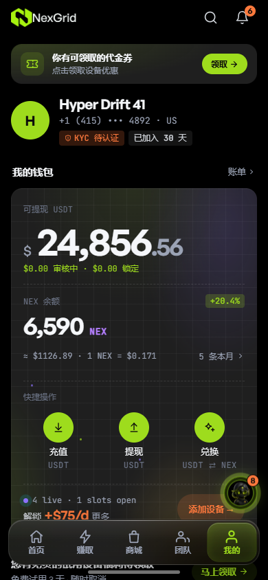 `wd-01-me.png` | 我的页余额卡:「$0.00 审核中 · $0.00 锁定」不可点、无解释 | 🔴-3 |
| 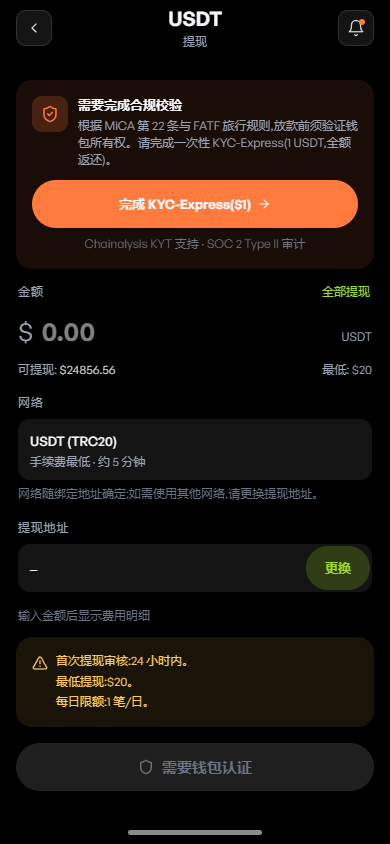 `wd-03-withdraw-empty.png` | 全新用户首次进提现页:KYC 闸 + 灰按钮「需要钱包认证」点不动 | 🟠-8 |
| 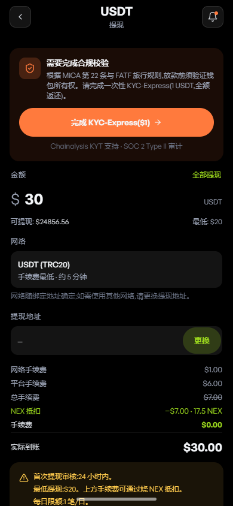 `wd-04-withdraw-30.png` | 输 $30 的完整费用明细($6 平台费 = 20%,NEX 自动抵扣) | 🟠-5 🟠-6 |
| 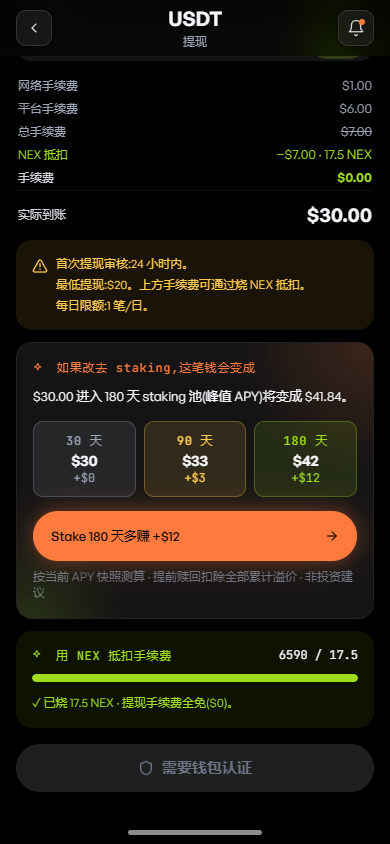 `wd-05-withdraw-30-lower.png` | 橙色 staking 卡压过主 CTA;「✓ 已烧 17.5 NEX」无开关 | 🟠-5 🟠-9 |
| 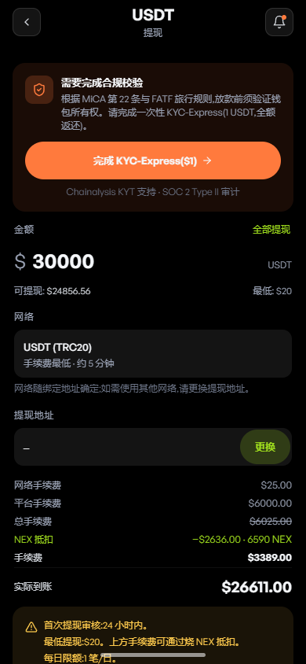 `wd-06-overbalance.png` | KYC 前输 $30000:零提示,照算「实际到账 $26,611」 | 🔴-6 |
| 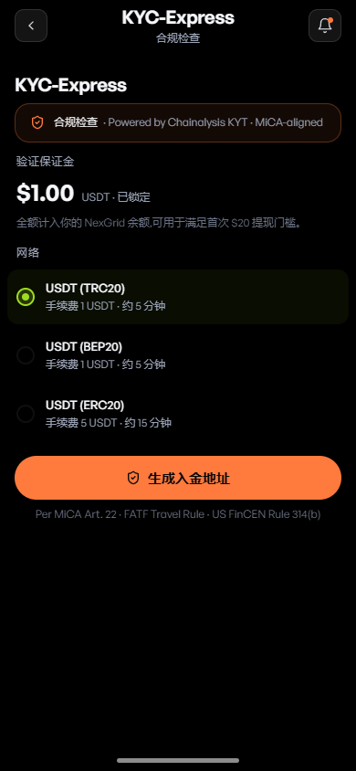 `wd-07-kyc-topup.png` | KYC-Express 页:「$1.00 已锁定 / 全额计入余额」(与提现页「全额返还」不一致) | 🟠-8 |
| `wd-08-kyc-address.png` / `wd-09-kyc-done.png` | $1 入金二维码页 / 验证完成页 | 🟠-8 |
|  `wd-10-withdraw-unlocked.png` | 解锁后的提现页:空金额时按钮副标题「请输入提现金额。」(这条做得好) | — |
| 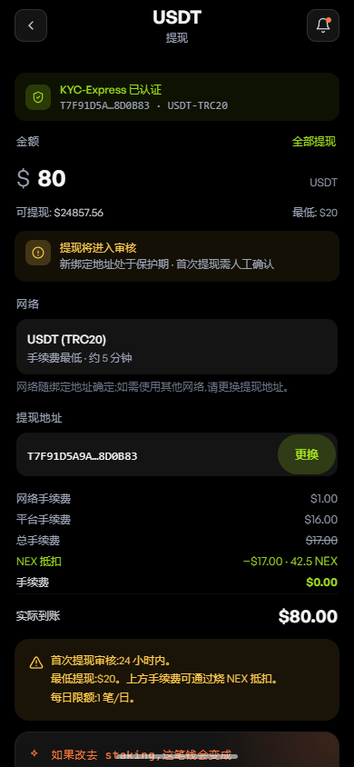 `wd-11-withdraw-80.png` | 输 $80:审核横幅出现,但**没有**「改提 $50 以内可立即处理」 | 🟠-1 |
| 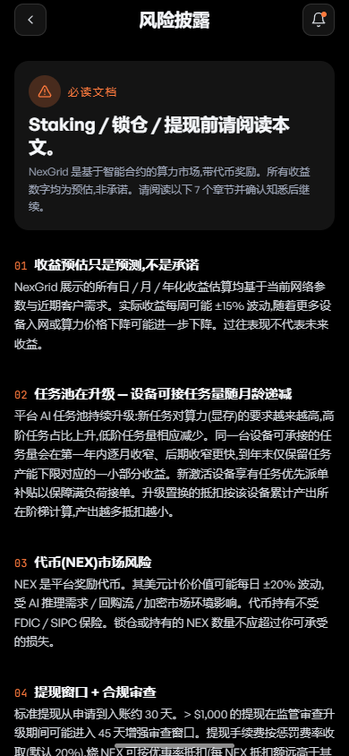 `wd-12-risk-disclosure.png` | 提交后被丢去 7 章风险披露 | 🟠-3 |
| 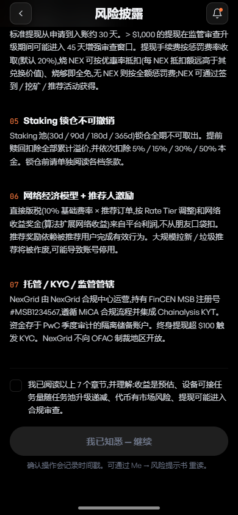 `wd-13-risk-bottom.png` | §04「标准提现从申请到入账约 30 天」+「20% 惩罚费率」 | 🔴-5 🟠-6 |
| 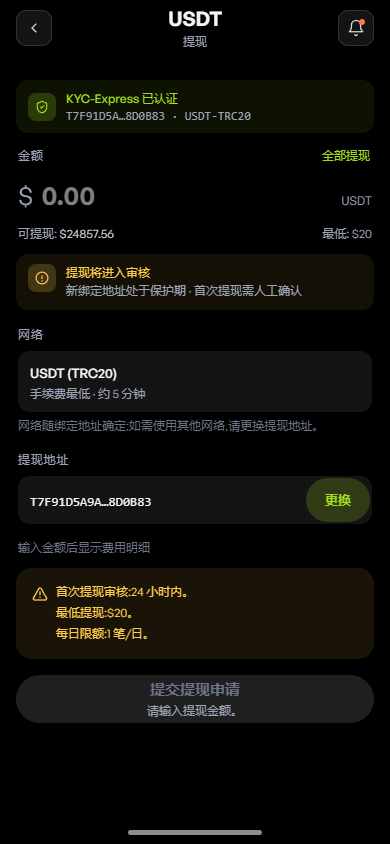 `wd-14-back-to-withdraw.png` | 读完风险披露回来:金额被清空成 $0.00 | 🟠-3 |
| 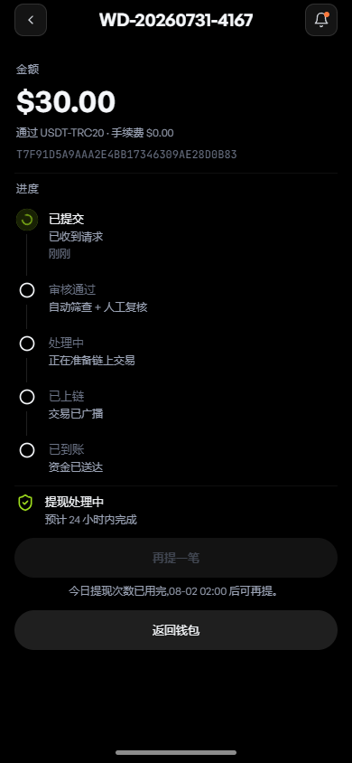 `wd-15-submit-confirm.png` | $30 提交后的进度页:五步 + 「预计 24 小时内完成」 | 🔴-5 🟠-2 🟡-4~6 |
| 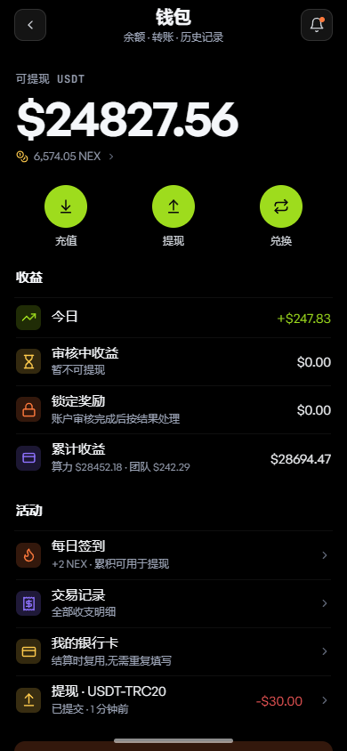 `wd-16-wallet.png` | 钱包页(只能从进度页「返回钱包」进来):审核中/锁定行 + 底部提现记录 | 🔴-3 🔴-4 |
| 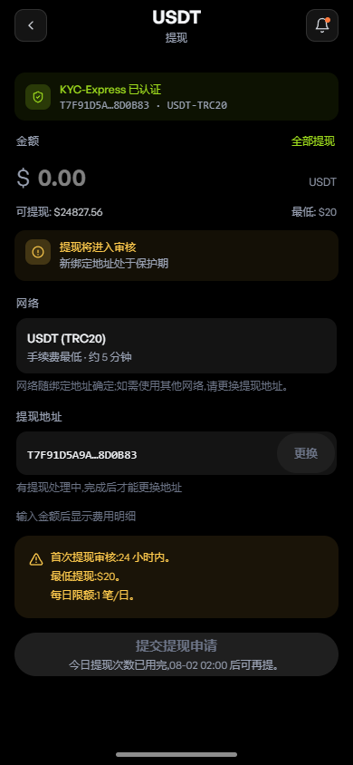 `wd-17-second-withdraw.png` | 当天再提:按钮副标题「今日提现次数已用完,08-02 02:00 后可再提。」 | 🟠-7 |
| 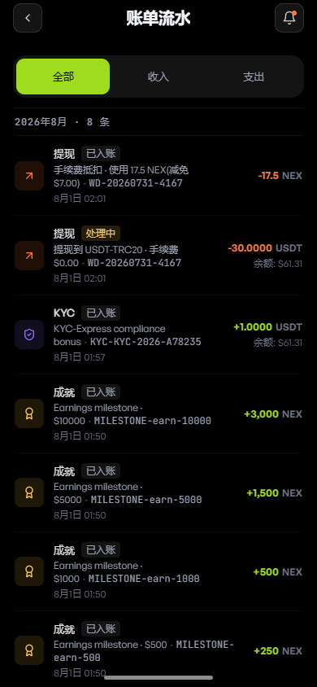 `wd-18-bills.png` | 账单:「余额: $61.31」(钱包是 $24,827.56)+ 内部编号外泄 | 🔴-2 🟡-1 |
| 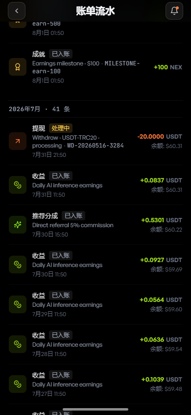 `wd-19-bills-english.png` | 中文界面里的英文流水备注 | 🟡-1 |
| 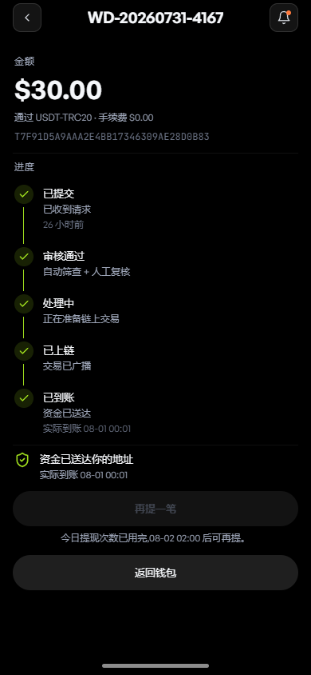 `wd-20-tracking-elapsed.png` | 到账终态:五步全绿,但中间三步无时间、无交易哈希 | 🟡-5 🟠-10 |
| 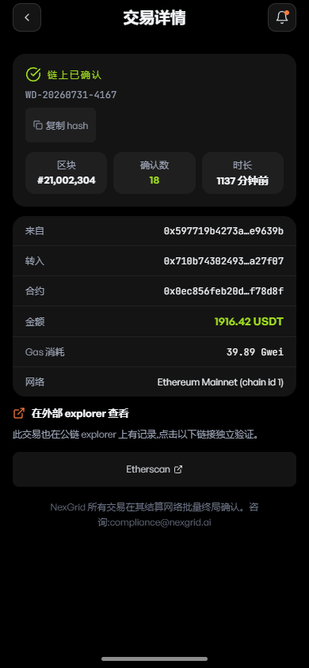 `wd-21-tx-hash.png` | **点自己那笔 $30 提现 → 显示「1916.42 USDT · Ethereum Mainnet」** | 🔴-1 |
| 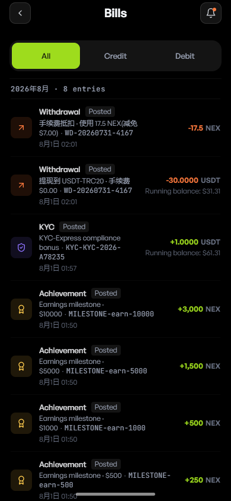 `wd-22-bills-en.png` | 英文界面下账单变中文备注 + 中文日期「8月1日 02:01」 | 🟡-1 🟡-2 |
| 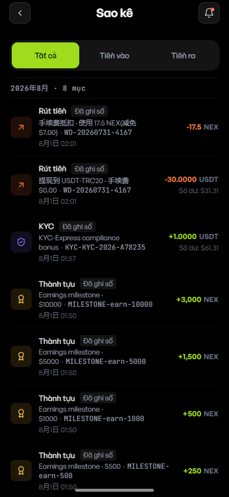 `wd-23-bills-vi.png` | 越南语界面同样:中文日期 + 中英混杂备注 | 🟡-1 🟡-2 |
| 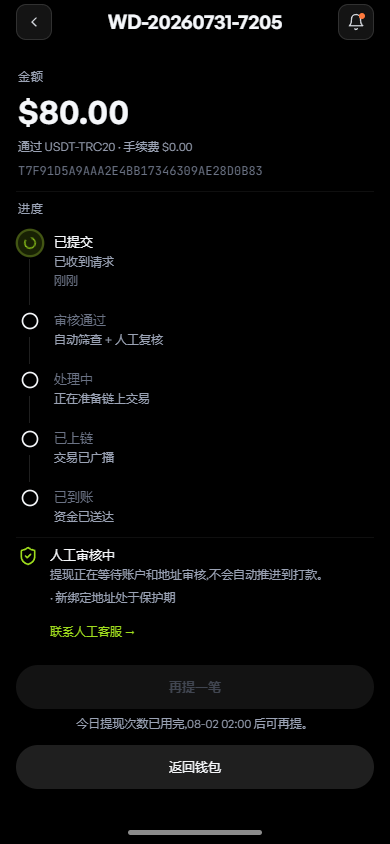 `wd-24-tracking-80-review.png` | $80 进度页:「人工审核中 · 不会自动推进到打款」,**无 ETA**,但有客服入口 | 🟠-2 🟡-6 |
| 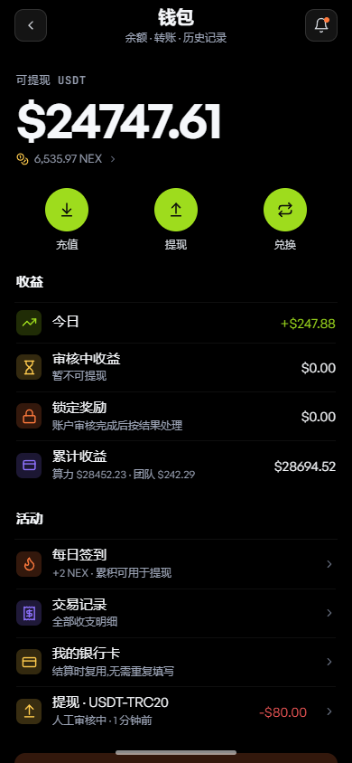 `wd-25-wallet-review-pending.png` | 余额少了 $80,「审核中收益」写 $0.00 | 🔴-3 |
| 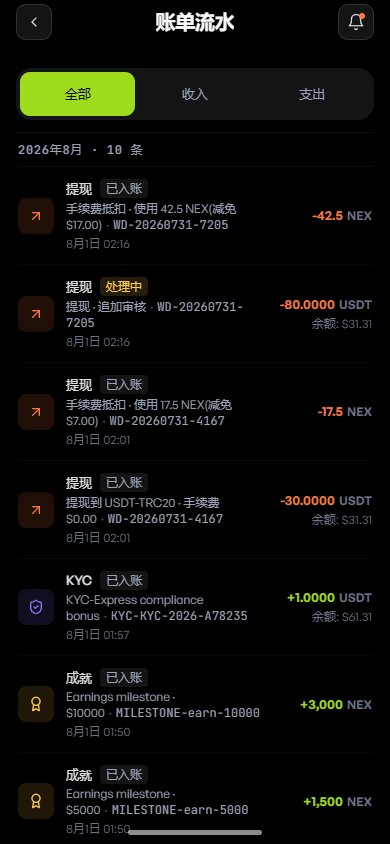 `wd-26-bills-balance-broken.png` | -$80 和 -$30 两行的「余额」都是 $31.31 | 🔴-2 |
| 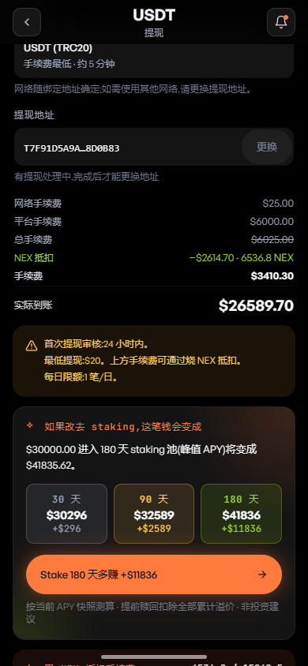 `wd-27-overbalance-post-kyc.png` | 余额 $24,747 却算出「实际到账 $26,589.70」+ staking 卡按 $30,000 测算 | 🔴-6 |

### 附:两笔真实提交的落库单据(证据)

```
$30 → { status:"confirmed",      riskRoute:"pass",  fastLaneApplied:true,
        waivedGates:["new-address-hold","first-withdrawal-review"],
        estimatedCompletion: submittedAt + 24h }

$80 → { status:"review-pending", riskRoute:"delay", fastLaneApplied:false,
        riskReasons:["new-address-hold"],
        estimatedCompletion: submittedAt + 24h }
```

阈值实测:$50 及以下无审核横幅、走快车道;$51 起进审核。$1,000 起额外叠加「大额提现需人工审核」。
**这三个数字($50 / $1,000 / 20% 费率)在提现页上一个都没写。**

