# APP 样式一致性问题清单与修复验收

正式来源为 `nexion-frontend-uniapp` 的远端 `test`。基线 `8d37bfa1`，集成吸收 `be241e78`、`38ce507e` 和 `198b81f8`；H5 分享卡参考为 `Nexion-H5` 的 `e4098ba9`。本轮只调整已确认的视觉问题，保持资金、分享事件、邀请码和路由业务规则。

## 问题清单与推荐方案

| 类别 | 实际问题与范围 | 推荐方案 / 本轮处理 | 验收状态 |
|---|---|---|---|
| U01 静态卡片背景 | 暗色基线 26 个路由、57 个面板使用蓝灰 `#11151D`，与旧灰 `#141414` 混用 | 公共内容 token 统一引用旧灰 `--v5-surface`；保留亮色白面和导航交互层玻璃 | 暗亮全路由实景通过 |
| U02 Earn 裸列表 | 市场价格、设备排名、任务中心和成功读取的设备详情缺少完整内容卡外壳 | 为完整模块补单层灰底；内部行透明，避免卡片再套背景卡 | 已填充列表、设备详情实景通过 |
| U03 子页导航长条 | 基线 77 个路由出现公共子页 header；返回、标题、消息共用长条玻璃 | 两套公共 header 改成独立圆形按钮，标题透明；滚动隐藏、回到顶部恢复；商品参数不能覆盖内部宿主标记 | 全路由几何、两套滚动交互通过 |
| U04 钱包粒子缺失 | 我的页钱包缺少点状粒子；主人明确原右下角光圈要保留且不加网格 | 原光圈节点和样式不改，只加五个点状粒子；金额在上层、装饰不拦点击；减少动态时粒子静止 | 原光圈逐项一致、自然动画采样通过 |
| U05 团队分享卡 | 新版信息层级丢失原版的大字 NEX、工具值与紧凑布局 | 按主人最终决定直接采用 H5 原版双栏与分享胶囊；仅借视觉，保留正式奖励启用/关闭/加载/失败规则 | 三语言、窄屏、四工具及奖励四状态通过 |

### U01：统一旧灰卡片

基线左图的内容卡为蓝灰；右图显示同一处旧灰卡。此类采用公共 token 修复，覆盖首页、商城、我的、团队、日常、任务、信任和引用子页，不逐页硬编码。

| 修改前 | 修改后 |
|---|---|
| 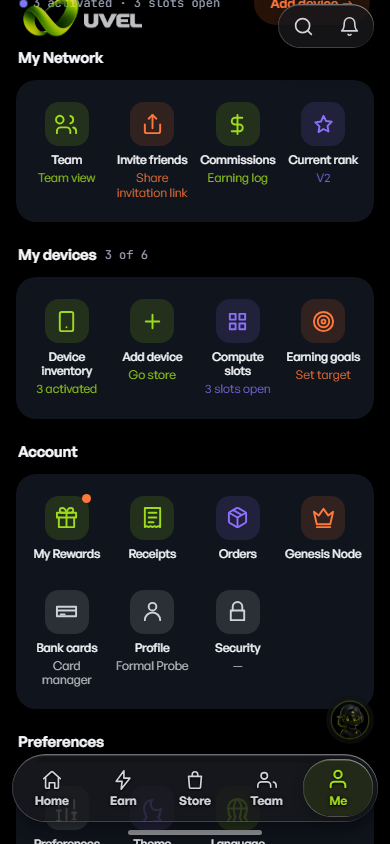 | 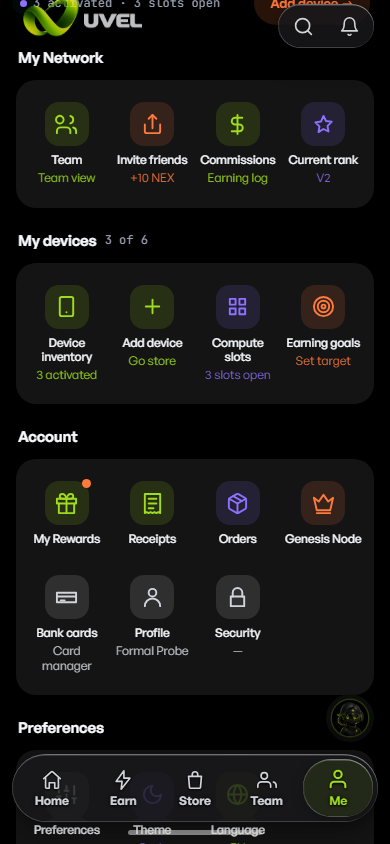 |

### U02：Earn 列表补卡片

完整市场模块与任务中心原来直接落在页面黑底上。推荐把每个完整模块作为一个灰色内容面，标题、榜单和历史行留在同一面内。

| 修改前 | 修改后 |
|---|---|
| 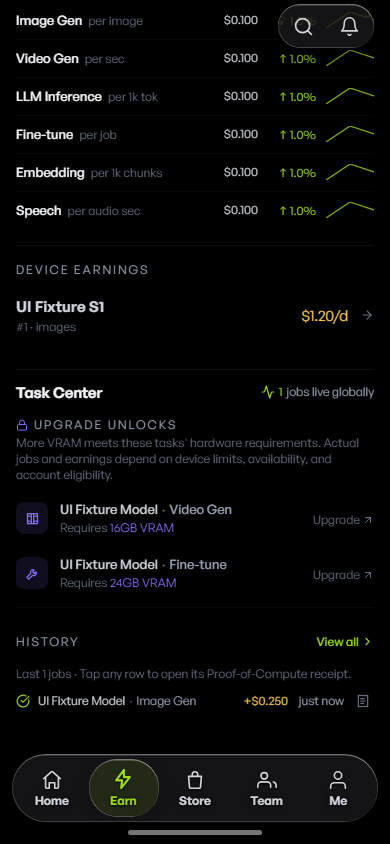 | 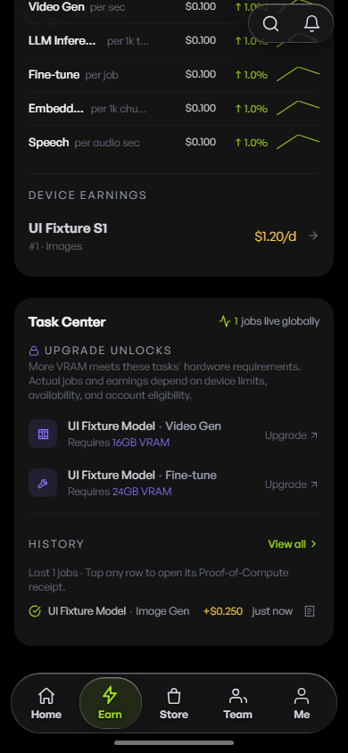 |

### U03：圆形返回与无底标题

两套共享 header 都需要改。商品详情页另外复现了查询参数覆盖宿主标记的挂接问题，不能只修改外观后忽略真正的滚动行为。

| 修改前 | 修改后 | 上滑隐藏 |
|---|---|---|
| 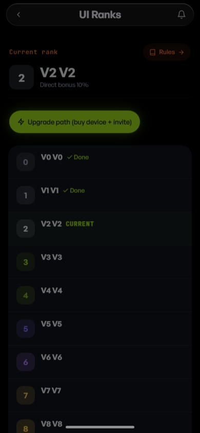 | 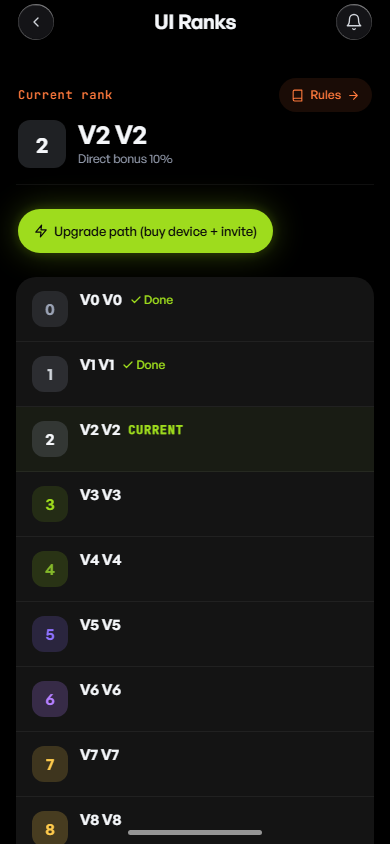 | 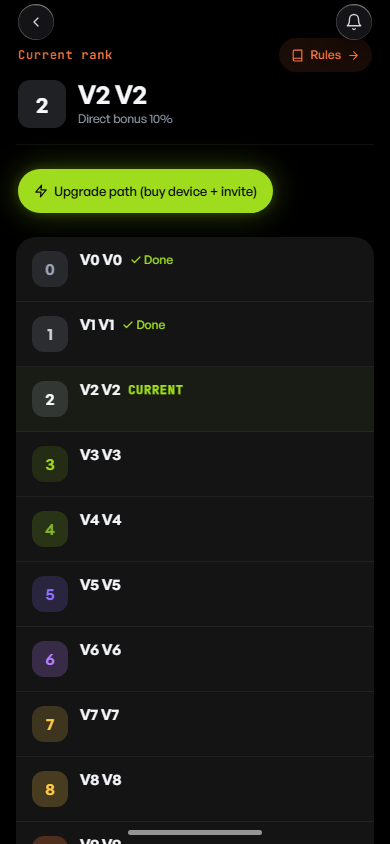 |

两套 header 都验证了冷启动、下滑 40px 隐藏、上滚至 20px 仍隐藏、回顶恢复。实际返回导航会重置滚动位置至 0，标题同步恢复可见；本轮不声称实现滚动位置保留。44px 点击区域、消息入口和工单专用操作保持。

### U04：恢复钱包原粒子

只添加原版点状粒子，不添加网格和新的 aurora 铺底层。原右下角光圈保持。粒子在金额下层，不拦点击。两个自然时间点的位移与可见度、减少动态时的静止可见状态都已实测；原光圈的尺寸、位置、旋转、渐变、阴影与 7 秒呼吸动画保持。

| 修改前 | 修改后 |
|---|---|
| 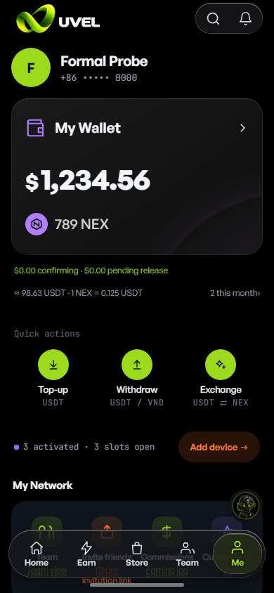 | 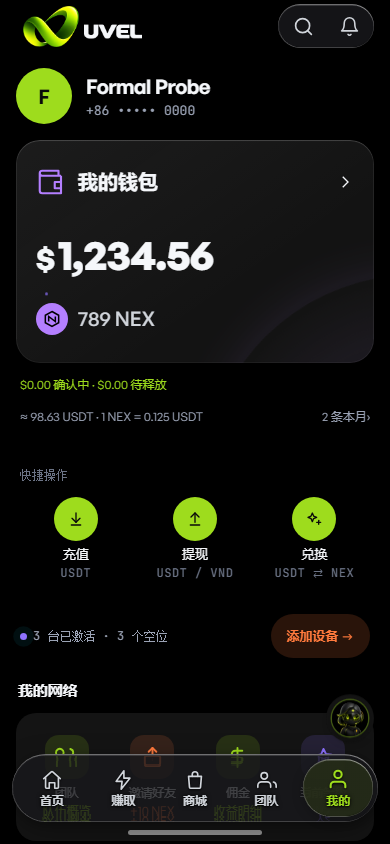 |

### U05：直接采用 H5 原版分享卡

主人最终指定原版双栏样式，取代本轮未被接受的新设计：左侧大字 NEX 和说明，右侧海报、邀请码、链接、原版主分享胶囊，底部奖励记录；窄屏按原版堆叠。奖励金额来自正式读取结果。未启用、加载和失败时明确显示对应状态，不能把示例数值或旧美元奖励带入正式 APP。

| 修改前 | H5 视觉参考 | 修改后 |
|---|---|---|
| 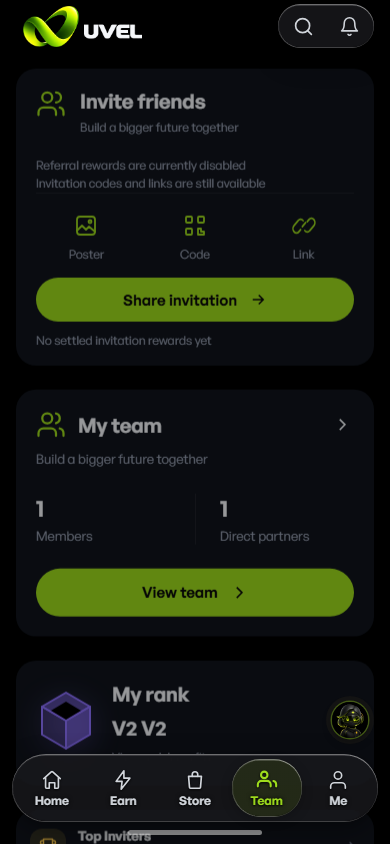 | 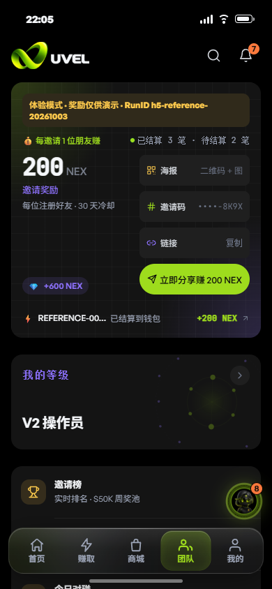 | 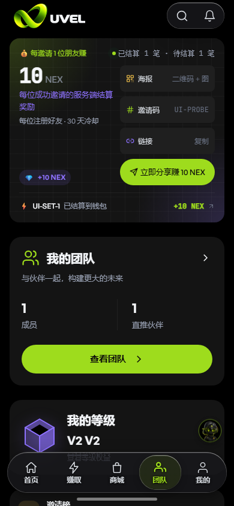 |

## 最终验收与覆盖

前端全站实景批次在 `http://127.0.0.1:5174` 对完整清单执行：

- 94 个清单路由在 390px 中分别遍历暗亮主题；9 个关键页面另覆盖中文、越南语、320px 三语言暗亮，以及减少动态的暗亮状态，共 296 组。
- 4,392 条运行断言，734 张截图，0 失败；包含交互后 browser errors 和非导航请求失败检查。
- runId：`f5bfe1e0-8c92-40b2-b531-7c42fa8b76b5`；起止 HEAD：`38ce507ee21aaf3cf3512d5f252eef53bb7ac870`。
- 起止源码与探针快照一致：`9f0956cae9427fd34858dc57054caeee490caf2c2a5cb356d88a4d86495644e3`，1,504 个文件。报告中的修改后截图均来自这次稳定快照，五类视觉组件此后未改。
- 提交整理时删除滚动测试末尾一行空白，并将探针默认临时目录改为中性名称；全站批次显式指定了输出目录，未使用此默认值。随后吸收远端 `198b81f8` 的三语注册前提文案；受影响页面的追加回归与 5173 集成回归另按新快照记录。这些后续变动均单独记录，不能将旧批次原始快照冒充新提交快照。
- 重跑命令：设置 `BASE_URL=http://127.0.0.1:5174` 和仓外 `UI_AUDIT_OUTPUT` 后执行 `node scripts/ui-consistency-runtime.mjs`。本机完整原始记录位于 `D:/WORKS/PLAN/UI/ui-consistency-20261003/final-runtime/{runtime,summary}.json`。

独立正交核查没有限定卡片 class 名，另对 94 个暗色路由的 454 个广义表面、84 个页头候选、149 个列表候选读取实际计算样式。未发现新的蓝灰普通面板、缺灰底的完整列表或长条公共页头。该次只读核查的 runId 为 `d93b76f8-3e2c-46b3-8503-782f9fde1b32`；快照 `98db1f7af7c2b8cfd4a790f163df05bb03a5d5ead04b4579898c9e21fc088d5a` 早于最终探针的 scoped 动画名称校正，产品源码相同。原始证据位于同级 `residual-surfaces`。

第一次完整批次因 Vue 给 scoped keyframe 名附加 8 位标记，探针误报了 12 条光圈名称不符；保留原失败记录 `final-runtime-scoped-animation-false-red`。仅将探针限定为接受原名称或该 8 位标记，继续严格核验原 CSS、7 秒周期和实景动画，再重新跑完整 296 组；未修改产品以迎合探针。

截图中的受控测试账号、金额、商品和奖励用于前端状态验收，不作为真实后台业务证明。H5 参考图中的 sandbox 标记与旧演示奖励只属于参考环境，未带入正式 APP。

原始暗亮基线各访问 94 个清单路由。钱包旧绑卡页按正式适配器跳转新增绑卡页；缺少会话参数的聊天入口跳转消息中心，另用受控有效会话验证聊天页。不能把这些跳转写成被跳转页面的已填充业务状态通过。

### 六维完成检查

| 维度 | 证据与边界 |
|---|---|
| 真落地 | 冷启动、刷新和重新进入读取实际计算样式；钱包两次自然动画采样。样式无新增持久化业务写入，复制也不发分享奖励事件 |
| 该有的在不在 | 全清单请求与实际路由分别记账；检查完整灰底列表、两套标题、五粒子及原光圈、四分享入口、奖励提示四状态 |
| 交互完整 | 实际返回、消息入口、分享弹层、海报、复制码/链接、Enter/Space、复制失败和空码防护；四入口均至少 44px |
| 同形全扫 | 94 路由暗亮遍历，另用广义元素选择扫描 454 个表面；分类截图及候选语义核查互相补充 |
| 不变量 | 中英越、暗亮、320/390px、双币金额、减少动态；原生运行边界单独列出，未冒充真机通过 |
| 实景回归 | 稳定源码批次 296 组零失败；独立源码审查与 46 条相关行为/契约测试通过。提交另受完整 `npm run verify` 稳定候选树门约束，最终门记录与推送结果以交付记录为准 |

本轮修复的是视觉及宿主绑定，未改变业务功能契约，因此不修改 PRD。被复现的宿主 ID 覆盖问题、两套 header 行为和钱包装饰边界已补入自动回归测试。

完整检查第一轮实际跑完 22 步，20 通过、2 失败；原日志保留在本机 `full-verify-first-failure`。其中视觉对照误读工作树旁的旧目录，改用现有批准指纹全部匹配的 `D:/WORKS/PLAN/Nexion-uniapp`（`710e9eec`）后，17 条对照测试通过；新增探针临时名称已改正。机型检查按其既有“取样探针”规则精确登记四行 UI fixture 的用途，不修改全集判据或自测，也不声称八机型业务覆盖。其余六个运行门因临时 development 服务中途失联而无法判定，不能算页面错误或通过；重新运行完整检查时指定正确参照和 `PROBE_CONCURRENCY=1`，保留同样路由、断言及失败条件。

## 范围限制与后续建议

额外候选只有 Earn 收益上限展示卡原有的橙色柔光：外层已经是旧灰，但内部保留警示色渐变。它属于关键展示，未构成本轮蓝灰普通卡、裸列表或长条导航问题。推荐继续保留；若后续决定让关键展示也完全平面化，可只去掉其 `glowStyle` 装饰层，保留灰底和业务内容，本轮未扩大修改。

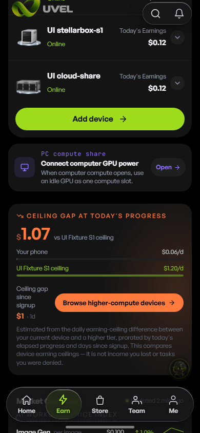

本轮 H5 实景验证覆盖页面和已确认视觉族。原生真机的后台驻留、设备绑定、心跳、校准，以及真实资金和奖励写入不属于前端 fixture 的证据范围。建议在正式原生包验收时复用同一截图与交互清单；不将这些未验证范围记作已发现的 bug。

本轮按五类要求统一了 APP 样式，分享卡回到 H5 原版，钱包保留原光圈并只加点状粒子；问题清单、方案和对应截图已按同类归档。
