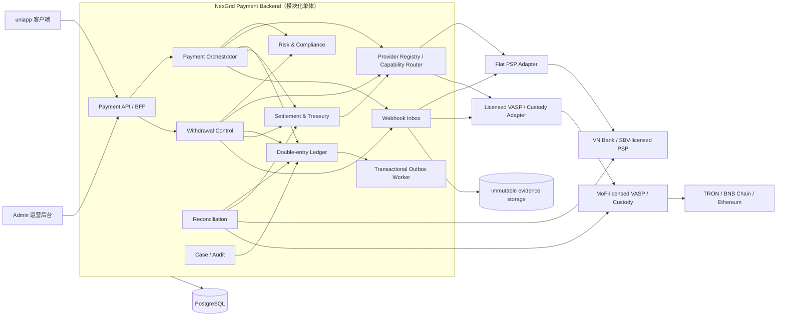

# NexGrid 越南支付生产架构规格（三位一体）v2.0-DRAFT

> 工作线：uniapp + admin + 支付后端　|　模式：规格先行　|　状态：Draft / 主人产品默认已确认 / 法务、合作方与上线签字未完成 / 禁止据此开真钱
>
> 作用：补齐已签 `PAY-NexGrid_越南支付架构规格_v1.0.md` 的生产资金、合规、托管、账本、对账和灾备边界。v1 在本草案签字前仍是交互基线；本草案不授权改代码、不授权签供应商、不授权开放真实资金。

---

## 0. 先给结论

### 0.1 反结论：当前项目不能直接开真钱

[KNOWN, HIGH] 当前 uniapp 中 USDT 地址、链上确认、VietQR 回单、银行卡授权、钱包验证、提现扣款和账单均为客户端 mock；它证明了交互，不证明真实资金安全。

[KNOWN, HIGH] 现有两份项目文档存在生产前提冲突：

- 已签 v1 要求 `USDT 三链 + VietQR + 国际卡` 入金、仅 USDT 出金；
- 更新的美国主体落地分析认为，当前“入金—设备—收益—佣金—提现”完整经营结构不能仅靠换支付商解决。

[KNOWN, HIGH] 越南 `05/2025/NQ-CP` 要求加密资产相关服务和营销由财政部持牌机构提供，并规定加密资产发行、交易与结算使用 VND。`52/2024/NĐ-CP` 管理越南非现金支付工具与支付服务。因此，“收 VND/卡后按客户指令发 USDT”不能当普通电商充值处理。

[KNOWN, HIGH] 美国 FinCEN 的 CVC 指引按业务实质判断：经营性接受、兑换或传输可兑换虚拟货币通常可能构成 money transmission，除非落入明确限制或豁免。

[UNKNOWN] 截至 2026-07-29，本次官方来源核验未确认越南首家已获财政部牌照、且书面支持 USDT 外部钱包转出的服务商。未核验不等于不存在；上线前必须以官方牌照与合同业务范围复核。

### 0.2 唯一建议的生产模型

NexGrid 只拥有产品、支付编排、不可变账本、风控决策、对账和运营处置；不自己做以下事情：

- 不用个人或轮换银行账户收款；
- 不直接保存卡号、CVV 或磁道数据；
- 不自行把 VND 兑换成 USDT；
- 不持有私钥、助记词或热钱包主密钥；
- 不以客户端状态、支付截图或跳转成功页作为入账依据；
- 不允许银行卡/银行/USDT 入金本金直接变成可提现 USDT；
- 不在供应商回调结果未知时切备用通道重复扣款；
- 不在风控服务无响应时自动放行。

真实资金由两个受监管边界承接：

1. **越南法币边界**：越南银行或 SBV 许可范围可核验的 PSP/收单方，承接 VietQR、NAPAS/国际卡、VND 结算、退款与拒付。
2. **加密资产边界**：越南财政部牌照与业务范围可核验的 VASP/托管方，承接 USDT 地址、KYT、托管、VND↔USDT 兑换、签名、广播、Travel Rule 数据与链上对账。

任一边界未通过法务、牌照、合同和沙箱验收，对应通道默认 `OFF`。

越南首发账务的权威计价和商户结算币种是 **VND**。所谓“USDT 入金”是客户把 USDT 交给持牌 VASP，由 VASP 在许可范围内完成兑换并向商户结算 VND；NexGrid 不接受 USDT 直接购买商品/服务，也不把收到的 USDT 记成平台可自由支配资产。所谓“USDT 出金”是把已确认的 VND 可提现收益交给持牌 VASP 报价兑换并发到已审核钱包。若未来采用“客户在 VASP 的独立 USDT 托管子账户”，须另获法务、牌照和产品签字，且 VASP 账本是资产权威，NexGrid 只做镜像。

[RECOMMENDATION, HIGH] M2 合同应让 PSP/VASP 在其许可范围内以受监管签约方身份承接对应资金服务，而非只做 NexGrid 的无牌代理。最终 principal/agent、资金所有权、风险转移和破产隔离以合同与双法域书面意见为准；若资金法律上先归 NexGrid，再委托供应商处理，本规格的牌照边界必须重审。

### 0.3 推荐上线形态

| 形态 | 法币入金 | USDT 入金 | USDT 出金 | 结论 |
|---|---|---|---|---|
| M0 沙箱 | 模拟 | 模拟 | 模拟 | 当前允许 |
| M1 纯商品/服务订单法币支付 | 持牌 PSP | 关闭 | 关闭 | 最可能先落地；仅开放无投资式收益承诺且已通过逐 SKU 准入的订单 |
| M2 持牌伙伴全链路 | 持牌 PSP 结算 VND | 持牌 VASP 收取 USDT、兑换并向商户结算 VND | 持牌 VASP 把 VND 应付兑换为 USDT 后转至已审核钱包 | 本规格条件性目标；逐 SKU、七层网络版税和主体/经营结构未签前 No-Go |
| M3 NexGrid 自收款、自兑换、自托管 | 自有账户 | 自有钱包 | 自有签名 | 禁止作为首发方案 |

M2 仍有一个产品级前置条件：收益、团队佣金、质押/回报承诺和提现资格必须由越南与美国专业律师做书面结构审查；支付架构不能替经营模型消除证券、MLM、汇款或消费者保护风险。

### 0.4 本轮已确认的产品口径

1. **网络版税仍按七层计算**：后台以 L1–L7 的真实推荐链、费率、受益人和规则版本逐层计算、记账和冲正；APP 仅把 L1 投影为 `Direct Royalty`，把 L2–L7 合计投影为 `Network Yield Bonus`。两项展示不是两层算法，也不能作为对律师、监管、银行、PSP、收单方、VASP、审计和税务的披露口径。
2. **入金绑定具体订单**：首发不创建可反复消费的通用充值余额。每个 PaymentIntent 绑定服务端冻结的 `orderId + orderVersion + orderLineSnapshot + productOfferVersion`，支付金额不得由客户端自由填写。
3. **支持的是“所有已获支付准入的 SKU”**，不是“新 SKU 自动能收钱”。算力设备可以按各自法律分类和履约模型进入准入；Genesis 是独立金融/高风险 SKU，不属于普通设备目录，默认 `paymentEnabled=false`，须另取产品、Legal VN/US、Compliance、Finance、PSP/VASP/收单方的书面接受后才能开放。
4. **服务商尚未选定**：领域模型、账本和订单状态只依赖规范化能力与事件；具体 PSP/VASP、合同、账户、adapter、状态映射和技术认证都由不可变版本快照绑定。首发每个 scope/role 只启用一个人工批准的主 provider，不做自动经济 failover 或双写。
5. **资金服务主体默认由持牌合作方/MoR 承接**：NexGrid 只做产品、技术编排、账本镜像、风控决策和对账；具体债权债务主体、资金所有权、风险转移和破产隔离必须由最终合同及越南/美国书面意见确认。
6. **法币入金默认按 VietQR 主、Visa/MC 辅设计**：NAPAS 境内卡只在 PSP 明确支持、正确商户范围和风控能力满足时开放；“银行卡”不自动等于全部卡种都开放。
7. **银行/卡/USDT 入金本金只可消费、不能提现，退款只走原轨**：任何把本金直接兑换或转成可提现 USDT 的需求均视为新业务，不在本规格默认范围内。
8. **USDT 首发仅开一条由持牌 VASP 书面支持且运行数据最佳的网络**：不预设 TRC20，也不默认三链并行；网络、合约和限额在 provider O2/O5 证据齐全后冻结。
9. **出金同时支持自托管钱包与交易所/VASP 托管账户**：前者走签名挑战或增强认证，后者走 hosted-account 证明与 Travel Rule 字段；两类受益人不得共用低标准验证。
10. **FX、费用与退款价差按 VASP 实际成交处理**：人工审核不锁汇，审核通过后重新报价并由客户确认；NexGrid 不承担投机汇率风险。VND 退款义务固定，USDT 退回数量由 return trade 决定。
11. **订单默认仅在实际 settlement 后进入 paid、履约和计佣**：只有 provider guarantee、准备金、暴露上限和审批同时有效时，才允许 capture 后的受控提前履约；authorization 永不触发履约或佣金。

[KNOWN, HIGH] 越南多层经营规则按多级、多分支网络及参与人从自己与网络内他人经营结果取得经济利益的业务实质定义；仅把七层在 APP 合并成两项不会改变该事实。现行官方文本还限定多层经营对象和禁止行为，因此七层网络版税及 Genesis 必须分别作为法律与通道方 Go/No-Go，不得靠命名包装过门。

---

## 1. 第一性原理与不可破坏的不变量

### 1.1 基本事实

1. 银行卡/VietQR 是可撤销或可争议的法币轨；链上 USDT 转账通常不可逆，两者不能即时等价释放。
2. 客户看到“成功”不等于供应商已结算；供应商授权、捕获、结算、退款、拒付是不同事实。
3. 链上看到交易不等于可用；还需验证网络、USDT 合约、接收地址、KYT、确认数和链重组。
4. 钱包余额不是一列数字，而是有来源、用途、冻结状态和可逆性的负债集合。
5. 任何外部回调都可能重复、乱序、延迟、伪造或在本方响应前已成功。
6. 金额不能用 JavaScript `number` 和“两位小数”承载：VND 最小单位为 1，USDT 账务精度为 6 位。
7. 真正的资金事实只有三个：供应商/链上原始证据、不可变复式账本、实际银行/托管结算余额。

### 1.2 硬不变量

- `INV-01`：客户端无权铸造单号、地址、金额、汇率、费率、状态、风险结论或余额。
- `INV-02`：所有金额以整数最小单位存储；API 金额用十进制字符串，不传浮点数。
- `INV-03`：每个已过账 journal 的同币种借贷恒等；已过账记录不可更新、不可删除，只能新增冲正。
- `INV-04`：业务状态、平衡分录和 outbox 在同一 PostgreSQL 事务提交。
- `INV-05`：外部事件先验签并原样落证据库，再幂等推进状态；解析失败不丢原文。
- `INV-06`：外部业务键永久唯一；24h 请求幂等 TTL 不能代替永久的 provider/链上去重。
- `INV-07`：银行/卡/USDT 入金本金只核销绑定的 VND 订单，不进入“可提现收益”。
- `INV-08`：退款只回原支付轨或经合规人工案件退回原资金来源；禁止把法币退款改成 USDT 提现。
- `INV-09`：每笔提现必须有显式且未过期的 `RiskDecision=PASS|HOLD|REJECT`；缺失、超时或依赖失败一律 `HOLD`。
- `INV-10`：广播结果未知不得退款或重播；进入 `broadcast_unknown`，通过托管方与独立链源核实。
- `INV-11`：应用、数据库、日志、运营后台不出现私钥、助记词、CVV 或完整卡号。
- `INV-12`：任何供应商、网络、账本或对账异常都能单通道熔断，不拖垮其他通道。
- `INV-13`：每笔资金保留 `source_rail/source_provider/source_account/source_transaction`，不能提现时丢失来源标签。
- `INV-14`：配置、牌价、风控模型、供应商版本和条款版本按交易快照保存，事后改配置不改历史。
- `INV-15`：越南订单、收益负债和商户结算以 VND 为权威；USDT 只作为持牌 VASP 外部入金原币、报价资产或出金资产，不能用 UI 等值展示替代 VND 法定账。
- `INV-16 PRODUCT_ECONOMIC_GATE`：PaymentIntent 必须绑定 `product_offer_version_id`。只有 `legal_entity + country + rail + sku/event_type + economic_terms_version + commission_policy_version + product_legal_classification + accounting_policy_version` 的精确元组均为 `APPROVED` 且未过期，才可进入 `accepting_funds`；`UNKNOWN/TBD/EXPIRED/REVOKED` 一律 M0/禁真钱。一个 SKU 获批不得推导另一个 SKU、复投、升级、Genesis 一级或二级获批。
- `INV-17 COMMISSION_SUBSTANCE`：`royalty_view_component=direct|extended` 仅是 APP 投影，不是计算、结算、账务或合规维度。每笔网络版税永久保存 L1–L7 原始层级及源订单；禁止只存两项聚合后丢失七层事实。
- `INV-18 ORDER_BOUND_FUNDS`：入金只能核销已绑定订单及其不可变行项目快照，未匹配、超额、迟到或订单已失效的来款进入 `funds_case`；不得自动沉淀成可复用余额。
- `INV-19 GLOBAL_ECONOMIC_GUARD`：扣款、捕获、退款、FX、清算、签名、广播等同一经济动作在所有 provider 之间最多一个未被强终态证据关闭的 attempt。`timeout/unknown/普通 failed/查无记录` 不授权换 provider。

---

## 2. 目标架构：一个模块化后端，不造微服务动物园



### 2.1 首发组件

| 组件 | 唯一职责 | 明确不做 |
|---|---|---|
| Payment API/BFF | 身份、参数校验、幂等入口、只读查询 | 不改余额，不接受“客户端支付成功” |
| Payment Orchestrator | `PaymentIntent/Attempt/Refund/Dispute` 状态机 | 不直接调用账本表 UPDATE |
| Provider Adapter | 供应商鉴权、签名验证、规范化事件、主动查询 | 不包含产品余额规则 |
| Provider Registry/Router | 版本化能力、合同账户绑定、路由快照、认证和迁移 | 不按费用动态切通道，不在 unknown 时自动 failover |
| Risk & Compliance | KYC/KYB、制裁/PEP、KYT、速度、来源、显式决策 | 不以“无命中事件”表示 PASS |
| Ledger | 不可变账户、journal、余额投影 | 不保存 UI 活动流水替代账本 |
| Withdrawal Control | 冻结负债、受益人、审批、签名、广播、确认 | 不接触私钥 |
| Settlement & Treasury | PSP/VASP 应收清账、结算批次、准备金、资金池、流动性预占和暴露上限 | 不直接绕过账本发钱 |
| Reconciliation | 外部事件、业务单、账本、实际结算四方核对 | 不直接改客户余额 |
| Case/Audit | 不平项、退款、拒付、冻结、人工证据与审计 | 不允许无理由高敏操作 |
| Outbox Worker | 可靠发通知、异步任务、可重放 | 首发不引入 Kafka |

### 2.2 首发基础设施

- PostgreSQL：资金权威库；同步多可用区、PITR、加密备份。
- Transactional outbox/inbox worker：使用数据库行锁安全领取；首发不增加 Kafka。
- 不可变对象存储：保存供应商原始 webhook、结算文件、链上证明和人工案件附件；正文加密、访问审计、按法务批准期限保留。
- Secret Manager：供应商密钥、webhook secret、mTLS 证书；不进仓库和普通环境文件。
- 托管方/MPC：私钥信任边界；NexGrid 仅保存 custody account ID、公开地址、交易请求 ID。
- 独立链上核对源：验证托管方广播与确认，不作为签名器。

### 2.3 核心数据表

所有资金对象强制带 provider-neutral 的同一个 `MoneyContext`：

`legal_entity_id / ledger_book_id / customer_account_id / merchant_account_id / environment / country / base_currency`

- Phase 0 已确认“持牌合作方/MoR 承接资金服务”的产品默认，但在具体债权债务主体、合同、资金所有权和双法域书面意见落定前，仍不允许创建生产 `ledger_book`，Phase 1 不得先按美国主体猜建。
- 每个 `ledger_book` 只属于一个法律实体和一个本位币；同币种平衡不得跨 book。
- 跨法律实体资金只允许通过双方 book 中成对、可对账的 `due_to/due_from` 分录，不得直接相抵。
- 法律主体、merchant account 或 ledger book 变化必须新建 context；provider 不能写死在 context。每个 provider 角色经 `money_context_provider_binding` 与 route snapshot 绑定，允许 PSP、FX、托管、签名和链上广播由不同获批主体承接。
- 旧订单、退款、拒付、FX、清算和出金永久沿用创建时的 provider route/binding；切换 provider 只影响切点后的新 `economic_operation`。
- 所有时点字段用 PostgreSQL `timestamptz`、内部 UTC；越南财务营业日固定 `Asia/Ho_Chi_Minh`，不得用服务器本地时区切日。

| 表 | 关键字段 | 关键约束 |
|---|---|---|
| `money_context` | 上述 MoneyContext 字段、state、valid_from/to | 生产必须指向已批准主体/合同 |
| `provider` / `provider_account` / `provider_contract` | provider/account/contract IDs, legal name, regulator/license refs, environment, account/merchant/custody refs, secret_ref, scope, state, accept_new_until, service_existing_until, continuity_from_contract_id | provider/account/contract/environment 有复合候选键；续约必须显式继承存量服务义务；secret 只存版本引用 |
| `money_context_provider_binding` | context_id, role, provider_account_id, provider_contract_id, state, valid_from/to | role 固定为 fiat_acquiring/fiat_settlement/crypto_deposit/fx/custody/signing/broadcast；历史 binding 不更新 |
| `provider_terminal_evidence_policy_version` | policy_version_id, provider_id, operation_type, allowed evidence/outcome, independent evidence/observation window, replacement-safe rules, content_hash, state | 不可变；只由 attempt pinned capability 引用 |
| `provider_capability_version` | capability_version_id, provider_id/account/environment, role, operation_type, scope_key, supported_commands, idempotency/query/result/cancel/partial/settlement profiles, limits, terminal_evidence_policy_version_id, content_hash, state | 不可变；精确 capability tuple 获批，不从品牌名推断能力 |
| `provider_adapter_release` | adapter_release_id, provider_id, adapter_key, spi_version, artifact_hash, released_at, state | adapter/provider 绑定；artifact 变化使技术认证失效 |
| `provider_mapping_version` | mapping_version_id, provider_id, source_kind/schema_version, canonical_schema_version, amount_sign/exponent/gross_net semantics, business timezone/date, artifact_hash, state | 未知状态、列或精度必须 quarantine，禁止默认映射 |
| `provider_endpoint_profile_version` / `provider_credential_set_version` | provider/account/environment, endpoint/TLS profile hash, Secret Manager version refs/key IDs, valid_from/to, state | 不保存 secret；任何版本变化触发 production 重认证 |
| `provider_route_scope_guard` | environment, scope_key, route_epoch, current_new_route_version_id, version | route 选择与 cutover 共用的持久锁行；切点序列化 |
| `provider_route_epoch` | environment, scope_key, route_epoch, route_version_id, activated_at, migration_plan_id, content_hash | append-only 切点历史；route decision 的 FK 目标 |
| `provider_route_version` | route_version_id, environment, scope_key(country/rail/role/asset/chain/product_class/event_type), provider_binding/capability/adapter/mapping/certification/endpoint/credential version IDs, accept_new, service_existing, follow_on_command_allowlist, state, effective_from, approval_request_id, content_hash | 新单仅 active+accept_new；draining/retired 可 service_existing；所有 tuple 复合一致 |
| `provider_service_successor` | successor_id, origin_route_version_id, follow_on_command, service_route_version_id, compatibility_certification_run_id, contract_continuity_evidence_id, effective_from/to, state, approval_request_id | 同 context/role/provider/account/法律主体/object namespace 的安全轮换；可用新不可变 binding 承接续约合同；每个 origin+command 最多一个 active |
| `provider_route_decision` | route_decision_id, economic_operation_id, selection_mode(new/origin_direct/service_successor), new_route_epoch, route version及全部 pinned tuple, origin_route_decision_id, service_successor_id, decided_at, reason | new 冻结 guard epoch；follow-on 不冒充新单 epoch，保留 origin ownership |
| `provider_certification_run` | certification_run_id, provider binding+contract+environment+scope+capability+adapter+mapping+endpoint+credential tuple, state, evidence_manifest_hash, certified_at/expires_at | sandbox/production 分开；任一 tuple 变化，禁止新单直至重认证 |
| `product_catalog_version` | country, seller_entity, catalog_version, signed_by/at, state, content_hash | 同一市场/卖方仅一个 active SIGNED catalog；历史不可更新 |
| `economic_model_version` | country, seller_entity, model_version, rewards/commission/fulfillment refs, signed_by/at, state, content_hash | 同一市场/卖方仅一个 active SIGNED model；草案/客户端常量不得引用 |
| `product_offer_version` | catalog_version_id, economic_model_version_id, sku_id, product_class, seller_entity, price/tax/discount/fulfillment/economic terms, state, content_hash | 仅同时引用 active SIGNED 权威版本的 offer 可创建新订单 |
| `sku_payment_policy` | product_offer_version_id, country, event_type, allowed_rails, legal/accounting/commission policy refs, provider acceptance refs, refund/fulfillment rules, payment_enabled, valid_to, state | deny-by-default；Genesis 一级、二级及普通设备分别批准 |
| `order` / `order_line` | order_id/version, customer, seller, currency, totals, product_offer_version_id, quantity, terms_acceptance, state | PaymentIntent 只读服务端快照；支付中不可改价/换 SKU |
| `commission_policy_version` | program, layer rules, eligible event/SKU matrix, recognition/cooling rules, mandatory_clawback_policy_ref, content_hash, state | benefit 默认 false；任一 program=true 时强制 clawback policy |
| `sponsor_chain_snapshot` | source_order_id, beneficiary path L1..L7, captured_at, source/hash | 计提时冻结，不因后续关系变化重写历史 |
| `commission_accrual` | accrual_id, context_id, source_order_line_id, beneficiary_id, sponsor_chain_snapshot_id, network_depth, view_component, rate, influence_score, eligible_base_vnd, reward_asset/amount, policy_version, posting_stage, posting_instance_key, state, reversal_of | cash reward=VND、token reward=NEX 分账；reversal_of 只能指向同 context/受益人/depth/asset 的原 accrual |
| `commission_reversal_position` | original_accrual_id, reward_asset, original_amount_minor, reversed_amount_minor, version | 原 accrual 同事务创建；累计冲正的唯一并发守卫 |
| `commission_reversal_allocation` | original_accrual_id, reversal_accrual_id, source_event_type/id, amount_minor | 每个 reversal accrual 只归属一个原 accrual；精确分配且不可超原额 |
| `payment_intent` | context_id, id, order_id/version, order_snapshot_hash, product_offer/policy versions, gate_snapshot_hash, rail, purpose, requested_amount, status, quote_id, expires_at, version | expires_at≤全部依赖最早失效时点；每个外部/核销/履约/计佣门前重检；状态 CAS |
| `domain_event` | event_id, context_id, aggregate_type/id, event_type, aggregate_version_before/after, business_instance_key, payload_hash, occurred_at | append-only 合法状态转换；补偿只追加新 event |
| `economic_operation` | id, environment, context_id, owner_type/id, side_effect_class, business_instance_key, semantic_request_hash, amount_minor, asset, state, version | provider-neutral canonical command hash；owner/context/scope key 全部 NOT NULL |
| `domain_economic_operation_link` | context_id, owner_type/id, side_effect_class, business_instance_key, economic_operation_id | payment create/capture、FX、settlement、signing、broadcast、refund 分别链接，禁止一个含糊 provider attempt 表示多角色 |
| `provider_operation_attempt` | attempt_id, economic_operation_id, provider_account_id, route_decision_id, pinned capability/adapter/mapping/certification/endpoint/credential versions, provider_idempotency_key, provider_object_pk, semantic_request_hash, provider_request_hash, predecessor_attempt/evidence/policy refs, replacement_authorization_id, state, terminal_evidence_id, terminal_at | 同一 operation 最多一个 active；wire hash 可随 provider 变，semantic hash 不变 |
| `provider_terminal_evidence` | evidence_id PK, attempt_id, policy_version_id, outcome, evidence_type, provider/independent evidence uri+hash, external_operation_closure_hash, replacement_safe, state, verified_by/at, revoked_by/at/reason | attempt 一对一；只按其 pinned capability→policy 计算；撤销不可物理删除 |
| `provider_replacement_authorization` | authorization_id, economic_operation_id, predecessor_attempt_id, terminal_evidence_id, policy_version_id, successor_attempt_id, approval_request_id, state, authorized/revoked_by/at, reason | successor 出网的不可变依据；claim 前必须仍有效 |
| `payment_attempt` | context_id, intent_id, provider_object_pk, status, raw_amount, version | 外部经济命令通过 domain link；双结算都记录，订单只核销一次 |
| `provider_object` | provider_object_pk, environment, provider_account_id, object_type, provider_object_id, payload_hash | 所有外部 payment/quote/trade/refund/dispute/payout/settlement ID 的永久注册表与唯一作用域 |
| `provider_object_binding` | provider_object_pk, context_id, owner_type, owner_id, relation_role, bound_at | `provider_object_pk` 为 PK/FK；一个外部对象只能有一个不可变内部 owner |
| `provider_event_inbox` | inbox_id PK, environment, provider_account_id, event_id, payload_hash, received_at, signature_state, payload_uri, process_state | 同 event ID 同 payload 幂等；同 ID 异 payload 隔离+熔断 |
| `normalized_provider_fact_set` | fact_set_id, inbox_id, mapping_version_id, state(authoritative/shadow/superseded), approved_by/at, content_hash | 同 inbox+mapping 重跑复用；同 inbox 仅一个 authoritative set |
| `canonical_fact_contract_version` | canonical_type/schema_version, economic_effect, allowed_owner_type/relation_role/posting_stages, consumption_cardinality, state, content_hash | 平台权威 canonical 语义；资金事实首发只允许 `single_owner_single_consumption` |
| `normalized_provider_fact` | fact_id, fact_set_id, fact_ordinal, fact_hash, provider_object_pk, canonical_contract_version_id, occurred/observed_at, amount/currency/finality, raw_evidence_hash | 一个 set 可多事实；consumer 由 object binding+canonical contract 决定 |
| `provider_fact_consumption` | consumption_id, fact_set_id, fact_id, consumer_type/id, posting_stage, domain_aggregate_before/after_version, domain_event_id, ledger_book_id, journal_id, consumed_at | 只允许消费 authoritative set；事实→业务状态→账本血缘不可变且幂等 |
| `provider_fact_consumption_effect` | consumption_id, effect_type, typed ref(domain_event；ledger_book+journal；outbox_id；economic_operation_id；commission_accrual_id), reversibility, dispatch_or_completion_state | typed refs 恰一非空并有真实 FK；逐项记录派生效果 |
| `provider_fact_correction` | correction_id, inbox_id, old/new_fact_set_id, case_id, approval_request_id, state | 已消费事实重映射的唯一审批头；同一旧 set 同时最多一个 active |
| `provider_fact_correction_lineage` | correction_id, old_consumption_id, compensating_domain_event_id, reversal_ledger_book_id/journal_id, replacement_fact_id/consumption_id, replacement_ledger_book_id/journal_id, side_effect_case_id, effect_resolution_manifest_hash, state | 每条旧消费逐一绑定业务补偿、资金冲正、外部效果处置与替换 |
| `chain_transfer` | chain_id, token_contract, tx_hash, log_index, from, to, amount_minor, confirmations | `UNIQUE(chain_id,tx_hash,log_index,token_contract)` |
| `fx_quote` | context_id, account_id, beneficiary_id, purpose, provider_quote_object_pk, source/payout asset+amount, chain, token_contract, fees, rounding_rule, rate, expires_at, state | 不可变、一次消费；客户端只回传 quoteId |
| `fx_trade` | context_id, quote_id, provider_trade_object_pk, source/payout amount, fees, rate, state, version, executed_at | execute/query/reversal 各自经 domain economic operation link；部分成交/未知可追溯 |
| `fx_execution_leg` | leg_id, trade_id, provider_leg_object_pk, leg_sequence, source_asset/amount_minor, payout_asset/amount_minor, fees, state, executed_at | 每次 partial fill 是不可变实例，不能覆盖聚合值 |
| `fx_leg_reversal_position` | original_leg_id, payout_asset, original_payout_minor, reversed_payout_minor, version | `original_leg_id PRIMARY KEY REFERENCES fx_execution_leg(leg_id)`；并发反转唯一守卫 |
| `reversal_allocation` | original_leg_id, reversal_leg_id, allocation_asset, amount_minor | 计量原 leg 的 payout/reversal leg 的 source；正数；累计与精确分配双向校验 |
| `settlement_instruction` | context_id, fx_trade_id, provider_instruction_object_pk, direction, amount, asset, state | 外部命令经 domain link；未知态复用同一 economic operation |
| `settlement_batch` | context_id, provider_batch_object_pk, mapping_version_id, asset, source_exponent/schema, business_date/timezone, gross/fee/tax/reserve/net_minor, state, evidence_uri | 原币 `gross-fee-tax-reserve=net`；符号/精度/语义来自 mapping profile |
| `settlement_line` | context_id, batch_id, provider_line_object_pk, mapping_version_id, source_line_hash, asset, source_exponent, gross/fee/tax/reserve/net_minor, business_date/timezone, state | 逐笔原币闭合；amount 是 gross 还是 net 不可猜 |
| `provider_balance_snapshot` | context_id, provider_account_id, asset, available_minor, reserved_minor, as_of, evidence_hash | Treasury/对账使用；只作外部时点证据 |
| `provider_liquidity_position` | context_id, environment, provider_account_id, asset, available_minor, reserved_minor, version, snapshot_as_of | `UNIQUE(environment,provider_account_id,asset)`；唯一容量行，所有预占经条件更新 |
| `liquidity_reservation` | context_id, environment, provider_account_id, subject_type, subject_id, rail, asset, amount_minor, reason, state, expires_at, released_at | 入金提前释放或出金预注资均可预占；不产生 journal；释放只可一次 |
| `account` | ledger_book_id, account_id, owner, asset, purpose | 科目、币种、book 不可变 |
| `journal` | ledger_book_id, journal_id, business_type, business_id, posting_stage, posting_instance_key, reversal_of, replacement_for, posted_at | partial fill/reversal 各有实例键；已过账只可冲正 |
| `journal_line` | ledger_book_id, journal_id, account_id, debit_minor, credit_minor, asset, base_value_vnd | 复合外键锁死 journal/account/book/asset；延迟触发器验证整本 journal |
| `balance_projection` | ledger_book_id, account_id, asset, pending, locked, available, withdrawable, version | 复合 PK/FK 指向 account；只由同 book+asset journal 投影，可重建 |
| `fund_lot` | context_id, source_rail/provider/account/transaction, original, available, consumed, refunded, disputed, state | 每笔资金来源独立，禁止丢来源 |
| `fund_allocation` | lot_id, purchase/refund/dispute/withdrawal id, amount, allocation_type | 消费、冻结、退款按 lot 分摊 |
| `beneficiary` | context_id, id, account_id, asset, chain, address, type, verification_method, verification_level, evidence_hash/uri, challenge_id, verified_at, expires_at, version, kyt_state, cooling_until, hosted_vasp/account_ref | 地址+网络+证据版本绑定；敏感字段加密；变化即旧审批失效 |
| `withdrawal` | id, beneficiary_id, source_vnd_minor, payout_usdt_minor, fee_vnd_minor, quote_id, state, risk_decision_id | VND 源负债与 USDT 到账额并存；状态 CAS；唯一幂等键 |
| `payout_attempt` | context_id, withdrawal_id, attempt_no, custody_request_object_pk, provider_tx_object_pk, tx_hash, transaction_digest, state, terminal_at | signing 与 broadcast 各有 domain operation/link/route；同时受全局与链级证据守卫 |
| `chain_invalidation_evidence` | payout_attempt_id, chain_id, raw_tx_hash, signer, nonce_or_reference, expiry_or_blockhash, replacement_tx_hash, finality_height, provider_attestation_uri, independent_chain_evidence_uri, state | 已签交易不能上链的强证明；仅查不到 tx 不算证明 |
| `payout_terminal_evidence` | payout_attempt_id, evidence_type, payout_confirmation_ref, never_signed_attestation_ref, chain_invalidation_evidence_id, external_operation_closure_hash, verified_by, verified_at | `UNIQUE(payout_attempt_id)`；trigger 只凭三类强证明填写 terminal_at |
| `refund` | context_id, id, original_intent_id, origin_route_decision_id, fund_lot_id, amount, asset, provider_refund_object_pk, state, version | follow-on 强制回原 route service_existing；每次 partial refund 有独立 key |
| `dispute` | context_id, id, original_attempt_id, provider_dispute_object_pk, amount, fee, stage, outcome, evidence_uri | 拒付全生命周期与抗辩结果 |
| `risk_decision` | subject_type/id, decision, rule_version, input_hash, expires_at, reasons | 每笔必有显式结论 |
| `idempotency_record` | context_id, actor, endpoint, idempotency_key, request_hash, response_ref, state, expires_at | 同 key 异 body=409；资金外部业务键永久保留 |
| `approval_request` | context_id, action, target, payload_digest, maker, required_quorum, expires_at, state | 审批覆盖不可变动作摘要 |
| `approval_vote` | request_id, actor_id, human_identity_id, role_snapshot, decision, reason, signed_at | `UNIQUE(request_id,actor_id)`；quorum 按 distinct human 计，maker≠checker |
| `capability_evidence` | capability_id, type, scope, source, content_hash, reviewer, reviewed_at, review_due_at, revoked_at | 每份证据独立审核，非一个数组 |
| `reconciliation_run` | context_id, scope, business_date, timezone, as_of, high_watermarks, input_hashes, status, totals, evidence_uri | 四方同一冻结快照；迟到事件可重开 |
| `reconciliation_match` | run_id, match_group, asset, amount_minor, external_ref, business_ref, journal_ref, settlement_line_ref, state | 每侧可分摊但组内合计必须相等；同一来源不得重复超额匹配 |
| `reconciliation_exception` | run_id, object_refs, delta, owner, state, resolution_journal_id | 有货币差异必须绑定已过账处置分录 |
| `funds_case` | context_id, case_id, case_type, subject_type/id, provider_evidence_refs, asset, amount_minor, state, reason_code, legal_or_aml_hold, owner, review_due_at, evidence_uri/hash, return_trade_id, resolution_journal_id, version, closed_at | received_suspense/错币/差额/结算失败/退回失败的权威聚合；只引用原对象/证据、不争抢其 owner；CAS 状态 |
| `audit_log` | seq, actor, action, payload_digest, prev_hash, reason, request_id, ts | 连续哈希链；WORM/KMS 签名检查点 |
| `recovery_epoch` | epoch_id, restore_point, external_high_watermarks, fence_state, reconciled_at, approved_by | 灾备后外部副作用 fencing |
| `outbox` | outbox_id PK, context_id, environment, provider_account_id, aggregate, event_type, payload, side_effect_class, operation_id, economic_operation_id, provider_operation_attempt_id, route_decision_id, replacement_authorization_id, expected_operation_version, semantic/provider request hashes, recovery_epoch_id, fencing_token, publish_state | 除首 attempt 必须为 NULL 的 replacement authorization 外，经济 command 关键引用均 NOT NULL；替换型 command 强制 predecessor authorization；expected version 是不可变比较快照而非指向可变 current row 的 FK |
| `provider_migration_plan` | environment, scope_key, from/to route versions, state, cutover_at, old/new high_watermarks, approval, rollback_rule | 同 scope 最多一个非终态 plan；切换经锁 scope 的 DB 入口原子完成 |
| `provider_migration_checkpoint` | plan_id, type, count, evidence_hash, status | 切换和回滚只影响新 operation；旧 provider 清在途 |

### 2.4 永久唯一键

- `(environment, provider_account_id, event_id)`
- `provider_object` 的 `UNIQUE(environment,provider_account_id,object_type,provider_object_id)`
- `provider_object_binding.provider_object_pk PRIMARY KEY REFERENCES provider_object(provider_object_pk)`；owner 绑定后不可 UPDATE/DELETE
- `UNIQUE(economic_operation.environment,context_id,owner_type,owner_id,side_effect_class,business_instance_key)`；各列 `NOT NULL`，owner 非全局 UUID 也不串 context
- `UNIQUE(domain_event.context_id,aggregate_type,aggregate_id,aggregate_version_after)`；before/after 必须连续，补偿 event 也不可覆盖历史
- `UNIQUE(domain_economic_operation_link.context_id,owner_type,owner_id,side_effect_class,business_instance_key)` 且 `economic_operation_id UNIQUE`
- partial unique index `(economic_operation_id) WHERE provider_operation_attempt.terminal_at IS NULL`
- `UNIQUE(provider_operation_attempt.attempt_id,economic_operation_id,route_decision_id,provider_account_id,semantic_request_hash,provider_request_hash)` 作为经济 outbox 的 attempt/route/provider/双 hash 复合 FK 目标
- `provider_terminal_evidence.attempt_id UNIQUE`，并建候选键 `(evidence_id,attempt_id,policy_version_id)`；evidence policy 只取旧 attempt pinned capability，只有其策略可写 `terminal_at/replacement_safe`
- `provider_replacement_authorization.successor_attempt_id UNIQUE`；outbox 的 replacement authorization 与 attempt/predecessor evidence/policy 以复合 FK 锁死，非替换型 command 必须为 NULL
- `provider_route_scope_guard PRIMARY KEY(environment,scope_key)`；`provider_route_epoch PRIMARY KEY(environment,scope_key,route_epoch)` 且另建候选键 `(environment,scope_key,route_epoch,route_version_id)`，epoch append-only。`selection_mode=new` 的 decision 以 `(environment,scope_key,new_route_epoch,route_version_id)` 复合 FK 指向 epoch；`origin_direct` 强制 route 等于 origin route；`service_successor` 强制 route 等于 successor service route。三种模式用 CHECK/trigger 锁定必填/互斥字段，均不 FK 到会更新的 guard
- partial unique index `(environment,scope_key) WHERE provider_route_version.state='active'`；避免 nullable chain 绕过唯一约束
- partial unique `(origin_route_version_id,follow_on_command) WHERE provider_service_successor.state='active'`
- partial unique index `(environment,scope_key) WHERE provider_migration_plan.state NOT IN ('complete','aborted')`
- `UNIQUE(normalized_provider_fact_set.inbox_id,mapping_version_id)`；partial unique `(inbox_id) WHERE state='authoritative'`；`UNIQUE(fact_set_id,fact_ordinal)`
- `UNIQUE(normalized_provider_fact.fact_set_id,fact_id)`；资金事实 `provider_fact_consumption.fact_id UNIQUE`，consumer/posting_stage 都不参与去重；一个事实需要多个业务效果时在同一 consumption 事务写 effect 明细，不能再次消费。fact consumption 的 `(fact_set_id,fact_id)` 复合 FK 指向同一 set
- `provider_fact_consumption_effect` 的 typed refs 恰一非空且各自为 FK；按 `(consumption_id,effect_type,typed_ref)` 唯一
- partial unique `(old_fact_set_id) WHERE provider_fact_correction.state NOT IN ('complete','aborted')`；`UNIQUE(correction_id,old_consumption_id)`，lineage 的 reversal/replacement journal 均以 book+journal 复合 FK 关联
- partial unique `(country,seller_entity) WHERE product_catalog_version.state='active'`；`economic_model_version` 同理
- `UNIQUE(source_order_line_id,beneficiary_id,network_depth,reward_asset,commission_policy_version,posting_stage,posting_instance_key)`；七层佣金逐受益人/逐资产/逐事件实例去重
- `commission_reversal_position.original_accrual_id PRIMARY KEY`；`commission_reversal_allocation.reversal_accrual_id UNIQUE`；在 `commission_accrual` 建候选键 `(accrual_id,reversal_of)`，allocation 的 `(reversal_accrual_id,original_accrual_id)` 复合 FK 指向该键，另以 `original_accrual_id` FK 指向原 accrual，数据库强制 reversal 的 `reversal_of=original_accrual_id`
- `(chain_id, tx_hash, log_index, token_contract)`
- `(context_id, actor, endpoint, idempotency_key)`，同时比较 `request_hash`
- `UNIQUE(journal.ledger_book_id,journal.journal_id)`
- `UNIQUE(account.ledger_book_id,account.account_id,account.asset)`；`balance_projection` 以同一 tuple 为 PK/FK，禁止只按 `account_id` 聚合
- `(ledger_book_id, business_type, business_id, posting_stage, posting_instance_key)`
- partial unique index `(journal.ledger_book_id,journal.reversal_of) WHERE reversal_of IS NOT NULL`；全额冲正一次，部分反转走 leg allocation
- `UNIQUE(fx_trade.quote_id)`
- `UNIQUE(fx_execution_leg.trade_id,fx_execution_leg.leg_sequence)`；有 provider leg ID 时还必须落 `provider_object` 唯一 FK
- `fx_leg_reversal_position.original_leg_id PRIMARY KEY REFERENCES fx_execution_leg(leg_id)`；与 original leg 同事务创建，asset/原始金额不可修改
- `UNIQUE(reversal_allocation.original_leg_id,reversal_allocation.reversal_leg_id)`
- partial unique index `(context_id,environment,provider_account_id,subject_type,subject_id,asset) WHERE liquidity_reservation.state='active'`
- partial unique index `(context_id,subject_type,subject_id) WHERE funds_case.closed_at IS NULL`；`case_type` 只可 CAS 演进，不得靠换类型另开 active case
- `(request_id, actor_id)`；同一 human 即使兼具多角色也只计一票
- `(environment, provider_account_id, operation_id)`；只负责单 provider API 幂等，不能代替跨 provider 的 `economic_operation` 守卫；跨恢复 epoch 仍永久
- `UNIQUE(withdrawal_id) WHERE payout_attempt.terminal_at IS NULL`；只有 payout confirmed、never-signed attestation 或链级失效且外部副作用闭环的强证明可填写 terminal_at

provider/account/contract/environment、binding/role、capability scope、mapping/provider、adapter/provider、certification exact tuple 与 route pinned tuple 全部使用候选复合键+复合 FK；不能只存看似匹配的独立 UUID。`provider_operation_attempt.attempt_id` 是 PK。`activate_provider_route(...)` 是唯一新单 route 激活入口：锁 `provider_route_scope_guard(environment,scope_key)`，逐项验证 binding/account/contract/provider/environment、capability role/scope、mapping/adapter provider、production certification tuple、endpoint/credential versions完全一致且 `expires_at>now()`，再原子切旧 route 与新 route、插入下一条 append-only `provider_route_epoch` 并更新 guard current pointer。既有 epoch/decision 永不更新。

密钥、endpoint、certification 或合同续约不允许继续调用失效旧凭据，也不能让旧订单失去退款/查询能力。唯一入口 `activate_provider_service_successor(...)` 按 `origin_route_version+follow_on_command` 加锁，只允许 service route 与 origin 保持同一 environment/context/role/provider/account/法律主体/object namespace；合同 ID 变化时，创建指向新合同的不可变 binding，并以 continuity evidence 明确继承原对象的退款、争议、结算、数据与退出义务，资金所有权不得变化。新 capability/adapter/mapping 必须声明并通过历史对象/旧事件 fixture 兼容认证，service route 必须 `service_existing=true`、命令在 allowlist。它只替换获批 servicing tuple，不改变原支付 ownership、MoneyContext、provider object 或业务语义，禁止借此跨 provider/account。旧 credential 一经轮换/撤销即禁止网络调用；旧 tuple 只保留审计与证据解释。应用账号无上述表的直接 INSERT/UPDATE/DELETE 权。

所有 provider ID 必须先在 `provider_object` 以同一事务注册，并同时插入不可变 `provider_object_binding`；拥有外部经济对象的领域表只保存 `provider_object_pk` FK，且 trigger 验证 binding 的 owner_type/owner_id/relation_role 正是当前领域行。禁止再保存可绕过注册表的裸 provider ID，也禁止同一外部对象绑定第二个内部 owner。`payment_attempt/fx_quote/fx_trade/fx_execution_leg/settlement_instruction/settlement_batch/settlement_line/payout_attempt/refund/dispute` 的 provider 引用全部走该绑定。`funds_case/reconciliation` 只能通过 subject 或不可变 evidence ref 旁路引用原 owner 的对象；案件新建的 return trade/refund/payout 才各自拥有新的 provider object。object_type、provider account、environment 与 MoneyContext 同样由约束触发器/唯一领域入口校验一致。

所有外部副作用只能调用数据库 `authorize_provider_attempt(...)`：先按固定顺序锁 `provider_route_scope_guard`、`economic_operation`，校验 operation 尚未 `succeeded/closed`、不存在 active attempt、上一 attempt 已按**该旧 attempt pinned capability→terminal policy**取得强终态证据且 `replacement_safe=true`，并验证 owner/semantic request hash/amount/asset 未变。新经济动作在插入 attempt/outbox 前于同一 guard 锁内再次验证 `route_epoch + current route + active + accept_new`；因此与 cutover 串行，不能在切点后向旧 route 创建新 command。退款/void/dispute/settlement/query 等 follow-on 必须带 `origin_route_decision_id` 并验证原 payment ownership。只有 origin 的完整 servicing tuple（binding、contract service-existing 期限、capability、endpoint、credential、certification、adapter/mapping）全部有效时才可直用；任一项轮换、撤销、到期或不可服务，就必须解析当前 active `provider_service_successor`，冻结新的 service route decision，并验证同 context/role/provider/account/法律主体/ownership、合同 continuity 与兼容认证。两种路径都不得改投其他 provider/account，且每次按实际 servicing tuple 重查全部有效期。

通过后在同一事务创建 provider attempt、不可变 route decision 和经济 command outbox；outbox 的 economic operation/attempt/route/provider/semantic+provider hash 均非空并由复合 FK 锁死。若这是替换 attempt，同事务还须锁 predecessor evidence/policy，创建 `provider_replacement_authorization`，并让 successor attempt/outbox 以复合 FK 固化 predecessor attempt/evidence/policy；普通首 attempt 的 replacement refs 必须为空。`expected_operation_version` 是 authorize 时写入的不可变快照：INSERT trigger 必须验证当时 current version 相等，claim 再与锁定后的 current row 比较；不得外键到会更新的 `economic_operation.version`，不得级联改写。普通 `4xx/5xx/timeout/failed/cancelled/查无记录` 都不构成可替换证据；允许的最小证据为 `never_accepted_verified / never_executed_attestation / cancelled_unexecuted_verified / chain_invalidated_verified / reversed_and_settled`。`succeeded_confirmed` 只关闭经济动作，绝不允许再建 attempt。

应用运行账号撤销 `economic_operation/provider_operation_attempt/provider_terminal_evidence/provider_replacement_authorization/经济 command outbox` 的直接 DML；只可调用 security-definer 领域函数。worker 出网前必须调用 `claim_provider_command(outbox_id, expected_operation_version, recovery_epoch, fencing_token)`：同事务锁 operation+attempt+outbox；替换型 command 还按固定顺序锁 predecessor attempt/evidence/policy/authorization，确认它们仍 `approved/active`、未 revoked 且 `replacement_safe=true`；随后确认 attempt 仍是 current active、operation 未成功/关闭且版本相等、route/service mode 与命令匹配、完整 pinned tuple 与复合 FK 一致、certification 未过期、fence 当前，才发放一次性短时 dispatch grant。任一不符将 outbox 标为 cancelled/stale，**不得网络调用**。外部成功事实落库时同事务推进 operation version并取消所有尚未 claim 的 command。

evidence 或 policy 事后发现造假、误判或安全缺陷时，只能调用 `revoke_replacement_basis(...)`：锁 policy/evidence、相关 operation/attempt/outbox，追加撤销记录并推进 operation version，取消所有尚未 claim 的 successor command；已 claim/已出网者立即熔断 scope、开双 provider `funds_case` 并主动查询，不能假装撤销了外部动作。撤销不删除原证据，也不让系统自动再选第三个 provider。

`business_instance_key` 必须由服务端从不可变领域事实派生并永久保存：例如 payment capture 使用 intent+capture stage，退款使用 refundId/partial sequence，FX 使用 trade/leg，结算使用 instruction，payout 使用 withdrawal。HTTP 重试、恢复 epoch 和 provider 切换必须复用同一 key；客户端、运营和 adapter 无权以“新 key”绕过全局守卫。

跨 provider 对抗验收：

1. A 请求超时进入 unknown 后，即使 route 切到 B，worker、admin 和客户并发重试也必须被数据库拒绝，B 不产生 outbox 或网络调用；A 只准 query/reconcile。
2. A 提供满足 capability policy 的签名 no-effect 证据后，maker-checker 才可在一个事务关闭 A 并创建 B；100 个并发请求仍只有一个 active attempt。
3. A 在 B 获准后迟到成功，两个外部事实都保留，订单只核销一次，系统立即熔断 scope、开 `funds_case` 并对账，绝不覆盖旧事实或再次发货。
4. B outbox 创建后、claim 前 A 迟到成功时，B outbox 因 operation version/state 变化被取消，B 网络调用必须为 0；直接 INSERT、错 provider/route/hash/version tuple 或绕函数 DML 均由权限/FK/trigger 拒绝。

### 2.5 数据库唯一过账入口

生产资金只允许调用数据库 `post_journal(...)`：

1. 校验 MoneyContext、ledger book、业务状态版本、幂等请求指纹和 posting stage 唯一键；
2. 按稳定顺序 `SELECT ... FOR UPDATE` 锁定受影响账户/资金 lot/余额投影；
3. 用条件更新保证 `available_minor >= requested_minor`，不同幂等键的并发提现也只能成功一个；
4. 插入 journal/lines；行级 `CHECK` 只做本行可表达的不变量：`debit_minor/credit_minor NOT NULL DEFAULT 0`、两者非负且恰有一侧大于 0；
5. `journal_line(ledger_book_id,journal_id)` 复合 FK 指向父端候选键 `UNIQUE(journal.ledger_book_id,journal.journal_id)`；`journal_line(ledger_book_id,account_id,asset)` 复合 FK 指向 `UNIQUE(account.ledger_book_id,account.account_id,account.asset)`，数据库直接阻断跨 book 与错币种；
6. `journal(ledger_book_id,reversal_of/replacement_for)` 均以 `MATCH FULL` 复合 FK 指向同 book 的 journal；不同法律实体/book 不得互相冲正或替换；
7. `DEFERRABLE INITIALLY DEFERRED` constraint trigger 在 COMMIT 前按每个 `(ledger_book_id,journal_id,asset)` 验证有效行至少两条且 `SUM(debit_minor)=SUM(credit_minor)`；跨表/跨行规则不得伪装成 PostgreSQL `CHECK`；
8. partial fill 每个 `fx_execution_leg` 使用自身 leg ID 作为 `posting_instance_key`；部分反转只能调用 §2.5.2 原子入口；
9. 同事务更新业务状态、fund allocation、balance projection、audit 和 outbox；
10. 任何一步失败整体回滚。

`journal`/`journal_line`/`balance_projection` 禁止应用账号直接 INSERT/UPDATE/DELETE。worker 领取 inbox/outbox 使用 `FOR UPDATE SKIP LOCKED` + 有期限租约；崩溃后可安全接管。关键外键、查询索引和待处理 partial index 是建表验收项。

### 2.5.1 流动性预占唯一入口

生产只允许调用数据库 `reserve_provider_liquidity(...)` / `release_provider_liquidity(...)`：

1. 按 `(environment,provider_account_id,asset)` 锁定唯一 `provider_liquidity_position` 行；
2. 用单条条件更新 `reserved_minor = reserved_minor + amount_minor WHERE available_minor - reserved_minor >= amount_minor`；受影响行数不是 1 就拒绝，不允许“先查后写”；
3. 同事务插入 active reservation；同一 subject/provider/asset 的 partial unique 约束阻断重复预占；
4. 未使用的释放只做 `active → released`，原子递减 `reserved_minor`；真实外部消费做 `active → consumed`，同一条件更新同时执行 `reserved_minor -= amount_minor` 与 `available_minor -= amount_minor`，二者都不得为负，重复回调 no-op；
5. 外部结果 unknown 或 reservation 到期不自动释放，必须先查询 provider、结算证据与外部高水位；否则会把仍在途的钱再次预占；
6. `provider_balance_snapshot` 只是一份带时点的外部证据；刷新 snapshot 与容量行也要在同一锁下按 provider high-watermark 覆盖，旧快照不得回写。消费后在更新快照前，已扣减的 available 不能再次预占；
7. 若新快照显示 `available_minor < reserved_minor`，立即把该 position 标为 deficit 并关闭新预占，保留原 reservation 逐笔核实，不允许通过释放 reservation 伪造资金恢复。

### 2.5.2 部分 FX 反转唯一入口

生产只允许调用数据库 `allocate_fx_reversal(...)`：

1. original leg 创建时在同一事务插入唯一 `fx_leg_reversal_position`，其 asset/原始金额不可更新；分配时按稳定顺序锁定 original leg、reversal leg 和这条 PK 守卫，验证 `amount_minor > 0`、`allocation_asset = original.payout_asset = reversal.source_asset`，且两 leg 属于同一 MoneyContext/业务链；
2. 条件更新 `reversed_payout_minor += amount_minor WHERE reversed_payout_minor + amount_minor <= original_payout_minor`；并发事务只能有一个成功，不依赖 deferred 聚合查询；
3. 同事务插入唯一 `(original_leg_id,reversal_leg_id)` allocation；重复 provider leg 只能 no-op；
4. reversal leg 进入 `reversed_and_settled` 前，延迟约束验证其全部 allocation 的 `SUM(amount_minor)` **精确等于**该 reversal leg 的 `source_amount_minor`；原 leg 上验证累计不超 `original_payout_minor`；
5. 反向 FX 的汇率差、费用和返回的另一币种数量单独进入 journal 损益行，不能篡改 allocation 的计量资产来“凑平”。

### 2.5.3 佣金部分冲正唯一入口

生产只允许调用数据库 `allocate_commission_reversal(...)`：

1. 原始 `commission_accrual` 创建时，同事务插入 `commission_reversal_position(original_amount_minor,reversed_amount_minor=0)`；原金额、资产、受益人、层级和 context 不可更新。
2. 按稳定顺序锁定 original accrual、reversal accrual 与 position，验证 reversal 引用同 context/受益人/network depth/reward asset，且 `amount_minor > 0`。
3. 条件更新 `reversed_amount_minor += amount_minor WHERE reversed_amount_minor + amount_minor <= original_amount_minor`；退款、拒付、关系纠错交错并发也不能累计超冲。
4. 同事务插入唯一 allocation、对应 journal/reversal event 与审计；`reversal_accrual_id UNIQUE`，一个 reversal 不能分给多个 original。同一 `source_event_type/id + original_accrual_id` 重放只能 no-op，不能用新 posting key 绕过；reversal 进入 `posted/reversed` 前，延迟约束验证 allocation 的 `SUM(amount_minor)` 精确等于该 reversal accrual 的绝对金额且 `reversal_of` 就是被分配的 original。
5. 任何佣金 program 启用时 `mandatory_clawback_policy_ref` 必填；退款/拒付/履约失败的冲正不是可关闭的营销权益。已支付且不能追回部分进入明确应收/未来收益抵扣/损失分录，不通过超冲原 accrual 处理。

### 2.5.4 Provider fact 消费与更正唯一入口

生产只允许调用数据库 `consume_authoritative_fact(...)`：

1. 锁定 inbox、fact set、fact、provider object binding、目标业务聚合和 journal，验证 set 为当前 `authoritative`，fact 确属该 set，禁止消费 `shadow/superseded`；
2. consumer 只能由 `provider_object_binding` 的唯一 owner 和该 `canonical_fact_contract_version` 允许的 owner/relation/posting stage 派生；调用方传入不同 consumer 必须拒绝。资金事实按 `fact_id` 全局单消费，换 consumerId 或 postingStage 重放也不得产生第二业务推进或 journal；一个 provider payload 影响多个对象时必须先规范化为多个独立 fact；
3. 在业务状态、journal、`provider_fact_consumption`、逐项 `provider_fact_consumption_effect` 和 outbox 的同一事务中写入不可变血缘；记录 aggregate 前后版本、领域事件以及每个 journal/outbox/economic operation/履约/计佣效果，同一 fact+posting stage 重放只能 no-op；
4. 已消费 authoritative set 不能直接替换。重映射须先开 case 和 maker-checker 审批，再调用 `correct_consumed_fact_set(...)`：逐条锁旧 consumption；以新 compensating domain event 纠正聚合状态，不 UPDATE/倒写历史；取消尚未 claim 的 outbox；对佣金、履约、退款等已落效果分别生成领域补偿与 journal reversal；
5. 已 claim/已出网或不可逆履约不能靠 mapping correction 假装撤销，必须绑定 `side_effect_case`，查询外部终态并按真实结果补偿。案件未闭环时 correction 保持 open、相关 rail/SKU 按阈值冻结，禁止自动提升新 set；
6. 只有每条旧 consumption 的业务补偿、资金 reversal、所有派生 effect 处置均有不可变证据且金额/资产/book 闭合，才写 `provider_fact_correction_lineage`、提升新 set 为 authoritative，并通过正常消费入口生成 replacement；“账平但订单/履约/佣金/外部动作仍错”不得 complete；
7. 应用账号撤销 fact set 状态、consumption、effect 和 correction lineage 的直接 DML；原始 inbox、旧 facts、旧领域事件、旧 journal 永久保留。

### 2.6 外部调用事务边界

禁止持数据库事务/账户锁等待 PSP/VASP：

1. 事务 A：经 `authorize_provider_attempt` 校验业务/route/certification，写带完整复合 FK 的不可变 command outbox（稳定 economic operation ID、attempt、semantic/provider request hash、expected operation version、recovery epoch/fencing token），提交；
2. worker 经 `claim_provider_command` 短事务重锁并复验 current attempt/state/version/tuple/fence 后取得一次性短时 dispatch grant并提交；普通 outbox lease 不能代替该门；
3. **事务外**调用 PSP/VASP；超时保持 unknown，先 query，不新建 operation ID；
4. 事务 B：落原响应/查询证据，CAS 推进状态，必要时调用 `post_journal`，写后续 outbox，提交。

通知/投影类 outbox 可重放；扣款、FX、退款、清算、签名和广播类 command 只能按永久 operation ID 查询后续作。恢复 epoch 变化不会生成新的经济业务键。

### 2.7 Provider capability、adapter 与切换契约

生产启用条件是以下交集，而不是“某供应商品牌支持支付”：

`法律/牌照 scope APPROVED ∩ 合同有效 ∩ provider capability version APPROVED ∩ adapter+mapping 技术认证有效 ∩ route active ∩ rail/health enabled ∩ SKU policy approved`

sandbox 与 production 是两个独立认证 tuple；生产 account/endpoint/key IDs/网络 allowlist 创建后必须生成新的 `provider_certification_run`。sandbox 通过不能直接把 production route 设 active。生产认证优先使用 provider 的零资金验证；确需最低金额真实 smoke 时，仅允许走下述窄例外：

- O0–O4 已全部通过，由 Security、Finance、Payment Engineering 三方具名批准一次性认证动作；
- 使用独立内部认证账户、专用 test MoneyContext 和专用 route scope，禁止客户资金、客户订单、收益、佣金或公开流量；
- 仍创建永久 `economic_operation`、provider attempt、journal、原始证据、四方对账和审计记录，不得线下绕账；
- smoke 完成后必须原轨清账、关闭认证暴露并由 Finance 签零差异；任一 unknown、未清资金或账差即停在 `production_connected`；
- 该例外只用于证明 production tuple 可工作，不授予 pilot/production 权限；公开灰度仍须 O0–O7 和 §8.3 全部通过。

adapter SPI 首发只保留八个入口：

- `describeCapabilities()`；
- `execute(sealedCanonicalCommand, envelope)`；
- `query(economicOperationId, attemptId)`；
- `cancel(economicOperationId, attemptId)`；
- `verifyAndNormalizeWebhook(rawBytes, signedHeaders)`；
- `fetchSettlement(cursor, asOf)`；
- `fetchBalance(asOf)`；
- `health()`。

`envelope` 固定携带 `economicOperationId / attemptId / providerAccount / environment / routeDecision+Version / originRouteDecision / serviceSuccessorId / capabilityVersion / adapterRelease / mappingVersion / certificationRun / endpointProfileVersion / credentialSetVersion / semanticRequestHash / providerRequestHash / expectedOperationVersion / deadline / recoveryEpoch / fencingToken`。adapter 只能返回 `accepted/action_required/pending/unknown/succeeded/failed_verified + evidence`，不能写领域状态或账本；任何 timeout 只能映射为 `unknown`。capability 未声明的命令由 orchestrator 在网络调用前拒绝。

新经济动作只从 `active+accept_new` route 选路并冻结；原支付衍生的 query/void/refund/dispute/settlement 永久保留 `origin_route_decision_id`。origin live tuple 有效时可直接服务；密钥/endpoint/certification 轮换后改用同 provider/account 的 active service successor 并另冻 servicing tuple，旧 key 网络调用必须为 0。两者都要求 `service_existing=true` 且命令在 follow-on allowlist，不能要求 origin 仍 active，也不能切到其他 provider。provider 状态名只由该 servicing tuple 的版本化 mapping 转为 canonical fact；未知状态、未知列、精度改变或歧义映射进入 quarantine，不能猜成 failed/succeeded。

同一 inbox+mapping 重跑复用原 fact set，100 次不得增加事实行。新 mapping 先生成 `shadow` set；同一 inbox 只有一个 authoritative set。只有 `consume_authoritative_fact(...)` 能把 fact 推进业务/账本并固化 consumption；若旧 authoritative 已消费，重映射只能走案件、逐消费 reversal 和 correction lineage 后再生成 replacement，禁止把 shadow 或新事实自动再消费。settlement mapping 必须用 provider fixture 固化原币、符号、source exponent、gross/net、fee/tax/reserve 和营业日语义，逐批逐行机器证明原币闭合。旧 adapter/capability/mapping 的 artifact、schema、fixture 和证据解释能力须保留至法定义务结束；旧在线凭据不得因此保留，存量出网改走经兼容认证的 service successor。

provider A→B 迁移状态为：

`draft → target_certified → shadow_read → old_draining → cutover_fenced → target_active → dual_reconcile → complete`

切点前可 `aborted`；任一阶段可因牌照、合同、安全或资金异常 `suspended`。同一 `environment+scope_key` 最多一个非终态 migration。切换只能调用 `cutover_provider_route(...)`，与 `authorize_provider_attempt(...)` 锁同一 `provider_route_scope_guard`；在一个事务执行 `A active/accept_new → draining/false`、`B approved → active/true`、插入下一条 append-only route epoch、更新 guard current pointer 并写 checkpoint，A 保持 `service_existing=true`。以 guard 锁的串行化顺序为唯一切点：排在切点前的新 operation 全部冻结 A，排在切点后全部冻结 B；不存在“切点后新建 A outbox”。shadow/dual-run 只允许主动查询、webhook/结算映射影子比较、余额与对账，禁止 create/capture/refund/trade/settlement/payout/sign/broadcast 双写。旧 provider 永久承接其存量 attempt 及相关退款、拒付、结算；B 只接切点后的新 operation。回滚同样只影响未来新单并插入新的 epoch，不篡改旧切点。

首发不做动态最低价路由、自动经济 failover、active-active、插件市场、工作流 DSL 或微服务拆分。第二家 provider 尚未进入 PoC 前，迁移由审批单与脚本执行即可，但上述全局经济守卫、版本快照、认证与 mapping 契约必须先落库。

---

## 3. 资金桶与记账口径

### 3.1 订单资金与收益严格分离

| 资金桶 | 来源 | 可用于什么 | 可提现 | 客户侧呈现 |
|---|---|---|---:|---|
| `order_payment_pending_vnd` 订单待核销款 | VietQR/卡 VND 应收；或 VASP 将订单对应 USDT 兑换形成的 VND 应收 | 仅核销绑定的 `orderId+version` | 否 | 订单“核实中/已支付”，不显示成钱包余额 |
| `order_contract_liability_vnd` 订单履约负债 | 已结算并核销到订单的款项 | 对应 SKU 履约、退款或收入确认 | 否 | 订单“待履约/已履约” |
| `earnings_pending_vnd` 待结算收益 | 有合法来源订单、逐层计算证据，但未过履约/争议/冷却/风控期的 VND 收益 | 到期释放或冲正 | 否 | 待结算收益 |
| `earnings_withdrawable_vnd` 可提现收益 | 已履约、已结算、可追溯、合规放行的 VND 收益 | 可选消费或由持牌 VASP 报价后 USDT 提现 | 是 | 可提现收益 |
| `withdrawal_hold_vnd` 提现处理中 | 发起提现后从可提现收益冻结 | 完成清账或失败后原子释放 | 否 | 提现处理中 |
| `network_reward_nex_pending/available` NEX 网络奖励 | 另行批准的 NEX 奖励 policy | NEX 生态内已批准用途；与现金收益分账 | 否 | 在 Direct/Network 两项内按 NEX 单独显示，不与 VND/USDT 相加 |

`total_balance` 只可作为 UI 展示汇总，不是支付或提现权限依据；订单资金不得并入钱包余额。钱包首页必须分别显示“待结算收益”“可提现收益”“提现处理中”，不得继续用一个“USDT Balance”混淆 VND 负债与 USDT 参考估值。

首发不提供可复用 `purchased_credit_vnd`。PaymentIntent 必须绑定服务端订单快照；已匹配款只能核销该订单，未匹配、超额、迟到、订单失效或 SKU gate 失效的来款进入 §3.5，原则上原轨退回。以后若另做闭环购买余额，须作为独立产品重新取得“非电子钱包/非预付支付工具”书面结论和 PSP 合同批准，不得借本规格顺带开放。

### 3.2 法币与 USDT 不能混成一套假账

- VND 入金保留 VND 原币资产、PSP 应收、结算批次、手续费和退款。
- USDT 入金保留 `asset + chain + token_contract + gross_usdt_minor` 外部原币证据；只有 VASP 完成兑换、给出成交回执并形成 VND 应收后，才允许核销绑定订单。
- USDT 出金同时保存源负债 `source_amount_vnd`、VASP 成交汇率/费用和目标 `payout_amount_usdt_minor`；客户确认的是一笔有时效的报价。
- 若供应商执行 VND↔USDT 兑换，`fx_trade` 保存两端**经济数量**、成交汇率、费用和供应商成交号。推荐 principal 模式下 USDT 腿是 VASP 表外备查量，NexGrid 只对自己拥有的 VND 应收/资产/负债过账；只有合同明确把 USDT 所有权和风险转给 NexGrid 时，USDT 腿才进入独立同币种复式账本，并触发牌照重审。
- UI 可显示 USDT 参考估值，但订单、收益与商户法定账以 VND 为权威；参考估值不得命名为“USDT 余额”。
- 仅当另行批准 VASP 客户独立托管模式时，才展示真实 USDT 托管余额；此时 VASP 账本是权威，NexGrid 镜像需逐笔/逐日对账。
- 现有 v1“VND 不进账本、全部折 USDT”在生产账本中废止。

### 3.3 关键分录

以下为业务语义；实际科目由财务签字后固化。

下表按“VASP 是受监管签约方，NexGrid 仅在兑换成交后取得 VND 结算应收”的推荐模式编写。若合同约定 NexGrid 在兑换前已取得 USDT 所有权或承担价格/托管风险，必须增加 USDT 在途资产与客户负债，并重新评估许可、储备、税务和托管范围，不能沿用下表静默上线。

| 事件 | 借 | 贷 |
|---|---|---|
| VietQR 回单已核验、待 PSP 结算 | PSP 应收 VND | 绑定订单待核销负债 VND |
| 卡授权 | N/A，仅状态和授权证据 | N/A |
| 卡捕获、未结算 | PSP 应收 VND | 绑定订单待核销负债 VND |
| PSP 实际结算 | 银行 VND 净额 + PSP 准备金应收 + PSP 费用/税费 | PSP 应收 VND 总额 |
| PSP 后续释放准备金 | 银行 VND | PSP 准备金应收 VND |
| USDT 已确认/KYT，VASP 兑换处理中 | N/A，记录外部原币事实与 VASP 交易状态 | N/A，不核销订单 |
| VASP 完成 USDT→VND 兑换并形成应收 | VASP 应收净额 VND + VASP 费用/税费 | 绑定订单待核销负债 VND 总额 |
| VASP 实际结算 VND | 银行 VND 净额 + VASP 准备金应收 | VASP 应收 VND |
| 订单付款确认 | 绑定订单待核销负债 VND | 订单履约合同负债 VND |
| SKU 履约/收入确认 | 订单履约合同负债 VND | 商品/服务收入 + 税费应付；按签字会计政策拆分 |
| 七层网络版税逐层计提 | 推荐佣金成本 VND | 受益人待结算收益负债 VND；每层/每资产单独 posting |
| 网络版税满足履约、退货/拒付窗与冷却条件 | 受益人待结算收益负债 VND | 受益人可提现收益负债 VND |
| 订单退款/拒付冲回版税 | 优先冲回待结算负债；不足部分为可审计追偿应收/损失 | 镜像冲回原佣金成本或按签字会计政策处置 |
| NEX 网络奖励逐层计提（仅在独立批准后） | NEX 奖励成本/权益分配科目 | 受益人待释放 NEX 负债；在独立 NEX ledger book 内同资产平衡 |
| NEX 奖励满足释放条件 | 受益人待释放 NEX 负债 | 受益人可用 NEX 负债；不得转入 VND 可提现科目 |
| 退款/拒付等冲回 NEX 奖励 | 优先冲回待释放 NEX；不足部分进入签字的追偿/损失流程 | 镜像冲回原 NEX 奖励成本/权益分配科目 |
| 提现申请冻结 | 客户可提现收益负债 VND | 提现冻结负债 VND |
| 提现流动性预占 | N/A，只写 `liquidity_reservation` | N/A，不得伪造资产转移 |
| 实际向 VASP 划付/扣取 VND | VASP 出金清算资产 VND | 银行/PSP 结算资产 VND |
| VASP 完成 VND→USDT 成交、尚未广播 | VASP 出金清算资产的 FX 子账重分类 | 同额原子重分类；客户提现冻结负债不动 |
| 提现链上确认 | 客户提现冻结负债 VND + 平台承担的 FX 损失/网络费 | VASP 出金清算资产 VND + FX 收益；每项显式独立 line |
| 成交前取消且 VND 已退回 | 银行/PSP 结算资产 VND；客户提现冻结负债 VND | VASP 出金清算资产 VND；客户可提现收益负债 VND |
| 成交后付款失败 | N/A，保持提现冻结负债与 VASP 出金清算资产 | N/A，进入重新广播或反向 FX+退回流程 |
| 成交后反向 FX、VND 退回 | 银行实际退回 VND + FX 损失（退回额较低时） | VASP 出金清算资产账面额 + FX 收益（退回额较高时） |
| 反向 FX 退回确认后释放客户冻结 | 客户提现冻结负债 VND | 客户可提现收益负债 VND |
| 银行/卡原路退款 | 订单履约负债/退款应付负债 VND | PSP 退款清算/银行资产 VND |
| USDT 来源原路退回 | 通过新 `return_quote/fx_trade/payout_attempt` 结算，不核减 NexGrid 不拥有的托管资产 | 目标为原 VASP 交易/已验证受益人，非盲退链上 from 地址 |
| 卡拒付 | 未消费 fund lot 负债 + 客户追偿应收/拒付损失 + 拒付费 | PSP 应收/银行结算资产 VND |
| 争议胜诉/chargeback reversed | PSP/银行应收恢复；按原 chargeback journal 做镜像冲正 | 冲回客户追偿应收/拒付损失/费用；恢复仍有效的 fund lot |
| 争议败诉 | N/A，确认原 chargeback 分录为最终；新增费用才另过账 | N/A |

禁止在 `approve` 与 `confirmed` 两个时点重复核减储备。`approve` 只转负债到冻结/应付；资产在真实广播或结算阶段按唯一分录核减。

默认在 PSP/VASP **实际结算**后把订单标记为 paid 并进入履约。若业务要求在 capture/成交应收阶段提前履约，必须由财务与风控批准 provider guarantee、rolling reserve、单 provider/单客户暴露上限和 `liquidity_reservation`；授权态本身永不触发履约、佣金计提或发货。

### 3.4 FX 是独立资金域，不是一个 rate 字段

`fx_quote` 只表示可接受的价格，不表示已成交。`fx_trade` 状态机：

```text
quoted → accepted → funding_pending → submitted
submitted → execution_unknown | partially_executed | executed
execution_unknown → cancelled_unexecuted_verified | partially_executed | executed
partially_executed → partial_completion_pending | partial_reversal_pending
partial_completion_pending → execution_unknown | executed
partial_reversal_pending → partial_reversal_unknown | partially_reversed_and_settled
partial_reversal_unknown → partially_reversed_and_settled | partial_reversal_pending
executed → settlement_pending
settlement_pending → settlement_unknown | settlement_failed | settled
settlement_unknown → settlement_pending | settlement_failed | settled
settlement_failed → reversal_pending | funds_case_opened
executed → reversal_pending
reversal_pending → reversal_unknown | reversed_and_settled
reversal_unknown → reversal_pending | reversed_and_settled
```

- `accepted` 时原子把 quote 标成 consumed；同一 quote 只能创建一个 trade。
- 入金 quote 若在链上确认前过期：进入 `requote_required`；按订单创建时客户接受的滑点上限执行，超限须再次确认或原路退回；没有有效保证报价不得履约。
- 提现先完成风险审核，再生成短时 quote；客户确认后才提交 FX。人工审核期间不锁汇，审核结束必须重新报价。
- 报价绑定 account、purpose、beneficiary、source/payout amount、chain、token contract、provider quote ID、费用、舍入、过期时间和单次消费状态；客户端只提交 `quoteId + beneficiaryId`。
- `execution_unknown`、`partially_executed`、`partial_reversal_unknown`、`settlement_pending` 不释放客户冻结负债，也不发起第二笔 trade。
- 每次部分成交都新增不可变 `fx_execution_leg`，以 provider leg object/sequence 永久去重，并用 leg ID 作为 journal `posting_instance_key`；不能覆盖 `fx_trade` 聚合值。每次部分反转也新增 leg，并经 `allocate_fx_reversal` 以原 leg 的 payout/reversal leg 的 source 资产计量：原 leg 累计不得超额，reversal leg 在结算前必须被 allocations 精确覆盖。
- 部分成交按已成交腿建账；未成交部分继续冻结，客户按预先签署的滑点/部分成交政策选择继续、反向成交或取消。
- `cancelled_unexecuted_verified` 只允许 `executed_amount=0`；任何已成交量都必须先到 `partially_reversed_and_settled` 或完整 `reversed_and_settled`，并核实 VND 实际退回，不能借“取消剩余部分”释放整笔冻结。
- `settlement_failed` 不能直接恢复客户额度/冻结：USDT 入金在同一事务幂等创建 `funds_case(state=received_suspense)`，由 VASP 证明资金归属后完成重试结算或 return trade；提现则先完成反向 FX、VND 实际退回和外部对账。任何路径均不得把“成交”和“结算”合成一个假成功。
- 成交后失败不能直接恢复原 VND：先由 VASP 完成反向 FX/退款并实际结算，再按真实汇兑损益释放。
- 已确认按 VASP 实际成交、审核后重新报价、客户确认、NexGrid 不赌汇率、VND 原轨退款/USDT return trade 的默认口径；具体滑点阈值、重新确认阈值、费用表和舍入规则必须在供应商合同及报价 policy 中固化。

### 3.5 已收资金异常处置

VietQR 迟到/差额/无附言、卡重复结算、USDT 错资产/低额/高风险、退款结果未知统一进入资金案件，不留无出口 `held`：

```text
case_opened → received_suspense
received_suspense
  → blocked | recovery_review
blocked → periodic_review
periodic_review → blocked | recovery_review | return_quote | written_off
recovery_review → matched_and_released | return_quote | blocked | recovery_unavailable | written_off
return_quote → return_submitted → return_unknown | returned
return_unknown → return_submitted | returned
recovery_unavailable → periodic_review | return_quote | written_off
matched_and_released/returned/written_off → closing_validation → closed
```

- 每个转换均在 `funds_case.version` 上 CAS，并与状态所需 journal、fund lot/allocation、provider object、outbox 和审计同事务提交；partial unique index 让重复 webhook 只能复用原 active case。
- `return_unknown` 只能通过供应商主动查询、结算文件和独立链源进入 `returned` 或回到 `return_submitted`；不能盲目再退。
- `blocked` 必须保存 `block_reason_code / legal_or_aml_hold / owner / blocked_at / review_due_at / latest_evidence / allowed_exits`；到期自动升级，不得无限期无人负责。法律/AML hold 只有 compliance 可解封，解封仍回 `recovery_review`，不直接入账。
- 每条转换必须定义 journal、fund lot、供应商业务键、受益人核验、AML/制裁结论、证据和操作权限。
- 银行/卡按原 provider payment/account 退款；禁止运营改目标账户。
- USDT 未兑换时由原 VASP 交易执行退回；已兑换后须新建 return quote/trade。链上 `from` 可能是交易所 omnibus 热钱包，不能直接当退款受益人；目标必须由 VASP 原交易映射或重新验证。
- 错网络/错资产若供应商当前无法恢复，案件进入 `recovery_unavailable`，记录 provider 结论、费用、证据和下一复核日；它不是终态，必须回 periodic review、return quote 或经批准核销。
- `written_off` 需要财务批准并绑定已过账损失 journal；`closing_validation` 强制核对外部高水位、资金 lot、return trade、resolution journal 和证据完整性。有货币差异或法律 hold 的案件不允许只写备注关闭。

### 3.6 逐 SKU 订单准入与七层网络版税

创建订单到收款的顺序固定为：

`SIGNED catalog/economic model → SKU payment policy APPROVED → provider written acceptance → server order snapshot → terms acceptance → PaymentIntent → settlement → order paid → fulfillment → revenue/commission recognition`

平台必须先确定唯一签字的 `product_catalog_version + economic_model_version`；当前 PRD、运营参数、客户端常量若互相冲突，生产 rail 保持 M0/禁真钱。支付中的订单价格、税、折扣、数量、卖方主体、履约承诺、收益条款和佣金政策不可修改，变化必须创建新订单版本；运行中证据失效的在途规则见本节下方，不得用“只影响新单”掩盖已暴露的外部收款。

准入需在**创建 intent、签发 QR/地址/Hosted Session、capture/执行外部副作用、核销订单、履约、计佣**前重检。`payment_intent.expires_at` 不得晚于 order/offer、SKU policy、provider product acceptance、contract、capability、certification、route 和 quote 中最早的 `valid_to/expires_at`。

- 正常版本换代只影响新订单；在所有原证据仍有效且未过 intent expiry 时，在途单沿用不可变 snapshot。
- `SUSPENDED/REVOKED` 是紧急证据失效，不享 grandfather：未签发支付坐标的 intent 立即 `expired`；已签发但尚无外部资金事实的 QR/地址/session 进入非终态 `acceptance_closing`，保留 webhook/query 并尽力撤销，禁止 capture、履约和计佣。取得强 no-effect 证据后转 `cancelled_unexecuted_verified`；撤销/查询 unknown 或出现任何外部资金事实则转 `funds_case_opened` 并按下一条处理。
- 已授权、已 capture、已看到链上转账或结果 unknown 时，不能假装没发生；继续查询、验签、KYT、结算与对账，但资金进入 `funds_case`/hold，不履约、不计佣，原则上原轨退回，具体由 Legal/Compliance 决定。
- 已过账历史不重写；已履约订单按退款、拒付、追偿和监管指令处理。禁止以 policy 撤销删除原订单、外部事实、journal 或 commission reversal。

`sku_payment_policy` 至少逐 `SKU × event_type × country × rail` 保存：

- `productClass / sellerEntity / merchantAccount / legalClassification / accountingPolicy`；
- `allowedRails / providerCapabilitySet / providerWrittenAcceptance / minMaxAmount`；
- `fulfillmentEvidence / recognitionTrigger / refundPolicy / chargebackExposure`；
- `economicTermsVersion / commissionPolicyVersion / customerTermsVersion`；
- `eligibleUnilevel / eligibleRankVolume / eligibleBalanceMatch / eligiblePeer / eligibleLeadershipPool`；
- `eligibleBaseDefinition / coolingOrVestingRule / mandatoryClawbackPolicyRef / validFrom/To / approvalRequestId / state`。

所有 benefit program 默认 `false`，未列举即不计入。“该 SKU 可以付款”不等于“该 SKU 自动产生网络版税、等级业绩、双轨、同级奖或领导池”。普通算力设备、Cloud 服务、升级、复投、Genesis 一级认购、Genesis 二级承接分别审批，不能复用一个 `isCommissionable` 布尔值。

支付准入与多层报酬准入必须解耦：合法商品/服务即使允许付款，也可以且默认不产生任何网络奖励；不能合法参与多层经营的服务、数字内容或金融/代币事件，禁止仅因能收款就进入七层计算。产品本身未过法律分类时则连付款也关闭。

Genesis 至少拆成以下独立事件和科目：

- `genesis.primary_purchased`：一级订单，默认支付关闭；
- `genesis.emission_accrued`：NEX 排放，不等于销售佣金；
- `genesis.referral_commission_accrued`：一级推荐佣金，默认 `DISABLED`，须 PM+Legal+Finance 单独签字；
- `genesis.secondary_fulfilled`：二级成交，另过 marketplace 合同与支付准入；
- `genesis.marketplace_royalty_settled`：二级 2.5% 版税进入独立 marketplace 科目，不得混入七层受益人收益。

七层网络版税的计算、账本和冲正以 L1–L7 为唯一事实：

1. 订单达到该 SKU 的 `recognitionTrigger` 后，以签字 policy 和 `sponsor_chain_snapshot` 逐层生成 `commission_accrual`；L1–L7 每个受益人、费率、基数、InfluenceScore、奖励资产和金额都不可变。
2. APP 查询层按 `reward_asset` 分组后，把 `network_depth=1` 聚合为 `Direct Royalty`，把 `network_depth IN (2..7)` 聚合为 `Network Yield Bonus`；VND 与 NEX 分别显示，禁止把不同资产数量相加。投影可重建，不反写 accrual；界面和条款不得虚假声称底层只有两层。
3. 退款、拒付、订单取消、履约失败或推荐关系纠错均引用原 accrual 新增 reversal；优先冲回 pending，已释放/已支付部分进入明确的追偿、未来收益抵扣或损失流程，不静默改负余额。
4. `commission.accrued/held/vested/reversed/paid` 与 `order.paid/fulfilled/cancelled/refunded/chargeback` 全部由服务端事件驱动；客户端无权计算或触发收益。
5. 法务、PSP/VASP、收单方、银行、税务和审计资料包始终提供完整七层规则、费率、触发条件、商品范围和关系图，不提供两项营销投影代替业务实质。

越南现金网络版税的账本负债以 VND 计量；APP 的 USDT 金额只是带 `asOf/rateSource` 的参考或提现时一次性 VASP quote。若政策同时奖励 NEX，NEX 必须使用独立资产账本、法律分类和释放规则，不能并入 `earnings_withdrawable_vnd`，也不能自动通过本规格的 USDT 出金。只有另行批准“VASP 客户独立 USDT 托管余额”后，真实 USDT 负债才按 §3.2 的外部权威模式处理。

---

## 4. 标准 API 与外部事件

### 4.1 客户 API

| API | 作用 | 核心约束 |
|---|---|---|
| `GET /v1/orders/:id/payment-methods` | 返回该订单当前真正可用通道 | 同时校验 SKU policy、provider acceptance、牌照/合同/认证/route/健康；任一失败即隐藏或置灰 |
| `POST /v1/payment-intents` | 为指定订单创建 VietQR/卡/USDT 入金意图 | 只收 orderId/version+rail；强制 `Idempotency-Key`；金额、报价与单号均由服务端 |
| `GET /v1/payment-intents/:id` | 查询服务端状态 | 轮询只读，不接受客户端推进 |
| `POST /v1/payment-intents/:id/cancel` | 取消未支付意图 | 已授权/检测到账后返回 409 |
| `GET /v1/balances` | 返回 VND 待结算/可提现/提现中，以及另行获批的 NEX pending/available 分资产视图 | 订单付款不进入余额；VND/NEX 不相加；每个资产带独立 `asOf`、账本与版本 |
| `POST /v1/beneficiaries` | 新增/换绑提现钱包 | step-up auth、KYT、冷静期 |
| `POST /v1/withdrawal-quotes` | 以 VND 源负债锁定 USDT 到账额、网络费和兑换报价 | 报价过期不得提交 |
| `POST /v1/withdrawals` | 创建提现并冻结资金，随后触发显式风险决策 | 幂等、服务端原子事务；无有效 PASS 不得进入 FX |
| `GET /v1/withdrawals/:id` | 查询提现状态与 txHash | 仅确认广播后展示 txHash |
| `POST /v1/refunds` | 客户发起退款申请 | 仅原路退款；复杂案件进人工队列 |

所有对象查询与动作均由服务端从登录主体派生 `customer_account_id + MoneyContext` 并做对象级授权；客户端传入的 account/tenant/legal entity 只作拒绝校验，不能改变作用域。intent、beneficiary、withdrawal、refund 和 dispute 跨账户访问统一返回不可枚举结果并触发安全告警。

所有写 API 强制 `Idempotency-Key`。服务端保存规范化请求 hash 和原响应引用：同 key+同 body 返回原结果；同 key+不同 body 返回 409 并记录安全事件。资金外部 operation ID 永久保存，不随 HTTP 幂等缓存过期。

服务端响应/持久化金额对象统一为：

```json
{
  "asset": "USDT",
  "chain": "TRON",
  "tokenContract": "provider-allowlisted-contract",
  "amount": "25.000000",
  "amountMinor": "25000000"
}
```

VND 使用 `amountMinor` 整数且 `amount` 不带小数。创建入金意图时客户端不提交金额，只提交订单版本和 rail，服务端从不可变订单快照生成应付 VND 与 USDT 入金报价；接受提现报价时客户端只提交一次性 `quoteId + beneficiaryId`。客户端不得同时提交两份权威金额或自行换算 minor unit。

### 4.2 供应商 webhook 处理顺序

1. 在边缘层限制方法、大小、Content-Type、速率和来源能力；IP allowlist 只能辅助，不能替代签名。
2. 以原始字节验证算法 allowlist、key ID/版本、证书、事件 ID、签名时间和可信时钟窗口；签名输入必须绑定 `raw body + event_id + timestamp + provider_account/environment`，或证明这些字段位于已签 body 内。密钥轮换有明确重叠期，旧 key 到期即拒绝。
3. 先过供应商 schema 与敏感字段 gate：正常原文加密落对象锁存储；若异常包含完整 PAN/CVV/敏感认证数据，不把禁存字段写入任何持久层，只保存报文 hash、脱敏证据和安全事件并暂停供应商通道。
4. 以永久唯一键返回幂等 ACK；不在 webhook 请求内执行长事务。
5. worker 主动查询供应商核实高价值/结果冲突事件。
6. 在一个数据库事务内推进业务状态、过账、写审计和 outbox。
7. 失败进入可重放队列；超过阈值进入人工案件并熔断受影响通道。

客户端 redirect/callback 只能改变展示，绝不入账。

无效签名只保留限量、脱敏取证，不允许攻击者用 webhook 填满证据库。无效签名洪泛、同 event ID 异 payload、时钟偏差、跨账户对象访问和主动查询冲突均有阈值、值班人和自动 rail 降级。

### 4.3 规范化事件

- `fiat.payment_authorized`
- `fiat.payment_captured`
- `fiat.payment_settled`
- `fiat.payment_failed`
- `fiat.refund_settled`
- `fiat.dispute_opened`
- `fiat.dispute_won`
- `fiat.dispute_lost`
- `fiat.chargeback_settled`
- `fiat.chargeback_reversed`
- `crypto.transfer_seen`
- `crypto.transfer_confirmed`
- `crypto.transfer_reorged`
- `crypto.transfer_rejected`
- `fx.quote_created`
- `fx.trade_submitted`
- `fx.trade_execution_unknown`
- `fx.trade_partially_executed`
- `fx.trade_executed`
- `fx.trade_cancelled_unexecuted_verified`
- `fx.trade_partial_reversal_unknown`
- `fx.trade_partially_reversed_and_settled`
- `fx.trade_reversed`
- `fx.trade_settled`
- `settlement.instruction_submitted`
- `settlement.instruction_unknown`
- `settlement.instruction_failed`
- `settlement.instruction_settled`
- `settlement.batch_received`
- `settlement.line_matched`
- `payout.signing_submitted`
- `payout.signing_unknown`
- `payout.signing_rejected_verified`
- `payout.broadcast`
- `payout.broadcast_unknown`
- `payout.broadcast_failed_verified`
- `payout.chain_invalidated_verified`
- `payout.confirmed`
- `payout.failed`
- `funds.return_submitted`
- `funds.return_unknown`
- `funds.returned`
- `risk.decision_recorded`
- `reconciliation.exception_opened`
- `order.paid`
- `order.fulfilled`
- `order.cancelled`
- `order.refunded`
- `order.chargeback`
- `commission.accrued`
- `commission.held`
- `commission.vested`
- `commission.reversed`
- `commission.paid`
- `sponsor_chain.corrected`

`payout.failed` 不是可直接消费的终态：规范化 payload 必须带 `phase(pre_sign/post_sign/broadcast/confirming)`、provider object、operation ID、是否可能已生成签名、raw tx hash（如有）、provider signed evidence 与查询时点。只有 `pre_sign + no_signature_attestation` 可映射 `signing_rejected_verified`；其他缺证据的失败统一映射对应 unknown，已签/已广播失败必须进入链级失效核验。

事件是事实通知，不是余额命令。只有拥有业务聚合的模块可以根据事件生成 journal。

---

## 5. 三位一体功能单元

#### [FEAT-PAY20] 上线资格闸与持牌合作边界

**① 用户故事**

- 作为越南客户，我只应看到当前司法辖区、身份状态和系统健康允许真实使用的支付通道，避免钱进入不能结算或不能退款的路径。
- 作为合规/财务负责人，我需要每条通道的牌照、合同范围、地区、币种、网络和到期日均可证明，任何证据失效时自动关闭新单。

**② 验收(GWT)**

- 阳光路径：Given PSP/VASP 牌照、合同、商户与逐 SKU 审核、adapter/mapping 认证、沙箱、对账和律师意见全部有效，When 发布越南 route，Then订单支付方式仅返回精确获批的 productClass/SKU/event/rail/asset/chain，且后台展示证据与技术版本、到期日。
- 异常1（未核验 VASP）：Given 无法从官方来源核验实际牌照或合同不含 USDT 外部钱包转出，When 打开越南区支付页，Then USDT 入金和出金均为关闭，不得仅凭申请回执或销售承诺启用。
- 异常2（法币商户审核不符）：Given PSP 未书面承保 crypto/account-funding/当前产品类型，When 运营尝试启用卡通道，Then 返回 422，要求补齐收单批准与正确 MCC/交易标识。
- 异常3（证据过期）：Given 牌照、合同、渗透测试或律师意见超过复核日，When 定时合规检查运行，Then 自动禁止创建新意图与未执行 intent 的 capture/外部副作用；存量外部事实只继续查询、结算、退款、争议和对账，并按 §3.6 进入 hold/funds_case，产生告警和审计。
- 异常4（法务结构意见未完成）：Given 收益/佣金/提现经营结构尚无双司法辖区书面意见，When 请求从 M1 升 M2，Then 发布门拒绝，不允许技术配置绕过。
- 异常5（技术版本漂移）：Given endpoint、密钥、adapter artifact、capability 或 mapping version 发生变化，When 创建新单，Then 原认证自动失效并关闭该 route；存量保留原 provider/account/ownership 与证据语义，旧 tuple 完整有效时直用，否则只能经同主体兼容认证的 service successor 查询/退款/对账，旧 key 不再调用。

**③ 数据字典 + 生成规则**

| 字段 | 类型 | 必填 | 默认 | 规则 |
|---|---|---|---|---|
| railCapabilityId | string | 是 | — | server mint |
| country | ISO-2 | 是 | VN | 固定适用地区 |
| rail | enum | 是 | — | vietqr/card/usdt_deposit/usdt_withdrawal |
| providerLegalEntity | string | 是 | — | 合同主体全称 |
| regulator | string | 是 | — | SBV/MoF/其他书面批准机关 |
| licenseNumber | string | 是 | — | 官方可核验；不得只存图片 |
| approvedAssetsChains | array | 是 | [] | 精确到 USDT 合约与网络 |
| contractScope | array | 是 | [] | 收款/托管/兑换/外部钱包转出/退款/拒付 |
| productScope | array | 是 | [] | 精确 productClass/SKU/eventType；Genesis 一级/二级独立 |
| providerCapabilityVersionId | string | 是 | — | 机器可执行的命令/查询/终态/结算能力 |
| certificationRunId | string | 是 | — | 绑定 provider account+contract+scope+capability+adapter+mapping+endpoint+credential 的精确 tuple |
| activeRouteVersionId | string | 条件 | — | production/pilot 必须有唯一 active route |
| evidenceSetId | string | 是 | — | 指向逐份 `capability_evidence`，每份有 scope/hash/reviewer/reviewDue/revoked |
| nextReviewAt | timestamp | 是 | — | 取所有必需证据最早复核日；到期即 fail-closed |
| state | enum | 是 | draft | draft/review/approved/suspended/expired |
| approvalRequestId | string | 条件 | — | approved 前必须达到 product+legal+compliance+finance+security+payment engineering+payments ops quorum |

**④ 状态机 + 禁止动作**

- 状态：`draft → review → approved → suspended/expired`；资料更新后从新 `draft` 重新审。
- 禁止动作：法律/合同、SKU policy、技术认证、active route、health/rail 任一未 `approved/enabled` 不得创建真钱 intent；`suspended/expired` 禁新单但必须保留查询、退款、对账和客诉；运营不得手改牌照到期日绕过。
- 行为边界：系统只自动校验证据 hash、官方状态、scope 完整性与复核日；法律意见内容和合同解释必须由具名专业人员复核。询问后执行恢复；永不以“行业常见”“灰区”或供应商销售口头承诺替代批准。

**⑤ 交互原型(4 态)**

- 默认态：只显示已启用通道、费用、到账时点和限制。
- 空状态：无获批通道时显示“当前地区暂未开放充值/提现”与客服入口，不展示假按钮。
- 加载态：拉取服务端能力清单时显示支付方式骨架，不提前渲染本地默认通道。
- 报错/极限态：能力服务不可用时 fail-closed，显示“暂时无法创建新订单；已有订单可继续查询”。

**⑥ 点击流矩阵**

| 触发元素 | 目标 | 反馈 |
|---|---|---|
| 支付方式 | 对应入金流程 | 仅 approved+healthy 可进入 |
| 关闭通道说明 | 通道说明页 | 展示非工程化原因，不泄露风控规则 |
| 已有订单 | 入金记录详情 | 即使新单关闭仍可查询 |
| 客服 | 工单 | 自动带 rail/country/requestId |

**⑦ 跨文档一致性**

- 本单元新增“上线资格闸”，高于 v1 的静态 `enabled` 配置。
- admin 的通道开关必须读取本单元批准状态；不得独立造第二套真值。
- 生产通道选择以官方牌照、合同和批准记录为准，供应商品牌名不写死在 PRD。

---

#### [FEAT-PAY21] VietQR、银行卡与 USDT 双类入金编排

**① 用户故事**

- 作为越南客户，我可以为一个已确认订单选择 VietQR/银行卡；若该 SKU 与持牌 USDT 通道均获批，也可通过受监管托管地址支付。
- 作为财务人员，我需要同一笔入金只有一次最终入账，重复、乱序、迟到、金额不符、链重组和拒付都能追溯并安全处置。

**② 验收(GWT)**

- 阳光路径（VietQR）：Given 订单内每个 offer 的 SKU policy 与 VietQR provider scope 均有效，When 客户扫码完成转账，Then PSP 回单与主动查询一致后先创建订单 VND 应收；默认等 PSP 实际 settlement 后才核销该订单并进入履约。若批准提前履约，必须同时建立 provider guarantee 对应的 `liquidity_reservation` 和暴露上限。
- 阳光路径（卡）：Given 该 SKU/MCC/业务模型已获收单方书面承保，When Hosted Page/Fields 完成 3DS、捕获并实际 settlement，Then 仅核销绑定订单；只有 §3.3 提前履约保护获批时可在 capture 后推进，authorization 永不发货或计佣。NexGrid 永不接触 PAN/CVV。
- 阳光路径（USDT）：Given 该 SKU、VASP 牌照、USDT+网络+兑换范围均获批，When allowlist 合约向分配地址转账并通过确认/KYT、VASP 完成 USDT→VND 兑换且 VND 实际 settlement，Then 只核销绑定 VND 订单，不增加可提现收益；提前履约同样强制 guarantee+reservation。
- 异常1（重复回调）：Given 相同 provider event 重放任意次数，When worker 消费，Then 业务状态与 journal 只推进一次，后续 no-op 并记去重指标。
- 异常2（供应商结果未知）：Given 创建/捕获请求超时，When 客户重试或运营切换 route，Then `economic_operation` 全局守卫拒绝第二 provider attempt，只查询/对账原尝试。
- 异常3（银行卡拒付）：Given 已提前核销/履约的卡交易发生 dispute/chargeback，When 事件核验，Then 暂停未履约行、冲回未释放佣金并建立追偿/损失分录；已发货部分进入案件，不把账本改成负数后静默结束。
- 异常4（链重组）：Given 已检测交易在确认前或确认后被 reorg，When 独立链源确认，Then 未释放则继续 hold；已释放则冲正并冻结关联未消费额度/资产，产生 P0 告警。
- 异常5（错币/假 USDT）：Given tx 发到正确地址但 token contract 不在 allowlist，When 监听到事件，Then 不入账，进入 wrong_asset 案件。
- 异常6（金额/附言不符）：Given VietQR 到账不能唯一匹配，When 回单到达，Then 先入待核实负债，绝不按截图手工加余额。
- 异常7（SKU 未准入）：Given 普通设备、Genesis 一级或二级任一 policy 为 TBD/过期/撤销或 provider 未书面接受，When 创建 intent，Then 服务端返回不可用原因且零外部调用、零资金动作；不能靠前端隐藏按钮代替。
- 异常8（订单快照变化）：Given intent 已创建后订单价格、数量、优惠、税、卖方、履约或经济条款变化，When 客户支付，Then 旧 intent 过期并要求确认新订单版本；不得把来款自动套到新版本。
- 异常9（在途 policy 撤销）：Given QR/地址/session 已签发后 SKU/provider 证据被 suspended/revoked，When capture、来款或结算继续到达，Then 系统禁止新外部动作/履约/计佣，无法阻止的外部事实进入 `funds_case` 查询对账并原则上原轨退回，不删除原 intent。

**③ 数据字典 + 生成规则**

| 字段 | 类型 | 必填 | 默认 | 规则 |
|---|---|---|---|---|
| intentId | string | 是 | — | server mint `DP-...` |
| purpose | enum | 是 | order_purchase | 首发只允许指定订单 |
| orderId/orderVersion | string | 是 | — | 服务端订单；版本与快照 hash 不可变 |
| orderSnapshotHash | string | 是 | — | 覆盖 line、价税、卖方、履约与经济条款 |
| productOfferVersionIds | array | 是 | — | 每行必须为唯一 SIGNED catalog version |
| skuPaymentPolicyRefs | array | 是 | — | 每行/事件/rail 的 APPROVED policy snapshot |
| rail | enum | 是 | — | vietqr/card/usdt |
| requestedMoney | Money | 是 | 服务端派生 | 来自订单 VND 应付额/USDT quote，客户端不可填 |
| quoteId | string | 条件 | — | USDT/跨币种兑换强制；纯 VND VietQR/卡不需要；过期不可提交 |
| economicOperationId | string | 是 | — | 跨 provider 经济动作永久键 |
| routeDecisionRef | string | 是 | — | provider/capability/adapter/mapping 不可变快照 |
| attemptId | string | 是 | — | 每次供应商尝试独立 |
| providerObjectRef | string | 条件 | — | 服务端 `provider_object_pk` 引用；provider 原始 ID 只存在注册表/证据域 |
| sourceFingerprint | string | 是 | — | 资金来源标记，敏感值 hash/tokenize |
| status | enum | 是 | created | 见④，server-canonical |
| releasePolicy | enum | 是 | settlement | capture/settlement；capture 仅在 §3.3 暴露保护获批后可用；authorization 永不释放 |
| ledgerJournalIds | array | 是 | [] | 每一 posting stage 可追溯 |
| termsVersion | string | 是 | — | 交易条款快照 |

**④ 状态机 + 禁止动作**

- 统一状态：`created → action_required → provider_pending → screening → settlement_pending → settled`。
- 证据紧急失效分支：`created/action_required/provider_pending → acceptance_closing → cancelled_unexecuted_verified | funds_case_opened`；`acceptance_closing` 非终态，只允许 provider query/cancel、webhook、对账和案件动作，禁止 capture、履约、计佣或切换 provider 重试。
- 失败/后续态：`expired/cancelled/failed/held/funds_case_opened/reversal_pending/reversed/refund_pending/refunded/disputed/chargeback`。
- VietQR：`awaiting_payment → matched → settlement_pending → settled`；`unmatched/amount_mismatch/late_payment → received_suspense`，再走 §3.5 资金处置。
- 卡：`requires_payment_method → requires_3ds → authorized → captured → settlement_pending → settled`；后续可 `disputed/chargeback/refunded`。
- USDT：`address_assigned → seen → confirming → kyt_screening → fx_quote/requote_required → fx_submitted → §3.4 FX 全状态（含 partial/unknown/reversal）→ vnd_settlement_pending → vnd_settlement_unknown/vnd_settlement_failed/settled`；`vnd_settlement_failed` 进入 `received_suspense`，只能凭 VASP 结算证据重试或经 reversal/return trade 走 §3.5，绝不核销订单。异常 `wrong_network/wrong_asset/below_minimum/held/reorged/rejected` 同样进入 §3.5。
- 本单元 `settled` 默认指实际外部结算已匹配；提前履约不是改写 settled，而是带有效 `liquidity_reservation` 的 `released_at_risk`，后续 settlement/chargeback 仍独立推进和对账。
- 两个 attempt 若外部事实上都结算，必须都记录并把第二笔放入 `received_suspense` 开案；“订单只核销一次”不能掩盖真实双收款。
- 禁止动作：客户端推进状态/金额；同订单两次核销；把卡授权当结算；非 allowlist token 入账；provider unknown 换通道；未过 SKU gate 收钱；静态个人码/轮换账户池。

**⑤ 交互原型(4 态)**

- 默认态：先展示不可变订单摘要、卖方、SKU、应付 VND、退款/履约要点；再显示该订单可用 rail。VietQR 为法币主入口；卡进入 PSP 托管页/Hosted Fields；USDT 仅显示该 SKU 与服务端共同允许的网络。
- 空状态：某 rail 无可用 provider 时只关闭该 rail，并给出可用替代项。
- 加载态：创建 intent、3DS、等待银行回单、链上确认分别使用业务态文案和可恢复轮询。
- 报错/极限态：结果未知显示“正在核实，请勿重复支付”；差额/迟到/错资产显示案件编号与下一步，不承诺自动找回。

**⑥ 点击流矩阵**

| 触发元素 | 目标 | 反馈 |
|---|---|---|
| 生成 VietQR | 当前页付款单 | 服务端订单金额、商户名、订单号、到期时间 |
| 银行卡支付 | PSP 托管页 | 完成后回 App 只显示“核实中” |
| USDT 网络 | 专属地址页 | 地址、网络、合约、最低额、确认进度 |
| 我已付款 | 当前订单查询 | 仅触发查询，不改变状态 |
| 申请退款 | 退款申请 | 显示原路退款规则 |
| 未到账 | 工单 | 自动带 intent/provider/txHash（如有） |

**⑦ 跨文档一致性**

- 继承 v1 的 VietQR、卡、USDT 入口；USDT 入口在越南版改为“持牌 VASP 入金并结算 VND”，废止客户端 timer/mock 作为生产事实。
- v1 的固定两位小数改为本规格整数最小单位。
- v1 的个人/轮换收款账户思路不得进入生产；改为持牌 PSP 的商户动态 QR/虚拟账户。
- 最近入金只读 `payment_intent` 服务端投影；账单活动流不能成为第二权威源。

---

#### [FEAT-PAY22] 不可变复式账本、退款冲正与四方对账

**① 用户故事**

- 作为客户，我看到的订单付款状态、待结算收益和可提现收益必须与真实资金来源一致，刷新、换设备或重复回调都不能多钱或少钱。
- 作为财务/审计人员，我能从任何余额追到 journal、支付单、供应商证据和实际结算，差异只能经案件和冲正闭环。

**② 验收(GWT)**

- 阳光路径：Given 任一已核验资金事件，When 业务状态结算，Then 状态、平衡 journal、余额投影和 outbox 同事务提交，任一失败整体回滚。
- 异常1（分录不平）：Given journal 同币种借贷不等，When 尝试过账，Then 数据库约束拒绝，业务状态不推进并触发 P0。
- 异常2（重复业务入账）：Given 同一 provider payment/chain transfer 再次到达，When 尝试创建相同 posting stage，Then 唯一约束拒绝第二分录且不影响原交易。
- 异常3（人工更正）：Given 财务确认历史分录错误，When 提交理由和证据并双人批准，Then 新增 reversal + replacement journal；原分录保持不可变。
- 异常4（对账不平）：Given 外部事件、支付单、账本、银行/托管余额任一不一致，When 日结运行，Then reconciliation run 保持 open，受影响 rail 按阈值降级/熔断，不得标记“已结清”。
- 异常5（卡拒付已履约）：Given 订单已发货/履约后发生卡拒付，When chargeback 结算，Then 记录拒付损失/应收追偿并冻结仍可冻结的未履约权益；不得删除原订单和原账。
- 异常6（并发提现）：Given 同一账户可提现额只够一笔，When 两个设备用不同 Idempotency-Key 同时提现，Then `post_journal` 行锁/条件更新只允许一笔冻结成功，另一笔返回余额不足，不出现负余额。
- 异常7（拆分支付退款）：Given 同一订单经获批的拆分支付由多张卡/VietQR/USDT 资金 lot 构成且已部分履约，When 申请部分退款或发生拒付，Then fund lot/allocation 精确计算各原轨可退、已履约和追偿金额，并绑定原 provider transaction。
- 异常8（实际结算）：Given PSP/VASP settlement batch 到达，When 逐行匹配，Then 应收按净额、费用、税费、准备金清账；准备金释放另有唯一 posting stage，不永久挂应收。

**③ 数据字典 + 生成规则**

| 字段 | 类型 | 必填 | 默认 | 规则 |
|---|---|---|---|---|
| journalId | string | 是 | — | server mint |
| businessId | string | 是 | — | intent/withdrawal/refund/dispute |
| postingStage | enum | 是 | — | received/released/held/broadcast/settled/reversed |
| postingInstanceKey | string | 是 | — | 普通阶段用稳定业务实例；partial fill/reversal 强制使用不可变 execution leg ID |
| originalAsset | string | 是 | — | VND/USDT + chain |
| amountMinor | bigint/string | 是 | — | 整数，不用 float |
| baseValueVnd | bigint/string | 是 | — | 本位币估值与 quote 关联 |
| reversalOf | string | 否 | — | 只能指向已过账 journal |
| evidenceRefs | array | 是 | [] | provider/chain/settlement/audit |
| closeDate | date | 是 | — | 财务期间 |
| reconciliationState | enum | 是 | pending | pending/matched/exception/resolved |

**④ 状态机 + 禁止动作**

- Journal：`draft → validated → posted`；`posted` 终态，只能由新 journal `reversal` 抵消。全额冲正 `UNIQUE(ledger_book_id,reversal_of)` 且逐账户/逐币种镜像原分录；部分冲正按原 `fx_execution_leg` 建不可变 reversal leg，经锁行+条件更新保证原 leg 不超额，并在 COMMIT 前验证 reversal leg 被精确分配，replacement 以同 book 复合 FK 关联。已关账期间的冲正进入当前开放期间并回链原账期。
- 对账：`collecting → matching → balanced → closed`；不平走 `exception_open → investigating → corrected/accepted_loss → resolved → balanced → closed`。`resolved` 的货币差异强制绑定 posted `resolution_journal_id`；关账存储过程按 `match_group+asset` 验证外部事件、业务单、journal、settlement line 各侧分摊合计一致，且任何来源累计分摊不超原额，全部匹配/处置后才允许 closed。
- 退款：`requested → eligibility_checked → provider_submitted → processing → refunded`；异常 `rejected/failed/unknown → provider_query → processing/failed`。USDT 来源退款另走 §3.5 的 return quote/trade。
- 争议：`opened → evidence_submitted → won/lost`；`chargeback_settled → chargeback_reversed` 只能由供应商事实触发。胜诉/反转按原 chargeback journal 镜像冲正，恢复符合条件的 fund lot；败诉把损失与费用固化。
- 禁止动作：UPDATE/DELETE posted journal；后台直接写 balance；把不同币种或不同 ledger book 借贷硬凑成一条“平衡”；未结算退款先加客户余额；不平项只附证据不落处置分录；累计退款或部分冲正超原额。

**⑤ 交互原型(4 态)**

- 默认态：钱包按四桶展示；详情显示来源、用途、状态、费用和可用时间。
- 空状态：无交易时提供充值入口，不显示伪造的 0 账单。
- 加载态：服务端余额与记录分别有 `asOf/version`；刷新不本地重算。
- 报错/极限态：账本/对账健康异常时隐藏新资金动作并保留只读历史；金额超长按币种格式化，不转科学计数法。

**⑥ 点击流矩阵**

| 触发元素 | 目标 | 反馈 |
|---|---|---|
| 订单付款 | 订单付款明细 | 显示来源 rail、核销订单与不可提现说明 |
| 可提现收益 | 收益明细 | 显示释放依据和冻结项 |
| 资金记录 | 交易详情 | 统一读取服务端业务投影 |
| 退款状态 | 退款详情 | 原路、预计时点、供应商参考号 |
| admin 不平项 | reconciliation case | 证据、差额、owner、允许动作 |

**⑦ 跨文档一致性**

- 替代现有以 Bill/activity log 和运行余额模拟总账的做法；Bill 只做 UI 投影。
- 后台资金科目、待核实入金、退款、拒付、链上在途和提现冻结必须引用同一 account registry。
- v1 “充值本金可消费但不可提现”在本规格固化为 VND 账本硬不变量，不再只靠 UI 文案。

---

#### [FEAT-PAY23] 仅 USDT 出金、受益人验证与托管签名

**① 用户故事**

- 作为已完成 KYC 且有真实可提现收益的客户，我可以把收益通过获批网络提到已验证钱包，并在每一步知道状态和失败出口。
- 作为风控/财务人员，我需要在任何签名之前冻结资金、验证身份/钱包/链上风险，并在结果未知时阻止重复广播。

**② 验收(GWT)**

- 阳光路径：Given `earnings_withdrawable_vnd` 足额、KYC 有效且受益人过冷静期，When 客户创建提现，Then 先原子转入 `withdrawal_hold_vnd` 并完成显式风控/人工审核；批准后生成短时 VND→USDT 报价，客户 step-up MFA 确认，系统再依次执行 FX、VND 清算、托管签名、广播和链上确认，最终结清并展示 txHash。
- 异常1（风控超时）：Given 风控/KYT/制裁任一依赖无响应，When 提交提现，Then 状态为 `held`，不签名、不自动放行。
- 异常2（地址换绑）：Given 客户新增或更换地址，When 完成重新认证、MFA、地址校验和 KYT，Then 立即冻结提现并进入冷静期；旧地址不再可创建新提现。
- 异常3（交易所钱包）：Given 目标为 VASP/交易所托管地址，When 验证受益人，Then 收集并核验 VASP/账户归属与 Travel Rule 字段；不得强制用“从新地址转 1 USDT”证明控制权。
- 异常4（自托管钱包）：Given 目标支持签名挑战，When 钱包完成链上/离线签名，Then 记录验证；不支持时走增强 MFA、风险评估和人工规则，不伪造控制权结论。
- 异常5（FX/广播未知）：Given VASP API 超时且可能已成交、已签名或已广播，When worker 收到 unknown，Then 不退款、不重发、不发起第二笔 trade/attempt，使用 provider 查询、结算证据和独立链源核实后再推进；provider 的“取消成功”本身不够，已签交易必须先取得链级不可执行证明，反向 FX 后还须证明 VND 实际退回，才允许释放冻结。
- 异常6（网络暂停/USDT 冻结/脱锚）：Given 网络、合约或发行方风险触发 kill-switch，When 新提现提交，Then 新单关闭，存量资金保持冻结并向客户说明核实中。
- 异常7（取消后延迟广播）：Given 托管方先返回取消/失败但旧签名交易稍后被广播，When 独立链源发现 tx，Then 旧 attempt 仍是 active，系统阻断退款与新 attempt、进入 broadcast/confirming 并触发 P0；不得形成客户退款与链上付款双付。

**③ 数据字典 + 生成规则**

| 字段 | 类型 | 必填 | 默认 | 规则 |
|---|---|---|---|---|
| withdrawalId | string | 是 | — | server mint `WD-...` |
| sourceAmountVndMinor | bigint/string | 是 | — | VND 整数源负债 |
| payoutAmountUsdtMinor | bigint/string | 条件 | — | quote_ready 后生成的 USDT 6 位整数 |
| sourceBucket | enum | 是 | earnings_withdrawable_vnd | 只允许 VND 可提现收益 |
| beneficiaryId | string | 是 | — | 已验证且未过期 |
| beneficiaryType | enum | 是 | — | self_hosted/vasp_hosted |
| chainId | string | 是 | — | 由获批受益人绑定，不在提交页随意切 |
| tokenContract | string | 是 | — | provider allowlist 快照 |
| riskDecisionId | string | 条件 | — | screening 后必有；有效 PASS 才可进入 compliance_approved |
| quoteId | string | 条件 | — | compliance_approved 后生成；FX 提交时必须未过期且一次消费 |
| fxTradeId | string | 条件 | — | FX 提交后永久绑定，不得替换 |
| custodyRequestRef | string | 条件 | — | 服务端 `provider_object_pk` FK；重试复用同一外部 operation |
| transactionDigest | string | 条件 | — | 地址/网络/合约/金额/报价/费用/策略摘要 |
| txHash | string | 条件 | — | 真实广播后填写 |
| payoutAttemptId | string | 条件 | — | 同一 withdrawal 同时只允许一个 `terminal_at IS NULL` 的 attempt |
| terminalEvidenceRef | string | 条件 | — | completed、never-signed 或 chain-invalidated 的强证据引用；普通错误无值 |
| status | enum | 是 | requested | 见④ |
| coolingUntil | timestamp | 条件 | — | 换绑/高风险地址适用 |

**④ 状态机 + 禁止动作**

```text
requested
  → funds_held
  → screening
  → held | manual_review | compliance_approved
manual_review → compliance_approved | rejected
held → screening | rejected
compliance_approved
  → quote_required
  → quote_ready
  → customer_confirmed
  → pre_execution_recheck
  → fx_submitted
fx_submitted
  → fx_execution_unknown | fx_partially_executed | fx_executed
fx_execution_unknown
  → fx_cancelled_unexecuted_verified | fx_partially_executed | fx_executed
fx_partially_executed
  → fx_partial_completion_pending | fx_partial_reversal_pending
fx_partial_completion_pending
  → fx_execution_unknown | fx_executed
fx_partial_reversal_pending
  → fx_partial_reversal_unknown | fx_partially_reversed_and_settled
fx_partial_reversal_unknown
  → fx_partial_reversal_pending | fx_partially_reversed_and_settled
fx_executed
  → vnd_funding_required
vnd_funding_required
  → prefunded_liquidity_confirmed | vnd_settlement_pending
vnd_settlement_pending
  → vnd_settlement_unknown | vnd_settlement_failed | vnd_settled
vnd_settlement_unknown
  → vnd_settlement_pending | vnd_settlement_failed | vnd_settled
vnd_settlement_failed
  → fx_reversal_pending
prefunded_liquidity_confirmed/vnd_settled
  → signing
signing
  → signing_unknown | signed_not_broadcast | broadcast | broadcast_unknown | signing_rejected_verified
signing_unknown
  → signed_not_broadcast | broadcast | broadcast_unknown | signing_rejected_verified
signing_rejected_verified
  → payout_recovery_review
payout_recovery_review
  → signing | fx_reversal_pending
signed_not_broadcast
  → broadcast | chain_invalidation_required
broadcast_unknown
  → broadcast | chain_invalidation_required
broadcast
  → confirming | broadcast_failed_verified
broadcast_failed_verified
  → chain_invalidation_required
chain_invalidation_required
  → broadcast | chain_invalidated_verified
chain_invalidated_verified
  → new_payout_attempt_authorized | fx_reversal_pending
new_payout_attempt_authorized
  → signing
confirming
  → confirmation_unknown | completed
confirmation_unknown
  → confirming | completed | chain_invalidation_required

requested/funds_held/screening/held/manual_review/compliance_approved/quote_required/quote_ready/customer_confirmed/pre_execution_recheck
  → rejected | cancelled
quote_ready → quote_expired → quote_required
pre_execution_recheck → screening | quote_required | fx_submitted
fx_cancelled_unexecuted_verified → external_funds_check
fx_partially_reversed_and_settled → vnd_return_pending
external_funds_check → cancelled_no_funding | vnd_return_pending
cancelled_no_funding → funds_released
fx_reversal_pending → fx_reversal_unknown | vnd_return_pending
fx_reversal_unknown → fx_reversal_pending | vnd_return_pending
vnd_return_pending → vnd_return_unknown | vnd_returned
vnd_return_unknown → vnd_return_pending | vnd_returned
rejected/cancelled/vnd_returned → funds_released
```

- `pre_execution_recheck` 必须重新验证 RiskDecision 未过期、KYC/KYT/制裁、受益人版本、地址冷静期、报价、牌照能力、流动性预占和 rail_state；任何变化回到 hold/requote，不沿用旧批准。
- 只有供应商确认 `vnd_settled`，或新鲜 provider balance snapshot 证明有效预注资且对应 `liquidity_reservation` 已占用，才可进入 signing；`vnd_settlement_unknown` 只能 query/对账，禁止第二条 settlement instruction。
- 签名器只接受已达 quorum 的不可变 `transactionDigest`，摘要覆盖 withdrawal、quote、FX trade、地址、网络、合约、金额、费用/gas 上限和允许的链方法；签名后任何字段变化都必须废弃原请求并重审。
- `signing_rejected_verified` 必须包含供应商签名的“未生成签名/原始交易/异步任务”证明；普通 4xx/5xx/timeout 只能到 unknown。恢复时可在同一 active attempt 上经新审批重试，或转反向 FX；不得先开第二个 attempt。
- 已产生签名材料后，“链上暂时查不到”“provider 已取消”“观察了一段时间”都不是失效证明。`chain_invalidated_verified` 必须满足链协议层不可执行条件：原交易 TTL/blockhash/reference 已过期且越过约定 finality，或同 nonce/reference 已被确认的 replacement/cancel 交易消耗；同时保存 raw tx hash、signer、nonce/reference/expiry、replacement tx（如有）、finality 高度、provider 签名证明和独立链源证据。拿不到这套证据就保持冻结，只能继续核实或安全广播，禁止反向 FX、退款和释放。
- `terminal_at` 只经数据库 trigger 检查同一 attempt 的 `payout_terminal_evidence` 后填写：`completed` 已由托管方+独立链源最终确认；或 `chain_invalidated_verified` 且该 attempt 的签名/广播等外部付款副作用全部关闭。唯一的 pre-sign 例外是供应商签名证明从未产生任何签名材料的 `signing_rejected_verified`，且 withdrawal 的 FX/VND 资金腿已闭环。普通 provider failed、业务取消或单一 RPC 查无交易都不得终结 attempt。
- `new_payout_attempt_authorized` 不是复用或重播旧签名：先用 invalidation evidence 终结旧 attempt，再以新 attempt、新 operation ID、新 digest 审批进入 signing；旧 FX/结算事实仍沿原 withdrawal 追踪，不重复成交。
- `fx_execution_unknown`、`fx_partially_executed`、`vnd_settlement_unknown`、`signing_unknown`、`broadcast_unknown`、`confirmation_unknown` 和 `chain_invalidation_required` 永不直接通向 funds_released。释放必须证明未成交/未划款，或已把全部成交腿反向 FX 且 VND 实际退回，同时完成外部高水位对账和安全观察窗。
- 禁止动作：从订单入金本金提现；无显式 PASS 自动放行；同一 withdrawal 生成两个有效 custody request；任何 unknown 态退款/重发；向未验证/冷静期地址付款；人工粘贴私钥广播。
- `completed` 只由托管方和独立链源确认后进入。
- 人工批准不能覆盖制裁命中、牌照范围、全局 kill-switch 或冻结状态。

**⑤ 交互原型(4 态)**

- 默认态：展示可提现收益、绑定钱包、网络、到账数量、费用、报价有效期与预计审核路径。
- 空状态：无可提现收益时显示来源说明；无钱包时引导先完成受益人验证。
- 加载态：step-up auth、风控审核、签名、广播、确认分别有明确状态，不用一条假进度动画。
- 报错/极限态：held 展示案件/预计复核；broadcast_unknown 明示“请勿重复提交”；地址超长中段省略且可复制完整值。

**⑥ 点击流矩阵**

| 触发元素 | 目标 | 反馈 |
|---|---|---|
| 添加/更换钱包 | 受益人验证流程 | 重新认证+MFA+KYT+冷静期 |
| 提现 | 确认页 | 展示不可逆、地址、网络、到账额、费用 |
| 创建提现申请 | 当前页 | 原子冻结 VND 后返回 withdrawalId，进入审核 |
| 接受报价并确认 | 当前页 | step-up MFA；quote 一次消费，进入 pre_execution_recheck |
| 查看进度 | 提现详情 | 读取服务端状态与 txHash |
| 取消 | 当前页 | 仅 `fx_submitted` 前显示；之后只能走可证明的取消/冲销流程 |
| 申诉/未到账 | 工单 | 自动带 withdrawalId/custodyId/txHash |

**⑦ 跨文档一致性**

- 替代 v1“从新地址转 1 USDT 是唯一证明”的规则；按 self-hosted 与 VASP-hosted 分流。
- 修正后台 `pass` 无事件的 fail-open：`RiskDecision` 每笔必产，缺失即 HOLD。
- 修正后台 approve/confirmed 重复核减储备的歧义：冻结负债、链上在途与最终结算各有唯一分录。
- 首发已确认只启用一条由持牌 VASP 书面支持、费用可接受且运行数据最佳的网络；不预设 TRC20，也不默认三链齐开，具体网络和合约在 O2/O5 证据齐全后冻结。

---

#### [FEAT-PAY24] 运营处置、对账关账与灾备降级

**① 用户故事**

- 作为运营/财务/风控人员，我可以安全处理未匹配入金、退款、拒付、提现冻结和对账差异，每个高敏动作都有权限、理由、确认、失败态和审计。
- 作为平台负责人，我需要供应商、数据库、链、风控或签名器故障时自动缩小损失面，并能恢复和重放而不重复动钱。

**② 验收(GWT)**

- 阳光路径：Given 四方对账全部平衡，When 日终关账，Then run 进入 closed，生成签名摘要、证据清单和财务汇总。
- 异常1（PSP 中断）：Given PSP webhook 中断但主动查询可用，When 健康检查失败，Then 关闭新单，继续补查存量；结果未知不切备用重扣。
- 异常2（账本异常）：Given journal 校验、数据库复制或余额投影不一致，When 监控触发，Then 全部资金写操作熔断，只读与证据采集保持可用。
- 异常3（托管/签名器中断）：Given custody unavailable，When 提现已 hold，Then 保持冻结并排队，禁止人工私钥兜底；恢复后以原 custodyRequestId 查询/续作。
- 异常4（管理员越权）：Given support 角色尝试冲正/放行提现，When 请求到达，Then gateway 拒绝且记录真实角色、所需角色和 requestId，不调用领域服务。
- 异常5（恢复演练）：Given 从备份恢复到隔离环境，When 新建 recovery epoch，Then 先 fence 全部外部资金副作用，按备份高水位向 PSP/VASP/链/结算文件查询所有在途业务键并补齐事实；仅重放纯内部投影/通知。四方外部对账平衡且双人批准后才 controlled resume，证明无重复扣款/付款。
- 异常6（风险依赖故障）：Given RiskDecision 服务不可用，When 新提现到达，Then HOLD；入金可按 rail 策略进入 pending，不自动释放。

**③ 数据字典 + 生成规则**

| 字段 | 类型 | 必填 | 默认 | 规则 |
|---|---|---|---|---|
| controlKey | enum | 是 | — | global_money/rail/provider/chain/withdrawal |
| scope | object | 是 | — | country+rail+provider+asset+chain |
| railState | enum | 是 | disabled | enabled/draining/disabled，无批准配置默认 disabled |
| emergencyControl | enum | 是 | armed | armed/tripped；控制面失联或缓存过期视为 tripped |
| reason | string | 是 | — | 非空、不可只写“other” |
| changedBy | string | 是 | — | actor+role+MFA session |
| approvalRequestId | string | 条件 | — | 恢复/冲正/放行等高敏动作强制 |
| caseId | string | 条件 | — | 高敏/异常必须关联 |
| healthSnapshot | object | 是 | — | provider/ledger/risk/recon/custody |
| reconciliationRunId | string | 条件 | — | 关账与差异 |
| recoveryEpochId | string | 条件 | — | 恢复点、外部高水位、fence 与批准证据 |

**④ 状态机 + 禁止动作**

- Rail：`enabled → draining → disabled → enabled`；紧急控制 `armed → tripped → armed`。关闭可由授权风控/财务执行；恢复须牌照有效、健康检查、外部对账平衡和不可变 maker-checker 批准。控制面失联默认禁新资金动作。
- Case：`open → assigned → investigating → action_pending → resolved → closed`；新证据可 `reopened`。
- 灾备：`declared → external_effects_fenced → restore → internal_integrity_check → external_high_water_reconcile → controlled_resume → closed`。
- 恢复后生成新 `recovery_epoch`，所有 provider command 携带稳定 operation ID + epoch fencing token。恢复库中状态缺失不等于外部未执行；先查外部事实，禁止盲重放 command outbox。
- `approval_request` 固化动作摘要、maker、所需角色集合、distinct-human quorum 和过期时间；`approval_vote` 固化角色快照且 `UNIQUE(request_id,actor_id)`。同一人兼具多角色仍只计一票，maker≠checker，规则创建者≠发布者；角色撤销或目标版本变化使未执行投票失效，未达角色集合+人数双门不调用领域动作。
- 禁止动作：无理由高敏操作；客服改余额；恢复时清空幂等表；未知交易重放；未平对账恢复提现；后台删除证据；把旧 epoch 命令发到供应商。

**⑤ 交互原型(4 态)**

- 默认态：按 rail 展示 enabled/draining/disabled、emergency control、存量在途、最后回调、最后对账和差异。
- 空状态：无异常时显示最近一次成功关账与恢复演练，不留白。
- 加载态：大查询分页/筛选，动作提交显示 requestId 且防重复。
- 报错/极限态：部分供应商不可用时只降级对应 rail；错误有重试/返回出口，不把失败伪装成成功 Toast。

**⑥ 点击流矩阵**

| 触发元素 | 目标 | 反馈 |
|---|---|---|
| 关闭通道 | 确认弹窗 | 范围、影响单量、理由、MFA |
| 恢复通道 | 恢复检查单 | 牌照+健康+对账+双人批准 |
| 对账差异 | case 详情 | 四方证据与允许动作 |
| 冲正 | 双人审批 | 新建 reversal，不改原 journal |
| 放行提现 | 提现详情 | 仅有效 RiskDecision 且无硬冻结 |
| 恢复演练 | 演练记录 | 校验哈希、RPO/RTO 实测值 |

**⑦ 跨文档一致性**

- admin D1/D2/D3/D4 必须统一到本规格的 PaymentIntent、RiskDecision、Ledger 和 Reconciliation，不保留平行资金真值。
- 高敏动作继承后台权限、确认、理由和审计要求；本规格再加 maker-checker 与资金域硬门。
- 实际 RPO/RTO 由压测和恢复演练形成，不在未验证前写成已实现承诺。

---

## 6. 供应商准入清单

### 6.1 法币 PSP/收单方

全部满足才进入技术 PoC：

- 可从 SBV/官方名录核验法律主体、牌照号和精确服务范围；
- 书面接受 NexGrid 的真实商品/服务、余额用途、USDT/VASP 邻接关系和国家；
- VietQR 使用商户动态 QR 或虚拟账户，支持订单号、金额、过期、主动查询；
- 卡支持 Hosted Page/Fields、tokenization、3DS、正确 MCC/crypto transaction indicator；
- 提供签名 webhook、永久事件 ID、幂等创建、查询、退款、void/capture；
- 提供 settlement/dispute/chargeback 文件、费用、准备金、T+N、冻结和终止条款；
- VND 合法结算账户归合同商户或获批 MoR，不用自然人账户池；
- 提供生产/沙箱隔离、密钥轮换、事件重放和故障 SLA。

### 6.2 VASP/托管方

全部满足才开放 USDT：

- 实际牌照可从越南财政部/主管机关官方来源核验；申请回执、候选名单、海外牌照不替代；
- 合同书面覆盖 USDT、指定网络、托管、入金、兑换和向外部钱包转出；
- 合同明确 principal/agent、客户合同相对方、资金所有权与风险转移时点、退款义务、破产隔离和损失承担；
- 客户资产隔离与破产隔离说明；
- MPC/HSM、冷热钱包、策略签名、双人审批、热钱包/网络/gas 限额；
- 不可变 quote/trade ID、部分成交、主动查询、签名取消/冲销证明、VND 结算批次和完整 FX/费用明细；
- KYC/KYB、UBO、PEP/制裁、KYT、资金来源、可疑交易与 Travel Rule 能力；
- 自托管和 VASP 托管受益人均有可执行的核验流程；
- 链重组、假币合约、错网络、发行方冻结、脱锚、网络暂停与资产迁移预案；
- 提供地址分配、交易事件、主动查询、结算/余额报表和独立审计；
- 满足越南数据与记录留存要求，数据跨境边界经书面确认。

### 6.3 供应商替换原则

- 产品只依赖统一 adapter contract，不把某家供应商状态名写进领域层。
- 一个精确 `country+rail+role+asset+chain+productClass` scope 首发一个主 provider；只有原 attempt 取得 `replacement_safe=true` 的强终态证据后才允许新 provider attempt。
- route 只决定新 economic operation；旧支付的退款、拒付、结算和查询永久回原 provider。
- A→B 双跑只准 read/query/webhook mapping/reconciliation shadow，禁止任何经济双写；切换时 A draining、B 只接新单。
- 不为假想多供应商提前拆微服务；先在模块化单体内把 capability、全局经济守卫、event mapping、认证和对账边界做对。

### 6.4 供应商接入生命周期与人工 Gate

权威状态：

`candidate → rfi_complete → due_diligence_approved → contract_signed → sandbox_certified → production_connected → production_certified → operations_ready → pilot → production`

任一状态可进入 `rejected / suspended / offboarding → terminated`。禁止跳级；强制证据缺失、过期或撤销时自动禁止新单。每次迁移固化精确 scope、maker、distinct-human checker quorum、证据 hash/有效期、approvalRequestId、决定、理由和遗留风险。

| Gate | 必须人工完成的工作与资料 | Owner / Checker | 通过证据；失败动作 |
|---|---|---|---|
| O0 立项/RACI | 建唯一 onboarding case；锁定签约主体、卖方、产品/SKU、rail、资金流、国家与目标上线范围 | Partner Manager / Product、Legal、Compliance、Finance、Security、Payment Engineering、Ops | 具名 RACI+scope；不清晰则停 candidate |
| O1 牌照与 KYB | 官方核验注册、牌照精确范围、董事/UBO、PEP/制裁、监管处罚、财报、资本/保险、结算/托管账户所有权 | Compliance / Legal VN/US、Finance | 签字 KYB、官方证据、复核日；主体/账户不一致或未处置命中即 rejected |
| O2 产品与合同 | 向 provider 完整披露七层算法、全部 SKU/Genesis、收益/提现结构和流量预测；签 MSA、rail SOW、费用/准备金、SLA、DPA、安全附件、AML/Travel Rule RACI；固化 principal/agent、所有权、风险转移、退款/拒付、破产隔离、分包与退出协助 | Legal VN / Legal US、Compliance、Finance、Security | 已签合同与 capability/SKU scope 逐项映射；销售口头承诺、邮件或申请回执不得过门 |
| O3 安全/隐私/托管尽调 | 卡通道 PCI AOC/适用证明；审独立安全报告、渗透整改、数据流/位置、分包、事件通知、BCP/DR；VASP 另审 MPC/HSM、冷热钱包、密钥恢复、策略签名和资产隔离 | Security/Privacy / Compliance、SRE | 风险报告与整改关闭证据；未关闭 Critical/High 不进认证 |
| O4 沙箱联合认证 | 跑签名 webhook、幂等/重放、unknown+query、强终态、结算文件、退款/拒付、partial FX、签名/广播取消、迟到成功、四方对账与恢复 | Payment Engineering / Security、Finance、Compliance、Ops | 双方签字 UAT、原始证据索引、P0/P1=0、账务零未解释差异；失败退整改 |
| O5 生产账户/密钥与生产 tuple 再认证 | 核验 MID/provider account/银行账户/托管钱包属于批准主体；配置环境隔离、mTLS、IP/domain allowlist、webhook/API key、RBAC、双人控制、Secret Manager；实测轮换/撤销，并以历史对象 fixture 证明新 servicing tuple 可查询、退款、争议和结算，旧 key 网络调用为 0。随后以真实 production account/endpoint/key IDs/adapter/mapping/capability tuple 重跑签名、权限、幂等、query、webhook 与只读结算检查。优先零资金验证；确需最低金额真实 smoke 时只能按 §2.7 窄例外，使用独立内部认证账户/test MoneyContext，禁止客户资金、订单和收益 | Security/IAM+Payment Engineering / Security、SRE、Finance、Compliance、Ops | 独立 production certification run、service-successor/账户映射、key ID/访问清单、历史对象兼容、smoke/原轨清账/零账差/轮换证据；sandbox 证书不得复用，失败则 production disabled；本 Gate 不授予灰度权限 |
| O6 运营就绪/灰度 | 固化 7×24 联系人、Severity/SLA、结算日历、对账、退款/拒付、AML/Travel Rule、链暂停、钱包冻结、密钥泄露、provider 中断和 kill-switch SOP；桌面演练并定白名单/单笔/日量/暴露阈值 | Payments Ops / Finance、Compliance、Security、SRE、Support、Product | 联合 SOP、联系人实拨、演练记录、灰度指标/回退线；最终 quorum 必含 Payment Engineering+Payments Ops |
| O7 退出/失牌/破产 | 上线前签退出方案；实际退出严格按“禁新单 → 保留 query/refund/dispute/recon 能力与合同/凭据 → 清在途及尾期义务 → 追回准备金/客户资金 → 导出证据/案件 → 最终对账签字 → 撤销密钥/allowlist → 按留存政策删除/保留 → terminated”执行，并完成监管/客户通知 | Legal/Ops / Finance、Compliance、Security、SRE | 合同化 exit assistance、演练和最终对账模板；在途、尾期退款/拒付、资金或对账未清不得撤凭据/terminated；无退出能力不得上线 |

上线后：日查 health/资金/对账；月审 SLA、费用、拒付和客诉；季审权限、密钥、分包商、牌照和财务；年至少一次完整再认证。主体、UBO、牌照、结算账户、钱包、endpoint、SDK/adapter、mapping、分包商或重大安全事件变化均触发重审；逾期自动 `suspended`。

### 6.5 标准资料包清单

所有文件进入一个 `evidence_manifest`，每份记录 `category/source/issuer/documentId/contentHash/reviewer/issuedAt/reviewDueAt/revokedAt/classification/retentionPolicy`：

1. **主体/KYB**：营业登记、章程、股权结构、董事、UBO、授权签字人、注册地址、税号；
2. **牌照监管**：官方牌照、精确服务/国家/资产/网络范围、监管联系人、处罚与整改、复核截图/文件；
3. **产品业务**：完整业务模型、客户旅程、全 SKU 目录与分类、价格/销量/客单/国家、履约证明、退款政策、七层费率与触发、Genesis/质押/代币/二级市场说明；禁止只交“两项网络版税”展示稿；
4. **资金财务**：端到端 funds-flow、各主体/账户/币种所有权、结算账户证明、预计单笔/日/月量、峰值、退款/拒付、准备金、税务与会计政策；
5. **合同规则**：客户条款、隐私、KYC/AML/制裁、Travel Rule、消费者投诉、退款/拒付、营销披露；
6. **安全隐私**：架构/数据流、PCI 责任矩阵/AOC、渗透报告、加密与密钥、RBAC、日志留存、数据跨境、事件响应、BCP/DR、分包商；
7. **技术接入**：API/webhook 文档、状态/错误/幂等/查询/限流、sandbox fixture、结算/余额/争议文件 schema、网络/IP/domain、版本和变更策略；
8. **UAT/生产**：认证报告、对账样本、故障演练、生产账户映射、key ID/证书清单、联系人/SLA、灰度与回退批准；
9. **退出材料**：在途与准备金清理、退款/拒付尾期、证据导出、凭据撤销、数据返还/删除和最终对账。

### 6.6 实际接入流程与交付物

| 步骤 | 人工主责 | 主要产出 | 退出条件 |
|---:|---|---|---|
| 1. 产品/法律预分类 | Product+Legal | SKU/event/rail 风险矩阵；七层与 Genesis 独立意见范围 | 明确哪些先 PoC、哪些 No-Go |
| 2. RFI 与候选短名单 | Partner+Engineering+Ops | 标准问卷、capability gap register、商务报价 | 至少一家在目标 scope 无硬缺口；否则改范围 |
| 3. 牌照/KYB/安全尽调 | Compliance+Legal+Security+Finance | O1/O3 签字报告 | 无未处置 P0/P1 |
| 4. 书面产品接受与合同 | Legal+Partner | provider 对完整业务/SKU/七层的书面 acceptance；已签 MSA/SOW/DPA | 主体、资金、损失与退出责任无空白 |
| 5. Capability 建模 | Payment Engineering | provider account/binding、capability、mapping、terminal policy、route draft | 机器可判支持/不支持 |
| 6. Sandbox/adapter | Engineering+Provider | 生产同构 sandbox、adapter SPI、fixtures、webhook/query/settlement | contract tests 通过 |
| 7. 联合认证与安全测试 | Engineering+Security+Finance+Ops | UAT、渗透/轮换、unknown/迟到成功/灾备、四方对账 | P0/P1=0，零未解释账差 |
| 8. 生产准备与首次退出演练 | Security+SRE+Finance+Ops+Engineering+Legal | 生产账户、生产 tuple 再认证、密钥仪式、监控、SOP、kill-switch、结算日历、首次退出/失牌/破产桌面演练 | O5/O6/O7 quorum 全部签字，且 §8.3 Go-Live 证据包全绿；否则不得进入 pilot |
| 9. 低限额灰度 | Product+Risk+Ops | 白名单、低单笔/日量、观察窗、日报、自动回退线 | 连续观察窗满足成功率/unknown/欺诈/拒付/对账阈值 |
| 10. 分级放量 | 同上 | 每级批准与指标证据 | 每一级单独 Go；不能一次全开 |
| 11. 持续运营与周期复演 | Vendor Manager+各域 | 日/月/季/年复核、变更重认证、周期性退出复演 | 证据持续有效；失败自动 suspended |

候选方先过一票否决，再比价格。以下任一项成立即淘汰：官方牌照/scope 不可核验；不肯在合同写明真实 SKU、完整七层和 Genesis；要求错误 MCC/商品描述、个人账户或 NexGrid 自托管/自行兑换；没有稳定幂等键+主动查询+结算证据；不能原路退款/处理拒付；不能安全退出和导出在途/证据。通过后再按“牌照/产品覆盖、资金与结算、安全合规、技术恢复/对账、运营 SLA、总成本”评分，成本不得覆盖硬门。

---

## 7. 安全、风控与隐私基线

### 7.1 入金

- KYC/KYB、同名/第三方付款策略、设备/IP、速度、金额、国家、制裁和资金来源。
- 卡：优先使用 PSP origin 的隔离 iframe Hosted Page/Fields，CSP `frame-src/script-src/connect-src` 精确 allowlist；支付页禁 analytics、广告、session replay、非必要第三方脚本和动态标签管理器。维护支付页脚本依赖清单；自有脚本使用 nonce/hash，供应商不可变静态 SDK 在可用时用 SRI，动态 SDK 锁批准版本并做内容变更告警/CSP report。3DS、AVS/CVV 只存 tokenized response，不存原始敏感数据；token 按 merchant/environment/用途最小授权。
- USDT：chain+contract allowlist、KYT、mixer/scam/sanction exposure、source VASP/self-hosted 分类。
- 法币本金不可提；若退回，只走原轨。

### 7.2 出金

- step-up authentication + MFA：报价最终确认使用最近认证窗口（默认 5 分钟，可由安全签字收紧）和抗钓鱼因子 WebAuthn/passkey；TOTP 可作受控备用，短信/邮件不得单独批准提现；
- 受益人新增/换绑立即冻结提现并多渠道通知；
- 地址格式、网络、token contract、KYT、受益人类型和 Travel Rule 字段；
- 金额/速度/新账户/设备变化/异常登录/来源资金关联；
- 自动额度、人工额度与全局/单网络/单账户上限由合规签字配置；
- maker-checker；审批人不能是规则创建者或案件发起者；
- RiskDecision 明确 `PASS/HOLD/REJECT`，保存模型版本、输入摘要和理由。

账户接管防线：

- intent、withdrawal、refund、beneficiary 全做服务端对象级授权；
- 密码、邮箱、手机号、MFA、KYC 身份或账户恢复发生变化时撤销旧会话、发送多渠道通知并启动提现冷静期；
- 新增/重置 MFA 或账户恢复默认触发 24h 提现冷静期（可由风险签字延长，不可由客服缩短）；最终认证 challenge 一次性绑定 withdrawalId、quoteId、beneficiaryId+version、transactionDigest、金额和 expiry；
- 受益人签名挑战由服务端生成随机 nonce，绑定域名、account、beneficiary、address、chain、purpose、issuedAt/expiry，一次消费并防跨站/跨账户重放；
- 不能签名的钱包只能标记为“经增强认证接受的受益人”，不得伪称已证明私钥控制权，并应用更长冷静期/人工规则。

托管签名边界：

- 签名策略校验 `transactionDigest`、额度、网络、token contract、允许方法、gas 上限、受益人和审批 quorum；
- maker/checker 对同一 digest 投票；摘要变化使全部审批失效；
- 签名和广播前再次读取最新 RiskDecision、能力证据、受益人版本、rail state 与 recovery epoch；
- custody policy/allowlist/管理员变化产生独立安全告警和 WORM 审计。

### 7.3 数据

- 数据最小化、字段级加密、展示脱敏、下载水印、访问审计；
- 原始卡数据不进入 NexGrid；
- 私钥不进入 NexGrid；
- PII/交易/Travel Rule/审计保留期由越南和美国法务签字后固化，不能仅凭通用模板决定；
- 删除请求不得破坏法定资金和 AML 留存，但非必要副本必须可清理。

分别维护 PSP token、3DS 证据、Travel Rule PII、钱包地址、原始事件与案件附件的字段白名单、数据分类、KMS key、访问目的、轮换、保留和销毁策略。普通数据库的“append-only”不足以防 DBA 篡改：资金证据与审计同时写入跨账户只写汇聚，使用对象锁/WORM、内容摘要、连续序号+哈希链，并由 KMS/HSM 定期签名检查点；break-glass 访问也写入外部审计域。

### 7.4 权限与审批

| 动作 | maker | checker/quorum | 额外硬门 |
|---|---|---|---|
| 通道关闭 | 风控/财务 lead | 紧急关闭可单人，恢复须 2 人且含 compliance | health+recon+capability |
| 提现人工放行 | 风控 lead | 财务 lead + compliance，maker 不计票 | RiskDecision PASS、digest 不变 |
| 冲正/accepted loss | 财务 lead | 独立财务/审计 2 人 | resolution journal |
| 风控规则发布 | 风控 lead | compliance/超管 | model/version test |
| 牌照/产品/capability route 启用 | legal 或 compliance | 另一法律/合规角色 + product + finance + security + payment engineering + payments ops，distinct humans | 每份 evidence 有效；sandbox+production certification 均通过 |
| 灾备恢复资金写入 | SRE lead | finance+security 2 人 | external reconcile+epoch |
| 权限/角色变更 | IAM 管理员 | security 复核 | 旧会话撤销、审计 |

审批对象不可编辑；过期、目标版本变化、角色被撤销或 digest 变化后必须重建。support 永无余额、冲正、通道恢复或提现放行权。

### 7.5 可靠性目标与备份

以下是上线验收目标，不是当前已实现事实：

| 域 | RPO 目标 | RTO 目标 | 证明 |
|---|---:|---:|---|
| 主区域已提交 ledger | 0（同步多 AZ） | 30 分钟 | 主从切换演练 |
| 区域级灾难 | ≤5 分钟 | ≤4 小时 | 隔离恢复 + external reconcile |
| WORM 证据/审计 | ≤15 分钟 | ≤4 小时 | 对象清单/hash 校验 |
| 配置、IAM、Secret Manager | ≤15 分钟 | ≤4 小时 | 全栈恢复演练 |

备份跨账户/区域、不可变、启用删除保护并与生产凭据隔离；密钥恢复材料有双人控制。任何 RPO 意味着可能丢失内部状态，因此恢复一律先 fence 外部副作用并按 §PAY24 补齐 PSP/VASP/链事实，不能把内部恢复成功当资金恢复成功。

---

## 8. 测试、对抗性验收与上线门

### 8.1 机器门

- 金额属性测试：VND 0 位、USDT 6 位、边界/超大值、禁止浮点。
- 状态机非法转换全拒绝；并发 CAS 与幂等重放；同 key 异 body=409。
- SKU/订单 gate：未列举、TBD、过期、撤销、provider 未接受的 `SKU×event×rail` 全部拒绝；设备批准不能放行 Genesis；订单价税/行/条款任一变化使旧 intent 失效；客户端改 amount/SKU/orderVersion 必须拒绝。
- 七层佣金：L1–L7 每层、受益人、资产、规则版本唯一计提；APP 按资产分别验证 direct=L1、extended=L2–L7，禁止 VND/NEX 数量相加；退款/拒付/关系纠错逐原 accrual 冲正，重复事件 no-op，多事件/并发累计永不超过原 accrual；同一 reversal accrual 分配给两个 original 必须被唯一键/FK 拒绝，allocation 合计不等于 reversal 绝对金额时不得 posted。
- journal 行级 CHECK、journal/account/book/asset 复合 FK 与 deferred constraint trigger 必须在真实 PostgreSQL 集成测试中拒绝单行 journal、错币种、跨 book 和 COMMIT 时借贷不平；并发不同幂等键提现只能冻结一次，任何失败不留部分状态。`balance_projection` 必须以 book+account+asset 复合键重建；两个 VND/NEX book 使用同名 accountId 时不得串余额。
- 跨 provider 全局守卫：A unknown 时并发 100 次请求 B 均无 outbox/网络调用；只有按 A attempt 固化的 terminal-evidence policy 得出 `replacement_safe=true`，才可在原子事务关闭 A 并创建唯一 B。即使 B outbox 已创建，只要 A success 在 B `claim_provider_command` 前落库，B 的网络调用必须为 0；B outbox 创建后若 predecessor evidence/policy/authorization 在 claim 前 revoked，operation version 必须推进、B command 取消且网络调用为 0。直接 INSERT 经济 outbox、错 operation version、错 attempt/route/provider/hash/predecessor tuple 均须由数据库拒绝。A 在 B claim 后迟到成功则保留双事实、订单只核销一次并自动熔断开案。
- capability/认证：不支持命令在网络前拒绝；endpoint/credential/certification/capability/adapter/mapping 任一版本或组合不匹配均使新单认证失效。origin 完整 servicing tuple 有效时旧单按其 ownership/snapshot 服务；密钥/endpoint/certification 任一轮换，或旧合同 service-existing 到期后，只允许同 context/role/provider/account/法律主体且通过历史对象兼容认证、合同 continuity 有效的 service successor 承接 query/refund/dispute/settlement/reconcile。验证“旧 key 网络调用=0 且旧单退款/查询成功”；无 continuity、跨主体/provider/account 或错误 servicing tuple 在入库与 claim 两层均被拒绝。
- mapping/迁移：未知状态、列或精度进入 quarantine；A/B 等价 fixture 生成相同 canonical fact；同一 inbox+mapping 重放 100 次只产生一个 fact set 和固定 ordinal 事实，shadow 经 `consume_authoritative_fact` 必须被拒绝。每个已消费 fact 可追到 consumer、domain event、journal 和全部 outbox/economic/履约/计佣效果；换 consumerId 不得二次消费。构造“误把 pending 映射为 settled，已推进订单、计佣并产生 outbox”的用例：未 claim outbox 必须取消，订单/佣金须追加补偿，已出网或不可逆履约须开案且不得仅凭 journal 平账完成 correction；旧消费未逐条闭环或 replacement 不闭合时不得提升/消费新 set。shadow/dual-reconcile 阶段任何经济双写均被拒绝；同一 scope 并发迁移计划最多一个非终态；`cutover_provider_route` 与 100 个新 operation 并发时，按 guard 串行序切点前全部 A、切点后全部 B，零切点后 A outbox、零双写；旧支付退款永远回原 provider。
- provider object 注册+binding 覆盖所有 payment/quote/trade/leg/settlement/payout/refund/dispute；同一 provider object 绑定第二个 owner 必须失败；funds_case 只能旁路引用原 owner/evidence，新 return operation 拥有新对象；sandbox/production、不同 provider account 的相同裸 ID 不串单。
- liquidity reservation 并发属性测试：同一 provider/asset 多线程预占总额永不超过 available；重复 reserve/release/consume、expired+unknown、snapshot 并发刷新均不重复释放或超卖；`reserve → consume → 无新快照立即再次 reserve` 必须因 available 已扣减而失败。
- webhook：签名错误、过期、重复、乱序、原始字节差异、事件 ID 冲突；保持 body/signature 不变但篡改 event ID/timestamp/provider account/environment 必须拒绝。
- 链：错合约、错网络、重复 log、重组、确认回退、RPC 分歧。
- FX/提现：报价过期、每个 partial execution leg 唯一过账、重复 reversal position 创建必须被 PK 拒绝、并发部分反转不超原 leg、reversal leg 分配不等于其 source amount 时不得结算、执行未知、VND settlement unknown/failed、预注资不足、风控超时=HOLD、digest 变化审批失效、签名超时、广播未知、重复提交、换绑冷静期；custody/signing/broadcast 各自拥有独立 domain operation/link/route，缺任一角色的 capability 或认证不得把另一个 attempt 冒充完成。
- 链上取消对抗测试：provider 返回取消/失败后延迟广播旧签名交易；缺少 TTL/nonce/replacement/finality 强证明时必须保持同一 active attempt 与客户冻结，禁止反向 FX/退款/新 attempt；独立链源发现旧 tx 后必须继续 confirming 而非双付。
- 卡：授权/捕获/结算/部分退款/累计退款上限/争议胜败/chargeback reversed/拒付及余额不足，fund lot 分摊可重建。
- 资金案件：重复事件只得到一个 active `funds_case`；blocked/recovery_unavailable 到期升级；legal hold 不可越权关闭；无 provider/return/journal/高水位证据的 `closing_validation` 必须失败。
- 对账：同一 as_of/high-watermark 的四方每一种缺失/重复/金额差异都进入 exception；无 resolution journal 不得 closed。
- 恢复：旧 recovery epoch provider command 必须被拒；只允许纯内部投影安全重放。
- 审批：同 actor 重复投票、同一人多角色重复计票、maker 自审、角色撤销后沿用旧票均必须拒绝。

### 8.2 运行时门

- PSP 与 VASP 官方沙箱端到端；
- 至少两个 adapter fixture 跑同一 conformance suite，证明领域状态/账本不依赖供应商命名；不要求两家同时签约。
- provider 断网、慢响应、重复 webhook、返回 5xx；
- 普通设备允许、Genesis/未签 SKU 拒绝、policy 运行中撤销和订单版本变化的真实 API/客户端全态；
- 七层内部明细、APP 两项投影、退款/拒付冲正和审计导出的端到端一致性；
- 数据库主从切换、PITR 恢复、recovery epoch、外部高水位查询和 command fencing；
- 托管方中断、链暂停、双 RPC 分歧；
- 手机端新单、等待、失败、退款、held、broadcast_unknown、chargeback 全态实景；
- admin 每个高敏动作的授权/越权、quorum、digest 变化、失败、重试和 WORM 审计实景；
- 日结四方对账和至少一次“外部已成功、数据库回档前未记录”的双付对抗恢复演练。

### 8.3 Go-Live 证据包

缺一项即 No-Go：

1. 越南与美国专业律师对主体、逐 SKU/Genesis、完整七层报酬计划、法币入金、USDT 入/出、营销文案与客户披露的书面意见；
2. PSP/VASP 官方牌照核验截图+链接+日期，及合同业务范围；
3. 唯一签字的商品/服务目录、经济模型、交付、退款、七层收益/佣金政策及逐 SKU 支付资格矩阵；
4. 威胁模型、渗透测试、PCI 边界和供应商安全审查；
5. 账本不变量与对账测试报告；
6. 全状态 E2E、灾备恢复和 kill-switch 演练；
7. 财务科目、收入确认、税务、储备与损失承担签字；
8. 客服 SOP、争议/错链/退款/账户接管/钱包冻结处理手册；
9. 数据驻留、保留、跨境和执法请求流程；
10. 小流量、低限额灰度及逐级放量标准；
11. §6.5 evidence manifest、provider capability/route/mapping/adapter/certification 版本清单及 O0–O7 全部签字。

---

## 9. 分期落地

### Phase 0：决策与供应商可行性

- 固化 §10 已确认项，拍板剩余项；
- 双司法辖区法律意见，分别覆盖七层网络版税、各 SKU、Genesis、收益、提现和主体/合同；
- 签字唯一 `product_catalog_version + economic_model_version`；
- 执行 §6.4–§6.6 PSP/VASP RFI、牌照/KYB、安全尽调与书面业务/SKU 范围；
- 确定客户合同相对方、merchant/VASP principal-agent、资金所有权、风险转移、结算账户与每本 ledger 的 legal entity；
- M0/M1/M2 Go/No-Go。

**退出条件**：主体、产品、rail、余额和托管边界无冲突，MoneyContext/ledger book 可按已签合同建立。否则停止，不写真钱后端。

### Phase 1：资金底座

- 模块化 Payment Backend、PostgreSQL、inbox/outbox；
- MoneyContext、订单/SKU gate、七层 commission accrual、`economic_operation` 全局守卫、Provider Registry/Capability/Route、PaymentIntent/Attempt、FX Trade、Settlement/Treasury、fund lot、不可变 Ledger、RiskDecision；
- Admin 不可变审批/WORM 审计、rail state、recovery fencing、四方对账框架；
- 客户端全部改成 server-canonical，只读状态。

### Phase 2：VietQR

- 动态 QR/虚拟账户；
- 回调+主动查询+结算文件；
- unmatched/mismatch/late/refund；
- VND 原币账与对账。

### Phase 3：银行卡

- Hosted Page/Fields + 3DS；
- capture/settlement/release policy；
- refund/dispute/chargeback/追偿；
- 仅在收单方书面承保后开放。

### Phase 4：USDT 入金

- 持牌 VASP 托管地址；
- 首条获批网络、合约 allowlist、KYT、重组与对账；
- 只核销绑定订单，不入可提现收益。

### Phase 5：USDT 出金

- 受益人、step-up MFA、冷静期、Travel Rule；
- 显式 RiskDecision、冻结负债、托管签名、广播未知；
- 小额白名单灰度，日限额逐级放开。

不建议三条入金和三条链一次性同时上线。首发按“已批准纯商品/服务 SKU 的 VietQR → 同 SKU 卡 → 单条 USDT 网络入金 → USDT 出金 → 其他逐 SKU 开放”逐条通过证据门。带收益设备与 Genesis 不随普通商品支付自动开放。

### 可行性评估（以当前未选 provider、未取得书面法律意见为事实）

除 provider-neutral 沙箱架构设计外，表内任何真钱范围都必须先完整通过 §8.3 Go-Live 证据包和 §6.4 O0–O7；“最小解锁条件”列只列该场景在全局门之上的增量条件，不能单独满足即上线。

| 范围 | 技术可行性 | 商业/合规可行性 | 当前结论 | 最小解锁条件 |
|---|---|---|---|---|
| Provider-neutral 资金底座、订单、账本、对账 | [HIGH] | [HIGH] | 技术上可先行；本草案签字前不启动代码实施 | 本规格签字、会计科目与主体模型确定 |
| 纯硬件/可验证算力服务 VietQR（无保本、固定收益、回本或拉人收益绑定） | [HIGH] | [MEDIUM-HIGH] | 最可能首发；条件性可行 | SKU 法律分类+真实履约、越南主体/商户、PSP 书面接受、O0–O7 |
| 当前带日产/回本、USDT/NEX 产出或七层资格的设备 SKU | [HIGH] | [LOW] | **不能按普通硬件推导；默认 OFF** | 投资/证券/数字资产/多层经营/消费者保护分类与 provider/acquirer 逐 SKU 书面接受 |
| 已准入商品/服务的银行卡 | [HIGH] | [MEDIUM] | 条件性可行，拒付与业务类别会显著影响承保 | 明确卡范围；收单方书面接受真实业务/MCC；3DS、准备金、拒付模型 |
| USDT 入金→VND 商户结算 | [HIGH] | [LOW/UNKNOWN] | 技术能做，当前不可上线 | 官方可核验持牌 VASP，合同覆盖 USDT/网络/兑换/结算与 SKU |
| VND 可提现收益→USDT 外部钱包 | [HIGH] | [LOW/UNKNOWN] | 技术能做，当前不可上线 | 持牌 VASP/托管/Travel Rule/外部钱包/FX/签名广播均书面覆盖 |
| 七层网络版税、APP 两项展示 | [HIGH] | [LOW] | **当前 No-Go**；包装不改变七层实质 | 越南多层经营专项意见、所需登记/许可、真实商品与报酬计划审查、provider/acquirer 书面接受、客户披露 |
| Genesis 一级/二级支付 | [HIGH] | [LOW] | **默认 OFF / 独立 No-Go** | 产品/证券/数字资产/多层经营/消费者保护/税务意见；PSP/VASP/acquirer 逐场景书面接受 |
| M2 全链路一次开放全部 SKU | [HIGH] | [LOW] | **当前 No-Go** | 逐 SKU gate 全部通过；不能由一个设备 SKU 的批准推导 |

[INFERRED, HIGH] 架构可行不等于业务可获牌或可承保。以当前证据，签字后先做 provider-neutral M0；只有剥离投资式收益承诺、能证明真实交付且获 PSP 接受的纯商品/服务，才适合进入“商品/服务+VietQR”M1。银行卡、USDT、七层版税、带收益设备和 Genesis 应分别解锁，不应绑成一个大爆炸上线。

[RECOMMENDATION, HIGH] 若候选 PSP/VASP 要求隐藏七层、改用错误 MCC/产品描述、借个人账户/钱包、由 NexGrid 自行兑换/托管，或只给销售邮件不肯写进合同，直接判 No-Go，不用技术方案绕行。

---

## 10. 主人已确认的产品决策

### 10.1 已确认，进入本规格硬约束

| 原编号 | 主人结论 | 架构落点 |
|---:|---|---|
| 1 | 资金服务默认由持牌合作方/MoR 承接，NexGrid 仅做技术编排 | §0.4、§2.3、§6；具体法律主体和资金所有权仍须合同与双法域意见确认 |
| 2 | 后台真实算法保留 L1–L7；APP 只显示 Direct Royalty（L1）与 Network Yield Bonus（L2–L7 聚合） | §0.4、INV-17、§3.6；七层逐笔存证/记账/冲正，两项只作投影；完整披露给法务和 provider |
| 3 | VietQR 为主，Visa/MC 为辅；NAPAS 按 PSP 书面能力开放 | §0.4、FEAT-PAY21、§6.1；卡种不因“银行卡”一词自动全部启用 |
| 4 | 银行/卡/USDT 入金本金只可消费、不能提现；退款原轨 | INV-07/08、§3.1/§3.5；任何 fiat↔crypto 兑换/汇款诉求另立项 |
| 5 | USDT 首发仅一条持牌 VASP 支持且运行数据最佳的网络 | §0.4、FEAT-PAY23、§6；具体网络/合约由 O2/O5 书面证据冻结，不预设 TRC20 |
| 6 | 出金支持自托管钱包与交易所/VASP 托管账户，分别验证 | §0.4、FEAT-PAY23；不同受益人类型不得共用低标准校验 |
| 7 | FX、费用和退款价差以 VASP 实际成交、审核后重报价、客户确认处理；NexGrid 不赌汇率 | §0.4、§3.4；VND 原轨退款，USDT return trade 独立留证 |
| 8 | 默认实际 settlement 后才 paid/履约/计佣；满足 guarantee+准备金+暴露审批时才可 capture 后受控提前履约 | §0.4、§3.3、FEAT-PAY21；authorization 永不触发履约/佣金 |
| 9 | 入金绑定具体订单，并支持平台全部 SKU 商品，包括算力设备与 Genesis | §0.4、INV-16/18、§3.1/§3.6；解释为“架构覆盖所有 SKU、生产只开放已准入 SKU”，Genesis 独立 gate、默认 OFF |

### 10.2 不属于产品拍板、仍必须完成的外部上线条件

1. 持牌合作方/MoR、PSP、VASP 的实际主体、账户、合同范围、牌照和书面 SKU/七层业务接受；
2. 越南与美国专业律师对最终主体、完整七层规则、各 SKU/Genesis、法币/USDT 资金流和客户披露的书面意见；
3. 单条 USDT 网络、合约、限额、报价/费用/舍入参数和 service provider 生产认证；
4. O0–O7、§8.3 全部证据和各角色签字。

以上不是新的产品选择，任何一项缺失都保持 M0/禁真钱。provider 品牌仍按 §6 的准入、合同和技术认证选择。

---

## 11. 现实依据快照

- 越南政府 `52/2024/NĐ-CP`（非现金支付）：https://chinhphu.vn/?docid=210262&pageid=27160
- 越南政府 `05/2025/NQ-CP`（加密资产市场试点）：https://xaydungchinhsach.chinhphu.vn/toan-van-nghi-quyet-so-5-2025-nq-cp-ve-trien-khai-thi-diem-thi-truong-tai-san-ma-hoa-tai-viet-nam-119250909184045221.htm
- 越南财政部许可申请程序：https://www.mof.gov.vn/tin-tuc-tai-chinh/thoi-su/bo-tai-chinh-ban-hanh-cac-thu-tuc-hanh-chinh-phuc-vu-thi-diem-thi-truong-tai-san-ma-hoa
- 越南工贸部/国家法规库 `40/2018/NĐ-CP`（多层经营定义、商品范围与禁止行为）：https://moit.gov.vn/van-ban-phap-luat/van-ban-phap-quy/-nghi-dinh-ve-quan-ly-hoat-dong-kinh-doanh-theo-phuong-thuc-.html / https://vbpl.vn/bolaodong/Pages/vbpq-toanvan.aspx?ItemID=128613
- 越南政府 `18/2023/NĐ-CP`（修订多层经营规则）：https://chinhphu.vn/?classid=1&docid=207831&orggroupid=2&pageid=27160
- 越南政府 2026 合并文本（多层经营现行合并口径，生产签字前由越南律师逐条复核）：https://congbaocdn.chinhphu.vn/180507251028987904/2026/4/23/469361-1776914517_v1_1776915768_signed.pdf
- NAPAS VietQR：https://en.napas.com.vn/napas-fastfund-247-with-vietqr-code-service
- FinCEN 2013 CVC 指引：https://www.fincen.gov/resources/statutes-regulations/guidance/application-fincens-regulations-persons-administering
- FinCEN 2019 CVC 业务模型指引：https://www.fincen.gov/resources/statutes-regulations/guidance/application-fincens-regulations-certain-business-models

本节是架构输入，不代替越南/美国持牌律师针对最终主体、合同和业务事实出具的书面意见。

---

## 12. 与现有交付物的关系

- 交互基线：`PRD/prototypes/pay-vn-rails.html`；签字后需补订单/SKU 准入、银行卡托管跳转、订单付款与三类收益资金、受益人分型、held/broadcast_unknown/chargeback 等状态。
- 已签业务规格：`PRD/specs/PAY-NexGrid_越南支付架构规格_v1.0.md`；保留入口与业务意图，生产资金口径以本草案签字版为准。
- 实施拆解：签字后另建 v2 plan；不得直接沿用未闭环的 A7/B4/C1 清单声称生产完成。
- 主前端 PRD、admin PRD、资金账本方案、原型和 product log 必须在实现前做一次合同同步。

### 12.1 明确 supersedes

| 旧口径 | v2 生产口径 |
|---|---|
| 全平台 USDT 单币账，VND 不进账本 | 越南 ledger/订单/收益以 VND 为权威；入金绑定订单，USDT 是 VASP 外部 rail |
| 通用充值余额购买商品 | 首发无通用余额；每笔 payment intent 绑定不可变订单与逐 SKU policy |
| APP 两项网络版税等同两层算法 | 后台 L1–L7 是计算/账务/合规事实；APP 两项仅可重建展示投影 |
| 新 provider 只换 API endpoint | capability+adapter+mapping+route+认证全版本化；全局 economic operation 阻断跨 provider 重复动钱 |
| 三条 USDT 网络同时开放 | 按持牌范围逐网络审批，首发单网络 |
| 静态/轮换银行账户池 | 持牌 PSP 商户动态 QR/虚拟账户 |
| 卡表单直接采集 | PSP Hosted Page/Fields + 3DS |
| `$1` 从新地址转入作为唯一换绑证明 | self-hosted 签名挑战；VASP-hosted 账户证明；不能签名则风险接受而非证明控制权 |
| Bill/活动流水承担余额事实 | 不可变 ledger + fund lot；Bill 仅 UI 投影 |
| 无 `risk.withdraw_held` 即 PASS | 每笔显式 RiskDecision；缺失/超时=HOLD |
| approve/confirmed 都可能核减储备 | 冻结负债、外部清算资产、最终确认各一个唯一 posting stage |
| 统一“48h 到账” | 按 screening/held/FX/signing/broadcast/network 状态给可解释 SLA，不做绝对承诺 |

### 12.2 切换契约

- v2 使用新的 API/event/schema major version；v1 客户端不得向 v2 资金写接口写入。
- mock 地址、mock 回调、localStorage 余额、Bill、`latestWithdrawal` 和 DEV 单据一律不迁移成真钱或期初余额。
- 上线前生成经财务签字的唯一 opening journal；来源是银行/PSP/VASP 实际对账，不是前端缓存。
- 不允许 v1/v2 双写余额。切换顺序：冻结 v1 新单 → 结清/标记全部存量 → 外部对账 → opening journal → admin 只读核验 → 原子切换最低客户端版本与 route capability。
- 旧 admin D1/D2/D3/D4 在 v2 上线前改成只读历史或彻底退役；写动作只走 v2 领域 API。
- 数据迁移、事件转换、回滚点、server minimum version 和禁止旧版写入均进入 release gate；发现混版立即 `railState=disabled`。

---

## 13. 签字记录

**状态：主人产品默认已确认；法务、合规、财务、安全、服务商和 Go-Live 签字仍未完成，禁止开真钱。**

- Product：主人已确认采用 §10.1 默认（2026-07-29）
- Legal VN：待定
- Legal US：待定
- Compliance/AML：待定
- Finance/Tax：待定
- Security：待定
- Payment Engineering：待定
- SRE：待定
- Payments Ops：待定
- Support：待定
- PSP/VASP 对应 scope 书面接受：待定
- 主人最终产品拍板：已确认 `1、3、4、5、6、7、8` 采用推荐默认（2026-07-29）
