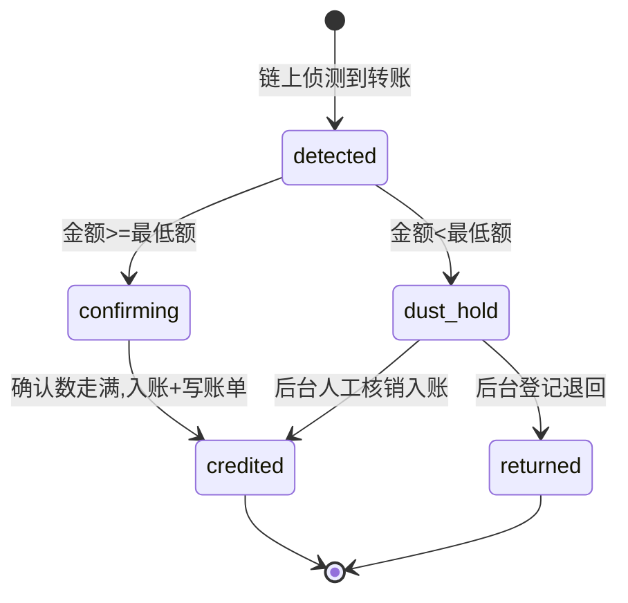
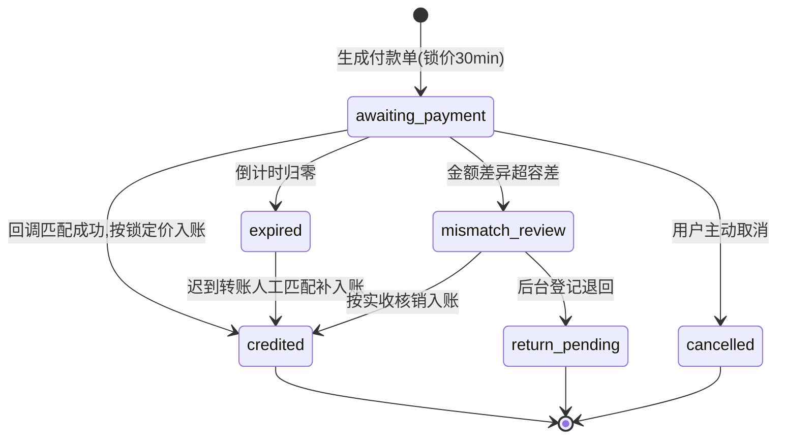

# NexGrid(Nexion)越南市场支付架构规格(三位一体)v1.0

> ⚠️ 本文件是工作区 `PRD/specs/` 的**只读副本**(随功能变更同步覆盖)。改规格请改 PRD 原件,勿直接改本副本。

> 工作线:🅿 产品规格(前端 uniapp 触点 + 后台 admin 契约) | 模式:规格先行(新功能) | 状态:**Signed(主人已签字 2026-07-24,3 小项同批拍板)**
> 定级:L | 拍板记录:§9 | 机器门:`spec-lint --strict` 需 PASS | 原型:`PRD/prototypes/pay-vn-rails.html`
> 市场设定:越南单一独立运营(权威 = 经济模型 v2 $649 锚)。

---

## 配套流程图

本规格的可视化流程图在同目录 `diagrams/` 下(单文件 HTML,自带明暗主题切换 + PNG/SVG 一键导出,双击即开):

| 图 | 内容 | 文件 |
|---|---|---|
| 01 | 资金流转全景:三通道 → 到账判定 → 自动入账 / 异常挂账 → 用户余额 → 资金出口 | `PAY-01-资金流转全景.html` |
| 02 | USDT 链上入金时序:扫码 → 链上侦测 → 确认数推进 → 自动扣费入账(含粉尘人工分支) | `PAY-02-USDT链上入金.html` |
| 03 | VietQR 银行轨流程:锁价付款单 → 回单匹配 → 三类异常进挂账队列 | `PAY-03-VietQR银行轨.html` |
| 04 | 银行付款单状态机:主流程 / 挂账队列(科目 #9)/ 终态出口 | `PAY-04-付款单状态机.html` |
| 05 | 提现出金三道闸:风控路由 → 额度双门 → 原子扣款(含换绑 24h 冻结) | `PAY-05-提现出金闸.html` |
| 06 | 对接真后台的替换边界:不用改的 / 需新建服务端 / 需外部对接三路 | `PAY-06-真后台对接方案.html` |

图由 archify 渲染,源 JSON 与图同目录同步维护;流程变更需同步改图。

---
## §0 总则与范围

**范围**:
- 入金 = USDT 链上(TRC20 / ERC20 / BEP20)+ VietQR 银行转账(新建,主力法币轨)+ 国际卡 Visa/MC(保留,辅助)。
- 出金 = 仅 USDT(同三网络)。
- BTC / ETH 充值与提现通道全部下线(拍板,见 §9)。

**继承性铁律**(本规格全部单元默认遵守,不再逐条重复):
1. 全平台**单一 USDT 记账**不变;VND 仅出现在 VietQR 通道的下单/凭证展示(见 [FEAT-PAY03]),不做全站双币显示;「1 USDT ≈ 1 USD」既有口径不变;NEX 体系不动。
2. 每笔资金动作走**复式账本分录**(《全平台资金账本_落地方案》§4,接线见 §5)。
3. 所有金额/费率/限额/汇率/容差 = **后台可配 + 单源派生**,前端禁写死。
4. 状态一律 **server-canonical**,client 绝不本地推进;mock 100% 可接真后台(action 即 endpoint 形态)。
5. 后台高敏动作(核销/补入账/退回/改牌价)一律 **确认 + 理由 + 审计 + 失败态**。
6. 单号族:入金 `DP-YYYYMMDD-NNNN`(与提现 `WD-` 同族,server mint)。

---

## §1 入金 · 链上与通道框架

#### [FEAT-PAY01] 入金通道框架与 USDT 链上充值

**① 用户故事**
- 作为持有 USDT 的新用户,我想要把交易所/钱包里的 USDT 充进平台,以便购买设备并参与收益计划。
- 作为不熟悉加密货币的越南用户,我想要看到「如何获取 USDT」的指引,以便第一次也能独立完成充值。

**② 验收(GWT)+ 异常路径**
- 阳光路径(TRC20):Given 用户在充值页选 USDT-TRC20,When 向专属地址转入 ≥ 最低额的 USDT,Then 平台侦测到转账后生成入金单(状态 `confirming`,页面显示确认进度 n/N),确认数走满后置 `credited`,入账金额 = 转入金额 − 通道费,写 topup 账单并推送到账通知。
- 异常1(低于最低额):Given 转入金额 < 最低充值额(默认 $10),When 链上侦测到,Then 入金单置 `dust-hold` 不自动入账,充值记录显示「金额低于最低充值额,已转人工处理」;后台可人工核销入账或登记退回。
- 异常2(错网络转入):Given 用户把 BEP20 的 USDT 转到 TRC20 地址(或反之),When 平台在所选网络侦测不到转账,Then 不生成入金单,页面维持「等待转账」;充值页常驻警示「请务必选择与转出方一致的网络,错网络转账可能无法找回」;用户可通过「充值未到账?」提交交易哈希转人工核实。
- 异常3(确认停滞):Given 入金单 `confirming` 超过 30 分钟未走满确认数,When 用户查看,Then 状态区显示「网络拥堵,确认时间延长」+ 客服入口,不自动置失败;确认走满后仍正常入账。

**③ 数据字典 + 生成规则**

入金记录 DepositRecord(三类通道共用;银行轨由意向单入账时生成,见 [FEAT-PAY02]):

| 字段 | 类型 | 必填 | 默认 | 生成规则 / 约束 |
|---|---|---|---|---|
| depositId | string | 是 | — | server mint `DP-YYYYMMDD-NNNN`,禁客户端造 |
| channel | enum | 是 | — | `usdt-trc20 / usdt-erc20 / usdt-bep20 / bank-vietqr / card-intl`(全站唯一通道枚举,前后台单源) |
| grossAmountUsdt | number | 是 | — | 实收金额(链上按实际到账);两位小数 |
| feeUsdt | number | 是 | — | 按通道费率表(后台 D1 配置)server 计算;client 仅展示 |
| creditedUsdt | number | 是 | — | = gross − fee;入账额 |
| address | string | 链上必 | — | 每用户 × 每网络专属充值地址,server 派发、恒定不轮换;mock 由 accountKey 确定性派生 |
| txHash | string | 链上必 | — | 链上交易哈希;幂等键(同 txHash 不重复入账;原型留形状,真后台生效) |
| confirmations / requiredConfirmations | number | 链上必 | 0 / 按网络 | 默认 TRC20 20 · ERC20 12 · BEP20 15,后台 D1 可配;server 推进 |
| status | enum | 是 | — | 见④;server-canonical,client 绝不本地推进 |
| createdAt / creditedAt | number | 是/否 | — | ms epoch,服务端时间戳(account-cloud 快照按 TIME_ANCHOR 同步) |

通道配置表(单源 = 后台 D1;client 拉取,拉取失败禁回退写死值):

| channel | 通道费 | 最低额 | 单笔上限 | 默认状态 |
|---|---|---|---|---|
| usdt-trc20 | 1 USDT | $10 | — | 启用 · 主推(手续费最低) |
| usdt-bep20 | 1 USDT | $10 | — | 启用 |
| usdt-erc20 | 5 USDT | $10 | — | 启用(大额适用) |
| bank-vietqr | 0 | $10 等值 | $5,000 | 启用(见 [FEAT-PAY02]) |
| card-intl | 3.5% | $30 | 沿用现行 | 启用(辅助;对齐经济模型,见 §7) |

**④ 状态机 + 禁止动作**

- 禁止动作:`credited / returned` 终态禁任何再处置(server 409);同一 txHash 重复回报 no-op(幂等);专属地址恒定,不存在「过期作废」——迟到转账照常走本状态机;client 无任何写状态入口(纯展示)。
- 行为边界三档:**始终**自动做「侦测 → 确认 → 入账」;**询问后**才做「dust / 错网络的人工核销与退回」(后台高敏);**永不**做「client 端推进状态 / 无 txHash 入账」。

**⑤ 交互原型(4 态)**(充值页 · 链上通道)
- 默认态:通道 tab(USDT 链上 / 银行转账 / 银行卡)→ 三网络 chip(TRC20 标「推荐 · 手续费最低」)→ 专属地址 + 二维码 + 复制按钮 + 网络一致性警示行 + 最低额/通道费说明 + 「如何获取 USDT」入口;下方「最近入金」列表实时显示确认中项的 n/N 进度。
- 空状态:从未充值时「最近入金」区显示引导(图标 + 「还没有充值记录」一句话),不白屏。
- 加载态:进入页拉取地址/通道配置时,地址与二维码区骨架占位(匹配真实形状,非通用转圈);列表项确认中用内联进度。
- 报错/极限态:通道被后台停用 → 该 chip 置灰 + 「暂停服务,请选择其他网络」;地址拉取失败 → inline 重试块;超长地址/交易哈希中段省略不溢出;断网 → 整页重试。

**⑥ 点击流矩阵**

| 触发元素 | 跳转 / 响应目标 | 转场 / 反馈 |
|---|---|---|
| 通道 tab(USDT 链上 / 银行转账 / 银行卡) | 当前页切换流程 | tab 切换;银行卡 tab 进现有卡表单 |
| 网络 chip(TRC20 / ERC20 / BEP20) | 当前页 | 切换专属地址与费率说明;停用态不可选 + 提示 |
| 「复制地址」按钮 | 当前页 | 复制 + Toast「地址已复制」 |
| 「如何获取 USDT」链接 | /me/wallet/usdt-guide(新静态指引页) | 右进左出 |
| 「充值未到账?」入口 | 客服/工单面板(复用现有入口) | 打开面板 |
| 最近入金列表行 | 账单详情(复用 bills 详情) | 右进左出 |

**⑦ 跨文档一致性**
- 通道枚举与后台 D1 渠道配置、C1 投入卡 `channel` 字段同源单写;最低额/费率登记进前端 PRD §13.3 关键参数集(指针指向 D1,不双写值)。
- txHash 幂等口径与《资金账本_落地方案》§4.8 一致(原型留形状,真后台生效)。
- 「最近入金」= bills 的 topup 类过滤视图,不另建流水源;KYC-Express(`?kyc=1`,$1 验证)流程不受本重构影响,复用同一到账侦测。
- 前端 PRD §9.2.1 通道表按 §7 修正清单修订(BTC/ETH 下线、BEP20 新增)。

---

## §2 入金 · 越南银行轨

#### [FEAT-PAY02] VietQR 银行转账入金

**① 用户故事**
- 作为只有越南银行账户、没有 USDT 的用户,我想要用银行 App 扫码转越南盾直接充值,以便不接触交易所也能入金。
- 作为对汇率敏感的用户,我想要下单时看到锁定的牌价和到账金额,以便确认自己不吃暗亏。

**② 验收(GWT)+ 异常路径**
- 阳光路径:Given 用户在充值页选「银行转账」输入 25 USDT,When 点「生成付款单」,Then 生成意向单(`DP-`,状态 `awaiting_payment`,30 分钟倒计时),按锁定牌价(示例 26,390)显示应付 659,750₫、VietQR 码(收款账户 + 精确金额 + 附言码 `NX-XXXXXX`)与「务必填写附言码」提示;用户转账后回调匹配成功 → `credited`,按锁定牌价入账 25 USDT(0 手续费),写 topup 账单 + 到账通知。
- 异常1(超时未付):Given 意向单超 30 分钟未匹配到回单,When 倒计时归零,Then 置 `expired`,页面提示「付款单已过期,请重新生成」+ 重新生成按钮;过期后才到账的转账进孤儿队列人工匹配,用户侧显示「已收到迟到转账,正在人工核对」。
- 异常2(金额不符):Given 实际转账金额与应付金额差异超容差(默认 ±1,000₫,可配),When 回调匹配,Then 置 `mismatch_review`,用户侧显示「到账金额与订单不符,正在人工核对(一般 2 小时内)」;后台可按实收核销入账或登记退回。
- 异常3(附言码缺失 / 孤儿转账):Given 转账未带附言码且金额撞不上任何在途意向单,When 回单进来,Then 进孤儿队列不自动入账;用户可在「充值未到账?」提交转账凭证,后台人工匹配后补入账。
- 异常4(锁价窗边缘):Given 用户在第 29 分钟完成转账、回调在过期后数分钟才到,When 回单时间落在宽限期(默认 10 分钟,可配)内,Then 仍按该单锁定牌价入账,不重新计价。

**③ 数据字典 + 生成规则**

入金意向单 DepositIntent(银行轨专用;入账时生成 [FEAT-PAY01] 的 DepositRecord 并互相关联):

| 字段 | 类型 | 必填 | 默认 | 生成规则 / 约束 |
|---|---|---|---|---|
| intentId | string | 是 | — | server mint `DP-YYYYMMDD-NNNN`(与链上同号段) |
| usdtAmount | number | 是 | — | 用户输入;≥ $10 等值,≤ 单笔上限 $5,000(D1 可配) |
| fxRate | number | 是 | — | 下单时锁定 = 牌价(见 [FEAT-PAY03]);单上恒定,后续调价不影响在途单 |
| vndAmount | number | 是 | — | = round(usdtAmount × fxRate),精确到盾、不凑整千(精确零头金额兼作回单匹配辅助,与附言码互补);server 计算 |
| memoCode | string | 是 | — | server mint `NX-` + 6 位大写字母数字;在途期内全局唯一 |
| bankAccount | object | 是 | — | 从收款账户池按轮换策略分配(户名/账号/银行);server 派发;页面脱敏规则不适用(用户需要完整账号转账) |
| status | enum | 是 | awaiting_payment | 见④;server-canonical |
| expireAt | number | 是 | 创建 + 30min | 锁价窗 = 单生命周期;宽限 10min(D1 可配) |
| receivedVnd / matchedAt | number | 否 | — | 回单实收金额与匹配时间 |

**④ 状态机 + 禁止动作**

- 禁止动作:`credited / cancelled / return_pending` 终态禁再处置(server 409);同一附言码的回单重复回报 no-op(幂等);client 仅可对 `awaiting_payment` 态执行取消,其余全部为 server/后台动作;超容差回单永不自动入账。
- 行为边界三档:**始终**自动做「回调匹配 → 按锁定价入账」;**询问后**才做「孤儿匹配、差额核销、退回登记」(后台高敏 + 理由必填);**永不**做「client 改状态 / 无回单入账 / 在途单重新计价」。

**⑤ 交互原型(4 态)**(充值页 · 银行转账 tab)
- 默认态:金额输入(USDT 主位 + 实时 ≈VND 副显)+ 牌价行「1 USDT ≈ 26,390₫ · 下单锁定 30 分钟」+ 「生成付款单」主按钮;已生成态 = VietQR 大图 + 户名/账号/银行 + 应付金额(VND 大字)+ 附言码强调块(复制按钮)+ 倒计时 + 三步指引(打开银行 App → 扫码 → 粘贴附言码)+「我已完成转账」确认钮。
- 空状态:收款账户池无可用账户 → 银行转账 chip 置灰 + 「银行通道维护中,请使用 USDT 充值」;从未有银行入金时历史区同 [FEAT-PAY01] 引导态。
- 加载态:生成付款单时按钮内联 spinner「生成中…」;二维码区骨架;等待回调期列表项「等待到账确认」脉冲态。
- 报错/极限态:金额低于最低 / 超单笔上限 → inline 红字 + 按钮置灰;过期态整卡置灰 + 重新生成;金额不符态黄色警示行 + 人工核对文案;VND 千分位展示不溢出;断网 inline 重试。

**⑥ 点击流矩阵**

| 触发元素 | 跳转 / 响应目标 | 转场 / 反馈 |
|---|---|---|
| 「生成付款单」主按钮 | 当前页 | 校验通过 → 付款单视图;失败 → inline 红字不跳转 |
| 「复制附言码」/「复制账号」 | 当前页 | 复制 + Toast |
| 「我已完成转账」 | 当前页 | 状态区置「等待到账确认」(仅 UI 轮询提示,不改单状态) |
| 「取消订单」次级链接 | 当前页 | 确认弹窗 → 取消;仅 awaiting_payment 态显示 |
| 「重新生成」(过期态) | 当前页 | 生成新意向单(按当前牌价重新锁价) |
| 牌价行信息 icon | 「牌价说明」半屏 | 底部滑出(内容见 [FEAT-PAY03]) |
| 「充值未到账?」入口 | 客服/工单面板 | 打开面板 |

**⑦ 跨文档一致性**
- 牌价唯一取数口 = [FEAT-PAY03] FxQuoteConfig 派生值,本单元不写第二份汇率。
- 账户池 / 容差 / 宽限 / 单笔上限归后台 D1(§6),前端只读。
- 孤儿匹配与差额核销把《资金账本_落地方案》§8「PSP↔平台对账不平核销 / 退款拒付」边界场景落到本单元 + §5 分录。
- MoMo / ZaloPay 不得作为支付入口出现(经济模型 §4.6:SBV 口径下钱包不可直接买币)。
- 页面文案禁工程名词:一律「附言码 / 付款单」,不出现 memo / ref / intent 等字段名。

---

## §3 汇率牌价

#### [FEAT-PAY03] 汇率牌价与 VND 展示

**① 用户故事**
- 作为用 VND 入金的用户,我想要下单前看到明确牌价与锁价时长,以便对比市场价再决定是否充值。
- 作为运营人员,我想要后台可调基准价与点差且留痕,以便控制法币入金成本(后台契约见 §6)。

**② 验收(GWT)+ 异常路径**
- 阳光路径:Given 后台配置基准价 26,000、点差 1.5%,When 用户打开银行转账 tab,Then 牌价行显示「1 USDT ≈ 26,390₫」,金额输入实时换算,下单即按此价锁定 30 分钟。
- 异常1(牌价拉取失败):Given client 拉取牌价失败或配置同步失败,When 用户进入银行转账 tab,Then 通道置灰「牌价更新中,请稍后再试」并禁止下单——禁静默回退写死默认价(对齐 config store 的 syncFailed 语义)。
- 异常2(调价不影响在途):Given 用户 A 有 `awaiting_payment` 意向单(锁价 26,390),When 后台把点差调到 2%,Then A 的在途单仍按 26,390 结算,仅新单取新价。
- 异常3(异常牌价防御):Given client 收到 quoteRate ≤ 0 或缺字段,When 渲染牌价行,Then 拒绝渲染换算结果并按「牌价更新中」禁用通道,不显示 0 或负价。

**③ 数据字典 + 生成规则**

FxQuoteConfig(单源 = 后台 [D6];client 只读):

| 字段 | 类型 | 必填 | 默认 | 生成规则 / 约束 |
|---|---|---|---|---|
| baseRateVndPerUsdt | number | 是 | 26,000 | 手动维护(真后台预留喂价源接口);≈ USD/VND 市场价(经济模型口径) |
| buySpreadPct | number | 是 | 1.5 | 范围 0–3;越界 server 422(后台失败态) |
| quoteRate | number | 派生 | — | = round(base × (1 + spread),十位);**派生不缓存、禁双写** |
| lockWindowMin | number | 是 | 30 | 意向单锁价窗 = 单生命周期 |
| updatedAt / updatedBy | — | 是 | — | 每次改动写审计(§6) |

- 展示规则:VND 仅出现在「银行转账流程 + 其账单/凭证详情」;余额、收益、提现等全站其余场景维持 USDT 单币展示。

**④ 状态机 + 禁止动作**
- N/A(无状态对象——本单元是配置 + 展示;在途单锁价语义归 [FEAT-PAY02] ④)。
- 行为边界三档:**始终**「新单取当前牌价」;**询问后**「后台改基准价/点差(高敏 + 审计)」;**永不**「在途单重新计价 / client 端算价入账」。

**⑤ 交互原型(4 态)**
- 默认态:牌价行(汇率 + 锁价时长 + 信息 icon)常驻银行转账 tab 顶部;金额输入双币实时换算;信息 icon 点开「牌价说明」半屏(说明锁价规则与到账币种)。
- 空状态:牌价未返回时换算位显示占位「—」,不显示 0(防误导)。
- 加载态:牌价行骨架短条;换算延迟 <300ms 不展示中间态(防闪烁)。
- 报错/极限态:拉取失败 → 牌价行「牌价更新中…」+ 通道禁用;异常数据(≤0/缺字段)同报错处理;超长 VND 数字千分位 + 不溢出。

**⑥ 点击流矩阵**

| 触发元素 | 跳转 / 响应目标 | 转场 / 反馈 |
|---|---|---|
| 牌价行信息 icon | 「牌价说明」半屏 | 底部滑出 |
| 半屏「知道了」按钮 | 关闭半屏 | 收起 |

**⑦ 跨文档一致性**
- quoteRate 是全站唯一 VND 牌价取数口([FEAT-PAY02] ③ fxRate 引用它),与 G3(NEX/USDT 定价引擎)分属两个模块、互不相干、不混写。
- baseRate 默认种子 = 经济模型「USD/VND ≈ 26,000」口径;后台模块建议编号 [D6](资金域),不放 G 域避免与 NEX 汇率语义撞名。
- 牌价改动审计与 A2 审计覆盖门对齐(高敏动作必审计)。

---

## §4 出金 · 收窄与地址换绑

#### [FEAT-PAY04] USDT 出金收窄与提现地址换绑

**① 用户故事**
- 作为要提现的用户,我想要把余额以 USDT 提到我绑定的钱包地址,以便收益落袋。
- 作为换了钱包的用户,我想要安全地更换绑定提现地址,以便旧钱包不可用后仍能提现。

**② 验收(GWT)+ 异常路径**
- 阳光路径(收窄):Given 用户已完成 KYC 且绑定地址在 TRC20,When 发起提现,Then 网络选择仅显示 USDT-TRC20 / ERC20 / BEP20 三项(BTC/ETH 不再出现),其余规则(费率 / 冷却 / 日限 / 审核 / 风控路由)与前端 PRD §9.3 现行一致、零改动。
- 阳光路径(换绑):Given 用户在「提现地址」入口发起换绑,When 按引导从**新地址**转出 $1 完成验证,Then 新地址生效、旧地址即时失效,提现功能冻结 24 小时(倒计时展示)并推送通知。
- 异常1(在途提现单):Given 用户存在 submitted~processing 在途提现单,When 点「更换地址」,Then 入口置灰 + 「有提现处理中,完成后才能更换地址」。
- 异常2(验证来源不符):Given 换绑验证要求从新地址转出 $1,When 侦测到转账来自其他地址,Then 验证失败,显示「验证转账必须从要绑定的地址发出」,可重试;30 分钟未完成 → 换绑单过期。
- 异常3(换绑频率):Given 用户 7 天内已换绑过一次,When 再次发起,Then 拦截 + 「每 7 天最多更换一次提现地址」(参数可配)。
- 异常4(换绑后大额首提):Given 换绑后地址账龄 < 7 天,When 提现金额 ≥ $1,000,Then 风控路由强制 manual(K3 地址账龄信号),用户侧显示「安全审核中」。

**③ 数据字典 + 生成规则**

提现地址绑定 WithdrawAddressBinding(每用户同一时刻有且仅有一个 active):

| 字段 | 类型 | 必填 | 默认 | 生成规则 / 约束 |
|---|---|---|---|---|
| bindingId | string | 是 | — | server mint `AB-YYYYMMDD-NNNN` |
| address | string | 是 | — | 链地址格式校验;与 KYC-Express 验证地址同一实体(换绑即更换 KYC 绑定地址) |
| network | enum | 是 | — | `usdt-trc20 / usdt-erc20 / usdt-bep20`(与提现网络枚举同源收窄) |
| status | enum | 是 | verifying | `verifying → active → revoked`;server-canonical |
| verifiedAt | number | 否 | — | $1 验证完成时间 = 地址账龄起点(喂 K3) |
| freezeUntil | number | 否 | — | = verifiedAt + 24h;冻结期内提现入口置灰 |
| rebindCooldownDays | number | 配置 | 7 | 后台 D5/K3 可配 |

**④ 状态机 + 禁止动作**
- 换绑单:`initiated → verifying(30 分钟倒计时) → active`(旧绑定同事务置 revoked,原子切换);`verifying → expired`;`initiated/verifying → cancelled`。
- 禁止动作:存在在途提现单时禁 `initiated`;`verifying` 期间旧绑定仍 active(未生效前不影响提现资格判断,但冻结从新绑定 active 起算);`revoked` 地址禁任何提现付款;终态(active 被替换后的 revoked / expired / cancelled)禁再处置;每 7 天最多一次换绑。
- 行为边界三档:**始终**「$1 验证匹配 → 自动生效 + 冻结 24h」;**询问后**「无用户侧询问动作;后台仅在风控冻结场景介入(走 D2/K3 既有动作)」;**永不**「未验证即换绑 / 向非 active 地址付款」。

**⑤ 交互原型(4 态)**(提现页 + 换绑页)
- 默认态:提现页网络选择三项(TRC20 标推荐);「提现地址」行显示当前地址(中段省略)+ 「更换」入口;换绑页 = 新地址输入 + 网络选择 + 安全提示 + 「开始验证」。
- 空状态:未绑定地址(未 KYC)用户进提现页 → 引导卡「先完成钱包验证」+ CTA 去 KYC-Express,不白屏。
- 加载态:换绑验证等待 = 倒计时 + 侦测动画(复用 KYC-Express 三步验证动画);提交中按钮内联 spinner + 防连点。
- 报错/极限态:冻结期 → 提现主按钮置灰 + 倒计时「安全冻结中,剩余 hh:mm」;验证来源不符红字;超长地址中段省略;断网 inline 重试。

**⑥ 点击流矩阵**

| 触发元素 | 跳转 / 响应目标 | 转场 / 反馈 |
|---|---|---|
| 提现页网络 chip × 3 | 当前页 | 切换网络 + 手续费说明刷新 |
| 「更换提现地址」入口 | /me/wallet/address-rebind | 右进左出;在途单存在时置灰 + 原因 |
| 换绑页「开始验证」 | 当前页 | 生成换绑单 → 验证视图($1 + 倒计时) |
| 「取消更换」次级链接 | 当前页 | 确认弹窗 → cancelled |
| 冻结倒计时行 | 当前页 | 信息展示,无跳转 |

**⑦ 跨文档一致性**
- 提现其余规则零改动:费率模型 / 冷却 / 日限 / 审核队列 / kill 闸全部引用前端 PRD §9.3 与后台 D2 / D5 / K3,本单元不双写。
- 沿用并强化「提现地址 = KYC 绑定地址」既有原则(§4.4.3):换绑 = 更换 KYC 绑定地址本身,不引入第二地址、不做地址簿。
- BTC/ETH 下线联动修正:前端 PRD §9.2.1、§9.3.1、前端 NETWORKS 常量、后台通道/网络枚举(§7 清单)。
- 地址账龄信号对齐 K3「新地址持有期」既有输入,不新造风控维度。

---

## §5 账本接线(复式分录)

继承《全平台资金账本_落地方案》§4 口径,本方案新增/明确以下分录(Σ借 = Σ贷,原子 post):

| 事件 | 分录 |
|---|---|
| 链上入金 credited | 借 reserve +gross;贷 用户可提负债 +credited、贷 fee_buffer +fee(三腿一笔,Σ平) |
| 卡入金 credited | 同上(fee = 3.5%,现行不变) |
| VietQR 回单到达(未匹配) | 借 reserve +实收折 USDT;贷 **待核实入金负债** +同额(挂账) |
| VietQR 匹配入账 / 孤儿补入账 / 差额按实收核销 | 借 待核实入金负债 −;贷 用户可提负债 +(0 费) |
| VietQR 登记退回(return_pending → 完成) | 借 待核实入金负债 −;贷 reserve −(资金退出) |
| 提现 settle | 借 用户可提负债 −;贷 reserve −(现行不变,唯一真现金出) |

- **新增第 9 负债科目「待核实入金」(suspense)**:银行轨回单先挂账、匹配才转用户负债——这是对落地方案 §8「对账不平核销」边界场景的正式补位(已拍板采纳,2026-07-24;《资金账本_落地方案》科目表随实现批次同步)。
- VND 只存在于意向单字段(vndAmount / fxRate);账本分录一律 USDT 计。
- 口径澄清(2026-07-24,A2 验收观察裁决):「用户可提负债」是**账本科目名**(承接落地方案八科目的「可提余额」伞形科目);前端 `withdrawableUsdt` 可提桶另由收益结算规则决定——**充值本金入总余额、可消费、不直接进可提桶**(与现行卡充值同语义,出金窄原则);UI 文案不得承诺「充值可提现」。
- 8 条资金流不变量全部沿用;新科目并入「储备 = 负债 + 净值」与「reserve 可对账」两条校验。
- 对账节奏沿用处方口径:周期 4h、差异容限 $0.01;银行轨对账面 = PSP 回单 vs 意向单 vs 分录三方。

---

## §6 后台配套能力清单(功能级;细化归 nexion-admin-prd 线)

| 模块 | 能力 | 备注 |
|---|---|---|
| D1 扩展 | 通道枚举同步(去 BTC/ETH,增 usdt-bep20 / bank-vietqr);银行轨对账 tab:在途意向单 / 已匹配 / 孤儿队列 / 差额队列 / 过期后到账五视图;动作 = 手动匹配入账、按实收核销、登记退回(全高敏:确认 + 理由 + 审计 + 失败态) | 参数:容差 ±1,000₫、宽限 10min、单笔上限 $5,000、各网络确认数 |
| D1 · 收款账户池 | 账户增删 / 启停 / 日收上限 / 轮换策略(轮询)/ 当日已收水位 / 单账户异常熔断;列表侧账号脱敏展示,详情侧完整 | 通道无可用账户 → 前端 chip 自动置灰(见 PAY02 ⑤ 空状态) |
| **[D6] 汇率牌价(新)** | baseRate / spread / 锁价窗配置 + 生效历史 + 审计;spread 超 0–3 范围 server 422 失败态 | 单源;client 只读派生 |
| 枚举同步 | C1 投入卡 channel、D2 提现网络展示、D5/K3 无规则变更仅枚举同步 | — |
| J 域 | **不新增 kill 闸**:通道级启停(D1)即熔断面,避免 KILLSWITCH 五闸计数变更与职责重复 | 偏离默认的说明 |

---

## §7 跨文档一致性修正清单(签字后随实现批次落地)

| # | 位置 | 现口径 | 修正为 | 依据 |
|---|---|---|---|---|
| 1 | 前端 PRD §9.2.1 | 5 通道含 BTC/ETH | USDT×3 + VietQR + 卡 | 拍板(§9) |
| 2 | 前端 PRD §9.2.3 | 卡最低额 $10 | $30 | 经济模型 §4.3 权威 |
| 3 | 前端 PRD §9.3.1 | 提现网络含 BTC/ETH | 仅 USDT×3 | 拍板(§9) |
| 4 | 处方 §3.D5 | 提现最小额 $10(与 PRD $20 冲突) | 统一 $20 | 已拍板(§9) |
| 5 | 前端 bills 11 类 vs 后台 8 类 | BillType 错位 | 登记欠账;实现批次对齐,本规格不新增账单大类 | — |
| 6 | 处方 §3.D1 | 无 VietQR 通道参数 | 补通道参数条目 | 本规格 |
| 7 | 卡表单国家列表 | 无越南 | 补 Vietnam | PAY01 范围 |

---

## §8 现实参照(设计输入快照,带认识论标注;产品内 0 meta,不出现此层表述)

- [KNOWN, HIGH] VietQR / NAPAS 247 即时转账是越南零售支付主干,银行 App 扫码 + 附言转账是大众日常习惯;卡渗透率相对低。
- [COMMON, MED-HIGH] 越南境内银行转账没有卡组织式拒付(chargeback)机制,银行轨风险集中在「金额/附言不符、孤儿转账」,而非拒付——所以银行轨用「挂账 + 人工核销」而非拒付处置。
- [COMMON, HIGH] 东南亚 USDT 流通以 TRC20 为主、BEP20 次之,ERC20 因手续费高多用于大额。
- [KNOWN, MED · 截至 2026-01 知识快照] 越南 2025 年通过《数字技术产业法》(2026-01-01 生效)承认加密资产,但央行口径下加密货币不得作为支付手段;平台「USDT 记账 + VND 仅通道换算」与经济模型 §4.6 已载的灰区实践一致。不构成合规意见。
- [COMMON, MED] 同品类真实平台的银行轨普遍采用收款账户池 + 轮换以规避单账户冻结;账户池模块即参照此实践。

---

## §9 拍板记录与待确认小项

**已拍板(主人,2026-07-23)**:① 银行入金 = VietQR 为主 + 国际卡为辅;② USDT 网络 = TRC20 + ERC20 + BEP20(充提同套);③ BTC/ETH 充值与提现全部下线;④ 本轮交付 = 规格文档 + 可点原型,实现另起任务。

**3 小项已拍板(主人,2026-07-24,均按建议)**:
1. 提现最小额统一 **$20**(PRD 现行为准,处方 §3.D5 反向修正,见 §7 #4)。
2. **采纳第 9 负债科目「待核实入金」**(§5 分录口径生效)。
3. VietQR 单笔上限默认 **$5,000**(后台 D1 可调)。

---

## §10 交付物与下一步

- 本规格:`PRD/specs/PAY-Nexion_越南支付架构规格_v1.0.md`(spec-lint --strict PASS)。
- 可点原型:`PRD/prototypes/pay-vn-rails.html`(钱类关键流:链上充值 / VietQR / 提现收窄 + 换绑)。
- 实施拆解:`Nexion-uniapp/docs/changes/2026-07-24-vn-payment-rails.plan.md`(uniapp 批次 A + admin 批次 B + PRD 修订批次 C;子任务 AC 逐条继承本规格 ② GWT;plan 过主人章后进子任务循环)。
- 前端 PRD §9 正文修订走 nexion-prd-sync,后台模块细化走 nexion-admin-prd(批次 C)。
