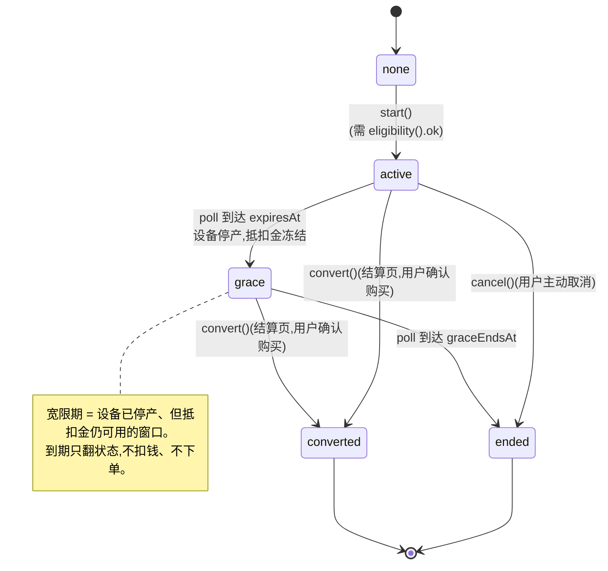
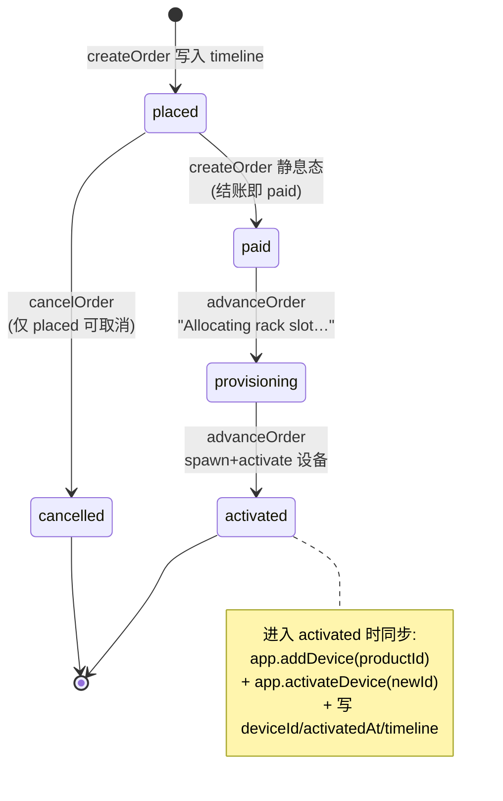
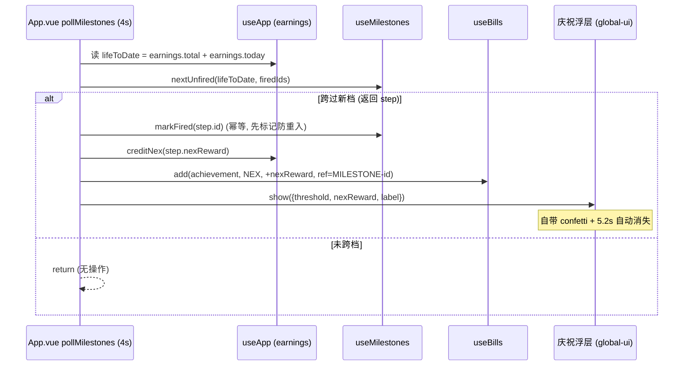
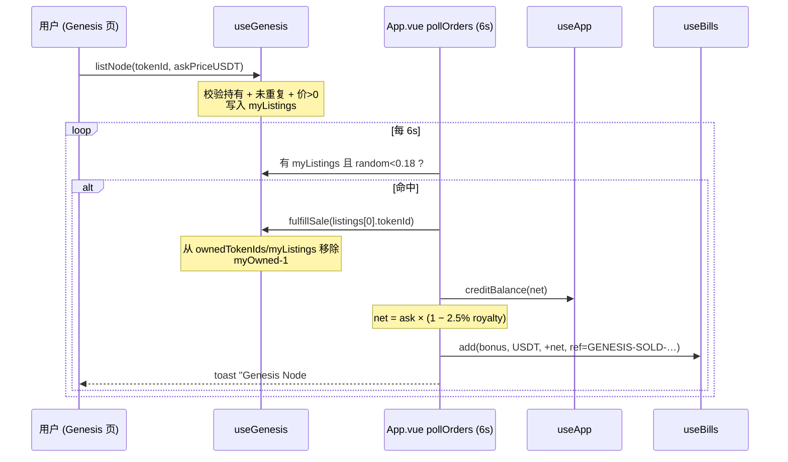
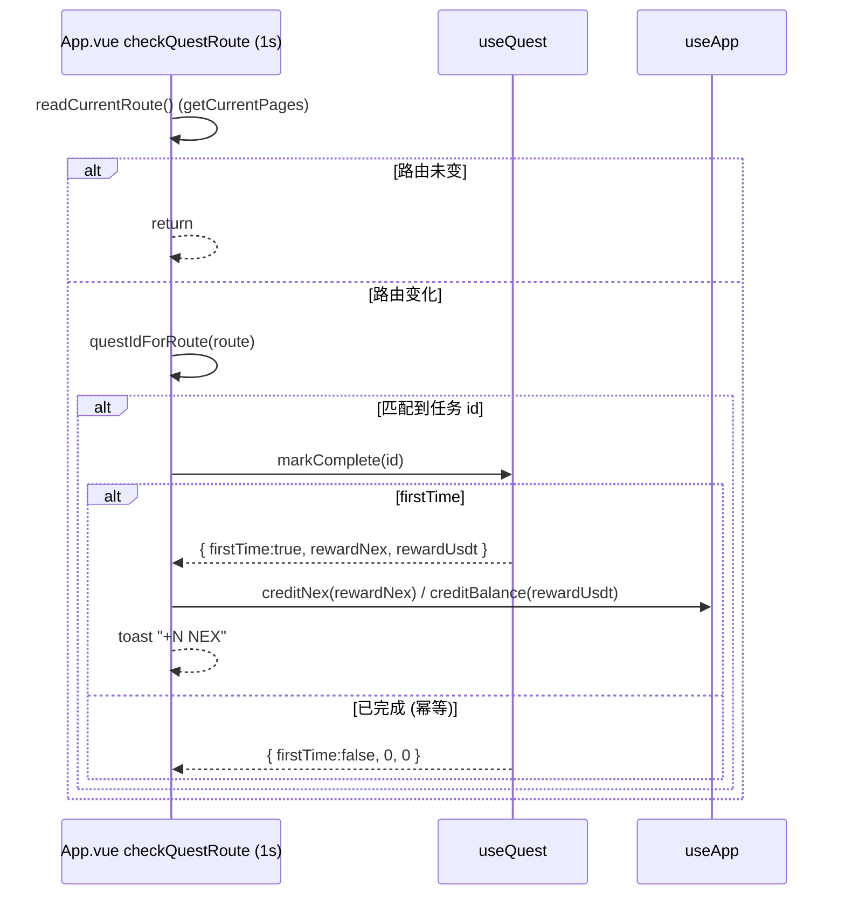
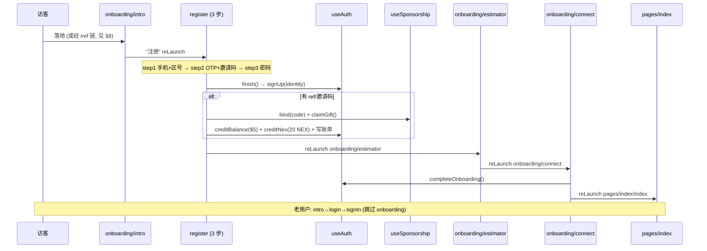
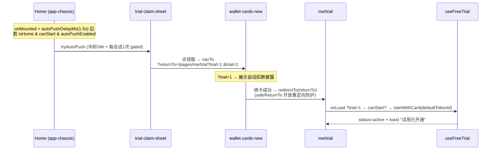

# NexGrid 前端业务流程说明（给后端 / 全栈开发）

<!-- STALE-TERMS-OK: §1 按 FEAT-TRIAL02 重写后,仍需原样写出卡时代动作名——一是说明「这些已删除、别照做」,二是 §1.7 列出机器门的禁用名单本身。出现即说明它们不存在,不是在描述当前行为。 -->

> 目标读者：要为 NexGrid 接真后端的后端 / 全栈工程师。
> 这是一份**产品业务流程**文档（与前端框架无关），让你不靠猜就能理解前端在模拟什么业务、状态怎么流转、副作用是什么，以及真后端该如何接管。
>
> **当前形态**：mock 驱动的高保真原型，**无真后端**。但每个 store / model 都按 **backend-replaceable** 结构写——状态机、字段、动作都对齐真后端契约，接真后端时前端逻辑零重写（把 mock 数据源换成 API/SSE 即可）。
>
> **实现面 / 当前真源**：`Nexion-uniapp`（uni-app + Vue 3 + Pinia）。文档以 uniapp 现状为准；旧 H5 工程只作为历史迁移来源，不再作为新功能、审计或 verify 对位源。
>
> **专有名词 / 字段 / API 路径保留英文**，便于和代码、PRD 对齐。

---

## 0. 全局架构与"模拟引擎"总览

### 0.1 mock 的本质

前端没有真后端，因此所有"时间推进、随机判定、状态机前进"都由**客户端定时器**模拟。这些定时器全部挂在 `src/App.vue` 的 `onShow` / `onHide` 生命周期（应用可见时跑，进后台暂停），是整个原型的"心跳"。

真后端接入后，这些**客户端定时器全部删除**，状态机推进改由**服务端定时任务（cron）+ 客户端订阅（SSE/WebSocket/轮询）**驱动。客户端只反映服务端下发的 canonical 状态，绝不自己推断或推进。

### 0.2 App.vue 的 5 个心跳定时器（核心入口）

`src/App.vue` 在 `onShow` 启动、`onHide` 停止以下 5 个循环。**这是理解整个系统的总开关**：

| 定时器 | 间隔 | 驱动的流程 | 对应章节 |
|--------|------|-----------|---------|
| `startTick` | **1s** | 收益模拟（全局统计抖动 + 每设备 GPU vitals + 收益累计 + 任务回执） | §3 |
| `startTrialPoll` | **4s** | 免费试用状态机推进（active→grace→redeemed/failed…）+ 紧迫 toast + 高质延期 sheet | §1 |
| `startOrderPoll` | **6s** | (a) 订单生命周期推进 + (b) Genesis 二级市场转卖 | §2 / §4 |
| `startMilestonePoll` | **4s** | 收益里程碑跨档派奖（撒花 + NEX 奖励 + 账单） | §3.2 |
| `startQuestWatch` | **1s** | 首日任务路由侦测（访问 earn/store/产品页自动完成 + 派奖） | §5 |

> 另外 **Nova 三频道 FOMO 推送**（§6）的定时器**不在 App.vue**，而在 `components/nova/nova-bubble.vue` 的 `onMounted`（只在 tab 路由挂载时跑）。

### 0.3 架构铁律：store 之间不互相 import

前端有一条硬规则：**Pinia store 不互相 import**。凡是需要跨多个 store 的副作用（例：试用到期 = 扣款 + 发设备 + 写账单），都在 **App.vue 层 / 页面层"编排"**：调 A store 拿结果 → 调 B store 落地 → 调 C store 写账单。

对后端的含义：这些"编排"在真后端里应该是**一个原子事务/一个 API**。文档每节的"后端接入映射"会标出哪些前端分散动作应合并成一个服务端原子操作（典型是 `POST /api/trial/charge` 一次性完成扣款 + 发设备 + 记账）。

### 0.4 余额 / 账本原语（贯穿所有流程）

`src/store/app.ts`（`useApp`）持有用户钱包，所有流程通过这几个原语改余额：

- `creditBalance(usdt)` / `debitBalance(usdt): boolean`（余额不足返回 false）
- `creditNex(nex)` / `debitNex(nex): boolean`
- `recordDeposit(usdt)`：充值（带输入校验：拒 NaN/±Inf/≤0/>1e9）

账单写入走 `src/store/bills.ts`（`useBills().add({ type, symbol, amount, status, memo, ref })`）。
真后端：余额变动 + 账单行必须在**同一事务**里写，客户端只读 `GET /api/me/balance` + `GET /api/me/bills`。

---

## 1. 免费试用状态机（核心流程）

`src/store/free-trial.ts` · `src/store/trial-boundary.ts`（时间边界唯一解析器）· `src/store/trial-config.ts` · 驱动在 `App.vue pollTrial`（4s）

> 🔴 **本节 2026-08-13 按 FEAT-TRIAL02 重写。** 2026-08-02 的「去绑卡」改造（包 F）把整套
> **绑卡 → 到期自动扣款**的流程删干净了，而本节直到今天还在描述那套已删除的流程（`startWithCard` /
> `autoChargeAtEnd` / `acceptExtension` / `markChargeFailed` / `handleAutoRedeem` 等动作**全部不存在**）。
> 照旧版实现会实现出一个规格明令禁止的产品。规格原件：`PRD/specs/FEAT-TRIAL02-cardless-trial.md`。

### 1.1 目的

用户**零支付要素**领取 S1 试用（不绑卡、不填任何支付方式），试用期间累计"抵扣金"（不可提现，只能抵购机款）。
试用期满进入宽限期：设备停止产出，但已累计的抵扣金仍然可用；宽限期结束自动停止。
**全程不会自动扣任何钱。** 想留下设备，用户自己去结算页用抵扣金购买。

🔴 **硬边界（规格④「禁止动作」）**：**永不**自动扣款、**永不**自动下单、**永不**在领取链路要求支付方式；
必须**用户显式确认**才生成订单与消耗抵扣金；`ended` 态**禁止**再累计抵扣金；`converted` 是终态、禁回退。

### 1.2 触发与生命周期

- **谁触发开通**：`freeTrial.start()`，无入参（入口：试用领取 sheet → 直接确认开通）。
- **谁推进状态机**：`App.vue` 的 `pollTrial()`，每 **4s**（`TRIAL_TICK_MS = 4000`）调 `freeTrial.poll(now)`。
  🔴 **它只翻状态 + 发 toast / 紧迫推送，零扣款、零下单、零发设备。**
- **转化的钱和订单落在哪**：**结算页**（`src/pages/store/checkout.vue`），用户确认后才发生。
  store 只管自己的状态，不碰钱 / 设备 / 账单（有机器门盯着这条：见 §1.7）。
- **时间边界唯一解析器**：所有时钟判定收敛到 `trial-boundary.ts` 的 `resolveTrialAt`
  （poll / convert / eligibility / 抵扣金累计全调它），store 里不再有任何手写的 `now >= 边界` 比对。

### 1.3 状态机



`TrialStatus = "none" | "active" | "grace" | "ended" | "converted"`（`trial-boundary.ts`）。

### 1.4 状态与转移表

| 当前状态 | 触发条件 | 下一状态 | 副作用 |
|---------|---------|---------|--------|
| `none` | `start()` 且 `eligibility().ok` | `active` | 记 `startedAt`、`expiresAt = now + trialDays`、`graceEndsAt = expiresAt + graceDays` |
| `active` | `poll`：`now ≥ expiresAt` | `grace` | 冻结抵扣金（`shadowFrozenAtUSD` / `shadowFrozenAtNEX` 定格）；App.vue toast 告知**停产时刻 + 抵扣金失效时刻 + 下一步** |
| `active` | `poll`：剩余 ≤24h | （不转移） | App.vue 发紧迫 toast（每段窗口一次） |
| `grace` | `poll`：剩余 ≤24h / ≤1h | （不转移） | 同上 |
| `grace` | `poll`：`now ≥ graceEndsAt` | `ended` | **只翻状态**（置 `finishedAt`）。零扣款、零订单、零设备写入 |
| `active` / `grace` | `convert()`（结算页用户确认后） | `converted` | 终态，不可回退。钱 / 订单 / 设备的副作用在结算页，见 §1.6 |
| `active` | `cancel()` | `ended` | 置 `finishedAt`。`grace` 无需取消（产出已停） |

🔴 **`convert()` 自己重新裁决一次**：内部取 `mockServerNow()` 并先 `resolveTrialAt` 推进边界，
**绝不信任调用方缓存的时刻或内存里的旧状态** —— 用户离线跨过宽限终点后趁 poll 未跑下单，
这里按真实时点判到 `ended` 即拒绝。

### 1.5 资格（一个账号一次，没有冷却）

`eligibility()` 返回 `{ ok, reason? }`，`reason` 是**具名原因**不是笼统报错：

| reason | 含义 |
|---|---|
| `in-progress` | 当前解析结果是 `active` / `grace` —— 已经在试用中 |
| `converted` | 已用抵扣金购机（终态） |
| `used` | 已用过（`ended` 终态） |
| `phase-closed` | 当前产品阶段未开放试用（`phaseOpen = false`） |
| `risk` | 风控命中。**mock 无风控引擎、本地无触发路径**，生产由服务端下发 |
| `unknown` | 真后台档下权威状态还没就绪 |

🔴 **一个账号只有一次**：`ended` / `converted` 都是**永久不可再领**。
规格状态机里**没有 `ended → 领取` 这条边**，所以**不存在**「冷却 N 天后可再申请」这回事
（旧版本文档写的 30 天冷却已随包 F 删除，配置里也没有 `cooldownDays` 这个字段了）。

判定基于 `resolveTrialAt` 解析后的状态（只读、不落盘）：离线跨过边界的行，在内存状态推进前
就按真实时点判 —— 真 `ended` 的行拿到 `used` 而不是 `in-progress`。

### 1.6 转化编排（结算页 `checkout.vue`，用户确认后同步执行）

**真后端应是 `POST /api/trial/convert` 一个原子事务**；mock 侧按下面的顺序在同步块内跑完，无 await 间隙：

1. 报价快照来自确认页那一次解析（`trialQuoteAt(now)` 是本页试用金额的**唯一出处**）。
2. 族级兜底闸：本次实收 > 确认页展示过的总额 → 拒单重报价（变便宜放行）。
3. 非数值金额（NaN 等）在**任何终态副作用之前**拦掉。
4. 🔴 **先扣款，再 `convert()`**：扣款失败（余额不足 / 落盘失败共用同一条退出）时试用**一根汗毛没动**。
   （反过来排会出现「试用已打成不可逆终态、钱却没扣成」的不可恢复态。）
5. `convert()` 返回 false（扣款与转化之间跨过了宽限终点的极窄窗口）→ 按增量精确退回刚扣的钱；
   退不回去 = 走响亮终态（交易号 + 待对账队列），**绝不只弹一句"报价已变"了事**。
6. `createOrder(...)`；`remainderUSD > 0` → 入余额；`shadowNEX > 0` → 入 NEX 余额。
   🔴 入账与收据走**同一个收口点**：收据落不了盘 = 入账原样退回、该项不进成功提示。
7. **设备由既有订单履约管线生成**（`tickOrders → advanceOrder → addDevice`），
   结算页**绝不直插设备**。

### 1.7 抵扣金规则（Model A）

`computeTrialOffset`（`trial-config.ts`）是**唯一真相源**，试用页与结算页共用，保证两处报价不分叉：

- **购买时（offset）**：累计抵扣金**优先抵扣购机款**，封顶 `trialOffsetCapUSD`（默认 $50）。**不可提现**，只能抵扣。
- **购买后（remainder）**：超出封顶的余量，购买成功后入可用余额，此后可正常使用。
- NEX 抵扣金（`shadowNEX`）在转化时全额入 NEX 余额。
- 促销折扣 `computeDiscountedPrice`：`discountRate` 封顶 `discountCapUSD`，与 offset 分行展示。
- 应付为 0 时不再要求走链上转账，直接完成（仍需显式确认，且明示超出部分不退差额）。

**机器门**（`scripts/verify.sh` FEAT-TRIAL02 哨兵，改这块前先看）：
① 卡时代源码指纹逐条清零（`startWithCard` / `autoChargeAtEnd` / `chargeFailRate` /
`scheduledChargeAt` / `trialDisclose` / `trialExtension` / `trial=1` / `redeemEarly` /
`redeem-early` / `markChargeFailed`）；② 三语 i18n 里自动扣款时代文案清零；
③ `free-trial.ts` 必须声明 `convert()` 且**全文件零钱 / 设备 / 账单 API**；
④ 试用价双源等值（配置价 == 商品目录价）。

### 1.8 关键参数（`DEFAULT_TRIAL_CONFIG`，trial-config.ts，全部"后台可调"）

| 参数 | 默认值 | 含义 |
|------|--------|------|
| `trialDays` | 3 | 试用天数（active 窗口，抵扣金累计期） |
| `graceDays` | 7 | 宽限天数（设备停产、抵扣金冻结但仍可用） |
| `discountRate` / `discountCapUSD` | 0.15 / 20 | 转化促销折扣率 / 封顶（USD） |
| `trialOffsetCapUSD` | 50 | 抵扣金抵购机款封顶（USD），见 Model A |
| `trialProductId` / `trialPriceUSD` | stellarbox-s1 / 649 | 试用商品 / 转化目标价 |
| `shadowDailyUSD` / `shadowDailyNEX` | 7 / 40 | 抵扣金日累计速率（S1 基线） |
| `phaseOpen` | true | 当前产品阶段是否开放试用 |
| `autoPushEnabled` / `autoPushDelayMs` / `autoPushCooldownHours` / `autoPushMaxPerSession` | true / 1500 / 24 / 1 | 领取 sheet 自动弹出策略（见 §8.1） |

🔴 **旧版本文档里的 `extensionDays` / `autoChargeAtEnd` / `highQualityThresholdUSD` /
`chargeFailRate` / `cooldownDays` 这 5 个参数已随包 F 一并删除**，配置结构里不存在。
（`chargeFailRate` 是 mock 扣款失败率——现在根本没有自动扣款这条路径。）

### 1.9 后端接入映射

| 前端动作（mock） | 真后端 |
|------------------|--------|
| `eligibility()` 本地判 | `GET /api/trial/eligibility`（server 单源持有"一次性资格"） |
| `start()` | `POST /api/trial/start`（无入参，server 校验资格与幂等并生成全部时间戳） |
| `poll(now)` 本地推进 | **服务端 cron 推进**；客户端 `GET /api/trial/state`（或 SSE/WS）只读 |
| `convert()` + 结算页那套副作用 | `POST /api/trial/convert`（server 结算价格拆解 + 建订单，**一个原子事务**） |
| `cancel()` | `POST /api/trial/cancel` |

🔴 **接线欠账（2026-08-13 立卡，未修）**：真后台档下 `convert()` 直接 `return false`，
且接口层（`src/api/trial-api.ts`）**没有 convert 方法** —— 即真后台档下持试用的用户
**走不完结算**。mock 档不受影响，所以全部机器门与实景走查都看不到它。
详见 `docs/changes/2026-08-13-trial-early-buy-adjudication.md` 卡 1，后端契约交底见交接书 U-17。

⚠️ 另注：`/api/trial/redeem-early`（"主动早购"）是**卡时代的旧端点名**，2026-08-02 已随
根 PRD §9.11a.2 改名为 `/api/trial/convert`（两行结算公式逐字相同）。旧名的客户端镜像已于
2026-08-13 删除。**不要照旧名接线。**

---

## 2. 订单生命周期

`src/store/orders.ts` · 驱动在 `App.vue pollOrders`（6s）+ 订单详情页内 3s tick

### 2.1 目的

统一的 4 段下单履约流程，覆盖所有商品（NexGridBox 各档 + Cloud Share）。**无物流虚构**——所有设备托管在平台数据中心，所以有意义的状态只有：下单 → 已支付 → DC 开通中 → 上线。订单到 `activated` 时**自动生成并激活一台设备**，把购买和 Earn 模块的设备机队接起来。

### 2.2 触发与生命周期

- **创建**：结账页（`store/checkout.vue`）调 `createOrder(input)`。注意：**结账后静息态直接是 `paid`**（不是 `placed`），timeline 同时写入 placed + paid 两行。
- **推进**：
  - `App.vue pollOrders()` 每 **6s**（`ORDER_TICK_MS = 6000`）调 `tickOrders()`，对每个在途订单以 `Math.random() < 0.45` 概率推进一段。
  - **订单详情页**（`store/order-detail.vue`）在页面内另起 **3s** tick，直接 `advanceOrder(id)`（用户盯着进度条时推得更快）。
- **落点**：状态推进 + 设备发放都在 store（`advanceOrder` 同步 spawn 设备，让 `deviceId` 落在同一次更新里）。

### 2.3 状态机



### 2.4 状态与转移表

| 当前状态 | 触发 | 下一状态 | 副作用 |
|---------|------|---------|--------|
| （无） | `createOrder(input)` | `paid` | 生成 `ORD-YYYYMMDD-NNNN` id；写 timeline placed+paid；按商品选 `dataCenter`（NexGridRack P1/P2→Frankfurt，其余→Singapore） |
| `paid` | `advanceOrder` | `provisioning` | timeline 加 `Allocating rack slot in {dc}…` |
| `provisioning` | `advanceOrder` | `activated` | **同步** `addDevice(productId)` + `activateDevice`；写 `deviceId`、`activatedAt`、timeline `Device live · joined NexGrid network` |
| `placed` | `cancelOrder` | `cancelled` | timeline 加 `Order cancelled · refund queued`。**仅 `placed` 可取消**；已 paid 不可自助取消（DC 已承诺产能） |

> ⚠️ **mock 状态机不完整（代码注释明示）**：真平台需要的终态 `payment_failed / expired / refunded / chargeback / provisioning_failed` 这里**全部塌缩成 `cancelled`**。接后端时要补全。

### 2.5 后端接入映射

| 前端（mock） | 真后端 |
|--------------|--------|
| `createOrder` 客户端生成 id/timeline | `POST /api/orders` → 服务端返回 canonical 订单 |
| `tickOrders` / 详情页 tick `advanceOrder`（client 随机推进） | **服务端推送状态变更**（SSE `GET /api/orders/:id`）；客户端只反映，不推断 |
| `advanceOrder` 进 activated 时 spawn 设备 | 服务端在订单上线时创建设备记录并返回 deviceId |
| `cancelOrder`（仅 placed） | `POST /api/orders/:id/cancel`（服务端裁决可否取消 + 退款流） |

---

## 3. 收益模拟 tick + 里程碑派奖

`src/store/app.ts tick()` · `src/store/milestones.ts` · 驱动在 `App.vue`（tick 1s / milestone poll 4s）

### 3.1 收益模拟 tick（每秒）

**目的**：让原型看起来"钱在实时进账"——全局平台统计抖动、每设备 GPU 遥测刷新、收益按设备速率累计、算力任务轮转出回执。

**触发**：`App.vue startTick()` 每 **1s** 调 `useApp().tick(deltaMs)`（传入距上次 tick 的真实毫秒差）。

`tick(deltaMs)` 单次做的事（`app.ts`）：

1. **全局统计抖动**：`activeDevices`、`activeJobs` 围绕锚对称有界抖动（±24 / ±36，不受个人 miningPaused 门控；锚单源见 `src/lib/platform-stats.ts`，纯展示用）。
2. **每设备更新**（仅 `activatedAt !== null` 且 `status === "online"` 且非 `cloud-share`）：
   - **手机门控**：`phone` 类设备若 `isCharging === false` → `pausedReason = "no-charger"`；`!isWifiConnected` → `no-network`；门控时 GPU 归零、任务可能因超时中断（`interruptInfo`）。
   - **GPU vitals（每 ~3s）**：`gpuUsage`（正态分布 82±6，限 65–97）、`gpuTemp`、`gpuPower`、`vramUsed` 刷新。
   - **收益累计（每 ~1.8s）**：`inc = baseRate × lifeEff × marketMult × variation × 1800 / ONE_DAY`，其中 `lifeEff` 是设备生命周期衰减系数（`device-lifecycle.ts getEfficiency`，仅 degradable 设备），`marketMult`/`variation` 是随机波动。USDT + NEX 双币累计到 `todayEarnings` / `todayEarningsNEX`。
   - **任务轮转**：当前任务到时长 → 生成 `CompletedTask` + 写回执（`useReceipts().add(generateReceipt(...))`），随机抽下一个任务（`pickRandomTask`）。若 `pendingDeactivate` 则任务完成后真正停用。
3. **聚合**：把所有设备 `todayEarnings` 求和，取与上次聚合的**正向 delta**加到 `earnings.today/thisWeek/thisMonth/total` 和 `user.pendingEarnings`/`user.nexBalance`。

> ⚠️ `useApp` 状态**有意不持久化**（刷新即重置），与其它 store 不同——这是设计选择（收益模拟每次会话从 seed 重新跑）。

**后端接入映射**：整个 `tick()` 删除，改为 **SSE/WebSocket 订阅服务端推送的每设备产出**（`baseRate`、衰减、市场系数全在服务端算）。`setPhoneRuntime`（手机充电/网络开关，演示门控用）真后端来自设备 agent 心跳，客户端不可写。

### 3.2 收益里程碑派奖（每 4s poll）

**目的**：累计收益（life-to-date）跨过 $100/$500/$1k/$5k/$10k 档时，各**触发一次**撒花庆祝 + NEX 奖励 + 成就账单——经典"赢家叙事"留存钩子。

**触发**：`App.vue pollMilestones()` 每 **4s**（`MILESTONE_TICK_MS = 4000`）。



**里程碑表**（`EARNINGS_MILESTONES`，milestones.ts）：

| id | thresholdUSD | nexReward |
|----|--------------|-----------|
| earn-100 | 100 | 100 |
| earn-500 | 500 | 250 |
| earn-1000 | 1,000 | 500 |
| earn-5000 | 5,000 | 1,500 |
| earn-10000 | 10,000 | 3,000 |

**幂等**：`firedIds` 持久化（`nexgrid-milestones-v1`），刷新后不再重复触发；`nextUnfired` 每次只返回最低的一个未触发档（一次推一档，下次 poll 再推下一档）。

**后端接入映射**：阈值/奖励表 `GET /api/config/milestones`；派奖 `POST /api/me/milestones/:id/claim`（服务端校验 + 幂等 key 的原子派奖，PRD §9.11e）。当前 App.vue 里"标记 + creditNex + 写账单"三步是**跨 store 编排**，真后端应是一个原子 API。

---

## 4. Genesis 二级市场转卖

`src/store/genesis.ts` · 驱动在 `App.vue pollOrders`（与订单共用 6s 循环的 (b) 分支）

### 4.1 目的

Genesis Node（创世节点）是限量 1000 张、$9,999/张的预售 FOMO 资产。持有者可在二级市场挂单转卖。本流程模拟"你挂的单偶尔被买走 → 扣版税后入账"，制造资产流动性与赚价差的预期。

### 4.2 触发与生命周期

- **挂单**：用户在 Genesis 页调 `listNode(tokenId, askPriceUSDT)`（必须持有该 token、未重复挂单、价>0）。
- **成交模拟**：`App.vue pollOrders()` 每 **6s** 检查——若用户有 ≥1 个活跃挂单，以 `Math.random() < 0.18`（`GENESIS_SALE_CHANCE`）概率成交**第一个**挂单（`fulfillSale(tokenId)`）。
- **落点**：`fulfillSale` 在 store 改持有/挂单数；入账 + 账单 + toast 在 App.vue 编排。

### 4.3 流程图



### 4.4 关键参数

| 参数 | 值 | 含义 |
|------|-----|------|
| `TOTAL_SLOTS` | 1000 | 总量 |
| `unitPriceUSDT` | 9999 | 单价 |
| `GENESIS_ROYALTY_RATE` | 0.025 | 二级转卖网络版税（卖家净得 `ask × (1−2.5%)`） |
| `GENESIS_SALE_CHANCE` | 0.18 | 每 6s 单个挂单成交概率（App.vue） |
| `soldSlots` 初始 | 847 | 启动已售（FOMO 进度条起点） |
| `tickSales` 增量 | 每 30s +1~3 | 销售进度条 ticker（独立于成交，纯 FOMO 抖动） |

> Genesis 单节点日分红口径：`currentDailyDividendPerNodeUSDT()` = 平台日交易额 × 0.1% / 1000。平台日交易额 mock 模型 `24_000_000 + soldSlots×100`，调到单节点 ~$24/天（≈14 月回本 $9,999）——一个**可信诱人**的回报数字，三处入口（/genesis、购买 sheet、持有者看板）共用此函数，绝不分叉。

### 4.5 后端接入映射

| 前端（mock） | 真后端 |
|--------------|--------|
| `App.vue` 客户端随机成交 | 服务端在真实买家成交挂单时触发（无客户端赌注） |
| `purchase` / `listNode` / `cancelListing` / `fulfillSale` | 对应 `POST /api/genesis/{purchase,list,unlist}`，成交由服务端撮合 |
| `tickSales` 进度条抖动 | `GET /api/genesis/stats` 真实已售量 |
| `currentDailyVolumeUSD` mock 模型 | 服务端真实平台交易额 |

---

## 5. 首日任务 quest

`src/store/quest.ts` · 驱动在 `App.vue startQuestWatch`（1s 路由侦测）

### 5.1 目的

首日 onboarding 任务：用户做规定动作（连钱包、访问 earn/store、看产品 ROI、设资料、邀好友）各解锁一笔递增 NEX（部分含 USDT）微奖励，**首次完成才发**。引导新用户走完核心路径。

### 5.2 触发与生命周期

- **路由型任务自动完成**：`App.vue checkQuestRoute()` 每 **1s**（`QUEST_TICK_MS = 1000`）读当前物理路由，路由变化时映射到任务 id：
  - `pages/earn/earn` → `visit_earn`
  - `pages/store/store` → `visit_store`
  - `pages/store/detail*` → `view_product_roi`（排除 orders/checkout 页）
- 首次落在匹配页 → `useQuest().markComplete(id)`；返回 `firstTime:true` 才 `creditNex`/`creditBalance` + toast。
- **落点**：完成判定 + 幂等在 store（`markComplete`）；派奖编排在 App.vue（store 不互 import）。

### 5.3 任务表（`QUEST_TASKS`，quest.ts）

| id | href（逻辑） | nexReward | usdtReward | order | 完成方式 |
|----|-------------|-----------|-----------|-------|---------|
| connect_wallet | /me/wallet/topup | 50 | — | 1 | 动作型（未接路由侦测，见 §10） |
| visit_earn | /earn | 30 | — | 2 | **路由型**（1s watcher 自动） |
| visit_store | /store | 50 | — | 3 | **路由型** |
| view_product_roi | /store/stellarbox-s1 | 100 | — | 4 | **路由型**（store/detail*） |
| setup_profile | /me/profile | 80 | — | 5 | 动作型 |
| invite_friend | /team | 200 | 1 | 6 | 动作型 |
| （全部完成） | — | +500（`QUEST_FINAL_BONUS_NEX`） | — | — | 收尾奖（展示侧） |

### 5.4 流程图



### 5.5 后端接入映射

- 任务定义：`GET /api/quest`（同一 canonical 形状）。
- 完成派奖：`POST /api/quest/complete` → `{ firstTime, rewardNex, rewardUsdt }` + canonical 余额/账本行。
- 替换本地 `Record` 为 API 调用对 caller 零改动。

---

## 6. Nova（AI 助手）三频道 FOMO 推送

`src/components/nova/nova-bubble.vue`（定时器 + 文案）· `src/store/nova.ts`（transcript/未读/冷却）

### 6.1 目的

Nova 是"AI 算力顾问"浮标。三个频道（team / staking / market）定时推送**营销性 FOMO 消息**（有人下单了、APY 涨了、$NEX 破新高、合作签约…），落到 Nova 对话流 + 铃铛角标，制造"机会稍纵即逝"的紧迫感。所有回复模板驱动，**无真 LLM**。

### 6.2 触发与生命周期

- **定时器位置**：**不在 App.vue**，在 `nova-bubble.vue` 的 `onMounted`（该组件由 chassis 仅在 5 个 tab 路由挂载，故频道只在 tab 页跑）。`onUnmounted` 清定时器。
- **冷却幂等**：`nova.push(msg, { cooldownKey, cooldownMs })` 用 store 里的 cooldown map 节流——store 是跨导航单例，所以 chassis 每次导航重挂载不会重复刷欢迎语/刷屏。

### 6.3 频道节奏（nova-bubble.vue 常量）

| 频道 | 首次延迟 | 间隔 | 冷却 | 内容示例 |
|------|---------|------|------|---------|
| welcome | 1.2s | 一次 | 24h | 欢迎语 |
| team | 2.5s | 90s | 70s | "{buyer} 刚买了 {product} · +$ USDT + NEX"、Track B 自动安置、V3 Captain 进度 |
| staking | 6s | 240s | 300s | 180 天金库 APY 80%→95%、Genesis 仅剩 N 张、锁仓 2× 空投 |
| market | 9s | 360s | 420s | $NEX 破 $X +Y%、Binance tier-1 过审、TVL 破 $XXX M、OPPO 合作 |

每次频道触发：`nova.push`（进对话流 + 未读 +1）**且** `notifications.push`（铃铛角标）双写，与原型一致。`cooldownKey = ${prefix}_${ctaHref}` 按目标去重。

### 6.4 Nova store（nova.ts）

- `messages`（chronological transcript，**不持久化**，会话级）、`unread`、`isOpen`、`cooldowns`。
- `push()`：冷却命中返回 false 不入列；`open` 时入列不加未读，否则未读 +1。
- 浮标 badge = `nova.unread + conversations.totalUnread`（合并 AI 推送 + 人工客服会话未读）。点浮标 → `/pages/support/messages`（统一会话中心）。
- 注：Nova 曾内嵌"真人客服接管"，现已剥离到 `conversations.ts` 的 support 类别，本 store 回归纯 AI。

### 6.5 后端接入映射

- 推送内容：真后端应是**服务端事件流**（真实的团队下单、APY 调整、行情、公告），客户端 SSE/WS 订阅，而非客户端定时生成假消息。
- transcript / 未读：`GET /api/nova/messages`、`POST /api/nova/read`。
- 用户发消息 `sendUser` → `POST /api/nova/message`（接真 LLM 或客服路由）。

---

## 7. Auth / Onboarding 漏斗

`src/store/auth.ts` · `src/pages/onboarding/*` · `src/pages/register/register.vue`

### 7.1 目的

新用户注册 → 走完 onboarding（介绍 → 收益估算 → 激活手机算力）→ 解锁主应用。`auth` store 记 `isAuthenticated` / `onboardingComplete`（demo 默认都 true，见 §7.4；`signUp` 置 `onboardingComplete=false` 让新注册走 onboarding，`signIn` 置 true 让老用户直接进）。

### 7.2 状态字段（auth.ts）

| 字段 | 默认 | 含义 |
|------|------|------|
| `isAuthenticated` | true (demo) | 是否已登录（demo 默认认证，见 §7.4） |
| `email` | "" | 账号标识（注册用 `{区号}{手机}@demo.nexgrid.ai`） |
| `onboardingComplete` | true (demo) | onboarding 是否完成 |

动作：`signIn(e)`（老用户：authed + onboardingComplete 都置 true）、`signUp(e)`（新用户：authed=true 但 onboardingComplete=false）、`completeOnboarding()`、`signOut()`。
> 持久化兼容：旧版 persisted 用户（无 onboardingComplete 字段）视为已 onboarded。

### 7.3 漏斗流程



> `onboarding/terms` 是 intro/register 用 `navigateTo` 打开的子页（条款），不在主链路顺序里。

### 7.4 路由守卫（demo 友好）

`App.vue` 的 `checkAuthGuard()`（每 1s 路由 tick + onShow 触发）是路由级守卫：读 `useAuth()`，访问受保护路由时若 `!isAuthenticated` → `reLaunch` 到 `pages/onboarding/intro`，若 `isAuthenticated && !onboardingComplete` → `reLaunch` 到 `pages/onboarding/estimator`。无壳页（`pages/onboarding/`、`login/`、`register/`、`ref/`、`tx/`）在白名单内不拦截，避免漏斗自跳死循环；reLaunch 前 `checkQuestRoute` 会 bail，不给被踢用户误派任务奖励。

**demo 默认**：`auth` store 默认 `{isAuthenticated:true, onboardingComplete:true}`，所以守卫在常规使用中休眠、应用直接进首页；只有显式 `signOut()` 后任意受保护路由才会被 reLaunch 到 onboarding。

真后端接入：把 `auth` store 换成真实 session（`GET /api/auth/session` 提供 `isAuthenticated`/`onboardingComplete`），守卫逻辑不变。

### 7.5 后端接入映射

- `signUp`/`signIn` → `POST /api/auth/{register,login}` 返回 token + canonical user。
- `completeOnboarding` → `POST /api/onboarding/complete`。
- onboarding 估算/激活手机算力 → 对应设备注册 API。

---

## 8. Deep-link query 流（跨页漏斗串联）

涉及：`?trial=1`、`?ref=CODE`/`?code=`、`?returnTo=`

### 8.1 `?trial=1` —— 试用自动开通链

把"领取 sheet → 绑卡 → 回到试用页自动开通"串成一条无缝转化链：



- **自动弹 sheet**：`app-chassis.vue onMounted`，仅 Home 路由、`autoPushEnabled` 且 `canStart()`，延迟 `autoPushDelayMs`(1.5s) 后 `tryAutoPush`（冷却 + 会话上限 gated，store 见 §1.8）。fire 时复查路由防止弹到已离开的页。
- **绑卡页披露**：`wallet-cards-new.vue` 读 `?trial=1`（onLoad query + hash 兜底）→ 展示自动扣款披露。
- **回跳自动开通**：`me/trial.vue onLoad`：`?trial=1` 且 `canStart()` → 用默认卡 `startWithCard`。

### 8.2 `?ref=CODE` —— 注册绑上线 + 欢迎礼

```mermaid
sequenceDiagram
    participant Link as /ref?code=CODE (ref/code.vue)
    participant Reg as register?ref=CODE
    participant Spon as useSponsorship
    participant App as useApp

    Link->>Spon: onLoad ?code 过预检 → capturePending(code) 归因暂存
    Link->>Link: pickSponsor → 展示赞助人+$5+20NEX 礼
    Link->>Reg: 点 CTA → navigateTo register?ref=encode(code)
    Reg->>Reg: onLoad ?ref ?? pendingCode → 锁定邀请码框 + sponsorPreview
    Reg->>Spon: finish() → bind(code) (首个赞助人 wins，绑定即清 pending)
    Spon->>Spon: claimGift() (一次性)
    Reg->>App: creditRewardBucket(giftRoute, $5, 20) 分桶入账 + 写 2 条账单
    Reg->>Reg: H5 → reLaunch register/success?gift=…(App 壳直进 onboarding)
```

- 落地页 `ref/code.vue` 读 `?code=` 并做格式预检（`NEXGRID-XXXX`，`normalizeRefCode`）：合法才展示 sponsor / 写 pendingRefCode 归因暂存；非法 = 通用落地（隐藏 sponsor 卡 + REF 徽章，不阻断注册）；已登录 = 提示条 +「进入 NexGrid」CTA，不重复领礼。
- 注册码来源优先级 `?ref > pendingRefCode > 手输`；**链接来源码锁定置灰，不可修改不可删除**（注册前换码 = 打开新链接 last-touch 覆盖）；登录页 `?ref` 同一预检，非法码不入绑定链。
- 注册 `finish()`：`sponsorship.bind`（**首个赞助人 wins，不覆盖；绑定即清 pendingRefCode**）→ `claimGift()`（一次性）→ 礼包按风险评估**分桶入账**（`giftRoute`，SPEC-7）→ H5 进注册成功页（礼包两态确认 + 下载引导，地址 `share.appDownload` 配置）。
- 分享侧：四入口链接由 `lib/share.ts buildShareLink()` 单源构造（`share.baseUrl` 配置，空则回退 `location.origin` 直连落地页）；成功分享动作记 `share.performed` 事件并幂等触发首日任务 `invite_friend`。

### 8.3 `?returnTo=` —— 绑卡后回跳

- 任何接受 `returnTo` 的页（绑卡、登录）经 `routing/safe-return-to.ts` 的 `safeReturnTo(raw, fallback)` 校验：**拒绝绝对 URL / 协议相对 // / `javascript:` 等 scheme，只放行 `/` 开头的相对路径**（开放重定向防护）。
- `wallet-cards-new.vue`：`returnTo` 默认 `/pages/me/wallet-cards`；绑卡成功 `redirectTo(returnTo)`。与 §8.1 串联：试用链里 `returnTo=/pages/me/trial?trial=1`。

### 8.4 后端接入映射

- deep-link 参数（trial/ref/returnTo）属前端导航编排，后端只需提供对应 API（试用开通、赞助绑定、欢迎礼派发）并对 ref code 做**服务端校验 + 反作弊**（防自荐/多账号刷礼）。
- `safeReturnTo` 注释提示：生产环境应配**服务端按用户角色的回跳目标白名单**。

---

## 9. 试用收益规则 Model A（汇总）

见 §1.7 的完整说明。一句话总结代码实际行为：

- **购买前**：试用累计收益**只能抵扣购机款**（`offsetUSD`，封顶 `trialOffsetCapUSD=$50`），不可提现。
- **购买后**：超出封顶的余量（`remainderUSD`）+ 全部 NEX 影子收益，在转化成功后**入可用余额**。
- 早赎和自动扣款两路共用 `computeTrialOffset` 唯一真相源，口径不分叉。

---

## 10. 已知缺口 / 待定（供开发知悉）

逐项回源确认，接后端时需注意：

1. **Auth 路由守卫已实现**（§7.4，原为缺口现已闭环）：`App.vue checkAuthGuard()` 已接线（每 1s 路由 tick + onShow；demo 默认认证使守卫休眠，signOut 后受保护路由 reLaunch onboarding，无壳页白名单防循环）。接后端只需把 `auth` store 换成真实 session，守卫逻辑不变。

2. **day-one-quest-card 显示侧未接 store**（§5）：`components/home/day-one-quest-card.vue` 渲染一个**硬编码的 `done = ["connect_wallet","visit_earn","visit_store"]` 数组**，**没有**接 `useQuest` 的真实完成态。即 quest 的**数据/派奖侧**（App.vue 1s watcher）已接线且幂等可靠，但 Home 上那张卡的**勾选展示**是写死的——展示与真实完成态不同步。接后端时要把卡片改为读 `useQuest().completedMap`。

3. **订单状态机不完整**（§2.4）：真平台需要的 `payment_failed / expired / refunded / chargeback / provisioning_failed` 终态**全部塌缩成 `cancelled`**，接后端需补全。

4. **动作型 quest 任务未自动完成**（§5.3）：`connect_wallet`/`setup_profile`/`invite_friend` 是动作型，当前 1s watcher 只覆盖路由型（earn/store/detail）三项；动作型任务的真实完成触发尚未接线（需在对应动作处调 `markComplete`，或由后端 `POST /api/quest/complete` 驱动）。

5. **收益模拟 receipt-modal 复制 / Explorer 缺口**：算力任务回执（`generateReceipt` 写入 `useReceipts`）数据已生成，但回执详情弹窗的"复制"动作与区块链 Explorer 跳转为占位/缺失（前端无真链）。接后端时回执应带真实 tx hash + Explorer 深链。

6. **客户端时间/RNG 是 mock 真相源**：所有 `mockServerNow()`、`Math.random()` 扣款/成交/推进判定在真后端必须**全部移到服务端**。客户端任何状态推进（trial poll / order tick / withdrawal advance / genesis sale）都是 mock-only，真后端改为只读服务端 canonical 状态（SSE/WS/轮询），客户端**永不推断或自行推进**。

7. **`useApp` 不持久化**（§3.1）：收益模拟状态有意每次刷新重置（与其它持久化 store 不同）。接后端后用户钱包/收益应来自服务端，持久性由后端保证。

8. **localStorage persist 陷阱**：多数 store 用 uni storage 持久化（trial / genesis / quest / sponsorship / milestones / auth …）。改 seed/默认值后，**已 persist 的浏览器不会刷新**——验证时需清对应 storage key。接后端后这些本地持久化应让位于服务端为准。

---

> 文档基于回源阅读 `Nexion-uniapp/src` 撰写（核心：App.vue + 上述各 store）。如代码演进，以源码为准。
